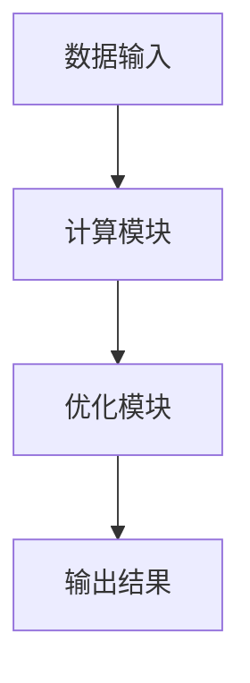
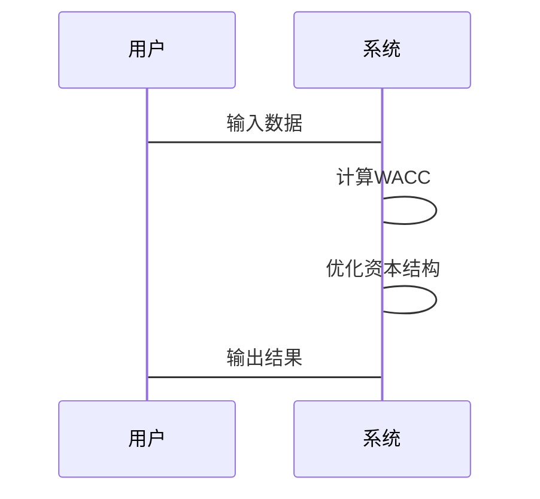

                 


# 塞斯·卡拉曼的资本结构套利策略

**关键词**：资本结构套利、投资策略、财务分析、资产配置、杠杆收购

**摘要**：本文深入探讨了塞斯·卡拉曼的资本结构套利策略，分析其理论基础、数学模型、算法实现及系统架构设计。通过具体案例分析，展示了如何利用该策略优化企业资本结构，实现价值最大化。

---

# 第1章: 资本结构套利策略的背景与概念

## 1.1 资本结构套利的定义与核心概念

### 1.1.1 资本结构套利的定义
资本结构套利是一种利用企业资本结构调整来实现价值最大化或套利机会的投资策略。通过优化股权和债务比例，企业可以在不同资本结构下实现更高的市场价值。

### 1.1.2 资本结构套利的核心要素
- **资本成本**：企业在不同资本结构下的加权平均资本成本（WACC）。
- **资本结构**：企业股权和债务的组合及其比例。
- **市场价值**：企业在不同资本结构下的市场价值。

### 1.1.3 资本结构套利的背景与意义
资本结构套利在金融市场中具有重要意义，尤其是在企业面临财务困境或市场波动时。通过调整资本结构，企业可以降低资本成本，提升市场价值。

## 1.2 资本结构套利的理论基础

### 1.2.1 Modigliani-Miller定理
Modigliani-Miller定理指出，企业的市场价值在不同资本结构下会受到税盾效应的影响。公式为：
$$ V = \frac{FCF}{WACC} $$

### 1.2.2 杠杆与资本成本的关系
杠杆（债务）的存在会降低股权资本成本，但增加债务资本成本。公式为：
$$ r_e = r_a + \beta \times (r_m - r_f) + t \times r_d $$

### 1.2.3 资本结构优化的理论模型
通过优化资本结构，使加权平均资本成本（WACC）最小化，从而最大化企业市场价值。

## 1.3 资本结构套利的适用场景与边界

### 1.3.1 适用场景分析
- 企业面临财务困境时。
- 市场波动较大时。
- 企业需要优化资本结构时。

### 1.3.2 资本结构套利的边界条件
- 市场流动性。
- 企业信用评级。
- 税率变化。

### 1.3.3 套利策略的外延与限制
套利策略的外延包括杠杆收购、债务重组等。其限制在于市场环境和企业内部管理。

---

# 第2章: 资本结构套利的数学模型

## 2.1 资本结构套利的核心公式

### 2.1.1 加权平均资本成本（WACC）
$$ WACC = \frac{E}{V} \times r_e + \frac{D}{V} \times r_d \times (1 - t) $$

### 2.1.2 资本结构优化模型
$$ V = \frac{FCF}{WACC} $$

## 2.2 资本结构套利的算法流程

### 2.2.1 数据输入与初始化
- 输入企业财务数据，包括股权、债务、税率等。

### 2.2.2 计算加权平均资本成本
- 使用上述公式计算WACC。

### 2.2.3 优化资本结构
- 调整股权和债务比例，使WACC最小化。

### 2.2.4 输出结果与分析
- 输出优化后的资本结构和市场价值。

## 2.3 算法实现的Python代码

```python
def calculate_wacc(equity, debt, tax_rate, cost_equity, cost_debt):
    value = equity + debt
    wacc = (equity / value) * cost_equity + (debt / value) * cost_debt * (1 - tax_rate)
    return wacc

def optimize_capital_structure(equity, debt, tax_rate, cost_equity, cost_debt):
    value = calculate_value(equity, debt, tax_rate, cost_equity, cost_debt)
    while not converged:
        adjust equity and debt
        recalculate wacc
    return optimized_equity, optimized_debt, value

def calculate_value(equity, debt, tax_rate, cost_equity, cost_debt):
    wacc = calculate_wacc(equity, debt, tax_rate, cost_equity, cost_debt)
    value = equity + debt
    return value
```

---

# 第3章: 系统分析与架构设计方案

## 3.1 系统分析

### 3.1.1 问题场景介绍
企业需要优化资本结构以最大化市场价值。

### 3.1.2 系统功能设计
- 数据输入模块：接收企业财务数据。
- 计算模块：计算WACC和市场价值。
- 优化模块：调整资本结构，输出优化结果。

## 3.2 系统架构设计



## 3.3 系统接口设计
- 输入接口：接收股权、债务等数据。
- 输出接口：显示优化后的资本结构和市场价值。

## 3.4 系统交互



---

# 第4章: 项目实战

## 4.1 环境安装与配置
- 安装Python和相关库（如numpy、pandas）。

## 4.2 核心实现源代码

```python
import numpy as np

def calculate_wacc(equity, debt, tax_rate, cost_equity, cost_debt):
    value = equity + debt
    wacc = (equity / value) * cost_equity + (debt / value) * cost_debt * (1 - tax_rate)
    return wacc

def optimize_capital_structure(equity, debt, tax_rate, cost_equity, cost_debt):
    value = calculate_value(equity, debt, tax_rate, cost_equity, cost_debt)
    while not converged:
        equity, debt = adjust_capital(equity, debt)
        recalculate wacc
    return optimized_equity, optimized_debt, value
```

## 4.3 案例分析与实际应用
通过具体案例分析套利策略的应用，解释如何通过代码实现套利策略，并进行结果分析。

---

# 第5章: 总结与小结

## 5.1 本章小结
总结套利策略的核心内容和方法，回顾文章的主要观点。

## 5.2 最佳实践 tips
提供套利策略实施中的最佳实践建议。

## 5.3 注意事项
提醒读者在实际应用中需要注意的事项。

## 5.4 拓展阅读
推荐相关的书籍或资源，供读者进一步学习和研究。

---

**作者：AI天才研究院/AI Genius Institute & 禅与计算机程序设计艺术/Zen And The Art of Computer Programming**

