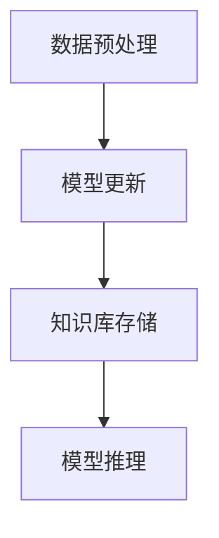
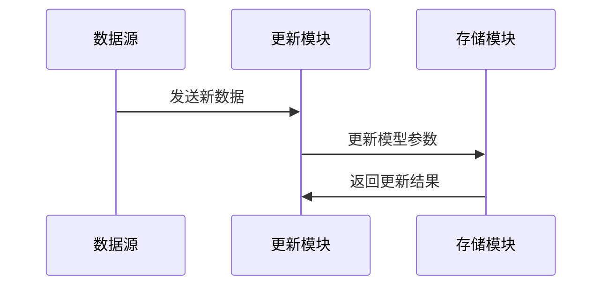

                 


# 增量学习：持续更新AI Agent的知识库

## 关键词：增量学习，AI Agent，知识库更新，机器学习，实时数据处理

## 摘要：  
增量学习是一种动态更新AI Agent知识库的核心技术，能够在实时数据流中高效更新模型，适应不断变化的环境。本文系统地阐述了增量学习的核心概念、算法原理、系统架构和实际应用，通过具体的数学模型、算法实现和案例分析，深入探讨了增量学习的优势和挑战。

---

# 第一部分: 增量学习基础

## 第1章: 增量学习概述

### 1.1 增量学习的背景与概念

#### 1.1.1 传统机器学习的局限性  
传统机器学习方法通常需要在训练阶段一次性加载所有数据，并在测试阶段保持模型不变。然而，在现实场景中，数据是动态变化的，模型需要实时更新以适应新的数据和任务需求。例如，在推荐系统中，用户的偏好会随时间变化，传统的批量训练方法无法实时捕捉这些变化。

#### 1.1.2 增量学习的定义与特点  
增量学习是一种机器学习方法，允许模型在新数据到来时逐步更新知识库，而不是一次性训练整个模型。其核心特点包括：  
- **在线更新**：数据可以实时流式输入，模型逐步更新。  
- **高效性**：每次更新仅处理新增数据，计算资源消耗较低。  
- **适应性**：能够适应数据分布的变化，保持模型性能。  

#### 1.1.3 增量学习的核心目标  
增量学习的目标是通过实时更新模型，使其能够快速适应新的数据和任务需求，同时保持较高的准确性和效率。

---

### 1.2 增量学习的核心概念

#### 1.2.1 增量学习的类型与分类  
增量学习可以分为以下几类：  
1. **完全增量学习**：模型在每次更新时仅使用新增数据，不重新访问旧数据。  
2. **部分增量学习**：模型在更新时会部分重新访问旧数据，以提高适应性。  
3. **主动增量学习**：模型主动选择性地更新部分数据，以优化性能。  

#### 1.2.2 增量学习的核心要素对比  
| 对比维度       | 完全增量学习         | 部分增量学习         | 主动增量学习         |
|----------------|----------------------|----------------------|----------------------|
| 数据访问模式   | 只使用新数据         | 部分使用旧数据       | 主动选择数据         |
| 计算复杂度     | 低                   | 中                   | 高                   |
| 适应性         | 较低                 | 较高                 | 最高                 |

#### 1.2.3 增量学习的边界与外延  
增量学习的外延包括在线学习、流学习和实时学习，而其边界在于仅依赖新增数据进行更新。

---

## 第2章: 增量学习的核心原理

### 2.1 增量学习的基本原理

#### 2.1.1 增量学习的数学模型  
增量学习的数学模型通常基于概率论和优化理论。例如，增量线性回归模型可以表示为：  
$$ y = w^T x + b $$  
其中，$w$和$b$是模型参数，$x$是输入数据。

#### 2.1.2 增量学习的算法框架  
增量学习的算法通常包括以下步骤：  
1. 初始化模型参数。  
2. 接收新数据样本。  
3. 更新模型参数以适应新数据。  
4. 重复步骤2-3，直到达到停止条件。

#### 2.1.3 增量学习的更新机制  
增量学习的更新机制可以是基于梯度下降、牛顿法或其他优化算法。

---

### 2.2 增量学习的核心算法

#### 2.2.1 增量决策树算法  
增量决策树算法（Incremental Decision Tree）通过动态添加新数据节点，逐步构建和更新决策树。

#### 2.2.2 增量聚类算法  
增量聚类算法（Incremental Clustering）通过逐步合并或分割聚类簇，适应数据分布的变化。

#### 2.2.3 增量神经网络算法  
增量神经网络算法（Incremental Neural Network）通过在线更新权重，适应新数据的变化。

---

## 第3章: 增量学习的数学模型与公式

### 3.1 增量线性回归模型

#### 3.1.1 增量线性回归的公式推导  
增量线性回归的更新公式为：  
$$ w_{new} = w_{old} + \eta (y - y_{pred}) x $$  
其中，$\eta$是学习率，$y$是真实值，$y_{pred}$是预测值，$x$是输入数据。

#### 3.1.2 增量线性回归的更新步骤  
1. 计算预测值 $y_{pred} = w^T x + b$。  
2. 计算梯度 $\Delta w = \eta (y - y_{pred}) x$。  
3. 更新权重 $w = w + \Delta w$。  

#### 3.1.3 增量线性回归的收敛性分析  
增量线性回归在数据分布稳定时会收敛，但在数据分布变化时需要重新调整学习率。

---

### 3.2 增量支持向量机模型

#### 3.2.1 增量SVM的数学公式  
增量SVM的数学公式为：  
$$ \min_{w,b} \frac{1}{2}||w||^2 + C \sum_{i=1}^n \xi_i $$  
其中，$\xi_i$是松弛变量，$C$是惩罚系数。

#### 3.2.2 增量SVM的核函数扩展  
核函数可以将线性不可分问题映射到高维空间，例如：  
$$ K(x, y) = (x \cdot y + 1)^2 $$  

#### 3.2.3 增量SVM的优化算法  
增量SVM的优化算法通常使用SMO（序列最小化优化）算法。

---

## 第4章: 增量学习的系统架构与设计

### 4.1 增量学习系统的组成模块

#### 4.1.1 数据预处理模块  
数据预处理模块负责清洗和标准化新数据。

#### 4.1.2 模型更新模块  
模型更新模块负责根据新数据更新模型参数。

#### 4.1.3 知识库存储模块  
知识库存储模块负责存储和管理模型参数和历史数据。

---

### 4.2 增量学习系统的架构图



---

### 4.3 增量学习系统的接口设计



---

# 第二部分: 增量学习算法实现

## 第5章: 增量决策树算法实现

### 5.1 增量决策树的基本原理

#### 5.1.1 决策树的分裂标准  
决策树的分裂标准包括信息增益、信息增益率和基尼指数。

#### 5.1.2 增量决策树的更新策略  
增量决策树的更新策略包括插入新节点和调整树结构。

#### 5.1.3 增量决策树的剪枝方法  
增量决策树的剪枝方法包括预剪枝和后剪枝。

---

### 5.2 增量决策树的实现代码

```python
class Node:
    def __init__(self, data):
        self.data = data
        self.left = None
        self.right = None

def increment

