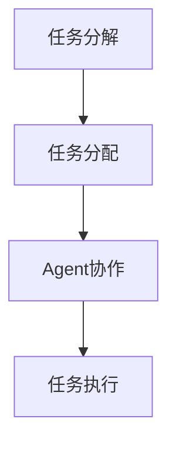
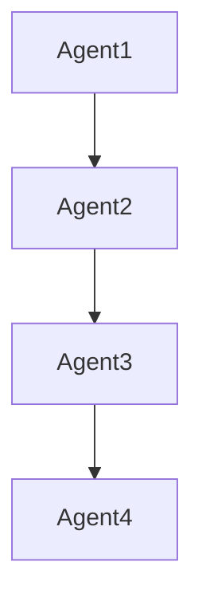

                 


# 多Agent协作系统：复杂任务的分解与协调

> 关键词：多Agent系统、任务分解、Agent协作、系统架构、分布式计算

> 摘要：多Agent协作系统是一种通过多个智能体协作完成复杂任务的分布式计算系统。本文将从多Agent协作系统的定义、体系结构、任务分解与协调方法、系统设计与实现等方面进行详细探讨，帮助读者理解多Agent协作系统的原理和应用。通过实际案例分析和项目实战，深入解析多Agent协作系统的核心技术与最佳实践。

---

## 第1章: 多Agent协作系统概述

### 1.1 多Agent系统的定义与特点

#### 1.1.1 多Agent系统的定义

多Agent系统（Multi-Agent System, 简称MAS）是由多个智能体（Agent）组成的分布式计算系统。这些智能体通过协作完成单个智能体无法完成的复杂任务。每个智能体都是具有计算能力的实体，能够感知环境、自主决策并与其他智能体进行交互。

#### 1.1.2 多Agent系统的核心特点

- **自主性**：每个Agent都有一定的自主性，能够独立决策。
- **反应性**：Agent能够感知环境并实时响应。
- **协作性**：多个Agent通过协作完成共同目标。
- **分布式性**：Agent分布在不同的物理节点上，通过网络进行通信。

#### 1.1.3 多Agent系统与单Agent系统的区别

| 特性          | 单Agent系统            | 多Agent系统           |
|---------------|------------------------|-----------------------|
| 系统结构      | 单一实体                | 多个实体协作           |
| 任务处理      | 单一智能体完成           | 多个智能体协作完成      |
| 通信方式      | 无通信或单向通信         | 需要复杂的通信机制      |
| 可扩展性      | 较低                   | 较高                   |

### 1.2 多Agent协作系统的应用场景

#### 1.2.1 分布式计算中的应用

在分布式计算中，多Agent系统可以通过任务分解和协作提高计算效率。例如，在分布式文件系统中，多个Agent可以分别负责数据块的存储、检索和管理。

#### 1.2.2 人工智能中的应用

在人工智能领域，多Agent系统可以用于智能交通管理、智能助手协作、机器人任务分配等场景。

#### 1.2.3 群智计算中的应用

群智计算通过多个智能体的协作完成复杂的群体智能任务，例如社交网络中的信息传播、分布式问题求解等。

### 1.3 多Agent协作系统的体系结构

#### 1.3.1 分层式体系结构

分层式结构将系统分为多个层次，每个层次负责不同的功能。例如，感知层、决策层和执行层。

#### 1.3.2 分布式体系结构

分布式结构中，每个Agent都是独立的节点，通过通信机制协作完成任务。

#### 1.3.3 混合式体系结构

混合式结构结合了分层和分布式的特点，适用于复杂任务的分解与协调。

---

## 第2章: 多Agent协作系统的背景与挑战

### 2.1 多Agent协作系统的背景

#### 2.1.1 复杂任务分解的必要性

复杂任务通常需要多个智能体协作完成，例如物流调度、交通管理等。

#### 2.1.2 多Agent协作的优势

- **任务分解**：通过分解任务降低复杂度。
- **资源利用率**：合理分配资源，提高效率。
- **容错性**：多个Agent协作可以增强系统的容错性。

### 2.2 多Agent协作系统的挑战

#### 2.2.1 任务分解的复杂性

如何将复杂任务分解为多个子任务，并确保每个子任务能够被独立完成。

#### 2.2.2 Agent之间的协调问题

Agent之间的通信、协商和协作机制需要复杂的设计。

#### 2.2.3 系统的可扩展性问题

随着Agent数量的增加，系统的扩展性和性能需要得到保障。

---

## 第3章: 多Agent协作系统的数学模型与算法

### 3.1 多Agent协作系统的数学模型

#### 3.1.1 任务分解的数学模型

任务分解可以通过图论模型表示，例如将任务分解为图中的节点，边表示任务之间的依赖关系。

$$ G = (V, E) $$

其中，$V$ 表示任务节点，$E$ 表示任务之间的依赖关系。

#### 3.1.2 Agent间协作的数学模型

协作过程可以通过博弈论模型表示，例如纳什均衡模型。

$$ \text{Nash Equilibrium} $$

### 3.2 多Agent协作系统的算法

#### 3.2.1 基于分解的任务分配算法

任务分解算法可以通过贪心算法实现，例如：

1. 将复杂任务分解为子任务。
2. 根据Agent的能力分配子任务。

```python
def task_decomposition(complex_task):
    sub_tasks = []
    for task in complex_task.dependencies:
        if task.can_be_executed:
            sub_tasks.append(task)
    return sub_tasks
```

#### 3.2.2 基于协商的协调算法

协商算法可以通过分布式协商机制实现，例如：

1. Agent提出任务请求。
2. 其他Agent响应并协商。
3. 协商达成后执行任务。

---

## 第4章: 多Agent协作系统的系统架构设计

### 4.1 系统功能设计

#### 4.1.1 任务分解模块

任务分解模块负责将复杂任务分解为子任务，并分配给不同的Agent。

#### 4.1.2 Agent协作模块

协作模块负责Agent之间的通信、协商和协调。

#### 4.1.3 系统监控模块

监控模块负责系统运行状态的监控和异常处理。

### 4.2 系统架构设计

#### 4.2.1 分层式架构设计

分层式架构将系统分为多个层次，每个层次负责不同的功能。



#### 4.2.2 分布式架构设计

分布式架构中，每个Agent独立运行，通过通信机制协作。



#### 4.2.3 混合式架构

混合式架构结合了分层和分布式的特点，适用于复杂任务的分解与协调。

---

## 第5章: 项目实战

### 5.1 环境安装

安装必要的软件和库，例如Python、Docker、RabbitMQ等。

### 5.2 系统核心实现源代码

```python
class Agent:
    def __init__(self, id):
        self.id = id
        self.tasks = []

    def assign_task(self, task):
        self.tasks.append(task)
        print(f"Agent {self.id} assigned task: {task}")

    def execute_task(self):
        for task in self.tasks:
            print(f"Agent {self.id} executing task: {task}")
```

### 5.3 案例分析与代码解读

通过实际案例分析，展示多Agent协作系统的实现过程。

---

## 第6章: 最佳实践

### 6.1 小结

总结多Agent协作系统的核心概念和实现方法。

### 6.2 注意事项

- 确保Agent之间的通信机制可靠。
- 任务分解要合理，避免过细或过粗。
- 系统设计要具有可扩展性。

### 6.3 拓展阅读

推荐阅读相关领域的书籍和论文，深入学习多Agent协作系统的理论和应用。

---

作者：AI天才研究院/AI Genius Institute & 禅与计算机程序设计艺术 /Zen And The Art of Computer Programming

