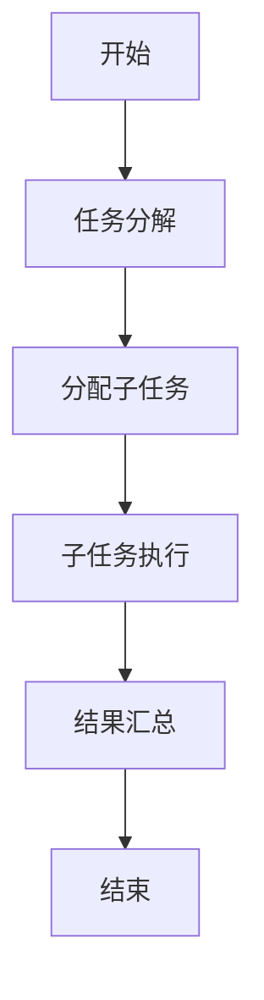
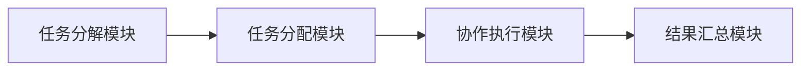

                 


# 多Agent协作系统：复杂任务的分解与协调

> 关键词：多智能体系统、协作机制、任务分解、分布式计算、智能算法

> 摘要：  
多Agent协作系统是一种基于多个智能体（Agent）协作完成复杂任务的系统。本文从多Agent协作系统的背景、核心概念、任务分解与协调机制、算法原理、系统架构设计、项目实战以及应用案例等方面进行深入分析，详细探讨了多Agent协作系统在复杂任务中的应用与实现。通过本文的讲解，读者可以全面了解多Agent协作系统的原理、方法和实际应用，掌握如何在复杂任务中进行任务分解与协作。

---

# 第1章: 多Agent协作系统概述

## 1.1 多Agent协作系统的背景介绍

### 1.1.1 问题背景与问题描述

随着人工智能技术的快速发展，单点智能逐渐难以应对复杂场景下的任务需求。在现实世界中，许多复杂任务需要多个智能体协同完成，例如智能制造、智能交通、物流配送、机器人协作等领域。传统的单智能体方法难以处理多目标、多约束的复杂环境，而多Agent协作系统通过多个智能体的分工协作，能够更好地适应复杂任务的需求。

### 1.1.2 多Agent协作系统的概念结构

多Agent协作系统由多个具有自主性、反应性和协作性的智能体组成，这些智能体通过通信、协调和协作完成复杂任务。系统的核心在于智能体之间的协作机制，包括任务分配、信息共享、冲突解决等。

### 1.1.3 核心要素与边界定义

- **智能体（Agent）**：能够感知环境、自主决策并采取行动的实体。
- **任务分解**：将复杂任务分解为多个子任务，分配给不同的智能体。
- **协作机制**：智能体之间通过通信和协调完成任务的机制。
- **环境**：智能体所处的物理或虚拟环境，包括任务目标和约束条件。

## 1.2 多Agent协作的核心概念

### 1.2.1 Agent的定义与类型

Agent是具有智能性的实体，能够感知环境、自主决策并执行任务。根据智能体的智能性和协作方式，可以将智能体分为以下几类：

1. **反应式Agent**：基于当前感知做出反应，没有内部状态。
2. **认知式Agent**：具有复杂的知识表示和推理能力。
3. **协作式Agent**：专门用于协作任务的智能体。

### 1.2.2 Agent的属性特征对比表格

| 属性         | 描述                               |
|--------------|------------------------------------|
| 知识表示      | Agent的知识存储方式，如规则、逻辑等 |
| 行为方式      | Agent采取行动的方式，如主动或被动 |
| 通信能力      | Agent与其他Agent或环境的通信方式 |
| 协作能力      | Agent与其他Agent协作的能力       |

### 1.2.3 ER实体关系图

```mermaid
erd
actor: 多Agent协作系统
agent: Agent
task: 任务
role: 角色
goal: 目标
```

---

# 第2章: 多Agent协作系统的核心原理

## 2.1 多Agent协作的算法原理

### 2.1.1 分布式规划算法

分布式规划算法是一种基于多Agent协作的任务分配方法，通过分布式计算实现任务分解与分配。



### 2.1.2 基于市场的协调机制

基于市场的协调机制通过模拟市场环境，实现任务分配和资源协调。

```python
def distribute_task(tasks, agents):
    for task in tasks:
        agent = select_agent(task)
        assign_task(agent, task)
```

### 2.1.3 负载均衡算法

负载均衡算法用于优化任务分配，确保各Agent的负载均衡。

$$负载均衡因子 = \frac{任务数}{可用资源}$$

例如：$任务数=5$，$可用资源=2$，则$负载均衡因子=2.5$。

---

# 第3章: 任务分解与协作机制

## 3.1 多Agent协作中的任务分解

任务分解是多Agent协作系统的核心步骤，将复杂任务分解为多个子任务，分配给不同的Agent。

### 3.1.1 任务分解方法

任务分解可以通过以下步骤完成：

1. **任务分析**：分析任务的目标、约束和环境。
2. **任务分解**：将任务分解为子任务。
3. **任务分配**：将子任务分配给不同的Agent。

### 3.1.2 任务分解的优化策略

任务分解的优化策略包括：

- **粒度调整**：根据Agent的能力调整任务粒度。
- **约束考虑**：在分解过程中考虑环境约束和Agent能力。

## 3.2 协作机制的设计

### 3.2.1 通信协议

通信协议是Agent之间通信的基础，包括消息格式和交互流程。

### 3.2.2 协调算法

协调算法用于解决任务冲突和协作问题。

---

# 第4章: 系统架构设计与实现

## 4.1 系统架构设计

### 4.1.1 系统功能设计

系统功能包括任务分解、任务分配、协作执行和结果汇总。

### 4.1.2 系统架构图



---

# 第5章: 项目实战

## 5.1 项目背景与目标

### 5.1.1 项目背景

本项目旨在实现一个多Agent协作系统，用于解决复杂任务的分解与协作问题。

### 5.1.2 项目目标

通过项目实战，掌握多Agent协作系统的实现方法。

## 5.2 环境安装与配置

### 5.2.1 环境要求

- 操作系统：Linux/Windows/MacOS
- Python版本：3.8+

### 5.2.2 依赖安装

```bash
pip install python-multiprocessing
pip install mermaid
```

## 5.3 系统核心实现

### 5.3.1 任务分解模块

```python
def decompose_task(main_task):
    sub_tasks = []
    # 分解逻辑
    return sub_tasks
```

### 5.3.2 任务分配模块

```python
def assign_task(sub_task, agents):
    selected_agent = select_agent(sub_task, agents)
    return selected_agent
```

## 5.4 代码实现与分析

### 5.4.1 任务分解代码

```python
def decompose_task(main_task):
    sub_tasks = []
    for task in main_task:
        if task.can_be_decomposed():
            sub_tasks.extend(task.decompose())
    return sub_tasks
```

### 5.4.2 任务分配代码

```python
def assign_task(sub_task, agents):
    selected_agent = agents[0]
    for agent in agents:
        if agent.load < selected_agent.load:
            selected_agent = agent
    return selected_agent
```

---

# 第6章: 应用案例分析

## 6.1 案例分析：智能物流配送

### 6.1.1 案例背景

智能物流配送需要多个Agent协作完成货物的运输和配送。

### 6.1.2 系统实现

通过多Agent协作系统实现智能物流配送的任务分解与协作。

---

# 第7章: 总结与展望

## 7.1 总结

多Agent协作系统是一种高效的复杂任务处理方法，通过任务分解和协作机制实现复杂任务的高效完成。

## 7.2 展望

未来，多Agent协作系统将在更多领域得到应用，例如智能制造、智能交通等。

---

# 作者：AI天才研究院/AI Genius Institute & 禅与计算机程序设计艺术 /Zen And The Art of Computer Programming

