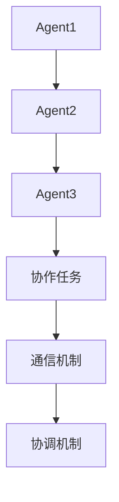
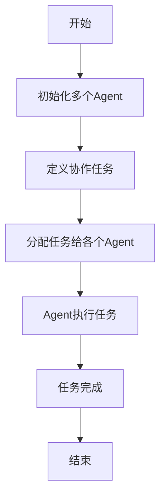
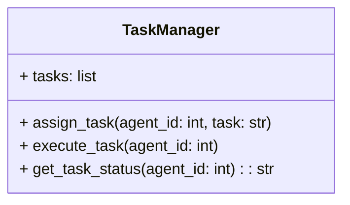
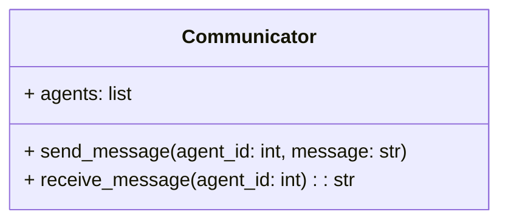
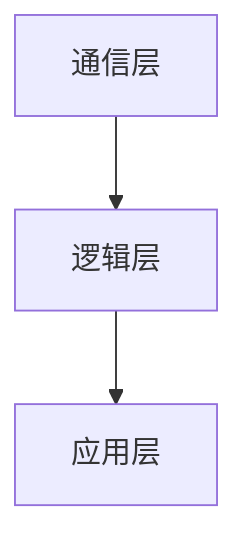

                 


# 多Agent协作：构建复杂的AI系统

> 关键词：多Agent协作、分布式系统、AI系统设计、一致性算法、任务分配、系统架构、协作机制

> 摘要：在复杂的AI系统构建中，多Agent协作是一种高效的解决方案。本文将从多Agent协作的基本概念、核心算法、系统架构到实际项目案例，逐步解析如何构建复杂的AI系统。通过详细分析多Agent协作的核心原理、算法实现、系统设计和项目实战，本文将为读者提供一套完整的构建方法论，帮助读者在实际项目中高效地应用多Agent协作技术。

---

## 第一部分: 多Agent协作基础

### 第1章: 多Agent协作概述

#### 1.1 多Agent协作的基本概念
多Agent协作是指多个智能体（Agent）通过协调和合作完成复杂任务的过程。Agent是具有感知、决策和执行能力的实体，能够独立完成部分任务，同时与其他Agent协同工作。

##### 1.1.1 什么是Agent
Agent（智能体）是能够感知环境、做出决策并采取行动的实体。它可以是一个软件程序、一个机器人或任何能够与环境交互的实体。Agent的核心特征包括：
- **自主性**：能够自主决策和行动。
- **反应性**：能够感知环境并实时调整行为。
- **协作性**：能够与其他Agent或系统组件进行协作。

##### 1.1.2 多Agent协作的定义
多Agent协作是指多个Agent通过通信、协调和合作，共同完成一个复杂任务的过程。多Agent协作的关键在于如何让各个Agent高效地协同工作，避免冲突并提高整体效率。

##### 1.1.3 多Agent协作的核心要素
多Agent协作的核心要素包括：
- **通信机制**：Agent之间通过某种协议进行信息交换。
- **协作任务**：明确的协作目标和任务分解。
- **协调机制**：确保Agent之间的协同工作，避免冲突。

#### 1.2 多Agent协作的历史发展
多Agent协作的概念可以追溯到分布式系统和人工智能的早期研究。随着技术的进步，多Agent协作逐渐从理论研究走向实际应用。

##### 1.2.1 多Agent协作的起源
多Agent协作的起源可以追溯到分布式计算和人工智能领域的早期研究。20世纪80年代，分布式系统和多智能体系统的概念开始出现，为多Agent协作奠定了理论基础。

##### 1.2.2 多Agent协作的演进过程
从最初的理论研究到实际应用，多Agent协作经历了以下几个阶段：
1. **理论研究阶段**：研究Agent的基本概念和协作机制。
2. **实验阶段**：通过小规模实验验证多Agent协作的可行性。
3. **实际应用阶段**：多Agent协作技术逐渐应用于分布式系统、机器人协作等领域。

##### 1.2.3 多Agent协作的现状
当前，多Agent协作技术已经广泛应用于多个领域，包括分布式计算、人工智能、机器人协作、自动驾驶等。随着人工智能和分布式系统技术的不断进步，多Agent协作的应用场景也在不断扩展。

#### 1.3 多Agent协作的应用场景
多Agent协作的应用场景非常广泛，涵盖多个领域。

##### 1.3.1 分布式系统中的协作
在分布式系统中，多Agent协作可以用于任务分配、资源调度、负载均衡等场景。例如，在分布式计算中，多个Agent可以协作完成大规模数据处理任务。

##### 1.3.2 人工智能中的协作应用
在人工智能领域，多Agent协作可以用于分布式机器学习、多智能体强化学习等场景。例如，在机器人协作中，多个Agent可以共同完成复杂的任务。

##### 1.3.3 多Agent协作的未来趋势
随着人工智能和分布式系统技术的不断发展，多Agent协作的应用场景将更加广泛。未来，多Agent协作将更多地应用于智能城市、自动驾驶、智能工厂等领域。

### 第2章: 多Agent协作的核心概念与联系

#### 2.1 多Agent协作的原理
多Agent协作的原理包括通信机制、协作任务分解和协调机制。

##### 2.1.1 多Agent协作的通信机制
多Agent协作的核心是Agent之间的通信。通信机制可以通过以下几种方式实现：
- **消息传递**：Agent之间通过消息传递信息。
- **共享数据库**：Agent通过共享数据库进行信息交换。
- **分布式计算**：Agent通过分布式计算平台进行协作。

##### 2.1.2 多Agent协作的协作任务分解
在多Agent协作中，协作任务需要分解为多个子任务，并分配给不同的Agent。任务分解的关键在于如何确保每个Agent的任务相互独立，同时又能协同完成整体目标。

##### 2.1.3 多Agent协作的协调机制
协调机制是确保多Agent协作顺利进行的关键。协调机制可以通过以下几种方式实现：
- **协商机制**：Agent之间通过协商解决任务分配和冲突。
- **一致性算法**：通过一致性算法确保多Agent之间的数据一致性。

#### 2.2 多Agent协作的核心概念图
以下是多Agent协作的核心概念图，展示了多Agent协作的主要组成部分。



#### 2.3 多Agent协作的流程图
以下是多Agent协作的流程图，展示了多Agent协作的基本流程。



### 第3章: 多Agent协作的算法原理

#### 3.1 多Agent协作的核心算法
多Agent协作的核心算法包括一致性算法、任务分配算法和协作任务分解算法。

##### 3.1.1 一致性算法
一致性算法是确保多Agent协作中数据一致性的关键算法。常见的是一致性算法包括Paxos算法和Raft算法。

##### 3.1.2 分布式任务分配算法
分布式任务分配算法用于将协作任务分解为多个子任务，并分配给不同的Agent。常见的任务分配算法包括贪心算法和负载均衡算法。

##### 3.1.3 协作任务分解算法
协作任务分解算法用于将复杂任务分解为多个子任务，并确保每个子任务能够被不同的Agent独立完成。常见的协作任务分解算法包括分治算法和动态规划算法。

#### 3.2 多Agent协作算法的数学模型
以下是多Agent协作算法的数学模型，展示了如何通过数学模型描述多Agent协作的过程。

$$
\text{协作任务} = \sum_{i=1}^{n} \text{Agent}_i \text{的任务}
$$

其中，$n$ 是 Agent 的数量，$\text{Agent}_i$ 表示第 $i$ 个 Agent。

#### 3.3 多Agent协作算法的实现
以下是多Agent协作算法的实现代码，展示了如何通过Python代码实现多Agent协作。

```python
import threading
import time

class Agent:
    def __init__(self, id):
        self.id = id
        self.task = None

    def assign_task(self, task):
        self.task = task
        print(f"Agent {self.id} assigned task: {task}")

    def execute_task(self):
        print(f"Agent {self.id} executing task: {self.task}")
        time.sleep(1)
        print(f"Agent {self.id} completed task: {self.task}")

def main():
    # 初始化多个Agent
    agents = [Agent(1), Agent(2), Agent(3)]
    
    # 定义协作任务
    tasks = ["task1", "task2", "task3"]
    
    # 分配任务给各个Agent
    for i in range(len(agents)):
        agents[i].assign_task(tasks[i])
    
    # 执行任务
    for agent in agents:
        agent.execute_task()

if __name__ == "__main__":
    main()
```

---

## 第二部分: 多Agent协作系统设计

### 第4章: 多Agent协作系统分析

#### 4.1 系统功能设计
多Agent协作系统的功能设计包括任务管理、Agent通信、任务执行和结果反馈。

##### 4.1.1 任务管理模块
任务管理模块用于定义协作任务、分配任务和监控任务执行。以下是任务管理模块的类图。



##### 4.1.2 Agent通信模块
Agent通信模块用于实现Agent之间的通信。以下是Agent通信模块的类图。



#### 4.2 系统架构设计
多Agent协作系统的架构设计包括通信层、逻辑层和应用层。

##### 4.2.1 系统架构图
以下是多Agent协作系统的架构图。



#### 4.3 系统接口设计
多Agent协作系统的接口设计包括任务分配接口、任务执行接口和结果反馈接口。

##### 4.3.1 任务分配接口
任务分配接口用于将任务分配给不同的Agent。以下是任务分配接口的代码。

```python
def assign_task(agent_id: int, task: str):
    agents[agent_id].task = task
```

##### 4.3.2 任务执行接口
任务执行接口用于执行分配的任务。以下是任务执行接口的代码。

```python
def execute_task(agent_id: int):
    agents[agent_id].execute_task()
```

##### 4.3.3 结果反馈接口
结果反馈接口用于反馈任务执行的结果。以下是结果反馈接口的代码。

```python
def feedback_result(agent_id: int):
    print(f"Agent {agent_id} completed task successfully")
```

#### 4.4 系统交互流程图
以下是多Agent协作系统的交互流程图。


---

## 第三部分: 多Agent协作项目实战

### 第5章: 项目实战

#### 5.1 环境安装
在开始项目之前，需要安装所需的环境和工具。

##### 5.1.1 安装Python
安装Python 3.8或更高版本。

##### 5.1.2 安装依赖库
安装所需的依赖库，例如`threading`和`mermaid`。

#### 5.2 系统核心实现
以下是多Agent协作系统的核心实现代码。

```python
import threading
import time

class Agent:
    def __init__(self, id):
        self.id = id
        self.task = None

    def assign_task(self, task):
        self.task = task
        print(f"Agent {self.id} assigned task: {task}")

    def execute_task(self):
        print(f"Agent {self.id} executing task: {self.task}")
        time.sleep(1)
        print(f"Agent {self.id} completed task: {self.task}")

def main():
    # 初始化多个Agent
    agents = [Agent(1), Agent(2), Agent(3)]
    
    # 定义协作任务
    tasks = ["task1", "task2", "task3"]
    
    # 分配任务给各个Agent
    for i in range(len(agents)):
        agents[i].assign_task(tasks[i])
    
    # 执行任务
    for agent in agents:
        agent.execute_task()

if __name__ == "__main__":
    main()
```

#### 5.3 代码实现与解读
以下是代码实现与解读。

##### 5.3.1 代码实现
上述代码实现了多Agent协作系统的核心功能，包括任务分配和任务执行。

##### 5.3.2 代码解读
- **Agent类**：定义了Agent的基本属性和方法，包括任务分配和任务执行。
- **main函数**：初始化多个Agent，定义协作任务，分配任务并执行任务。

#### 5.4 案例分析与实际应用
以下是多Agent协作系统的实际应用案例。

##### 5.4.1 案例分析
在上述代码中，三个Agent协作完成三个任务。每个Agent被分配一个任务并独立执行。

##### 5.4.2 实际应用
多Agent协作系统可以应用于分布式计算、机器人协作、自动驾驶等领域。

#### 5.5 项目总结
通过上述项目实战，我们可以看到多Agent协作系统的核心功能包括任务分配、任务执行和结果反馈。

---

## 第四部分: 最佳实践与总结

### 第6章: 最佳实践

#### 6.1 多Agent协作的注意事项
在多Agent协作中，需要注意以下几点：
- **通信机制**：确保Agent之间的通信可靠。
- **任务分配**：合理分配任务，避免负载不均。
- **协调机制**：确保多Agent之间的协调一致。

#### 6.2 多Agent协作的优化技巧
多Agent协作的优化技巧包括：
- **负载均衡**：通过负载均衡算法优化任务分配。
- **通信优化**：通过优化通信机制减少延迟。
- **协调机制优化**：通过优化协调机制减少冲突。

#### 6.3 多Agent协作的未来趋势
多Agent协作的未来趋势包括：
- **智能化**：Agent将更加智能，能够自主决策和协作。
- **分布式计算**：多Agent协作将更多地应用于分布式计算领域。
- **边缘计算**：多Agent协作将与边缘计算结合，实现更高效的协作。

### 第7章: 总结

#### 7.1 本文总结
本文详细介绍了多Agent协作的基本概念、核心算法、系统设计和项目实战。通过本文的学习，读者可以掌握多Agent协作的核心原理和实际应用。

#### 7.2 读者思考
读者可以通过以下问题进行思考：
- **多Agent协作的核心机制是什么？**
- **如何优化多Agent协作的通信机制？**
- **多Agent协作在哪些领域有广泛应用？**

#### 7.3 未来展望
随着人工智能和分布式系统技术的不断发展，多Agent协作将有更广泛的应用场景。未来，多Agent协作将更加智能化、分布式化和边缘化。

---

## 作者信息

作者：AI天才研究院/AI Genius Institute & 禅与计算机程序设计艺术 /Zen And The Art of Computer Programming

---

**完整文章内容请参考对应章节内容，以上是目录和摘要部分的内容。**

