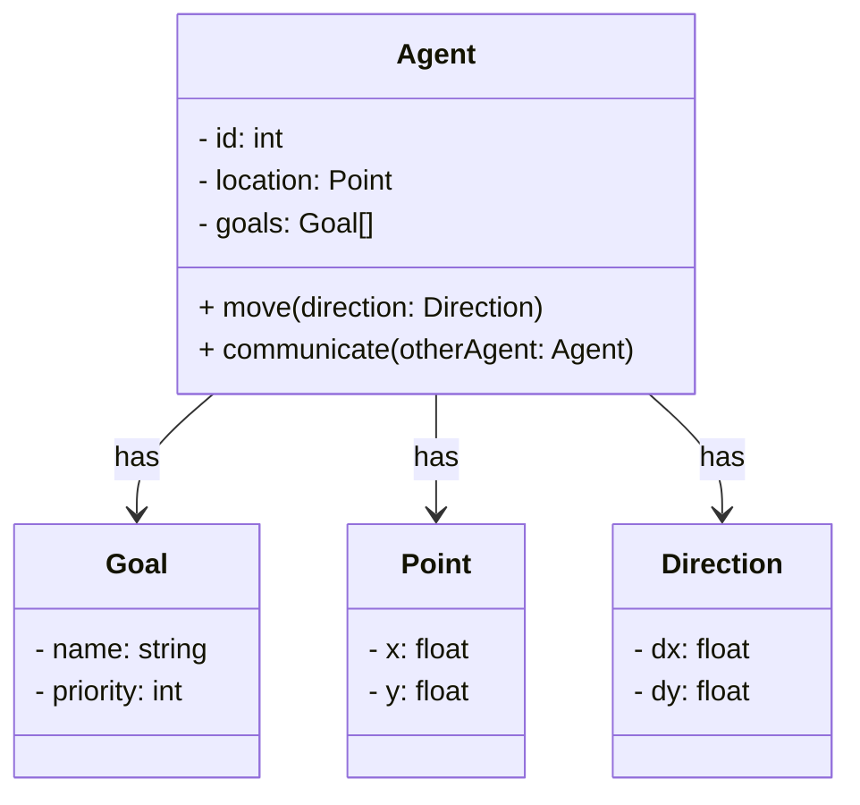
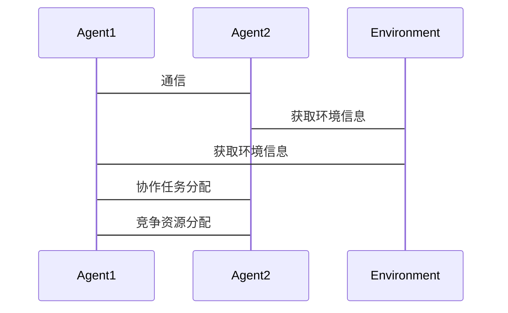

                 


# 多Agent系统：协作与竞争中的AI生态

---

## 关键词：多Agent系统，协作，竞争，AI生态，博弈论，强化学习

---

## 摘要

多Agent系统作为人工智能领域的重要组成部分，通过多个智能体之间的协作与竞争，构建了一个动态、复杂的AI生态系统。本文从多Agent系统的定义、核心概念、协作与竞争机制、算法原理、系统架构设计到项目实战，系统地介绍了多Agent系统的关键技术与应用场景。通过详细的理论分析和实际案例，本文深入探讨了多Agent系统在AI生态中的协作与竞争关系，为读者提供了从基础到实战的全面指导。

---

## 第1章: 多Agent系统概述

### 1.1 多Agent系统的定义与特点

#### 1.1.1 多Agent系统的定义
多Agent系统（Multi-Agent System, MAS）是由多个智能体（Agent）组成的分布式系统，这些智能体能够通过协作与竞争完成复杂的任务。每个智能体都有自己的目标、知识和行为规则，能够在动态环境中自主决策和协作。

#### 1.1.2 多Agent系统的核心特点
1. **分布式性**：多个智能体独立运行，分布在不同的物理或逻辑位置。
2. **自主性**：智能体能够自主决策，无需外部干预。
3. **协作性**：智能体之间通过协作完成共同目标。
4. **动态性**：环境和任务需求可能动态变化，智能体需适应这些变化。
5. **社会性**：智能体之间通过通信和交互形成复杂的社会关系。

#### 1.1.3 多Agent系统与传统AI的区别
传统AI通常基于规则或预定义的逻辑，而多Agent系统通过多个智能体的协作与竞争，能够适应动态变化的环境，具备更强的灵活性和适应性。

---

### 1.2 多Agent系统的背景与应用

#### 1.2.1 多Agent系统的起源与发展
多Agent系统起源于分布式人工智能（DAI）领域，20世纪90年代随着分布式系统和分布式计算的发展逐渐成熟。近年来，随着人工智能技术的进步，多Agent系统在各个领域的应用越来越广泛。

#### 1.2.2 多Agent系统在AI生态中的地位
多Agent系统是构建复杂AI生态系统的重要组成部分，通过多个智能体的协作与竞争，能够模拟和实现复杂的现实场景。

#### 1.2.3 多Agent系统的典型应用场景
1. **分布式任务分配**：如物流配送、资源分配等。
2. **游戏AI**：如多人在线游戏中的智能NPC。
3. **自动驾驶**：多辆自动驾驶车辆之间的协作与竞争。
4. **智能城市**：城市交通、能源管理等多方面的协作。

---

### 1.3 多Agent系统的生态结构

#### 1.3.1 多Agent系统的组成要素
1. **智能体（Agent）**：具备感知、决策、行动能力的个体。
2. **环境（Environment）**：智能体所处的物理或逻辑环境。
3. **通信机制**：智能体之间进行信息交换的渠道。
4. **协作与竞争规则**：智能体之间协作与竞争的行为规范。

#### 1.3.2 多Agent系统的协作与竞争关系
1. **协作**：智能体之间通过合作完成共同目标。
2. **竞争**：智能体之间通过竞争争夺资源或目标。

#### 1.3.3 多Agent系统的动态演化机制
多Agent系统能够根据环境变化和任务需求，动态调整智能体的行为策略和协作关系。

---

## 第2章: 多Agent系统的核心概念

### 2.1 多Agent系统的协作机制

#### 2.1.1 协作模型与协议
1. **协作模型**：描述智能体如何协作完成任务的框架。
2. **协作协议**：定义智能体之间通信和协作的规则。

#### 2.1.2 协作中的信息交换与决策
智能体通过通信交换信息，基于信息做出决策。

#### 2.1.3 协作中的冲突解决
智能体在协作过程中可能会发生冲突，需要通过协商或仲裁机制解决。

---

### 2.2 多Agent系统中的竞争机制

#### 2.2.1 竞争模型与策略
1. **竞争模型**：描述智能体如何竞争的框架。
2. **竞争策略**：智能体为达到目标而采取的策略。

#### 2.2.2 竞争中的资源分配与优化
智能体在竞争中需要合理分配资源，以提高整体效率。

#### 2.2.3 竞争中的公平性与效率
在竞争中，需要平衡公平性和效率，确保系统整体性能。

---

## 第3章: 多Agent系统的协作与竞争模型

### 3.1 协作模型的构建

#### 3.1.1 协作模型的定义与分类
1. **定义**：协作模型描述了智能体如何协作完成任务。
2. **分类**：包括基于角色的协作模型、基于任务的协作模型等。

#### 3.1.2 协作模型中的角色分配
智能体根据任务需求分配不同的角色，以提高协作效率。

#### 3.1.3 协作模型的动态调整
根据环境变化和任务需求，动态调整协作模型。

---

### 3.2 竞争模型的构建

#### 3.2.1 竞争模型的定义与分类
1. **定义**：竞争模型描述了智能体如何竞争。
2. **分类**：包括基于资源的竞争模型、基于任务的竞争模型等。

#### 3.2.2 竞争模型中的策略选择
智能体根据环境和任务需求选择合适的竞争策略。

#### 3.2.3 竞争模型的动态优化
根据环境变化和任务需求，动态优化竞争模型。

---

## 第4章: 多Agent系统的算法与实现

### 4.1 协作算法的设计与实现

#### 4.1.1 协作算法的基本原理
协作算法通过智能体之间的通信和协商，实现协作任务的分配和执行。

#### 4.1.2 协作算法的实现步骤
1. **通信**：智能体之间交换信息。
2. **协商**：确定协作任务的分配。
3. **执行**：智能体按照分配的任务执行。

#### 4.1.3 协作算法的优化与改进
通过优化算法，提高协作效率和任务完成质量。

---

### 4.2 竞争算法的设计与实现

#### 4.2.1 竞争算法的基本原理
竞争算法通过智能体之间的竞争，实现资源的优化分配。

#### 4.2.2 竞争算法的实现步骤
1. **资源分配**：智能体根据策略竞争资源。
2. **竞争结果**：确定资源分配结果。
3. **执行**：智能体按照分配的资源执行任务。

#### 4.2.3 竞争算法的优化与改进
通过优化算法，提高竞争效率和资源利用率。

---

## 第5章: 多Agent系统的数学模型与公式

### 5.1 协作模型的数学表达

#### 5.1.1 协作模型的数学公式
$$ C = \sum_{i=1}^{n} a_i $$
其中，\( C \) 表示协作结果，\( a_i \) 表示智能体 \( i \) 的贡献。

#### 5.1.2 协作模型的参数解释
1. \( a_i \)：智能体 \( i \) 的贡献。
2. \( C \)：协作结果。

#### 5.1.3 协作模型的应用实例
假设有两个智能体 \( A \) 和 \( B \)，它们协作完成任务：
$$ C = A + B $$

---

### 5.2 竞争模型的数学表达

#### 5.2.1 竞争模型的数学公式
$$ R = \sum_{i=1}^{n} r_i $$
其中，\( R \) 表示资源分配结果，\( r_i \) 表示智能体 \( i \) 分配到的资源。

#### 5.2.2 竞争模型的参数解释
1. \( r_i \)：智能体 \( i \) 分配到的资源。
2. \( R \)：资源分配结果。

#### 5.2.3 竞争模型的应用实例
假设有两个智能体 \( A \) 和 \( B \)，它们竞争资源：
$$ R = A + B $$

---

## 第6章: 多Agent系统的系统架构与设计

### 6.1 多Agent系统的项目介绍

#### 6.1.1 项目背景
一个典型的多Agent系统项目可能是模拟城市交通中的智能车辆协作与竞争。

#### 6.1.2 项目目标
实现多辆智能车辆在城市交通中的协作与竞争，优化交通流量。

---

### 6.2 多Agent系统的系统功能设计

#### 6.2.1 领域模型（mermaid 类图）


#### 6.2.2 系统架构设计（mermaid 架构图）
```mermaid
docker
    server1
    server2
    server3
    client
    database
    redis
    rabbitmq
```

---

### 6.3 多Agent系统的接口设计与交互

#### 6.3.1 系统接口设计
1. **通信接口**：智能体之间通过通信接口交换信息。
2. **协作接口**：智能体通过协作接口分配任务。
3. **竞争接口**：智能体通过竞争接口分配资源。

#### 6.3.2 系统交互设计（mermaid 序列图）


---

## 第7章: 多Agent系统的项目实战

### 7.1 项目环境安装

#### 7.1.1 环境要求
1. **编程语言**：Python 3.8+
2. **开发工具**：PyCharm、VS Code
3. **依赖库**：numpy、pandas、scikit-learn、matplotlib

#### 7.1.2 安装依赖
```bash
pip install numpy pandas scikit-learn matplotlib
```

---

### 7.2 项目核心实现

#### 7.2.1 协作算法实现
```python
class Agent:
    def __init__(self, id):
        self.id = id
        self.goals = []
    
    def collaborate(self, other_agents):
        # 协作逻辑
        pass
```

#### 7.2.2 竞争算法实现
```python
class Agent:
    def __init__(self, id):
        self.id = id
        self.resources = 0
    
    def compete(self, other_agents):
        # 竞争逻辑
        pass
```

---

### 7.3 代码实现与解读

#### 7.3.1 协作算法实现
```python
def collaborate_agents(agents):
    for agent in agents:
        agent.goals = [goal for goal in agent.goals if goal.priority > 0]
    return agents
```

#### 7.3.2 竞争算法实现
```python
def compete_agents(agents, resources):
    for agent in agents:
        agent.resources += resources / len(agents)
    return agents
```

---

### 7.4 项目应用与分析

#### 7.4.1 应用场景分析
以城市交通为例，多辆智能车辆通过协作与竞争，优化交通流量。

#### 7.4.2 项目实现小结
通过协作与竞争机制，智能车辆能够更好地适应交通环境，提高整体效率。

---

## 第8章: 多Agent系统的扩展与未来

### 8.1 当前研究热点

#### 8.1.1 多Agent系统的协作与竞争平衡
如何在协作与竞争之间找到平衡点，是当前研究的热点之一。

#### 8.1.2 多Agent系统的自适应性与智能性
如何提高多Agent系统的自适应性和智能性，是未来研究的重要方向。

---

### 8.2 未来发展趋势

#### 8.2.1 多Agent系统与边缘计算的结合
多Agent系统与边缘计算的结合，将推动AI技术在边缘计算领域的应用。

#### 8.2.2 多Agent系统与区块链的结合
多Agent系统与区块链的结合，将提高系统的安全性和可信度。

---

## 作者：AI天才研究院/AI Genius Institute & 禅与计算机程序设计艺术 /Zen And The Art of Computer Programming

---

**注**：由于篇幅限制，本文仅为部分内容，完整文章将涵盖每个章节的详细讲解和具体实现。

