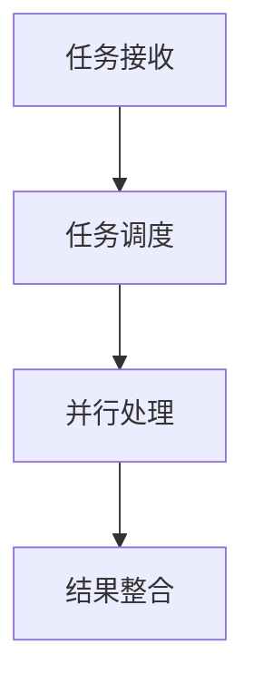
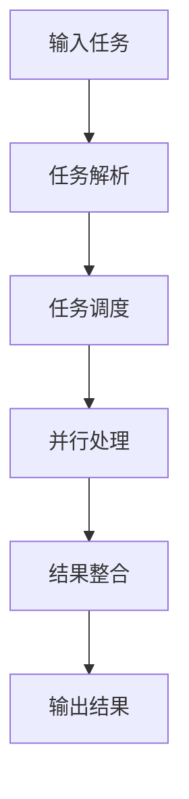
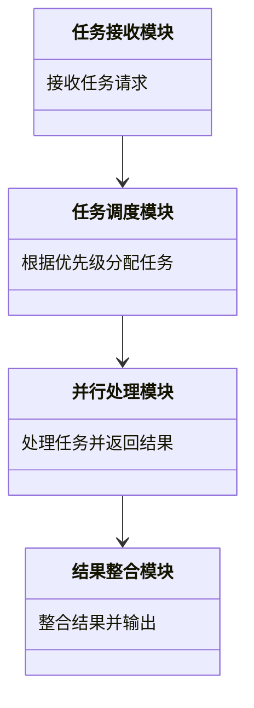
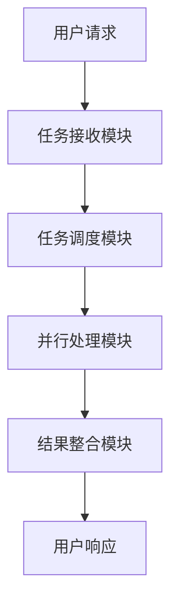
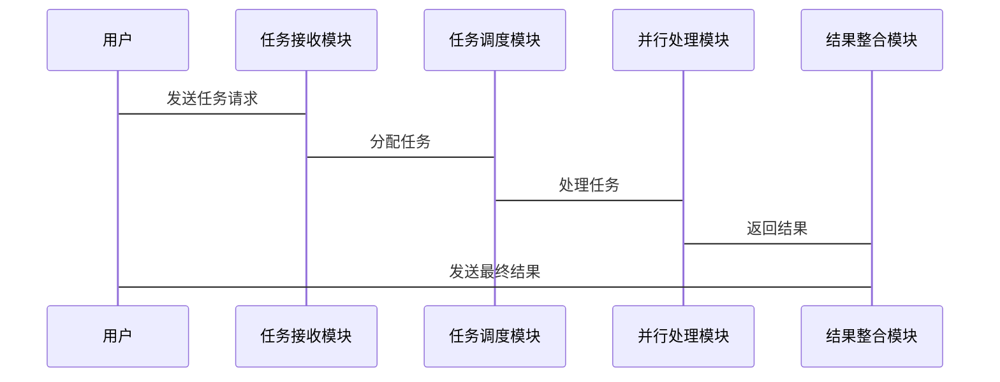

                 


# 多任务AI Agent：增强LLM的并行处理能力

> 关键词：多任务AI Agent，LLM，并行处理，增强能力，系统架构

> 摘要：本文详细探讨了多任务AI Agent的概念、原理及其在增强大语言模型（LLM）并行处理能力中的应用。通过分析多任务学习与并行处理的结合，本文揭示了如何通过优化算法和系统架构设计，提升LLM在多任务场景下的性能和效率。文章内容涵盖从理论基础到实际应用的全过程，旨在为读者提供全面的技术指导。

---

# 第一部分: 多任务AI Agent与LLM的并行处理基础

## 第1章: 多任务AI Agent概述

### 1.1 多任务AI Agent的定义与背景

#### 1.1.1 多任务AI Agent的定义
多任务AI Agent是一种能够同时处理多个相关或不相关任务的智能系统。它通过并行或串行的方式，将多个任务分解、调度和执行，最终输出统一的结果或多个独立的结果。

#### 1.1.2 多任务AI Agent的发展背景
随着人工智能技术的快速发展，单一任务处理的AI系统已无法满足复杂场景的需求。多任务AI Agent通过整合多个任务的处理能力，能够更高效地应对现实世界中的多样化问题。

#### 1.1.3 多任务AI Agent的应用场景
多任务AI Agent广泛应用于自然语言处理、图像识别、机器人控制、智能客服等领域。例如，在智能客服系统中，AI Agent可以同时处理多个用户的请求，包括问题解答、信息查询和情绪分析。

### 1.2 大语言模型（LLM）的基础概念

#### 1.2.1 LLM的定义与特点
大语言模型（LLM）是一种基于深度学习的自然语言处理模型，具有以下特点：
- **大规模训练数据**：通常使用数百万甚至数十亿的文本数据进行训练。
- **强大的上下文理解能力**：能够理解文本的上下文关系，生成连贯的回答。
- **多任务适应性**：通过微调或提示工程技术，可以在多种任务中表现出色。

#### 1.2.2 LLM的核心技术与实现原理
LLM的核心技术包括：
- **Transformer架构**：通过自注意力机制和前馈网络实现高效的序列处理。
- **大规模并行计算**：依赖GPU和TPU等硬件的并行计算能力，加速模型训练和推理。
- **预训练与微调**：通过预训练模型在大规模数据上进行通用训练，再通过微调适应特定任务。

#### 1.2.3 LLM在AI应用中的地位
LLM是当前AI技术的核心模块之一，广泛应用于文本生成、机器翻译、问答系统等任务。在多任务AI Agent中，LLM作为主要的处理模块，承担了任务理解和执行的核心职责。

### 1.3 多任务AI Agent与LLM的关系

#### 1.3.1 多任务AI Agent对LLM的需求
多任务AI Agent需要LLM具备以下能力：
- **多任务适应性**：能够在不同任务之间快速切换，适应多样化的输入。
- **高效的并行处理能力**：能够在短时间内处理多个任务，满足实时响应的需求。
- **强大的理解能力**：能够准确理解每个任务的具体要求和上下文信息。

#### 1.3.2 LLM作为多任务AI Agent的核心模块
LLM在多任务AI Agent中扮演着“智能大脑”的角色。它不仅负责接收和解析任务，还负责任务之间的协调和结果的整合。

#### 1.3.3 多任务AI Agent对LLM能力的增强
通过多任务处理，LLM能够更好地利用其并行计算能力和上下文理解能力，提升整体系统的效率和准确性。

### 1.4 本章小结
本章从多任务AI Agent和LLM的基本概念出发，分析了它们之间的关系及其在实际应用中的重要性。

---

## 第2章: 多任务学习与并行处理机制

### 2.1 多任务学习的基本原理

#### 2.1.1 多任务学习的定义
多任务学习是一种机器学习范式，旨在通过同时学习多个任务来提升模型的泛化能力和效率。

#### 2.1.2 多任务学习的优势与挑战
- **优势**：
  - 提升模型的泛化能力。
  - 减少跨任务的数据需求。
  - 提高训练效率。
- **挑战**：
  - 任务之间的干扰。
  - 并行处理的复杂性。

#### 2.1.3 多任务学习的数学模型
多任务学习的损失函数可以表示为：
$$ L = \sum_{i=1}^{n} w_i L_i $$
其中，$w_i$ 是任务 $i$ 的权重，$L_i$ 是任务 $i$ 的损失函数。

### 2.2 并行处理机制的核心概念

#### 2.2.1 并行处理的定义
并行处理是指在同一时间段内同时执行多个任务或计算步骤，以提高处理效率。

#### 2.2.2 并行处理的分类与特点
- **数据并行**：将数据分成多个部分，分别在不同的计算单元上进行处理。
- **模型并行**：将模型的不同部分分布在不同的计算单元上，进行并行计算。

#### 2.2.3 并行处理在AI中的应用
在AI中，数据并行和模型并行是常用的并行处理方式。数据并行适用于大规模数据集的训练，而模型并行适用于复杂的模型结构。

### 2.3 多任务学习与并行处理的结合

#### 2.3.1 多任务学习中的并行处理需求
多任务学习需要并行处理能力来同时优化多个任务的损失函数。

#### 2.3.2 并行处理对多任务学习的优化
通过并行处理，可以同时优化多个任务的损失函数，提升训练效率和模型性能。

#### 2.3.3 多任务学习与并行处理的协同关系
多任务学习和并行处理相互促进，前者通过共享表示提升模型性能，后者通过并行计算加速训练过程。

### 2.4 本章小结
本章详细介绍了多任务学习和并行处理的基本原理，并分析了它们在多任务AI Agent中的协同关系。

---

## 第3章: 多任务AI Agent的核心算法与数学模型

### 3.1 多任务学习的数学模型

#### 3.1.1 多任务学习的损失函数
多任务学习的损失函数可以表示为：
$$ L = \sum_{i=1}^{n} w_i L_i $$
其中，$w_i$ 是任务 $i$ 的权重，$L_i$ 是任务 $i$ 的损失函数。

#### 3.1.2 任务权重的动态调整
在实际应用中，任务权重可以根据任务的重要性动态调整。例如，使用指数加权平均方法：
$$ w_i = \alpha w_{i-1} + (1-\alpha) \cdot \beta_i $$
其中，$\alpha$ 是衰减系数，$\beta_i$ 是初始权重。

### 3.2 并行处理的算法原理

#### 3.2.1 并行处理的流程图
以下是并行处理的流程图：


#### 3.2.2 并行处理的实现步骤
1. **任务接收**：接收多个任务请求。
2. **任务调度**：根据任务优先级和资源情况，分配任务到不同的计算单元。
3. **并行处理**：每个任务在独立的计算单元上进行处理。
4. **结果整合**：将多个任务的结果整合成最终的输出。

### 3.3 基于LLM的多任务处理算法

#### 3.3.1 多任务处理的流程图
以下是多任务处理的流程图：


#### 3.3.2 任务解析与调度算法
任务解析和调度算法可以通过以下步骤实现：
1. **任务解析**：解析每个任务的类型和参数。
2. **任务调度**：根据任务的复杂度和优先级，分配到不同的计算单元。
3. **并行处理**：每个任务在独立的计算单元上进行处理。
4. **结果整合**：将多个任务的结果整合成最终的输出。

### 3.4 本章小结
本章详细介绍了多任务AI Agent的核心算法和数学模型，并通过流程图展示了并行处理的实现步骤。

---

## 第4章: 基于LLM的多任务AI Agent系统架构设计

### 4.1 系统功能设计

#### 4.1.1 系统功能模块
- **任务接收模块**：接收多个任务请求。
- **任务调度模块**：根据任务优先级和资源情况，分配任务到不同的计算单元。
- **并行处理模块**：每个任务在独立的计算单元上进行处理。
- **结果整合模块**：将多个任务的结果整合成最终的输出。

#### 4.1.2 功能模块之间的关系
以下是功能模块之间的关系图：


### 4.2 系统架构设计

#### 4.2.1 系统架构的分层设计
- **数据层**：负责数据的存储和管理。
- **业务逻辑层**：负责任务的接收、调度和处理。
- **用户界面层**：负责与用户的交互。

#### 4.2.2 系统架构的流程图
以下是系统架构的流程图：


### 4.3 系统接口设计

#### 4.3.1 系统接口的定义
- **任务接收接口**：接收任务请求。
- **任务调度接口**：分配任务到不同的计算单元。
- **结果整合接口**：整合多个任务的结果。

#### 4.3.2 接口之间的交互
以下是接口之间的交互图：


### 4.4 系统交互设计

#### 4.4.1 系统交互的流程
1. 用户发送任务请求。
2. 任务接收模块接收任务请求。
3. 任务调度模块根据优先级分配任务。
4. 并行处理模块处理任务并返回结果。
5. 结果整合模块整合结果并发送给用户。

#### 4.4.2 系统交互的优化
通过优化任务调度算法和并行处理能力，可以进一步提升系统的效率和性能。

### 4.5 本章小结
本章详细介绍了基于LLM的多任务AI Agent系统的架构设计，并通过流程图和序列图展示了系统的交互过程。

---

## 第5章: 多任务AI Agent的项目实战

### 5.1 环境配置

#### 5.1.1 硬件配置
- CPU：建议使用多核处理器，如Intel Core i7或更高。
- GPU：建议使用NVIDIA GPU，如Tesla V100或A100，支持并行计算。

#### 5.1.2 软件配置
- 操作系统：建议使用Linux或macOS。
- 开发工具：建议使用PyCharm或VS Code。
- 深度学习框架：建议使用TensorFlow或PyTorch。

### 5.2 系统核心实现

#### 5.2.1 任务接收模块的实现
以下是任务接收模块的代码示例：
```python
import queue

class TaskReceiver:
    def __init__(self):
        self.task_queue = queue.Queue()

    def receive_task(self, task):
        self.task_queue.put(task)
```

#### 5.2.2 任务调度模块的实现
以下是任务调度模块的代码示例：
```python
import threading

class TaskScheduler:
    def __init__(self, num_workers):
        self.num_workers = num_workers
        self.workers = []
        for _ in range(num_workers):
            worker = threading.Thread(target=self.dispatch_task)
            worker.start()
            self.workers.append(worker)

    def dispatch_task(self):
        while True:
            task = task_queue.get()
            # 处理任务
            self.process_task(task)
            task_queue.task_done()

    def process_task(self, task):
        # 处理具体的任务
        pass
```

#### 5.2.3 并行处理模块的实现
以下是并行处理模块的代码示例：
```python
import concurrent.futures

class ParallelProcessor:
    def __init__(self, max_workers=4):
        self.max_workers = max_workers

    def process_tasks(self, tasks):
        with concurrent.futures.ThreadPoolExecutor(max_workers=self.max_workers) as executor:
            futures = {executor.submit(task.run(), task) for task in tasks}
            for future in concurrent.futures.as_completed(futures):
                task = future.result()
                yield task
```

#### 5.2.4 结果整合模块的实现
以下是结果整合模块的代码示例：
```python
class ResultAggregator:
    def __init__(self):
        self.results = []

    def aggregate_results(self, results):
        self.results.extend(results)
        return self.results
```

### 5.3 代码应用解读与分析

#### 5.3.1 任务接收模块的实现
任务接收模块负责接收任务请求，并将任务添加到队列中。通过使用`queue.Queue`，可以实现任务的高效接收和处理。

#### 5.3.2 任务调度模块的实现
任务调度模块负责将任务分配到不同的工作线程中进行处理。通过使用`threading.Thread`，可以实现任务的并行处理。

#### 5.3.3 并行处理模块的实现
并行处理模块负责同时处理多个任务。通过使用`concurrent.futures.ThreadPoolExecutor`，可以实现任务的高效并行处理。

#### 5.3.4 结果整合模块的实现
结果整合模块负责将多个任务的结果整合成一个统一的输出。通过使用`ResultAggregator`类，可以实现结果的高效整合。

### 5.4 实际案例分析

#### 5.4.1 案例背景
假设我们有一个智能客服系统，需要同时处理多个用户的请求，包括问题解答、信息查询和情绪分析。

#### 5.4.2 系统实现
通过上述代码，我们可以实现一个多任务处理的智能客服系统。

#### 5.4.3 系统效果
通过多任务处理，智能客服系统可以同时处理多个用户的请求，提高系统的响应速度和处理效率。

### 5.5 项目小结
本章通过具体的代码实现和案例分析，展示了多任务AI Agent在实际项目中的应用。

---

## 第6章: 基于LLM的多任务AI Agent的最佳实践

### 6.1 多任务AI Agent的设计原则

#### 6.1.1 任务分解与组合
任务分解与组合是多任务AI Agent设计的关键。通过合理分解任务，可以提高系统的并行处理能力。

#### 6.1.2 任务调度与资源分配
任务调度与资源分配是影响系统性能的重要因素。通过优化任务调度算法和资源分配策略，可以进一步提升系统的效率。

#### 6.1.3 结果整合与输出
结果整合与输出是多任务AI Agent的最后一步。通过合理整合多个任务的结果，可以提高系统的输出质量。

### 6.2 多任务AI Agent的优化技巧

#### 6.2.1 并行处理的优化
通过优化并行处理的算法和资源分配策略，可以进一步提升系统的效率。

#### 6.2.2 任务调度的优化
通过优化任务调度算法，可以提高任务处理的效率和准确性。

#### 6.2.3 系统架构的优化
通过优化系统架构设计，可以进一步提升系统的扩展性和可维护性。

### 6.3 多任务AI Agent的注意事项

#### 6.3.1 任务之间的依赖关系
在多任务处理中，需要注意任务之间的依赖关系。如果任务之间存在依赖关系，需要合理安排任务的执行顺序。

#### 6.3.2 资源分配的均衡性
在资源分配中，需要注意资源的均衡分配。如果某个任务占用过多资源，可能会影响其他任务的处理效率。

#### 6.3.3 系统的可扩展性
在系统设计中，需要注意系统的可扩展性。通过模块化设计，可以方便地扩展系统的功能。

### 6.4 本章小结
本章总结了多任务AI Agent的设计原则和优化技巧，并给出了实际应用中的注意事项。

---

## 作者：AI天才研究院/AI Genius Institute & 禅与计算机程序设计艺术 /Zen And The Art of Computer Programming

---

通过以上内容，我们详细探讨了多任务AI Agent的概念、原理及其在增强LLM并行处理能力中的应用。希望本文能够为读者提供有价值的参考和指导。

