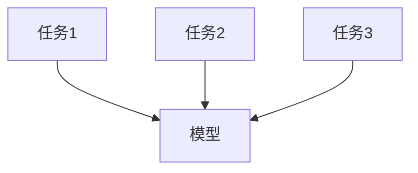
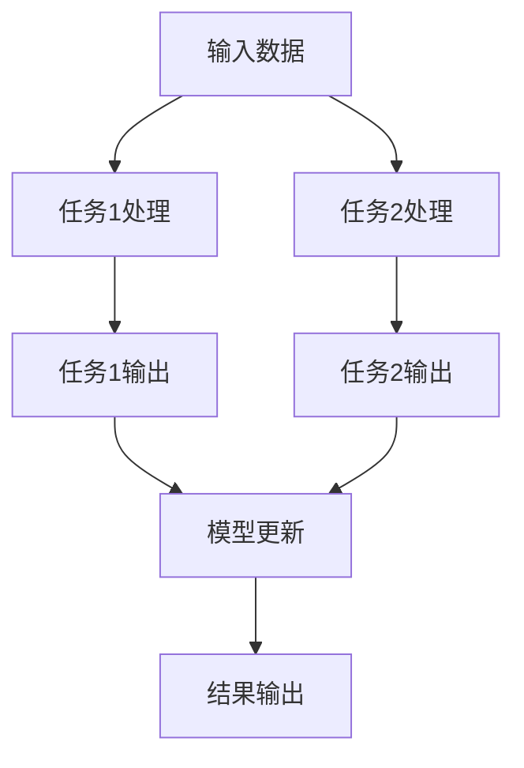
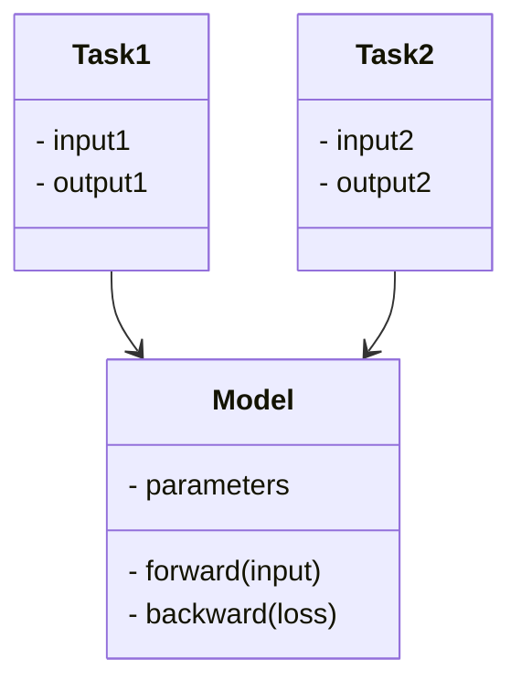
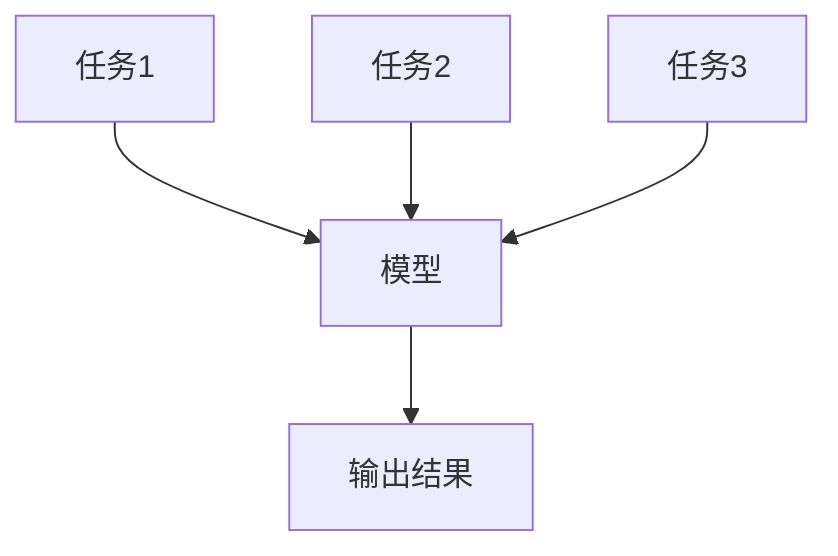
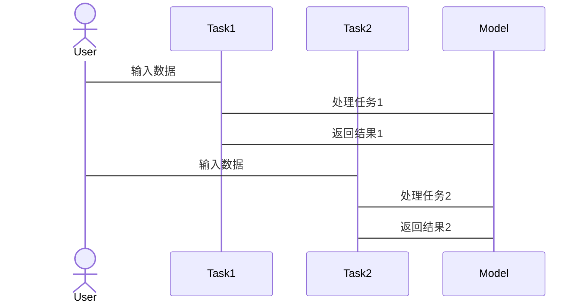

                 


# 多任务学习框架：构建全能型AI Agent

## 关键词：多任务学习，AI Agent，机器学习，模型构建，算法优化

## 摘要：  
本文详细探讨了多任务学习框架在构建全能型AI Agent中的应用。通过分析多任务学习的核心概念、算法原理和系统架构，结合实际案例，展示了如何通过多任务学习框架提升AI Agent的通用性和性能。文章内容涵盖背景介绍、核心概念、算法实现、系统设计、项目实战等多个方面，旨在为读者提供全面的理论与实践指导。

---

# 第一部分: 多任务学习框架与AI Agent概述

## 第1章: 多任务学习框架与AI Agent概述

### 1.1 多任务学习框架的背景与意义  
多任务学习（Multi-Task Learning, MTL）是一种机器学习范式，旨在通过同时学习多个相关任务来提升模型的泛化能力和性能。与传统的单任务学习相比，MTL能够有效利用任务间的共享信息，减少数据需求，提高模型的通用性。在AI Agent领域，MTL的应用尤为广泛，因为AI Agent需要在复杂环境中完成多种任务，如自然语言处理、视觉识别、决策推理等。通过MTL，AI Agent可以在单一模型中实现多种功能，从而显著提升效率和性能。

#### 1.1.1 多任务学习的定义与背景  
多任务学习（MTL）是指在一个统一的模型中同时学习多个任务，通过共享模型参数来捕捉任务间的相似性。MTL的核心思想是利用任务间的关联性，避免重复训练和参数冗余。MTL的背景可以追溯到20世纪90年代，但随着深度学习的兴起，MTL在自然语言处理、计算机视觉等领域得到了广泛应用。

#### 1.1.2 多任务学习的核心目标  
MTL的核心目标包括：
1. **提高模型的通用性**：通过共享参数，模型可以在不同任务之间迁移知识，提升对新任务的适应能力。
2. **降低数据需求**：MTL可以在数据较少的任务中利用其他任务的数据进行训练，减少对大量标注数据的依赖。
3. **提升模型的可解释性**：通过分析任务间的共享参数，可以更好地理解模型在不同任务中的行为。

#### 1.1.3 多任务学习在AI Agent中的作用  
AI Agent需要在复杂环境中完成多种任务，如语音识别、图像识别、自然语言理解等。MTL通过同时优化多个任务，使AI Agent能够在一个模型中实现多种功能，从而提升其智能性和效率。

---

### 1.2 AI Agent的基本概念与分类  

#### 1.2.1 AI Agent的定义与特点  
AI Agent是一种智能体，能够感知环境、自主决策并执行任务。AI Agent的特点包括：
1. **自主性**：AI Agent能够自主决策，无需外部干预。
2. **反应性**：AI Agent能够实时感知环境并做出反应。
3. **学习能力**：AI Agent能够通过经验改进性能。

#### 1.2.2 AI Agent的分类与应用场景  
AI Agent可以根据功能和智能水平分为以下几类：
1. **简单反射型AI Agent**：基于简单的规则做出反应，如PID控制器。
2. **基于模型的AI Agent**：利用内部模型进行决策，如强化学习模型。
3. **目标驱动型AI Agent**：基于明确的目标进行决策，如自动驾驶系统。

应用场景包括：
- 自动驾驶
- 智能客服
- 游戏AI
- 智能机器人

#### 1.2.3 多任务学习与AI Agent的关系  
MTL通过同时优化多个任务，使AI Agent能够在单一模型中实现多种功能。例如，一个AI Agent可以在同一模型中完成语音识别、图像识别和自然语言理解任务，从而提升其综合能力。

---

### 1.3 多任务学习框架的核心优势  

#### 1.3.1 提高模型的通用性  
MTL通过共享参数，使模型能够适应多种任务，从而提高其通用性。

#### 1.3.2 降低数据需求  
MTL可以在数据较少的任务中利用其他任务的数据进行训练，减少对大量标注数据的依赖。

#### 1.3.3 提升模型的可解释性  
通过分析任务间的共享参数，可以更好地理解模型在不同任务中的行为。

---

### 1.4 本章小结  
本章介绍了多任务学习框架的背景、核心目标以及在AI Agent中的作用，同时详细阐述了AI Agent的基本概念和分类。通过对比MTL与单任务学习，强调了MTL在提升AI Agent性能和效率方面的优势。

---

# 第二部分: 多任务学习框架的核心概念与原理

## 第2章: 多任务学习的核心概念与联系  

### 2.1 多任务学习的基本原理  

#### 2.1.1 多任务学习的定义与核心要素  
MTL的核心要素包括多个任务、共享参数和联合优化目标。MTL的目标是通过优化多个任务的联合损失函数，最大化任务间的共享信息。

#### 2.1.2 多任务学习的数学模型  
MTL的数学模型可以表示为：
$$
L = \lambda_1 L_1 + \lambda_2 L_2 + \dots + \lambda_n L_n
$$
其中，$L$是总损失，$L_i$是第i个任务的损失函数，$\lambda_i$是任务权重。

#### 2.1.3 多任务学习的优化目标  
MTL的优化目标是通过优化总损失函数，使模型在多个任务上同时达到最优性能。

---

### 2.2 多任务学习与单任务学习的对比  

#### 2.2.1 任务目标的差异  
单任务学习专注于优化单一任务的损失函数，而MTL优化的是多个任务的联合损失函数。

#### 2.2.2 模型参数的共享与独立  
单任务学习中，每个任务使用独立的模型参数，而MTL通过共享参数来捕捉任务间的相似性。

#### 2.2.3 优化算法的对比  
单任务学习使用单一任务的优化算法，而MTL需要设计联合优化算法。

---

### 2.3 多任务学习的ER实体关系图  



图2-1展示了多个任务共享同一模型的实体关系，清晰地体现了MTL的核心思想。

---

### 2.4 本章小结  
本章详细介绍了多任务学习的基本原理、核心要素以及与单任务学习的对比，并通过ER实体关系图直观展示了MTL的模型结构。

---

# 第三部分: 多任务学习框架的算法原理

## 第3章: 多任务学习算法的原理与实现  

### 3.1 多任务学习算法的基本原理  

#### 3.1.1 多任务学习的损失函数  
MTL的损失函数可以表示为：
$$
L = \sum_{i=1}^n \lambda_i L_i
$$
其中，$L_i$是第i个任务的损失函数，$\lambda_i$是任务权重。

#### 3.1.2 参数共享机制  
MTL通过共享模型参数，使不同任务之间共享信息，从而提高模型的泛化能力。

#### 3.1.3 任务权重的动态分配  
任务权重$\lambda_i$可以根据任务的重要性动态调整，以优化模型的性能。

---

### 3.2 基于梯度的多任务学习算法  

#### 3.2.1 基于Adam优化器的多任务学习  
Adam优化器是一种常用的优化算法，适用于多任务学习。在MTL中，Adam优化器可以通过调整学习率和动量参数，优化多个任务的联合损失函数。

#### 3.2.2 梯度裁剪与任务间平衡  
为了防止梯度爆炸或梯度消失，MTL可以通过梯度裁剪和任务间平衡策略，确保不同任务的梯度在优化过程中保持均衡。

---

### 3.3 多任务学习的算法流程图  



图3-1展示了多任务学习的算法流程，从输入数据到任务处理，再到模型更新和结果输出。

---

### 3.4 多任务学习的Python实现示例  

```python
import torch
optimizer = torch.optim.Adam(model.parameters())
loss_fn = torch.nn.CrossEntropyLoss()
lambda1 = 1.0
lambda2 = 1.0

loss_total = lambda1 * loss_task1 + lambda2 * loss_task2
optimizer.zero_grad()
loss_total.backward()
optimizer.step()
```

以上代码展示了多任务学习的Python实现，包括优化器设置、损失函数定义和模型更新步骤。

---

### 3.5 本章小结  
本章详细介绍了多任务学习算法的基本原理、优化策略以及实现方法，通过流程图和代码示例，直观展示了MTL的实现过程。

---

# 第四部分: 多任务学习框架的系统分析与架构设计

## 第4章: 多任务学习框架的系统分析与架构设计  

### 4.1 系统分析  

#### 4.1.1 问题场景介绍  
在构建全能型AI Agent时，需要同时处理多个任务，如语音识别、图像识别和自然语言理解。这些任务之间存在一定的关联性，可以通过MTL框架进行优化。

#### 4.1.2 项目介绍  
本项目旨在设计一个多任务学习框架，用于构建全能型AI Agent，能够在单一模型中完成多种任务。

---

### 4.2 系统功能设计  

#### 4.2.1 领域模型设计  
领域模型可以通过Mermaid类图表示，展示不同任务之间的关系。



图4-1展示了多任务学习框架的领域模型，包括任务输入、输出和共享模型。

---

### 4.3 系统架构设计  

#### 4.3.1 系统架构图  
系统架构图可以通过Mermaid架构图表示。



图4-2展示了多任务学习框架的系统架构，包括多个任务和共享模型。

---

### 4.4 系统接口设计  

#### 4.4.1 输入接口  
系统接受多个任务的输入数据，如语音信号、图像数据和文本数据。

#### 4.4.2 输出接口  
系统输出多个任务的处理结果，如语音识别结果、图像识别结果和自然语言理解结果。

---

### 4.5 系统交互设计  

#### 4.5.1 交互序列图  
系统交互可以通过Mermaid序列图表示。



图4-3展示了系统的交互流程，包括用户输入、任务处理和结果返回。

---

### 4.6 本章小结  
本章通过系统分析和架构设计，展示了多任务学习框架在构建全能型AI Agent中的应用。通过领域模型、系统架构图和交互序列图，直观展示了系统的整体结构和工作流程。

---

# 第五部分: 多任务学习框架的项目实战

## 第5章: 多任务学习框架的项目实战  

### 5.1 环境安装  

#### 5.1.1 安装Python和相关库  
需要安装Python和以下库：
```
torch
numpy
scikit-learn
```

#### 5.1.2 安装深度学习框架  
推荐使用PyTorch框架。

---

### 5.2 系统核心实现  

#### 5.2.1 模型实现  
以下是一个多任务学习模型的实现示例：

```python
import torch
class MultiTaskModel(torch.nn.Module):
    def __init__(self, input_size, hidden_size, output_size1, output_size2):
        super(MultiTaskModel, self).__init__()
        self.shared = torch.nn.Linear(input_size, hidden_size)
        self.task1_head = torch.nn.Linear(hidden_size, output_size1)
        self.task2_head = torch.nn.Linear(hidden_size, output_size2)
    
    def forward(self, x):
        x = torch.relu(self.shared(x))
        output1 = torch.relu(self.task1_head(x))
        output2 = torch.relu(self.task2_head(x))
        return output1, output2
```

#### 5.2.2 损失函数实现  
以下是一个多任务损失函数的实现示例：

```python
def multi_task_loss(output1, output2, label1, label2):
    criterion = torch.nn.CrossEntropyLoss()
    loss1 = criterion(output1, label1)
    loss2 = criterion(output2, label2)
    return loss1 + loss2
```

#### 5.2.3 优化器实现  
以下是一个多任务学习优化器的实现示例：

```python
optimizer = torch.optim.Adam(model.parameters(), lr=0.001)
```

---

### 5.3 代码应用解读与分析  

#### 5.3.1 模型解读  
上述模型通过共享一个中间层（shared层），实现了两个任务的参数共享。任务1和任务2的输出层分别处理不同的任务。

#### 5.3.2 损失函数解读  
多任务损失函数通过将两个任务的损失函数相加，实现了多个任务的联合优化。

#### 5.3.3 优化器解读  
Adam优化器用于优化模型的参数，通过调整学习率和动量参数，实现模型的优化。

---

### 5.4 实际案例分析  

#### 5.4.1 数据集准备  
以MNIST数据集为例，训练一个多任务学习模型，实现同时进行数字识别和手写风格分类。

#### 5.4.2 训练过程  
以下是一个训练过程的示例：

```python
for epoch in range(num_epochs):
    model.train()
    optimizer.zero_grad()
    outputs = model(inputs)
    loss = multi_task_loss(outputs[0], outputs[1], labels1, labels2)
    loss.backward()
    optimizer.step()
```

#### 5.4.3 结果分析  
通过训练，模型可以在同一模型中实现数字识别和手写风格分类任务。

---

### 5.5 本章小结  
本章通过实际案例分析，展示了多任务学习框架的实现过程，包括模型设计、损失函数定义和优化器选择。通过具体代码实现，帮助读者更好地理解多任务学习的应用。

---

# 第六部分: 多任务学习框架的最佳实践

## 第6章: 多任务学习框架的最佳实践  

### 6.1 最佳实践  

#### 6.1.1 任务选择与设计  
任务的选择和设计直接影响模型的性能。建议选择相关性较高且互补性强的任务。

#### 6.1.2 参数共享策略  
参数共享策略是MTL的核心，可以通过实验选择最优的共享方式。

#### 6.1.3 任务权重的动态调整  
任务权重的动态调整可以进一步优化模型性能，建议根据任务的重要性和数据分布进行调整。

#### 6.1.4 模型评估与优化  
模型评估是MTL的重要环节，可以通过交叉验证和性能指标分析进行优化。

---

### 6.2 小结  

---

### 6.3 注意事项  

1. **任务相关性**：任务之间应具有一定的相关性，否则可能导致模型性能下降。
2. **参数共享**：参数共享是MTL的核心，但需注意共享过多可能导致模型过拟合。
3. **任务权重**：任务权重的设置需要根据任务的重要性和数据分布进行调整。

---

### 6.4 拓展阅读  

1. **论文推荐**：推荐阅读《A Survey on Multi-Task Learning》（《多任务学习综述》）。
2. **工具与库**：推荐使用PyTorch和TensorFlow等深度学习框架进行MTL的实现。

---

## 结语  
通过本文的详细讲解，读者可以全面了解多任务学习框架在构建全能型AI Agent中的应用。从理论到实践，从系统设计到代码实现，本文为读者提供了全面的指导。希望本文能为读者在多任务学习领域的研究和应用提供有价值的参考。

---

## 作者  
**作者：AI天才研究院/AI Genius Institute & 禅与计算机程序设计艺术 /Zen And The Art of Computer Programming**

