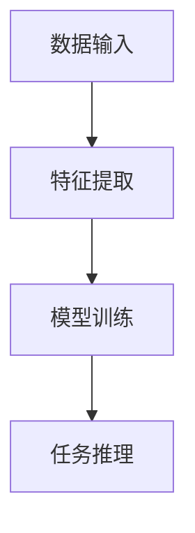
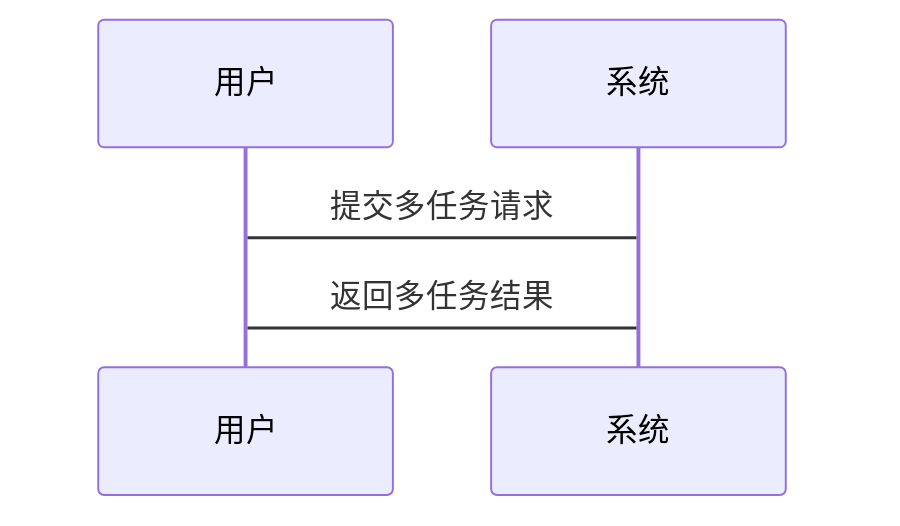

                 


# 多任务学习：构建全能型AI Agent

> 关键词：多任务学习、AI Agent、机器学习、深度学习、神经网络

> 摘要：多任务学习（Multi-Task Learning, MTL）是构建全能型AI Agent的核心技术之一。通过同时学习多个相关任务，模型能够更好地理解和处理复杂的现实世界问题。本文深入探讨多任务学习的原理、算法、系统设计与实战应用，帮助读者全面掌握构建全能型AI Agent的关键技术。

---

# 第一部分: 多任务学习基础与背景

## 第1章: 多任务学习概述

### 1.1 多任务学习的基本概念

#### 1.1.1 什么是多任务学习
多任务学习（Multi-Task Learning, MTL）是一种机器学习范式，旨在通过同时学习多个相关任务来提高模型的泛化能力和性能。与传统的单任务学习相比，MTL能够更好地利用任务间的共享信息，从而减少数据需求和计算成本。

#### 1.1.2 多任务学习的核心思想
多任务学习的核心思想是通过共享参数或特征，让模型在多个任务上同时优化，从而实现任务间的相互促进和互补。这种共享机制能够提高模型的鲁棒性和通用性。

#### 1.1.3 多任务学习的背景与动机
随着人工智能技术的快速发展，单一任务的处理已经无法满足复杂场景的需求。例如，在自然语言处理中，一个AI Agent可能需要同时进行文本分类、情感分析、机器翻译等多个任务。多任务学习能够有效解决这些问题，成为构建全能型AI Agent的核心技术。

### 1.2 多任务学习与单任务学习的对比

#### 1.2.1 单任务学习的局限性
- 数据需求量大：单任务学习需要大量的标注数据来训练模型，而在实际应用中，数据获取往往非常困难。
- 任务独立性：单任务学习假设任务之间是独立的，这在实际场景中并不成立，因为很多任务之间存在相关性。
- 模型泛化能力差：单任务学习的模型难以在多个任务上同时表现良好。

#### 1.2.2 多任务学习的优势
- 数据效率高：通过共享任务间的特征，多任务学习可以在数据量较少的情况下获得更好的性能。
- 任务间的相互促进：任务间的共享信息能够提高模型的泛化能力，同时促进各个任务的性能提升。
- 模型全能性：多任务学习能够构建全能型AI Agent，使其在多个任务上都能表现出色。

#### 1.2.3 任务间的关系与依赖
- 独立任务：任务之间没有明显的相关性，但可以通过共享低级特征来提高模型的泛化能力。
- 相关任务：任务之间存在一定的相关性，可以通过共享高级特征来促进任务间的相互促进。
- 依赖任务：任务之间存在明确的依赖关系，例如在NLP中，文本分类任务可以为情感分析任务提供有用的特征。

### 1.3 多任务学习的应用场景

#### 1.3.1 自然语言处理中的多任务学习
- 文本分类
- 情感分析
- 机器翻译
- 命名实体识别

#### 1.3.2 计算机视觉中的多任务学习
- 图像分类
- 目标检测
- 语义分割
- 图像生成

#### 1.3.3 综合型AI Agent中的多任务学习
- 自然语言理解
- 视觉识别
- 语音处理
- 个性化推荐

### 1.4 多任务学习的挑战与未来方向

#### 1.4.1 任务间冲突的解决
- 任务权重的分配：如何平衡不同任务的重要性，避免某些任务对模型的影响过大。
- 任务间的相互干扰：如何避免任务间的相互干扰，确保每个任务都能得到充分的学习。

#### 1.4.2 模型的泛化能力提升
- 通过任务间共享特征，提高模型的泛化能力。
- 引入外部知识库，增强模型的理解能力。

#### 1.4.3 多任务学习的未来趋势
- 更加复杂的任务组合：未来的多任务学习将涉及更多复杂任务的组合，例如跨模态任务的结合。
- 智能化的任务分配：根据任务的特性动态调整任务间的共享程度。
- 更高效的训练方法：通过优化算法和模型结构，提高多任务学习的训练效率。

### 1.5 本章小结
本章介绍了多任务学习的基本概念、核心思想、应用场景以及面临的挑战和未来方向。通过对比单任务学习和多任务学习，我们理解了多任务学习的优势和重要性。接下来的章节将深入探讨多任务学习的核心概念、算法原理和系统设计。

---

# 第二部分: 多任务学习的核心概念与联系

## 第2章: 多任务学习的核心原理

### 2.1 多任务学习的共享表示机制

#### 2.1.1 共享特征的定义
共享特征是指在多个任务中共同使用的特征，这些特征能够捕捉任务间的共同信息，从而提高模型的泛化能力。

#### 2.1.2 共享特征的作用
- 减少数据需求：通过共享特征，可以在数据量较少的情况下提高模型的性能。
- 提高任务间的相互促进：共享特征能够促进任务间的相互学习，从而提高模型的整体性能。

#### 2.1.3 共享特征的实现方式
- 共享低层特征：在模型的早期层共享特征，例如在卷积神经网络中共享卷积层。
- 共享高层特征：在模型的高层共享特征，例如在多任务学习中共享全连接层。

### 2.2 多任务学习中的任务关系

#### 2.2.1 任务间的独立性
任务间没有明显的相关性，但可以通过共享低级特征来提高模型的泛化能力。

#### 2.2.2 任务间的相关性
任务间存在一定的相关性，可以通过共享高级特征来促进任务间的相互促进。

#### 2.2.3 任务间的依赖性
任务之间存在明确的依赖关系，例如在NLP中，文本分类任务可以为情感分析任务提供有用的特征。

### 2.3 多任务学习中的任务均衡器

#### 2.3.1 任务权重的分配
- 静态权重：在训练过程中，任务权重是固定的。
- 动态权重：在训练过程中，任务权重可以根据任务的难易程度动态调整。

#### 2.3.2 任务间冲突的协调
- 使用任务均衡器：通过任务均衡器动态调整任务权重，确保每个任务都能得到充分的学习。
- 引入惩罚项：通过惩罚项来平衡任务间的冲突。

#### 2.3.3 任务均衡器的实现
- 使用门控机制：通过门控机制动态调整任务权重。
- 使用专家网络：通过专家网络来协调任务间的冲突。

### 2.4 多任务学习中的数学模型

#### 2.4.1 多任务学习的损失函数
$$ L = \sum_{i=1}^{N} \lambda_i L_i $$
其中，$\lambda_i$ 是任务 $i$ 的权重，$L_i$ 是任务 $i$ 的损失函数。

#### 2.4.2 权重共享机制
$$ W = \{w_1, w_2, ..., w_N\} $$
其中，$w_i$ 是任务 $i$ 的共享权重。

### 2.5 多任务学习的优化算法

#### 2.5.1 多任务学习的优化目标
$$ \min_{W} \sum_{i=1}^{N} \lambda_i L_i(W) + \lambda_{\text{reg}} R(W) $$
其中，$R(W)$ 是正则化项，$\lambda_{\text{reg}}$ 是正则化权重。

#### 2.5.2 多任务学习的优化方法
- 联合优化：将所有任务的损失函数联合起来优化。
- 分步优化：分别优化每个任务，然后将结果整合。

---

## 第3章: 多任务学习的算法原理

### 3.1 多任务学习算法的核心思想
多任务学习算法的核心思想是通过共享参数或特征，同时优化多个任务的损失函数，从而提高模型的泛化能力和全能性。

### 3.2 多任务学习算法的分类

#### 3.2.1 基于共享表示的多任务学习
- 基于共享低层特征的多任务学习：共享卷积层、嵌入层等低层特征。
- 基于共享高层特征的多任务学习：共享全连接层、注意力机制等高层特征。

#### 3.2.2 基于任务分解的多任务学习
- 任务分解：将多任务学习问题分解为多个子任务，分别进行优化。
- 任务组合：将子任务的结果组合起来，得到最终的模型。

#### 3.2.3 基于元学习的多任务学习
- 元学习：通过学习如何学习，快速适应新任务。
- 迁移学习：通过将一个任务的知识迁移到其他任务。

### 3.3 常见的多任务学习算法

#### 3.3.1 多任务学习（MTL）
- MTL的核心思想是通过共享参数同时优化多个任务的损失函数。
- 适用于任务间存在共享特征的情况。

#### 3.3.2 多任务迁移学习（MTTL）
- MTTL的核心思想是通过迁移学习，将一个任务的知识迁移到其他任务。
- 适用于任务间存在相关性的情况。

#### 3.3.3 分层多任务学习（HMTL）
- HMTL的核心思想是将多任务学习问题分解为多个层次，分别进行优化。
- 适用于任务间存在复杂依赖关系的情况。

### 3.4 多任务学习算法的优缺点对比

| 算法名称 | 优点 | 缺点 |
|----------|------|------|
| MTL      | 实现简单，适用于任务间共享特征的情况 | 任务间权重难以平衡，可能导致某些任务被忽视 |
| MTTL     | 能够有效利用任务间的迁移性 | 实现复杂，需要额外的迁移学习模块 |
| HMTL     | 能够处理任务间的复杂依赖关系 | 实现复杂，需要进行层次化的任务分解 |

### 3.5 本章小结
本章详细介绍了多任务学习算法的核心思想、分类以及常见算法的优缺点。通过对比不同算法，我们理解了在不同场景下如何选择合适的多任务学习算法。

---

## 第4章: 多任务学习的系统设计与实现

### 4.1 多任务学习系统的总体架构

#### 4.1.1 系统功能模块划分
- 数据输入模块：负责输入多任务数据。
- 特征提取模块：负责提取任务间的共享特征。
- 模型训练模块：负责训练多任务学习模型。
- 任务推理模块：负责在实际应用中进行多任务推理。

#### 4.1.2 系统架构设计


#### 4.1.3 系统交互流程


### 4.2 多任务学习系统的实现细节

#### 4.2.1 数据输入模块
- 数据格式：支持多种数据格式，例如文本、图像等。
- 数据预处理：对输入数据进行清洗、归一化等预处理。

#### 4.2.2 特征提取模块
- 低层特征提取：例如在NLP中提取词向量。
- 高层特征提取：例如在CNN中提取卷积特征。

#### 4.2.3 模型训练模块
- 模型选择：选择适合多任务学习的模型结构。
- 参数优化：使用合适的优化算法（例如Adam、SGD）进行参数优化。

#### 4.2.4 任务推理模块
- 任务分解：将多任务推理分解为多个子任务。
- 任务组合：将子任务的结果组合起来，得到最终的推理结果。

### 4.3 多任务学习系统的实现代码

#### 4.3.1 环境配置
```python
import torch
import torch.nn as nn
import torch.optim as optim
from torch.utils.data import DataLoader
```

#### 4.3.2 模型定义
```python
class MultiTaskModel(nn.Module):
    def __init__(self, input_dim, hidden_dim, output_dims):
        super(MultiTaskModel, self).__init__()
        self.shared_layer = nn.Linear(input_dim, hidden_dim)
        self.task_specific_layers = nn.ModuleList()
        for output_dim in output_dims:
            self.task_specific_layers.append(nn.Linear(hidden_dim, output_dim))
    
    def forward(self, x, tasks):
        x = self.shared_layer(x)
        outputs = []
        for task in tasks:
            outputs.append(self.task_specific_layers[task](x))
        return outputs
```

#### 4.3.3 损失函数定义
```python
def multi_task_loss(outputs, targets, tasks):
    loss = 0
    for i in range(len(outputs)):
        loss += nn.functional.cross_entropy(outputs[i], targets[tasks[i]])
    return loss
```

#### 4.3.4 训练循环
```python
def train(model, optimizer, criterion, dataloader, tasks):
    for epoch in range(num_epochs):
        for batch in dataloader:
            optimizer.zero_grad()
            inputs, targets = batch
            outputs = model(inputs, tasks)
            loss = multi_task_loss(outputs, targets, tasks)
            loss.backward()
            optimizer.step()
```

### 4.4 本章小结
本章详细介绍了多任务学习系统的总体架构、实现细节以及代码实现。通过代码示例，我们理解了如何在实际应用中构建一个多任务学习系统。

---

## 第5章: 多任务学习的项目实战

### 5.1 项目背景与需求分析

#### 5.1.1 项目背景
在一个实际的AI Agent项目中，我们需要同时进行文本分类、情感分析和命名实体识别三个任务。

#### 5.1.2 项目需求
- 文本分类：对文本进行主题分类。
- 情感分析：对文本进行情感倾向分析。
- 命名实体识别：从文本中提取人名、地名等实体。

### 5.2 项目实现

#### 5.2.1 环境配置
```python
import torch
import torch.nn as nn
import torch.optim as optim
from torch.utils.data import DataLoader
```

#### 5.2.2 数据集准备
```python
# 数据集示例
train_data = [
    ('文本内容1', {'任务1': label1, '任务2': label2, '任务3': label3}),
    ('文本内容2', {'任务1': label1, '任务2': label2, '任务3': label3}),
    ...
]
```

#### 5.2.3 模型定义
```python
class MultiTaskModel(nn.Module):
    def __init__(self, input_dim, hidden_dim, output_dims):
        super(MultiTaskModel, self).__init__()
        self.shared_layer = nn.Linear(input_dim, hidden_dim)
        self.task_specific_layers = nn.ModuleList()
        for output_dim in output_dims:
            self.task_specific_layers.append(nn.Linear(hidden_dim, output_dim))
    
    def forward(self, x, tasks):
        x = self.shared_layer(x)
        outputs = []
        for task in tasks:
            outputs.append(self.task_specific_layers[task](x))
        return outputs
```

#### 5.2.4 模型训练
```python
def train(model, optimizer, criterion, dataloader, tasks):
    for epoch in range(num_epochs):
        for batch in dataloader:
            optimizer.zero_grad()
            inputs, targets = batch
            outputs = model(inputs, tasks)
            loss = multi_task_loss(outputs, targets, tasks)
            loss.backward()
            optimizer.step()
```

### 5.3 项目分析与优化

#### 5.3.1 模型调优
- 调整共享层的维度：通过增加或减少共享层的维度，找到最佳的模型复杂度。
- 调整任务权重：根据任务的难易程度，动态调整任务权重，确保每个任务都能得到充分的学习。

#### 5.3.2 模型评估
- 使用验证集评估模型的性能。
- 计算每个任务的准确率、召回率等指标，分析模型的优缺点。

### 5.4 项目小结
通过本章的项目实战，我们理解了如何在实际应用中构建一个多任务学习系统。通过模型调优和评估，我们能够进一步优化模型的性能，提高AI Agent的全能性。

---

## 第6章: 多任务学习的最佳实践与未来展望

### 6.1 多任务学习的最佳实践

#### 6.1.1 任务选择与设计
- 根据实际需求选择合适的任务。
- 确保任务之间存在合理的相关性。

#### 6.1.2 模型选择与优化
- 根据任务特点选择适合的模型结构。
- 使用合适的优化算法和正则化方法，避免过拟合。

#### 6.1.3 任务权重的动态调整
- 根据任务的难易程度，动态调整任务权重。
- 使用门控机制或专家网络协调任务间的冲突。

### 6.2 多任务学习的未来展望

#### 6.2.1 更复杂的任务组合
- 多模态任务的结合：例如结合文本、图像、语音等多种模态信息。
- 动态任务分配：根据环境的变化，动态调整任务的执行顺序和权重。

#### 6.2.2 智能化多任务学习
- 自适应多任务学习：模型能够根据输入数据自动调整任务间的共享程度。
- 元学习的应用：通过元学习，快速适应新任务。

#### 6.2.3 更高效的训练方法
- 分布式训练：通过分布式计算，提高多任务学习的训练效率。
- 知识蒸馏：通过知识蒸馏，将多任务学习的知识迁移到更小的模型中。

### 6.3 本章小结
本章总结了多任务学习的最佳实践，并展望了未来的发展方向。通过不断优化模型结构和算法，多任务学习将在构建全能型AI Agent中发挥更大的作用。

---

# 作者：AI天才研究院/AI Genius Institute & 禅与计算机程序设计艺术 /Zen And The Art of Computer Programming

---

通过以上目录结构，我们可以看到《多任务学习：构建全能型AI Agent》这本书将从基础到高级，全面深入地探讨多任务学习的核心概念、算法原理、系统设计与实战应用。通过丰富的图表和代码示例，帮助读者更好地理解和掌握多任务学习技术，从而构建出能够同时处理多个任务的全能型AI Agent。

