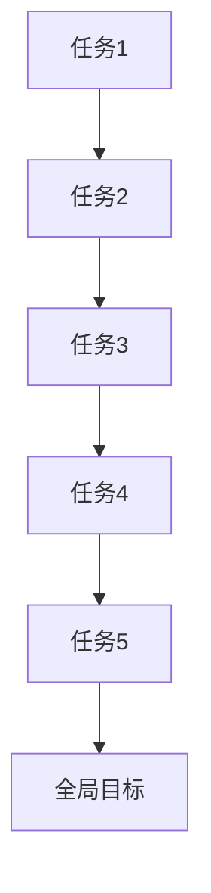
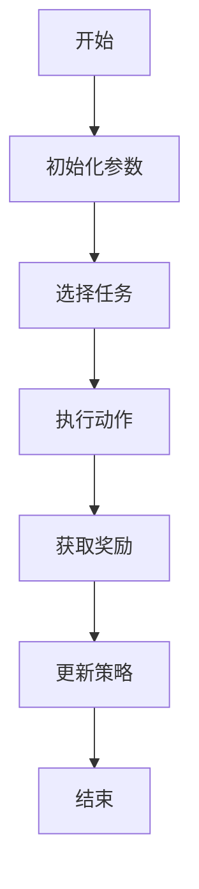
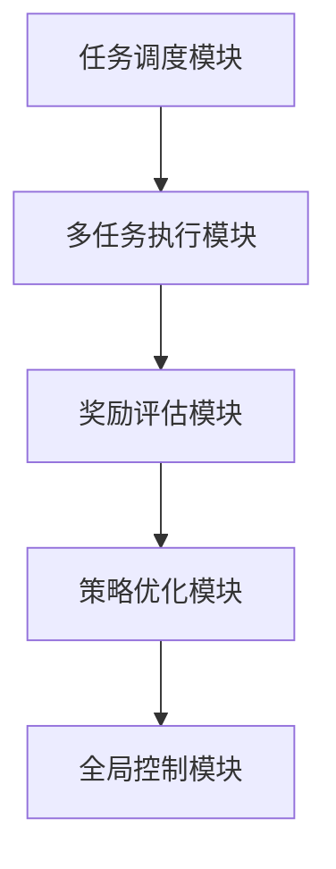

                 


```markdown
# 多任务强化学习：构建具有广泛技能的AI Agent

> 关键词：多任务强化学习、AI Agent、强化学习、机器学习、深度学习

> 摘要：本文将详细探讨多任务强化学习的核心概念、算法原理、系统设计与实现，并通过具体案例展示如何构建具备广泛技能的AI Agent。从理论到实践，全面解析多任务强化学习的技术细节与应用场景。

---

## 第一章：多任务强化学习概述

### 1.1 多任务强化学习的定义
- 1.1.1 强化学习的基本概念
- 1.1.2 多任务强化学习的定义
- 1.1.3 多任务强化学习的核心特点

### 1.2 多任务强化学习的背景与问题背景
- 1.2.1 传统强化学习的局限性
- 1.2.2 多任务强化学习的提出
- 1.2.3 多任务强化学习的应用场景

### 1.3 多任务强化学习的核心概念
- 1.3.1 任务之间的关系
- 1.3.2 多任务学习的类型
- 1.3.3 多任务强化学习的挑战

---

## 第二章：多任务强化学习的核心概念与联系

### 2.1 多任务强化学习的核心原理
- 2.1.1 多任务学习的数学模型
- 2.1.2 多任务强化学习的算法框架
- 2.1.3 多任务学习的优化目标

### 2.2 多任务强化学习的实体关系图


### 2.3 多任务强化学习的算法流程图


---

## 第三章：多任务强化学习的算法原理

### 3.1 多任务强化学习的主流算法
- 3.1.1 多任务强化学习的算法分类
- 3.1.2 基于混合策略的算法
- 3.1.3 基于任务分解的算法

### 3.2 基于混合策略的算法实现
- 3.2.1 混合策略的数学模型
$$ Q(s, a) = \sum_{i=1}^{n} \alpha_i Q_i(s, a) $$
- 3.2.2 混合策略的实现步骤
```python
def mix_policy(Q, alpha):
    return sum(alpha[i] * Q[i] for i in range(len(Q)))
```

---

## 第四章：多任务强化学习的系统分析与架构设计

### 4.1 系统分析
- 4.1.1 多任务强化学习的系统组成
- 4.1.2 多任务强化学习的系统功能
- 4.1.3 多任务强化学习的系统性能指标

### 4.2 系统架构设计


---

## 第五章：多任务强化学习的项目实战

### 5.1 项目环境安装
- 5.1.1 安装Python环境
- 5.1.2 安装必要的库
  ```bash
  pip install gym numpy tensorflow
  ```

### 5.2 系统核心实现源代码
```python
import gym
import numpy as np
import tensorflow as tf

class MultiTaskAgent:
    def __init__(self, env):
        self.env = env
        self.tasks = env.unwrapped.num_tasks
        self.model = self.build_model()

    def build_model(self):
        # 构建神经网络模型
        pass

    def train(self, episodes=1000):
        for episode in range(episodes):
            state = self.env.reset()
            while not done:
                action = self.model.predict(state)
                next_state, reward, done, _ = self.env.step(action)
                self.model.fit(next_state, reward)

    def test(self):
        state = self.env.reset()
        while not done:
            action = self.model.predict(state)
            next_state, reward, done, _ = self.env.step(action)
            print(f"Action: {action}, Reward: {reward}")

if __name__ == "__main__":
    env = gym.make('MultiTaskEnv-v0')
    agent = MultiTaskAgent(env)
    agent.train()
    agent.test()
```

### 5.3 代码应用解读与分析
- 5.3.1 代码结构解析
- 5.3.2 核心功能实现
- 5.3.3 代码优化建议

### 5.4 实际案例分析
- 5.4.1 案例背景介绍
- 5.4.2 案例实现过程
- 5.4.3 案例总结与分析

---

## 第六章：最佳实践、小结与扩展阅读

### 6.1 最佳实践
- 6.1.1 多任务强化学习的设计原则
- 6.1.2 系统优化与性能提升
- 6.1.3 多任务强化学习的伦理问题

### 6.2 小结
- 6.2.1 本文的核心内容回顾
- 6.2.2 未来的研究方向

### 6.3 扩展阅读
- 6.3.1 推荐的书籍与论文
- 6.3.2 相关技术博客与资源

---

## 作者信息
作者：AI天才研究院/AI Genius Institute  
联系方式：contact@aicourse.com  
GitHub：https://github.com/aiguru

---

## 附录
### 附录A：常用数学公式
- 强化学习的基本公式
$$ R = \gamma \cdot r + (1-\gamma) \cdot Q(s, a) $$

### 附录B：代码示例
```python
import gym
import numpy as np
import tensorflow as tf
```

---

感谢您的阅读！希望本文能为您提供有价值的技术见解与实践指导。
```

