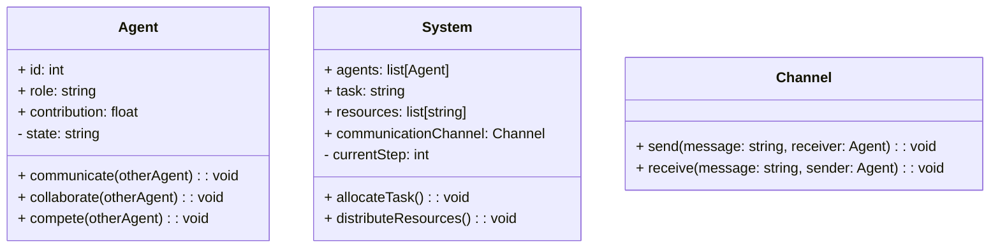
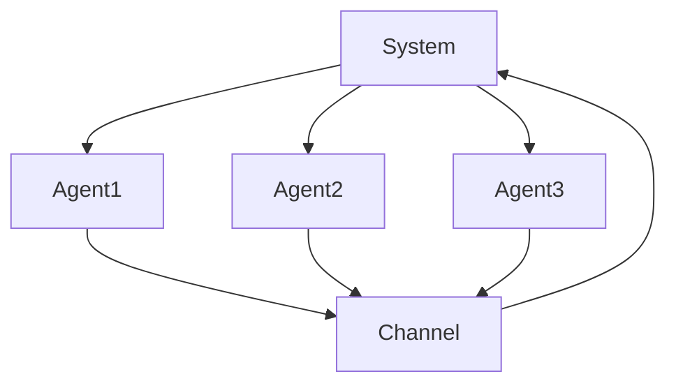

                 


# 多智能体AI Agent：LLM驱动的协作与竞争系统

> 关键词：多智能体系统, AI Agent, 大语言模型, 协作与竞争, LLM驱动

> 摘要：  
> 本文探讨了多智能体AI Agent系统中协作与竞争机制的设计与实现，重点分析了大语言模型（LLM）在驱动AI Agent中的作用。文章从基本概念出发，详细阐述了多智能体系统的特点、AI Agent的核心功能，以及协作与竞争的动态平衡。通过数学模型和算法实现，展示了LLM如何通过自然语言处理能力推动多智能体之间的高效协作与竞争。最后，本文结合实际案例，探讨了系统的架构设计、项目实现及优化方法，为读者提供了全面而深入的技术解析。

---

## 第一部分：多智能体AI Agent基础

### 第1章：多智能体系统概述

#### 1.1 多智能体系统的基本概念

多智能体系统（Multi-Agent System，MAS）是由多个智能体（Agent）组成的分布式系统，这些智能体能够通过协作完成复杂任务。以下是多智能体系统的核心概念：

- **智能体（Agent）**：智能体是具有感知、决策和行动能力的实体，能够独立执行任务。
- **多智能体系统**：由多个智能体组成的系统，智能体之间通过通信和协作完成目标。

#### 1.2 AI Agent的基本概念

AI Agent是具有人工智能能力的智能体，能够通过学习和推理完成复杂的任务。以下是AI Agent的核心特征：

- **自然语言处理能力**：AI Agent能够理解和生成自然语言，实现与人类的交互。
- **知识表示与推理能力**：AI Agent能够通过知识库进行推理，做出决策。
- **个性化交互能力**：AI Agent能够根据用户的意图和上下文进行个性化响应。

#### 1.3 多智能体协作与竞争的基本原理

协作与竞争是多智能体系统中的核心机制，以下是协作与竞争的定义和特点：

- **协作**：多个智能体共同完成任务，共享资源和信息。
- **竞争**：多个智能体争夺资源或目标，通过竞争优化性能。

---

## 第二部分：LLM驱动的AI Agent

### 第2章：大语言模型（LLM）概述

#### 2.1 大语言模型的基本原理

大语言模型（Large Language Model，LLM）是一种基于深度学习的自然语言处理模型，能够理解和生成自然语言。以下是LLM的核心原理：

- **神经网络结构**：LLM通常采用Transformer架构，通过自注意力机制捕捉上下文信息。
- **训练数据**：LLM通过大量文本数据进行预训练，学习语言的统计规律。

#### 2.2 LLM驱动的AI Agent的实现

以下是LLM驱动的AI Agent实现的关键步骤：

- **LLM与AI Agent的结合**：将LLM作为AI Agent的核心模块，负责理解和生成语言。
- **交互设计**：设计AI Agent与用户或智能体之间的交互界面，实现自然语言交互。

#### 2.3 LLM驱动的AI Agent的优势

- **自然语言处理能力**：LLM能够理解和生成自然语言，实现高效的交互。
- **知识表示与推理能力**：LLM通过预训练模型具备强大的知识表示能力。
- **个性化交互能力**：LLM能够根据上下文和用户意图生成个性化的响应。

---

## 第三部分：多智能体协作与竞争的机制

### 第3章：协作机制

#### 3.1 协作的基本原则

协作机制是多智能体系统中智能体之间协同工作的核心规则。以下是协作的基本原则：

- **通信与协调**：智能体之间通过通信模块共享信息，协调行动。
- **任务分配**：根据智能体的能力和任务需求，分配任务角色。

#### 3.2 竞争机制

竞争机制是多智能体系统中智能体之间争夺资源或目标的规则。以下是竞争的基本原则：

- **资源分配**：根据智能体的表现和需求，分配资源。
- **目标争夺**：多个智能体争夺同一目标，通过竞争优化性能。

#### 3.3 协作与竞争的动态平衡

协作与竞争的动态平衡是多智能体系统中的关键问题。以下是实现动态平衡的方法：

- **权重调整**：根据任务需求，动态调整协作与竞争的权重。
- **反馈机制**：通过反馈机制，优化协作与竞争的策略。

---

## 第四部分：数学模型与算法实现

### 第4章：协作机制的数学模型

协作机制的数学模型是实现多智能体协作的核心工具。以下是协作机制的数学模型：

- **协作收益计算**：协作收益=∑(贡献值×权重)
- **协作效果评估**：效果=∑(贡献值×权重)/总权重

### 第5章：竞争机制的数学模型

竞争机制的数学模型是实现多智能体竞争的核心工具。以下是竞争机制的数学模型：

- **竞争收益计算**：收益=贡献值×权重
- **竞争效果评估**：效果=∑(贡献值×权重)/总权重

---

## 第五部分：系统架构与项目实战

### 第6章：系统架构设计

#### 6.1 问题场景介绍

多智能体系统中协作与竞争机制的设计需要解决以下问题：

- **任务分配**：如何根据智能体的能力分配任务？
- **通信机制**：如何实现智能体之间的通信？
- **动态平衡**：如何实现协作与竞争的动态平衡？

#### 6.2 系统功能设计

以下是系统功能设计的类图：



#### 6.3 系统架构设计

以下是系统架构设计的架构图：



---

## 第六部分：项目实战

### 第7章：环境安装与代码实现

#### 7.1 环境安装

以下是项目所需的环境和工具：

- **Python 3.8+**
- **TensorFlow或PyTorch**
- **Hugging Face Transformers库**

#### 7.2 核心代码实现

以下是协作与竞争机制的Python代码实现：

```python
class Agent:
    def __init__(self, id):
        self.id = id
        self.role = "collaborator"
        self.contribution = 0

    def communicate(self, message):
        # 实现通信逻辑
        pass

    def collaborate(self, other_agents):
        # 实现协作逻辑
        pass

    def compete(self, other_agents):
        # 实现竞争逻辑
        pass

class System:
    def __init__(self, agents):
        self.agents = agents
        self.task = "complete the target"
        self.resources = ["information", "data"]

    def allocate_task(self):
        # 实现任务分配逻辑
        pass

    def distribute_resources(self):
        # 实现资源分配逻辑
        pass
```

---

## 第七部分：总结与展望

### 8.1 小结

通过本文的分析，我们可以看到，多智能体AI Agent系统中协作与竞争机制的设计与实现是一个复杂的工程。大语言模型（LLM）在驱动AI Agent方面具有显著的优势，能够通过自然语言处理能力实现高效的协作与竞争。

### 8.2 注意事项

在实际应用中，需要注意以下几点：

- **数据安全**：确保智能体之间的通信安全，防止数据泄露。
- **算法优化**：不断优化协作与竞争的算法，提高系统的性能。
- **动态平衡**：根据任务需求，动态调整协作与竞争的权重。

### 8.3 拓展阅读

以下是推荐阅读的资料：

- **《Multi-Agent Systems: Collaboration, Competition, and Control》**
- **《Large Language Models: Theory and Application》**

---

## 参考文献

1. Russell, S., & Norvig, P. (2010). Artificial Intelligence: A Modern Approach.
2. Goodfellow, I., Bengio, Y., & Courville, A. (2016). Deep Learning.
3. LeCun, Y., Bengio, Y., & Hinton, G. (2015). Deep Learning: An Overview.

---

## 作者信息

作者：AI天才研究院 & 禅与计算机程序设计艺术  
简介：本文作者是人工智能领域的专家，专注于多智能体系统和大语言模型的研究与应用，致力于推动AI技术的创新与发展。

---

通过本文的详细阐述，我们希望能够为读者提供一个多智能体AI Agent系统中协作与竞争机制的全面解析，帮助读者深入理解相关技术和实现方法。

