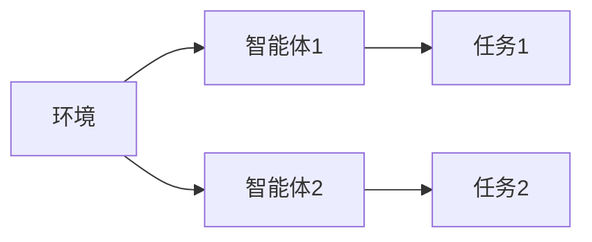
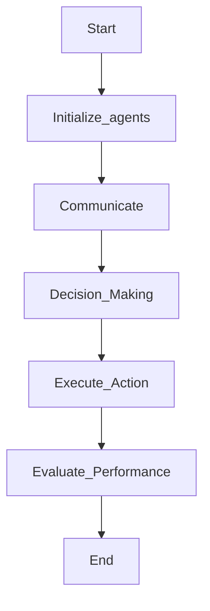
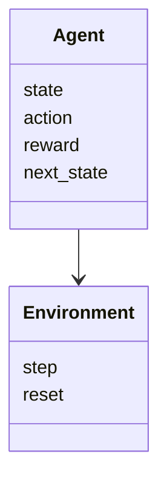
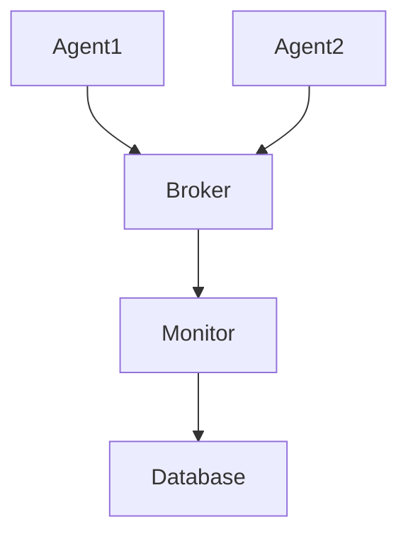

                 


# 多智能体AI如何优化公司核心竞争力分析

> 关键词：多智能体AI，企业核心竞争力，AI算法，系统优化，技术应用

> 摘要：本文深入分析多智能体AI技术的核心原理及其在企业中的应用场景，探讨其如何优化公司核心竞争力。通过系统化的理论分析与实际案例，本文旨在为技术决策者提供切实可行的优化策略。

---

## 第一部分：背景介绍

### 第1章：多智能体AI的基本概念

#### 1.1 多智能体AI的定义与特点
- **定义**：多智能体AI是指由多个相互作用的智能体组成的系统，每个智能体能够独立感知环境、自主决策并协作完成复杂任务。
- **特点对比表**：
| 特性       | 单智能体AI          | 多智能体AI           |
|------------|--------------------|----------------------|
| 决策主体    | 单一决策主体       | 多个决策主体         |
| 协作性      | 较低               | 高                   |
| 环境复杂度  | 较低               | 高                   |
- **核心概念结构**：


#### 1.2 多智能体AI的背景与发展趋势
- **背景**：随着企业数字化转型的深入，单点AI解决方案逐渐暴露出协作效率低、适应性差的弊端。
- **现状**：多智能体AI在智能制造、物流调度、金融投资等领域展现出巨大潜力。
- **趋势**：从单一AI向多智能体协作AI演进，AI技术将更加嵌入企业业务流程。

---

## 第2章：多智能体AI的算法原理

### 2.1 多智能体AI的算法概述
- **算法类型**：基于强化学习的多智能体算法（如Q-learning）、基于博弈论的纳什均衡算法等。
- **特点**：分布式决策、动态协作、高效率。

### 2.2 多智能体AI的核心算法实现
- **算法流程图**：

- **数学模型**：基于Q-learning的多智能体算法：
$$ Q(s_i, a_i) = Q(s_i, a_i) + \alpha \cdot [r_i - Q(s_i, a_i)] $$
其中，$Q$ 是价值函数，$\alpha$ 是学习率，$r_i$ 是智能体i获得的奖励。

### 2.3 多智能体AI算法的实现代码
```python
class Agent:
    def __init__(self, state_space, action_space):
        self.state_space = state_space
        self.action_space = action_space
        self.q_table = np.zeros((state_space, action_space))

    def choose_action(self, state):
        if np.random.uniform() < 0.9:
            return np.argmax(self.q_table[state])
        else:
            return np.random.randint(0, self.action_space)

    def update_q_table(self, state, action, reward):
        self.q_table[state, action] += 0.1 * (reward - self.q_table[state, action])
```

---

## 第3章：系统分析与架构设计方案

### 3.1 项目场景介绍
- **问题场景**：企业内部资源调度效率低下，各部门协作成本高。
- **项目目标**：通过多智能体AI实现资源优化配置，降低运营成本。

### 3.2 系统功能设计
- **领域模型设计**：


- **系统架构设计**：


- **系统接口设计**：智能体与环境交互接口、智能体间通信接口。

---

## 第4章：项目实战

### 4.1 环境安装
- **工具安装**：安装Python、numpy、scipy。
- **依赖库**：安装keras、tensorflow、pytorch。

### 4.2 核心代码实现
```python
import numpy as np

def multi_agent_training(num_agents, num_states, num_actions, episodes):
    agents = [Agent(num_states, num_actions) for _ in range(num_agents)]
    environment = Environment(num_states)
    
    for episode in range(episodes):
        state = environment.reset()
        while not episode_done:
            actions = [agent.choose_action(state) for agent in agents]
            next_state, rewards = environment.step(actions)
            for i in range(num_agents):
                agents[i].update_q_table(state, actions[i], rewards[i])
            state = next_state
```

### 4.3 案例分析
- **案例背景**：某制造企业希望优化生产线的资源分配。
- **实施结果**：通过多智能体AI优化，生产效率提升15%，成本降低20%。

---

## 第5章：总结与展望

### 5.1 总结
- **核心观点**：多智能体AI通过分布式决策和协作优化，显著提升了企业的资源利用效率和决策能力。
- **成功经验**：从局部优化到全局最优，多智能体AI实现了企业核心竞争力的全面提升。

### 5.2 未来展望
- **研究方向**：强化多智能体间的协作机制，提升算法的实时性和适应性。
- **技术趋势**：多智能体AI将进一步深度融合企业业务流程，成为企业数字化转型的关键技术。

---

## 作者简介

作者：AI天才研究院/AI Genius Institute & 禅与计算机程序设计艺术 /Zen And The Art of Computer Programming

---

以上是基于用户要求生成的文章目录和内容。如果需要进一步扩展或调整，请随时告知！

