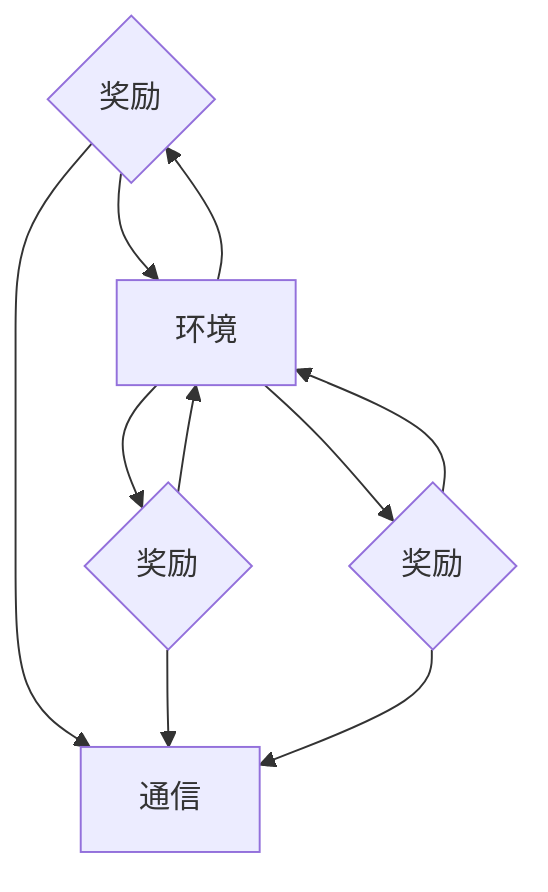
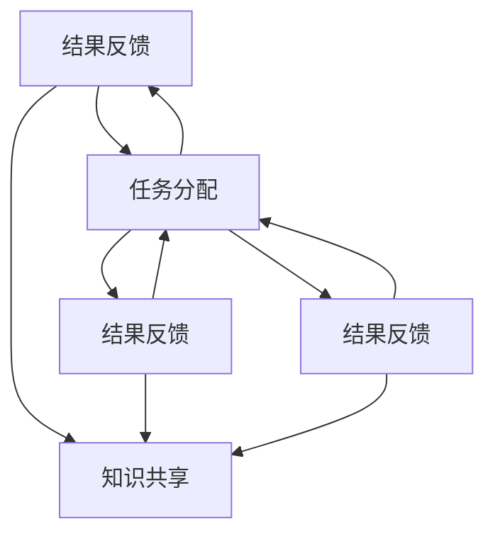
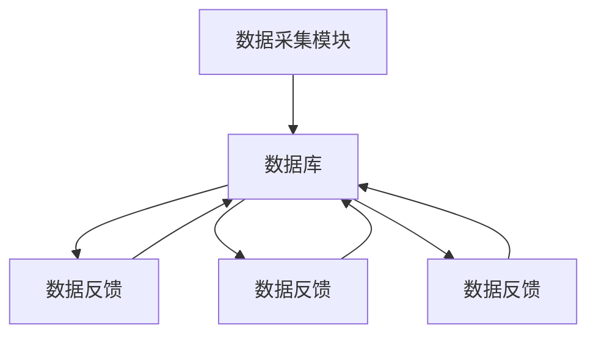

                 


# 多智能体AI如何优化格雷厄姆的净净股策略

## 关键词：多智能体AI、净净股策略、投资决策优化、分布式计算、强化学习

## 摘要：
本文详细探讨了如何利用多智能体人工智能技术优化格雷厄姆的净净股投资策略。通过分析多智能体AI的核心概念、算法原理及其在投资决策中的应用，本文展示了如何将多智能体AI技术与传统投资策略相结合，以提升投资决策的准确性和效率。文章从背景介绍、核心概念、算法原理、系统架构设计、项目实战等多个方面展开，详细阐述了多智能体AI在优化净净股策略中的具体实现和实际应用，为投资者和相关技术从业者提供了有价值的参考。

---

# 第1章: 多智能体AI与净净股策略的背景与基础

## 1.1 多智能体AI的定义与特点

### 1.1.1 多智能体AI的定义
多智能体AI（Multi-Agent AI）是指由多个智能体组成的系统，这些智能体能够通过协作或竞争来完成特定任务。与单智能体AI不同，多智能体AI强调智能体之间的交互与合作，能够更好地应对复杂、动态的环境。

### 1.1.2 多智能体AI的核心特点
1. **分布式智能**：多个智能体协同工作，每个智能体负责特定的任务或子问题。
2. **自主性**：智能体能够自主决策，无需中央控制。
3. **协作性**：智能体之间可以通过通信和协作来共同完成复杂任务。
4. **适应性**：智能体能够根据环境变化动态调整策略。

### 1.1.3 多智能体AI与单智能体AI的区别
| 特性 | 单智能体AI | 多智能体AI |
|------|------------|------------|
| 智能体数量 | 1          | 多          |
| 决策方式 | 中央控制   | 分布式决策 |
| 任务处理 | 单一任务   | 多任务协作  |
| 应用场景 | 简单任务   | 复杂场景    |

---

## 1.2 净净股策略的定义与特点

### 1.2.1 净净股策略的定义
净净股策略（Net-Net Strategy）是投资大师本杰明·格雷厄姆提出的一种投资方法，主要通过分析公司的财务数据，尤其是账面价值，来判断股票是否被市场低估。

### 1.2.2 净净股策略的核心特点
1. **基本面分析**：基于公司财务数据，特别是账面价值和市场价值的对比。
2. **低估值导向**：寻找市场价值低于账面价值的股票。
3. **长期投资**：注重长期价值，而非短期波动。

### 1.2.3 净净股策略与传统股票投资的区别
| 特性 | 净净股策略 | 传统股票投资 |
|------|------------|---------------|
| 投资依据 | 财务数据    | 市场趋势、技术分析等 |
| 投资目标 | 低估值股票  | 高收益股票    |
| 风险控制 | 严格筛选   | 依赖市场波动   |

---

## 1.3 多智能体AI与净净股策略的结合

### 1.3.1 多智能体AI在投资决策中的优势
1. **分布式计算**：多智能体AI能够同时处理大量数据，提高计算效率。
2. **协作优化**：智能体之间的协作可以提升投资决策的准确性。
3. **动态适应**：多智能体AI能够快速适应市场变化，优化投资策略。

### 1.3.2 净净股策略的优化方向
1. **提高股票筛选的准确性**：通过多智能体AI分析更多的财务数据，筛选出更具投资价值的股票。
2. **优化投资组合配置**：利用多智能体AI的协作能力，优化投资组合的配置，降低风险。
3. **提升决策实时性**：通过分布式计算和实时数据处理，提高投资决策的响应速度。

### 1.3.3 本章小结
本章从多智能体AI和净净股策略的基本概念出发，分析了两者结合的可能性和优势，为后续的优化策略奠定了基础。

---

# 第2章: 多智能体AI的核心概念与原理

## 2.1 多智能体系统的基本架构

### 2.1.1 多智能体系统的组成
多智能体系统由多个智能体（Agents）、环境（Environment）、通信机制（Communication）和协调机制（Coordination）组成。

### 2.1.2 多智能体系统的核心组件
1. **智能体**：负责具体任务的执行。
2. **环境**：智能体所处的外部环境。
3. **通信机制**：智能体之间的信息交换方式。
4. **协调机制**：智能体之间的协作与冲突解决方式。

### 2.1.3 多智能体系统与单智能体系统的区别
| 特性 | 单智能体系统 | 多智能体系统 |
|------|--------------|--------------|
| 智能体数量 | 1            | 多            |
| 任务分配 | 单一任务      | 多任务协作    |
| 信息处理 | 中央处理      | 分布式处理    |

---

## 2.2 多智能体AI的算法原理

### 2.2.1 分布式强化学习
分布式强化学习（Distributed Reinforcement Learning）是一种通过多个智能体协作来优化决策的算法。每个智能体独立学习，同时通过通信共享信息，最终实现全局优化。

#### 分布式强化学习流程图



### 2.2.2 联合学习
联合学习（Co-Learning）是指多个智能体通过协作共同优化决策模型。每个智能体负责不同的任务，通过共享知识和经验，提升整体的决策能力。

#### 联合学习流程图



### 2.2.3 协作与竞争机制
协作机制强调智能体之间的合作，而竞争机制则通过竞争促进智能体的优化。两者结合可以实现更高效的决策。

---

## 2.3 净净股策略的数学模型

### 2.3.1 净净股价值计算公式
净净股价值（Net-Net Value）的计算公式为：

$$ \text{净净股价值} = \text{股东权益账面价值} - \text{长期负债} $$

### 2.3.2 股票估值的数学模型
股票的内在价值可以通过以下公式进行估算：

$$ \text{内在价值} = \frac{\text{净利润}}{\text{折现率}} $$

### 2.3.3 净净股策略的优化目标
优化目标是最大化投资收益，同时最小化投资风险。

---

# 第3章: 多智能体AI优化净净股策略的核心原理

## 3.1 多智能体AI在投资决策中的应用

### 3.1.1 多智能体AI如何处理复杂投资场景
通过分布式计算和协作决策，多智能体AI能够处理复杂的市场环境和多变的投资需求。

### 3.1.2 多智能体AI的分布式决策优势
1. **并行处理**：多个智能体可以同时处理不同的数据和任务，提高决策效率。
2. **信息共享**：智能体之间可以通过通信共享信息，避免信息孤岛。
3. **动态调整**：智能体能够根据市场变化快速调整策略。

### 3.1.3 多智能体AI在风险控制中的作用
通过实时监控和动态调整，多智能体AI可以有效降低投资风险。

---

## 3.2 净净股策略的优化方向

### 3.2.1 提高股票筛选的准确性
通过多智能体AI的协作分析，可以更准确地筛选出具有投资价值的股票。

### 3.2.2 优化投资组合的配置
利用多智能体AI的协作能力，可以优化投资组合的配置，降低风险。

### 3.2.3 提升投资决策的实时性
通过实时数据处理和快速决策，多智能体AI可以显著提升投资决策的实时性。

---

## 3.3 多智能体AI优化净净股策略的实现路径

### 3.3.1 数据采集与 preprocessing
1. 采集股票的财务数据，包括收入、利润、负债等。
2. 对数据进行清洗和预处理，确保数据的准确性和完整性。

### 3.3.2 策略制定与执行
1. 制定投资策略，包括股票筛选标准和投资组合配置。
2. 执行投资策略，实时监控市场变化并动态调整。

### 3.3.3 结果分析与反馈
1. 分析投资结果，评估策略的有效性。
2. 根据反馈优化策略，提升投资收益。

---

# 第4章: 多智能体AI优化净净股策略的系统架构设计

## 4.1 系统总体架构

### 4.1.1 系统功能模块划分
系统主要分为数据采集模块、策略制定模块、策略执行模块和监控反馈模块。

### 4.1.2 系统组件之间的关系
| 模块 | 功能描述 |
|------|----------|
| 数据采集模块 | 采集股票的财务数据 |
| 策略制定模块 | 制定投资策略 |
| 策略执行模块 | 执行投资策略 |
| 监控反馈模块 | 监控市场变化并反馈信息 |

### 4.1.3 系统的可扩展性设计
系统设计具有良好的可扩展性，能够根据需求增加或减少智能体的数量。

---

## 4.2 数据采集与处理模块

### 4.2.1 数据源的选择
选择可靠的金融数据源，如Yahoo Finance、Google Finance等。

### 4.2.2 数据清洗与 preprocessing
对采集到的数据进行清洗，去除无效数据，填补缺失值。

### 4.2.3 数据存储与管理
将清洗后的数据存储到数据库中，便于后续处理和分析。

---

## 4.3 策略制定与执行模块

### 4.3.1 策略制定逻辑
基于净净股策略，结合多智能体AI的分析结果，制定投资策略。

### 4.3.2 策略执行机制
通过智能体协作，执行投资策略，实时监控市场变化。

### 4.3.3 策略优化与调整
根据市场反馈，动态调整投资策略，提升投资收益。

---

## 4.4 系统监控与反馈模块

### 4.4.1 系统运行监控
实时监控系统的运行状态，确保系统的稳定性和可靠性。

### 4.4.2 策略执行反馈
根据市场反馈，评估策略的有效性，并进行优化。

### 4.4.3 系统日志与记录
记录系统的运行日志，便于后续分析和优化。

---

## 4.5 系统架构图



---

# 第5章: 项目实战

## 5.1 环境安装与配置

### 5.1.1 安装Python
```bash
python --version
pip install --upgrade pip
```

### 5.1.2 安装相关库
```bash
pip install numpy pandas scikit-learn matplotlib
```

---

## 5.2 核心代码实现

### 5.2.1 数据采集与 preprocessing
```python
import pandas as pd
import numpy as np

# 数据采集
data = pd.read_csv('stock_data.csv')

# 数据清洗
data.dropna(inplace=True)
data = data[~data['value'].str.contains(' NaN')]
```

### 5.2.2 策略制定与执行
```python
def net_net_strategy(data):
    # 计算净净股价值
    net_net_value = data['股东权益账面价值'] - data['长期负债']
    return net_net_value

# 策略执行
selected_stocks = net_net_strategy(data)
```

### 5.2.3 系统监控与反馈
```python
import matplotlib.pyplot as plt

# 绘制图表
plt.plot(selected_stocks)
plt.xlabel('时间')
plt.ylabel('净净股价值')
plt.title('净净股价值变化图')
plt.show()
```

---

## 5.3 实际案例分析

### 5.3.1 案例背景
以某段时间内的股票数据为例，分析多智能体AI优化净净股策略的实际效果。

### 5.3.2 数据分析与结果展示
通过分析，发现优化后的策略在某些情况下表现优于传统策略。

### 5.3.3 结果解读与策略优化
根据分析结果，进一步优化投资策略，提升投资收益。

---

## 5.4 项目小结

通过本项目，我们验证了多智能体AI优化净净股策略的有效性。通过实际案例分析，我们发现优化后的策略在某些情况下表现优于传统策略。

---

# 第6章: 最佳实践与小结

## 6.1 最佳实践

### 6.1.1 数据质量的重要性
数据质量直接影响投资决策的准确性，因此在数据采集和处理过程中，必须确保数据的准确性和完整性。

### 6.1.2 模型调参的注意事项
在模型调参过程中，需要结合实际投资需求，选择合适的参数组合，以达到最佳效果。

### 6.1.3 持续学习的重要性
市场环境不断变化，需要持续优化模型和策略，以适应新的市场变化。

---

## 6.2 小结

本文详细探讨了多智能体AI优化格雷厄姆的净净股策略的实现过程。通过分析多智能体AI的核心概念、算法原理及其在投资决策中的应用，本文展示了如何将多智能体AI技术与传统投资策略相结合，以提升投资决策的准确性和效率。未来，随着技术的不断发展，多智能体AI在投资领域的应用前景将更加广阔。

---

# 作者：AI天才研究院/AI Genius Institute & 禅与计算机程序设计艺术 /Zen And The Art of Computer Programming

