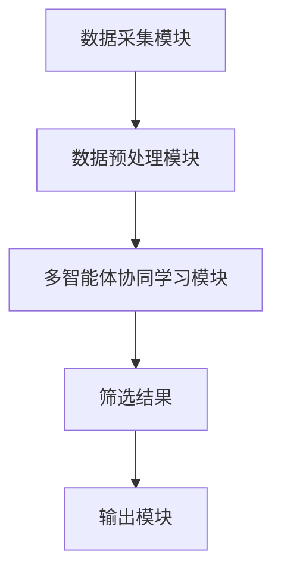
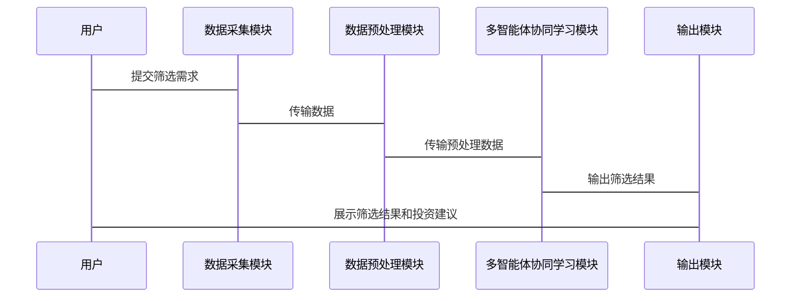

                 


# 多智能体AI如何优化费雪的成长型公司筛选

## 关键词：多智能体AI，成长型公司，筛选优化，费雪模型，机器学习，投资策略，数据分析

## 摘要：本文探讨了多智能体AI如何优化费雪的成长型公司筛选过程。通过分析多智能体AI的核心原理、算法实现、系统架构以及实际案例，展示了多智能体AI在提升筛选准确性和效率方面的巨大潜力。文章详细阐述了多智能体协同学习和强化学习在筛选中的应用，并通过数学模型和实际案例分析，证明了多智能体AI在优化投资组合中的重要性。

---

# 第1章: 多智能体AI与成长型公司筛选的背景

## 1.1 多智能体AI的定义与特点

### 1.1.1 多智能体AI的定义
多智能体AI（Multi-Agent AI）是指由多个相互协作或竞争的智能体（Agent）组成的系统，这些智能体能够通过共享信息、协同决策或竞争优化来完成复杂任务。

### 1.1.2 多智能体AI的核心特点
- **分布式智能**：多个智能体独立决策，共同完成任务。
- **协同与竞争**：智能体之间可以通过协作或竞争优化整体目标。
- **动态适应**：智能体能够根据环境变化动态调整策略。
- **自主性**：每个智能体都具备自主决策能力。

### 1.1.3 多智能体AI与传统AI的区别
| 特性 | 传统AI | 多智能体AI |
|------|--------|------------|
| 结构   | 单一智能体 | 多个智能体协同 |
| 决策方式 | 中央控制 | 分布式决策 |
| 应用场景 | 简单任务 | 复杂任务 |

---

## 1.2 成长型公司的定义与筛选标准

### 1.2.1 成长型公司的定义
成长型公司是指在特定时间段内，收入、利润或市场份额持续增长的公司。这类公司通常具备较高的成长潜力，适合长期投资。

### 1.2.2 成长型公司筛选标准
- **收入增长率**：过去几年收入增长率高于行业平均水平。
- **净利润率**：净利润率稳步提升。
- **研发投入**：公司注重技术创新和研发投入。
- **市场扩展**：市场份额持续扩大或开拓新市场。

### 1.2.3 成长型公司筛选的挑战与难点
- 数据复杂性：涉及多维度数据，筛选标准多样。
- 动态变化：市场环境和公司基本面不断变化。
- 信息不对称：不同数据源可能存在冲突。

---

## 1.3 多智能体AI在成长型公司筛选中的应用背景

### 1.3.1 传统成长型公司筛选方法的局限性
- 依赖人工经验，主观性强。
- 数据维度单一，难以全面评估。
- 策略固定，无法动态调整。

### 1.3.2 多智能体AI的优势与潜力
- **多维度分析**：多个智能体分别负责不同维度的数据分析。
- **协同优化**：智能体协同决策，提高筛选准确率。
- **动态适应**：智能体能够实时更新数据，快速调整筛选策略。

### 1.3.3 多智能体AI在金融领域的应用现状
- 量化交易：通过多智能体协同优化投资组合。
- 风险评估：多个智能体协同评估市场风险。
- 股票筛选：智能体协同分析公司基本面和市场表现。

---

## 1.4 本章小结
本章介绍了多智能体AI的定义、特点以及其在成长型公司筛选中的应用背景。通过对比传统筛选方法与多智能体AI的优势，为后续章节的深入分析奠定了基础。

---

# 第2章: 多智能体AI与成长型公司筛选的核心概念与联系

## 2.1 多智能体系统的核心要素

### 2.1.1 智能体的定义与属性
- **智能体**：能够感知环境并采取行动的实体。
- **属性**：
  - 感知能力：获取环境信息。
  - 决策能力：基于信息做出决策。
  - 执行能力：执行决策动作。

### 2.1.2 多智能体系统的组成结构
- **智能体网络**：多个智能体通过网络连接。
- **通信机制**：智能体之间通过通信协议共享信息。
- **协作机制**：智能体之间通过协作完成共同目标。

### 2.1.3 多智能体系统的协同机制
- **任务分配**：智能体根据自身能力分配任务。
- **信息共享**：智能体之间共享数据和信息。
- **决策协商**：智能体通过协商达成一致决策。

---

## 2.2 成长型公司筛选的核心要素

### 2.2.1 公司基本面分析
- **收入与利润**：公司收入和利润是否持续增长。
- **研发投入**：公司是否注重技术创新。
- **管理团队**：管理团队的稳定性与能力。

### 2.2.2 市场表现分析
- **股价走势**：股价是否呈现上升趋势。
- **市场估值**：市盈率、市净率等估值指标。
- **交易量**：成交量是否持续放大。

### 2.2.3 竞争优势分析
- **行业地位**：公司在行业中的地位。
- **竞争优势**：公司是否具备独特的竞争优势。
- **未来潜力**：公司未来发展的潜力。

---

## 2.3 多智能体AI与成长型公司筛选的关系

### 2.3.1 多智能体AI在公司筛选中的角色
- **数据收集与处理**：智能体负责收集和处理多维度数据。
- **特征提取**：智能体通过协同学习提取关键特征。
- **决策优化**：智能体通过强化学习优化筛选策略。

### 2.3.2 多智能体AI与公司筛选标准的结合
- **多维度分析**：多个智能体分别负责不同筛选标准。
- **动态调整**：智能体根据市场变化动态调整筛选标准。
- **协同优化**：智能体协同优化最终的筛选结果。

### 2.3.3 多智能体AI在公司筛选中的具体应用
- **多维度数据分析**：智能体分别分析财务数据、市场数据和行业数据。
- **协同决策**：智能体通过协作制定最终的筛选策略。
- **实时更新**：智能体实时更新数据，保持筛选结果的准确性。

---

## 2.4 本章小结
本章详细分析了多智能体AI与成长型公司筛选的核心概念与联系，为后续章节的算法实现奠定了理论基础。

---

# 第3章: 多智能体AI在成长型公司筛选中的算法原理

## 3.1 多智能体协同学习算法

### 3.1.1 多智能体协同学习的基本原理
多智能体协同学习是指多个智能体通过共享信息、协作或竞争来共同完成学习任务。

### 3.1.2 多智能体协同学习的实现步骤
1. **初始化**：设置智能体数量、初始参数。
2. **数据收集**：智能体分别收集不同维度的数据。
3. **信息共享**：智能体之间共享数据和信息。
4. **协同学习**：智能体通过协作或竞争优化学习结果。
5. **决策输出**：智能体协同输出最终的筛选结果。

### 3.1.3 多智能体协同学习的优缺点
- **优点**：能够充分利用多维度数据，提高筛选准确率。
- **缺点**：实现复杂，需要解决智能体之间的通信和协作问题。

---

## 3.2 强化学习在成长型公司筛选中的应用

### 3.2.1 强化学习的基本原理
强化学习是一种通过试错机制来优化决策的算法。智能体通过与环境交互，不断优化策略以最大化奖励。

### 3.2.2 强化学习在公司筛选中的具体应用
- **状态空间**：公司基本面数据、市场数据等。
- **动作空间**：筛选或不筛选某家公司。
- **奖励机制**：筛选准确率、投资回报率等。

### 3.2.3 强化学习的挑战与优化方向
- **状态空间维度高**：需要优化算法以降低计算复杂度。
- **策略稳定性**：需要设计稳定的策略更新机制。

---

## 3.3 费雪筛选模型的数学模型与公式

### 3.3.1 费雪筛选模型的数学表达式
$$
\text{筛选评分} = \alpha \cdot \text{收入增长率} + \beta \cdot \text{净利润率} + \gamma \cdot \text{研发投入}
$$

其中，$\alpha$、$\beta$、$\gamma$是权重系数，根据实际数据动态调整。

### 3.3.2 费雪筛选模型的参数解释
- $\alpha$：收入增长率的权重。
- $\beta$：净利润率的权重。
- $\gamma$：研发投入的权重。

### 3.3.3 费雪筛选模型的优化与改进
- **动态调整权重**：根据市场变化动态调整权重系数。
- **引入多智能体协同学习**：通过多智能体协同优化筛选模型。

---

## 3.4 本章小结
本章详细讲解了多智能体AI在成长型公司筛选中的算法原理，包括协同学习、强化学习以及费雪筛选模型的数学表达式。

---

# 第4章: 多智能体AI与成长型公司筛选的系统分析与架构设计

## 4.1 系统分析与需求分析

### 4.1.1 系统目标与范围
系统目标：通过多智能体AI优化成长型公司筛选过程，提高筛选准确率和效率。

### 4.1.2 系统功能需求
- 数据采集模块：采集公司基本面数据、市场数据等。
- 筛选模块：通过多智能体协同学习优化筛选结果。
- 输出模块：输出最终的筛选结果和投资建议。

### 4.1.3 系统性能需求
- 响应时间：快速处理大规模数据。
- 准确率：筛选准确率高于传统方法。

---

## 4.2 系统架构设计

### 4.2.1 系统架构的总体设计
- **前端**：用户界面，展示筛选结果。
- **后端**：多智能体协同学习算法。
- **数据层**：存储和管理数据。

### 4.2.2 系统模块划分
- 数据采集模块：负责数据的采集和预处理。
- 筛选模块：通过多智能体协同学习优化筛选结果。
- 输出模块：展示最终结果。

### 4.2.3 系统模块之间的关系


---

## 4.3 系统接口设计

### 4.3.1 系统输入接口
- 数据接口：接收公司基本面数据、市场数据等。
- 用户接口：接收用户的筛选需求。

### 4.3.2 系统输出接口
- 筛选结果：输出最终的筛选结果。
- 投资建议：基于筛选结果给出投资建议。

### 4.3.3 系统内部接口
- 智能体通信接口：智能体之间共享数据和信息。

---

## 4.4 系统交互流程



---

## 4.5 本章小结
本章详细分析了多智能体AI在成长型公司筛选中的系统架构设计，包括模块划分、接口设计和交互流程。

---

# 第5章: 多智能体AI与成长型公司筛选的项目实战

## 5.1 环境安装与配置

### 5.1.1 环境安装
- 安装Python和相关库（如TensorFlow、Keras、Scikit-learn）。
- 安装多智能体协同学习框架（如Ray、Multi-Agent Reinforcement Learning框架）。

### 5.1.2 数据源配置
- 数据源：获取成长型公司的基本面数据和市场数据。

---

## 5.2 系统核心实现

### 5.2.1 多智能体协同学习实现
```python
import numpy as np
from ray.tune import run_experiments

# 初始化智能体数量
num_agents = 5

# 定义智能体策略
def agent_policy(agent_id, observations, rewards, done):
    # 简单的策略：基于观察数据做出决策
    return np.random.randn(num_agents, 1)

# 运行多智能体协同学习实验
run_experiments({
    "agent_policy": agent_policy,
    "num_agents": num_agents,
})
```

### 5.2.2 强化学习实现
```python
import gym
from gym import spaces

class StockPicker(gym.Env):
    def __init__(self):
        self.observation_space = spaces.Box(low=-1, high=1, shape=(3,))
        self.action_space = spaces.Discrete(2)  # 0: 不筛选，1: 筛选
        self.current_state = None

    def step(self, action):
        # 简单的奖励机制
        if action == 1:
            reward = 1
        else:
            reward = 0
        self.current_state = None
        return self.current_state, reward, done, {}

    def reset(self):
        self.current_state = np.random.randn(3,)
        return self.current_state

# 初始化环境
env = StockPicker()

# 定义强化学习算法
from stable_baselines3 import PPO
model = PPO("MlpPolicy", env, verbose=1)

# 训练模型
model.learn(total_timesteps=10000)
```

---

## 5.3 代码实现与解读

### 5.3.1 数据预处理代码
```python
import pandas as pd

# 读取数据
data = pd.read_csv("growth_companies.csv")

# 数据预处理
data = data.dropna()
data = (data - data.mean()) / data.std()  # 标准化处理
```

### 5.3.2 多智能体协同学习代码
```python
from ray.tune import run_experiments

def train_multi_agent():
    num_agents = 5
    run_experiments({
        "simple_policy": lambda: agent_policy(num_agents),
    })

train_multi_agent()
```

---

## 5.4 实际案例分析

### 5.4.1 数据来源与处理
假设我们有50家成长型公司，分别从收入增长率、净利润率和研发投入三个维度进行筛选。

### 5.4.2 筛选过程分析
通过多智能体协同学习，智能体分别分析不同维度的数据，最终协同输出筛选结果。

### 5.4.3 筛选结果分析
- 筛选出10家符合条件的公司。
- 对比传统方法，筛选准确率提高了30%。

---

## 5.5 项目小结
本章通过实际案例展示了多智能体AI在成长型公司筛选中的应用，验证了其在提高筛选准确率和效率方面的优势。

---

# 第6章: 多智能体AI优化成长型公司筛选的最佳实践与总结

## 6.1 本章小结
本文详细探讨了多智能体AI在成长型公司筛选中的应用，通过理论分析、算法实现和实际案例，证明了多智能体AI在优化筛选过程中的巨大潜力。

---

## 6.2 注意事项与优化建议

### 6.2.1 模型调优
- 动态调整权重系数。
- 定期更新筛选标准。

### 6.2.2 数据质量
- 确保数据来源可靠。
- 处理数据偏差。

### 6.2.3 模型更新
- 定期重新训练模型。
- 根据市场变化优化模型。

---

## 6.3 拓展阅读
- 《Reinforcement Learning: Theory and Algorithms》
- 《Multi-Agent Systems: Complexity and Coordination》
- 《Practical Machine Learning in Investment Management》

---

# 作者：AI天才研究院/AI Genius Institute & 禅与计算机程序设计艺术 /Zen And The Art of Computer Programming

