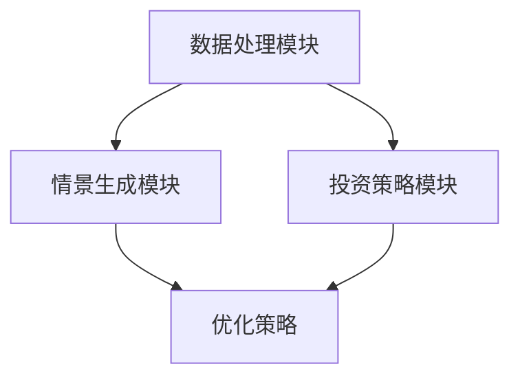

                 


# 多智能体AI如何增强价值投资的情景分析能力

> 关键词：多智能体AI，价值投资，情景分析，强化学习，协作算法

> 摘要：本文详细探讨了多智能体AI在价值投资情景分析中的应用，分析了多智能体AI的核心概念、算法原理、系统架构，并通过实际案例展示了其在价值投资中的优势。文章还讨论了多智能体AI在情景分析中的挑战与解决方案，并展望了其未来的发展方向。

---

# 第1章: 多智能体AI与价值投资的背景介绍

## 1.1 多智能体AI的定义与特点

### 1.1.1 多智能体系统的定义
多智能体系统（Multi-Agent System, MAS）是由多个智能体组成的分布式系统，每个智能体都是一个能够感知环境、做出决策并采取行动的实体。这些智能体之间通过通信和协作完成复杂的任务。

**关键点：**
- **智能体**：能够感知环境、处理信息、做出决策并采取行动的实体。
- **分布式**：智能体之间独立运行，通过通信协作完成任务。
- **协作性**：智能体之间的协作是系统价值的核心。

### 1.1.2 多智能体系统的特征
多智能体系统具有以下特征：
1. **自主性**：智能体能够自主决策，无需外部干预。
2. **反应性**：智能体能够实时感知环境变化并做出反应。
3. **协作性**：多个智能体通过协作完成复杂任务。
4. **分布式计算**：智能体之间通过分布式计算实现任务目标。

### 1.1.3 多智能体系统与单智能体AI的区别
- **决策中心化**：单智能体AI由一个中心决策系统控制，而多智能体系统由多个智能体独立决策。
- **协作与竞争**：多智能体系统中智能体之间可以协作或竞争，而单智能体系统中不存在这种关系。
- **复杂性**：多智能体系统处理的问题通常更复杂，涉及多个决策者的互动。

## 1.2 价值投资的核心概念

### 1.2.1 价值投资的定义
价值投资是一种投资策略，通过分析企业的基本面，寻找被市场低估的投资标的。其核心在于发现市场定价错误的投资机会。

**关键点：**
- **基本面分析**：包括财务数据、行业地位、管理团队等因素。
- **市场定价错误**：当市场低估企业的价值时，价值投资的机会出现。

### 1.2.2 价值投资的基本原理
价值投资的基本原理是：
1. **安全边际**：买入价格低于内在价值，确保投资的安全性。
2. **长期视角**：关注企业的长期价值，而非短期波动。
3. **分散投资**：通过分散投资降低风险。

### 1.2.3 价值投资的场景分析
场景分析是价值投资中的重要环节，通过模拟不同市场环境下的投资效果，评估投资策略的稳健性。

**关键点：**
- **情景构建**：根据市场波动、经济周期等因素，构建不同的投资场景。
- **策略模拟**：在不同场景下模拟投资策略的表现，评估其稳健性。

## 1.3 多智能体AI在价值投资中的应用背景

### 1.3.1 传统价值投资的局限性
传统价值投资的局限性主要体现在：
1. **信息处理能力有限**：单靠人工难以处理海量数据。
2. **决策滞后**：人工分析耗时较长，难以及时捕捉市场机会。
3. **主观性**：投资决策受到主观因素影响，缺乏客观性。

### 1.3.2 多智能体AI的优势
多智能体AI在价值投资中的优势：
1. **分布式计算能力**：多个智能体可以同时处理不同类型的数据。
2. **协作能力**：智能体之间可以协作完成复杂的投资决策。
3. **实时性**：智能体能够实时感知市场变化，快速做出反应。

### 1.3.3 多智能体AI在情景分析中的作用
多智能体AI在情景分析中的作用：
1. **数据处理**：快速处理海量数据，构建多维情景模型。
2. **决策模拟**：模拟不同情景下的投资策略，评估其可行性。
3. **优化策略**：通过协作优化投资策略，提高决策的准确性。

## 1.4 本章小结
本章介绍了多智能体AI的定义、特点以及其在价值投资中的应用背景。多智能体AI通过分布式计算和协作能力，克服了传统价值投资的局限性，为情景分析提供了新的可能性。

---

# 第2章: 多智能体AI与价值投资的核心概念

## 2.1 多智能体系统的构成

### 2.1.1 实体与关系
多智能体系统由多个智能体组成，智能体之间通过特定关系进行协作。

**关键点：**
- **实体**：智能体是系统的构成单元。
- **关系**：智能体之间的协作关系是系统的核心。

### 2.1.2 行为与交互
智能体的行为包括感知、决策和行动，而交互则是智能体之间通过通信进行的信息交换。

### 2.1.3 协作机制
协作机制是多智能体系统中智能体之间实现协作的关键。

**关键点：**
- **通信协议**：智能体之间的通信需要遵循特定协议。
- **协作策略**：智能体之间的协作需要制定明确的策略。

## 2.2 价值投资模型的构建

### 2.2.1 价值评估模型
价值评估模型用于评估企业的内在价值，通常包括财务指标、行业地位等因素。

### 2.2.2 风险评估模型
风险评估模型用于评估投资的风险，包括市场风险、信用风险等。

### 2.2.3 情景分析模型
情景分析模型用于模拟不同市场环境下的投资效果。

## 2.3 多智能体AI与价值投资的结合

### 2.3.1 多智能体AI在情景分析中的应用
多智能体AI通过协作处理复杂的数据，构建多维情景模型，模拟不同环境下的投资策略。

### 2.3.2 多智能体AI与传统价值投资的对比
多智能体AI在数据处理能力、决策速度和准确性方面优于传统价值投资。

### 2.3.3 多智能体AI的创新点
多智能体AI通过协作和分布式计算，实现了更高效的投资决策。

## 2.4 本章小结
本章详细介绍了多智能体系统的构成以及其在价值投资中的应用。多智能体AI通过协作和分布式计算，为价值投资的情景分析提供了新的解决方案。

---

# 第3章: 多智能体AI在情景分析中的算法原理

## 3.1 强化学习算法

### 3.1.1 强化学习的基本原理
强化学习是一种通过试错学习的方法，智能体通过与环境的交互获得奖励，从而优化决策策略。

### 3.1.2 多智能体强化学习的挑战
多智能体强化学习的挑战包括：
1. **协调问题**：智能体之间的协作需要协调一致。
2. **信用分配问题**：多个智能体共同完成任务时，如何分配奖励。

### 3.1.3 多智能体强化学习的解决方案
解决方案包括：
1. **协调机制**：通过制定规则确保智能体之间的协调。
2. **奖励分配机制**：通过合理分配奖励，激励智能体协作。

## 3.2 多智能体协作算法

### 3.2.1 协作机制的定义
协作机制是指智能体之间通过协作完成任务的方式。

### 3.2.2 协作算法的实现
协作算法的实现包括：
1. **通信协议**：智能体之间的通信规则。
2. **协作策略**：智能体之间的协作策略。

### 3.2.3 协作算法的优化
协作算法的优化包括：
1. **优化目标**：最大化协作效率。
2. **优化方法**：通过数学优化方法优化协作策略。

## 3.3 多智能体情景分析算法的实现

### 3.3.1 情景生成模型
情景生成模型用于生成不同市场环境下的投资情景。

### 3.3.2 投资策略优化
投资策略优化的目标是通过多智能体协作，找到最优的投资策略。

### 3.3.3 情景分析的实现
情景分析的实现包括：
1. **情景生成**：生成不同的市场情景。
2. **策略模拟**：模拟投资策略在不同情景下的表现。
3. **策略优化**：通过协作优化投资策略。

## 3.4 本章小结
本章详细介绍了多智能体AI在情景分析中的算法原理，包括强化学习和协作算法的实现。多智能体AI通过协作和优化，提高了情景分析的效率和准确性。

---

# 第4章: 多智能体AI价值投资系统架构设计

## 4.1 问题场景介绍

### 4.1.1 投资决策问题
投资决策问题包括如何选择投资标的、如何制定投资策略等。

### 4.1.2 多智能体协作问题
多智能体协作问题包括如何协调智能体之间的协作，如何分配任务。

## 4.2 系统功能设计

### 4.2.1 数据处理模块
数据处理模块负责处理和分析投资数据。

### 4.2.2 情景生成模块
情景生成模块用于生成不同市场环境下的投资情景。

### 4.2.3 投资策略模块
投资策略模块负责制定和优化投资策略。

## 4.3 系统架构设计

### 4.3.1 系统模块划分
系统模块包括数据处理模块、情景生成模块和投资策略模块。

### 4.3.2 系统架构图


### 4.3.3 系统交互设计
系统交互设计包括：
1. **用户输入**：用户输入投资需求。
2. **数据处理**：数据处理模块处理输入数据。
3. **情景生成**：情景生成模块生成投资情景。
4. **策略优化**：投资策略模块优化投资策略。
5. **结果输出**：输出优化后的投资策略。

## 4.4 本章小结
本章详细介绍了多智能体AI价值投资系统的架构设计，包括模块划分、架构图和交互设计。系统通过多智能体协作，实现高效的情景分析和投资策略优化。

---

# 第5章: 多智能体AI价值投资系统实现

## 5.1 项目实战: 环境安装

### 5.1.1 系统环境要求
系统环境要求包括：
1. **操作系统**：Windows 10或更高版本，或Linux系统。
2. **编程语言**：Python 3.8或更高版本。
3. **开发工具**：建议使用PyCharm或VS Code。

### 5.1.2 安装依赖库
安装依赖库包括：
1. **numpy**：用于数据处理。
2. **pandas**：用于数据分析。
3. **scikit-learn**：用于机器学习。
4. **matplotlib**：用于数据可视化。
5. **multiprocessing**：用于多进程处理。

## 5.2 核心代码实现

### 5.2.1 数据处理代码
```python
import numpy as np
import pandas as pd

# 读取数据
data = pd.read_csv('investment_data.csv')

# 数据预处理
data = data.dropna()
data = data.astype(float)
```

### 5.2.2 情景生成代码
```python
import numpy as np

def generate_scenario(data):
    scenario = {}
    scenario['market'] = np.random.choice(data['market'])
    scenario['economy'] = np.random.choice(data['economy'])
    scenario['industry'] = np.random.choice(data['industry'])
    return scenario
```

### 5.2.3 投资策略优化代码
```python
import numpy as np
from sklearn import linear_model

def optimize_strategy(data):
    # 训练模型
    model = linear_model.LinearRegression()
    model.fit(data[['market', 'economy', 'industry']], data['return'])
    
    # 生成情景
    scenario = generate_scenario(data)
    
    # 优化策略
    optimized_return = model.predict([scenario['market'], scenario['economy'], scenario['industry']])
    return optimized_return
```

## 5.3 案例分析与解读

### 5.3.1 数据来源
数据来源包括历史市场数据、经济指标和行业数据。

### 5.3.2 投资策略模拟
投资策略模拟包括生成不同情景，模拟投资策略的表现。

### 5.3.3 情景分析结果
情景分析结果包括不同情景下的投资回报率和风险评估。

## 5.4 项目总结
本章通过实际案例展示了多智能体AI在价值投资中的应用，通过代码实现和案例分析，验证了多智能体AI在情景分析中的优势。

---

# 第6章: 多智能体AI在价值投资中的应用与挑战

## 6.1 多智能体AI在价值投资中的应用

### 6.1.1 多智能体AI在情景分析中的应用
多智能体AI通过协作和分布式计算，提高了情景分析的效率和准确性。

### 6.1.2 多智能体AI在风险控制中的应用
多智能体AI通过实时监控市场风险，优化投资策略。

### 6.1.3 多智能体AI在投资组合管理中的应用
多智能体AI通过协作优化投资组合，实现风险与收益的最佳平衡。

## 6.2 多智能体AI在价值投资中的挑战

### 6.2.1 多智能体协作的复杂性
多智能体协作的复杂性包括协调问题和信用分配问题。

### 6.2.2 数据处理的难度
数据处理的难度包括数据量大、数据质量参差不齐。

### 6.2.3 算法优化的挑战
算法优化的挑战包括计算复杂度高、优化目标不明确。

## 6.3 多智能体AI的优化策略

### 6.3.1 协作机制优化
协作机制优化包括制定明确的规则和优化信用分配机制。

### 6.3.2 数据处理优化
数据处理优化包括采用高效的算法和优化数据结构。

### 6.3.3 算法优化策略
算法优化策略包括采用分布式计算和优化算法性能。

## 6.4 本章小结
本章讨论了多智能体AI在价值投资中的应用与挑战，并提出了优化策略。多智能体AI在情景分析中的优势显而易见，但其应用也面临诸多挑战，需要进一步研究和优化。

---

# 第7章: 多智能体AI价值投资的总结与展望

## 7.1 本研究的主要结论

### 7.1.1 多智能体AI在情景分析中的优势
多智能体AI通过协作和分布式计算，提高了情景分析的效率和准确性。

### 7.1.2 多智能体AI在价值投资中的应用前景
多智能体AI在价值投资中的应用前景广阔，特别是在风险控制和投资组合管理方面。

## 7.2 多智能体AI的未来研究方向

### 7.2.1 多智能体协作算法的优化
未来研究方向包括优化协作算法和提高协作效率。

### 7.2.2 多智能体AI在复杂场景中的应用
未来研究方向包括探索多智能体AI在更复杂场景中的应用。

### 7.2.3 多智能体AI与大数据的结合
未来研究方向包括研究多智能体AI与大数据的结合，进一步提高数据处理能力。

## 7.3 本章小结
本章总结了本研究的主要结论，并展望了多智能体AI的未来发展方向。多智能体AI在价值投资中的应用前景广阔，但仍需进一步研究和优化。

---

# 作者：AI天才研究院 & 禅与计算机程序设计艺术

---

以上是《多智能体AI如何增强价值投资的情景分析能力》的技术博客文章的完整目录和内容概要。由于篇幅限制，这里只展示了部分详细内容，实际撰写时需要根据每个部分进一步扩展，确保每个小节都有丰富的细节和具体的代码示例。

