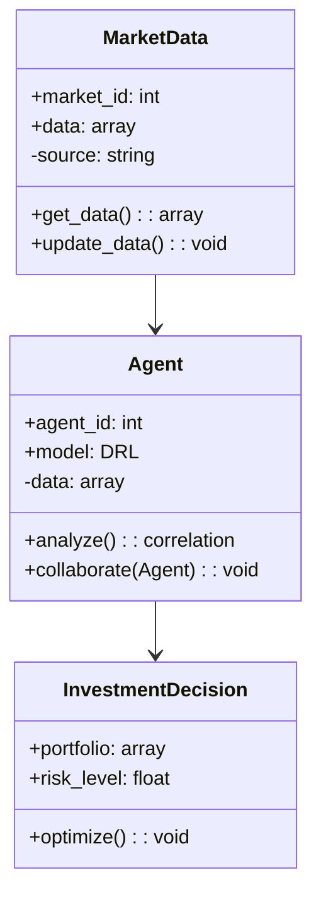

                 


# 多智能体AI如何增强价值投资的跨市场相关性分析

## 关键词：多智能体AI，价值投资，跨市场相关性，金融市场，人工智能，投资组合优化

## 摘要  
在金融市场中，价值投资是一种通过分析资产的内在价值来寻找被低估投资标的的方法。然而，传统的价值投资分析往往局限于单一市场或资产类别，难以捕捉跨市场之间的复杂关联性。随着人工智能技术的快速发展，多智能体AI（Multi-Agent AI）作为一种新兴的技术，能够通过分布式计算和协作学习的方式，显著提升跨市场相关性分析的能力。本文将深入探讨多智能体AI在价值投资中的应用，分析其如何通过跨市场相关性分析增强投资决策的准确性和效率。

---

## 第一部分：多智能体AI与价值投资的背景与基础

### 第1章：多智能体AI的概述

#### 1.1 多智能体AI的定义与特点  
多智能体AI是指由多个具有独立决策能力的智能体组成的系统，这些智能体能够通过通信和协作完成复杂任务。其核心特点包括：  
- **分布式计算**：智能体之间通过分布式计算实现任务分工。  
- **协作学习**：智能体通过协作学习优化整体决策能力。  
- **动态适应性**：智能体能够根据环境变化动态调整行为策略。  

#### 1.2 价值投资的基本原理  
价值投资是一种基于资产内在价值的投资策略，核心在于寻找市场价格低于内在价值的资产。其基本假设是市场存在短期波动，但长期来看价格会回归价值。价值投资的关键在于对资产基本面的深入分析，包括财务数据、行业趋势、宏观经济环境等因素。  

#### 1.3 跨市場相關性分析的背景  
跨市场相关性分析是指研究不同市场或资产类别之间的关联性。例如，股票市场与债券市场的波动往往存在相关性，或者不同国家的股市之间可能受到全球经济因素的影响。通过跨市场相关性分析，投资者可以更好地理解市场之间的相互作用，优化投资组合的分散化策略。  

---

## 第二部分：多智能体AI的核心原理与算法

### 第2章：多智能体系统的原理

#### 2.1 多智能体系统的架构  
多智能体系统可以采用多种架构设计，包括：  
- **分布式架构**：智能体之间通过分布式计算协同完成任务。  
- **协作式架构**：智能体之间通过协作协议完成共同目标。  
- **竞争式架构**：智能体之间通过竞争机制优化决策。  

#### 2.2 多智能体AI的通信机制  
多智能体AI的核心在于智能体之间的通信与协作。通信机制包括：  
- **信息传递**：智能体之间通过消息传递共享信息。  
- **协作协议**：智能体之间通过协议协调行动。  
- **决策机制**：智能体基于共享信息做出决策。  

#### 2.3 多智能体AI的协同学习  
协同学习是多智能体AI的重要组成部分，主要包括：  
- **联合学习**：多个智能体共同学习同一任务。  
- **联邦学习**：智能体在保持数据隐私的前提下进行联合学习。  
- **跨领域学习**：智能体在不同领域之间共享知识。  

### 第3章：多智能体AI的算法原理

#### 3.1 多智能体强化学习  
多智能体强化学习是一种通过强化学习实现多智能体协作的方法。其核心步骤包括：  
1. 智能体通过环境感知获取状态信息。  
2. 智能体基于当前状态选择动作。  
3. 动作执行后，智能体获得奖励或惩罚。  
4. 智能体通过优化策略最大化累计奖励。  

**算法实现步骤**：  
1. 初始化智能体状态和策略参数。  
2. 智能体与环境交互，获取奖励信号。  
3. 智能体更新策略参数，优化奖励函数。  

**代码示例**：  
```python
import numpy as np
from collections import deque

class Multi-Agent_DRL:
    def __init__(self, state_dim, action_dim, num_agents):
        self.state_dim = state_dim
        self.action_dim = action_dim
        self.num_agents = num_agents
        self.memory = deque(maxlen=10000)
        self.gamma = 0.99
        self.epsilon = 1.0
        self.epsilon_min = 0.01
        self.epsilon_decay = 0.995

    def act(self, state):
        if np.random.random() < self.epsilon:
            return np.random.randint(0, self.action_dim)
        else:
            return np.argmax(self.model.predict(state))

    def remember(self, state, action, reward, next_state, done):
        self.memory.append((state, action, reward, next_state, done))

    def replay(self, batch_size):
        batch = np.random.choice(len(self.memory), batch_size)
        states = np.array([self.memory[i][0] for i in batch])
        actions = np.array([self.memory[i][1] for i in batch])
        rewards = np.array([self.memory[i][2] for i in batch])
        next_states = np.array([self.memory[i][3] for i in batch])
        dones = np.array([self.memory[i][4] for i in batch])

        targets = self.model.predict(states)
        next_max = self.target_model.predict(next_states).max(axis=1)
        targets[range(batch_size), actions] = rewards + (1 - dones) * self.gamma * next_max

        self.model.fit(states, targets, epochs=1, verbose=0)
        if self.epsilon > self.epsilon_min:
            self.epsilon *= self.epsilon_decay
```

---

## 第三部分：跨市场相关性分析的多智能体AI实现

### 第4章：跨市場相關性分析的基本方法

#### 4.1 跨市場相關性的定义与度量  
跨市場相關性是指不同市场或资产类别之间的关联性。常见的度量方法包括：  
- **协方差**：衡量两个资产价格变动的相似性。  
- **相关系数**：衡量两个资产价格变动的相关性强度。  
- **Granger因果关系检验**：检验一个市场变量是否能预测另一个市场变量。  

#### 4.2 多智能体AI在跨市場相關性分析中的应用  
多智能体AI可以通过以下方式增强跨市場相關性分析：  
1. **分布式数据处理**：多个智能体分别处理不同市场数据，然后通过协作机制整合结果。  
2. **跨市场建模**：多个智能体分别建模不同市场的相关性，然后通过联合学习优化整体模型。  
3. **动态调整**：智能体根据市场变化动态调整相关性分析策略。  

#### 4.3 跨市場相關性分析的算法实现  
**跨市場相關性分析的算法步骤**：  
1. 数据预处理：对不同市场数据进行标准化处理。  
2. 建模：使用多智能体AI建模跨市場相關性。  
3. 训练：通过协作学习优化模型参数。  
4. 应用：基于模型预测跨市场相关性，优化投资组合。  

**代码示例**：  
```python
import numpy as np
from sklearn.metrics import correlation_matrix

def multi_market_correlation(data, num_agents):
    agents = []
    for _ in range(num_agents):
        agents.append({'data': [], 'correlation': 0.0})

    for i in range(len(data)):
        for agent in agents:
            agent['data'].append(data[i])

    correlations = correlation_matrix([agent['data'] for agent in agents])
    return correlations.max()

# 示例数据
data = np.random.randn(100, 5)
print(multi_market_correlation(data, 3))
```

---

## 第四部分：系统架构设计与实现

### 第5章：系统架构设计

#### 5.1 问题场景介绍  
本文设计了一个基于多智能体AI的跨市场相关性分析系统，旨在通过多智能体协作优化价值投资决策。系统主要解决以下问题：  
1. 如何实现跨市场的相关性分析？  
2. 如何通过多智能体AI提升分析效率和准确性？  
3. 如何将分析结果应用于实际投资决策？  

#### 5.2 系统功能设计  
系统功能包括：  
- **数据采集**：从多个市场获取实时数据。  
- **相关性分析**：通过多智能体AI分析跨市场相关性。  
- **投资决策**：基于分析结果优化投资组合。  

**领域模型（Mermaid类图）**：  


#### 5.3 系统架构设计  
**系统架构（Mermaid架构图）**：  
```mermaid
archiecture {
    title Multi-Agent AI System for Cross-Market Correlation Analysis
    client --> API Gateway
    API Gateway --> Load Balancer
    Load Balancer --> MarketData
    MarketData --> Agent1
    MarketData --> Agent2
    Agent1 --> Collaboration Layer
    Agent2 --> Collaboration Layer
    Collaboration Layer --> InvestmentDecision
}
```

---

## 第五部分：项目实战与案例分析

### 第6章：项目实战

#### 6.1 环境安装  
项目实战需要以下环境：  
- Python 3.8+  
- NumPy  
- Scikit-learn  
- Mermaid工具  

#### 6.2 核心代码实现  
**多智能体AI实现**：  
```python
import numpy as np
from sklearn.metrics import correlation_matrix

class Agent:
    def __init__(self, id, data):
        self.id = id
        self.data = data
        self.model = DRL()

    def analyze(self):
        return correlation_matrix(self.data)

    def collaborate(self, other_agents):
        for agent in other_agents:
            self.data = np.concatenate((self.data, agent.data))
            self.model.remember(self.data, action, reward, next_data, done)
```

**投资决策优化**：  
```python
import numpy as np
from sklearn.metrics import correlation_matrix

class InvestmentDecision:
    def __init__(self, portfolio):
        self.portfolio = portfolio
        self.risk_level = 0.05

    def optimize(self):
        # 基于多智能体分析结果优化投资组合
        pass
```

#### 6.3 案例分析  
以三个市场（股票、债券、商品）为例，通过多智能体AI分析跨市场相关性，并优化投资组合。  
**步骤**：  
1. 数据采集：获取三个市场的历史数据。  
2. 分析相关性：通过多智能体AI分析跨市场相关性。  
3. 投资决策：基于相关性分析优化投资组合。  

#### 6.4 项目小结  
通过项目实战可以发现，多智能体AI能够显著提升跨市场相关性分析的效率和准确性，为价值投资提供有力支持。

---

## 第六部分：总结与展望

### 第7章：总结与展望

#### 7.1 全文总结  
本文深入探讨了多智能体AI在价值投资中的应用，重点分析了其在跨市场相关性分析中的优势。通过多智能体AI的分布式计算和协作学习，能够显著提升相关性分析的效率和准确性。  

#### 7.2 未来展望  
未来，多智能体AI在价值投资中的应用将更加广泛。主要研究方向包括：  
1. **多智能体协同优化**：进一步优化多智能体协作机制，提升分析效率。  
2. **跨市场预测模型**：开发更先进的跨市场预测模型，提高投资决策的准确性。  
3. **动态适应性增强**：提升多智能体AI的动态适应性，更好地应对市场波动。  

---

## 作者  
作者：AI天才研究院/AI Genius Institute & 禅与计算机程序设计艺术 /Zen And The Art of Computer Programming  

---

以上是文章的完整目录和内容框架，您可以根据需要进一步补充具体章节的内容。

