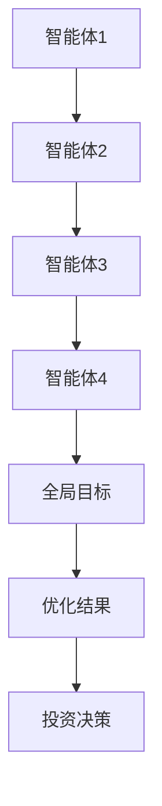

                 


# 多智能体AI如何增强价值投资的跨资产类别配置

## 关键词：
- 多智能体AI
- 价值投资
- 跨资产类别配置
- 算法协同
- 投资组合优化

## 摘要：
多智能体AI通过协同学习和动态优化，显著提升价值投资的跨资产配置效率和精度。本文详细阐述其原理、算法、系统架构及实战应用，为投资决策提供新思路。

---

# 正文

## 第一部分：背景介绍

### 第1章：多智能体AI与价值投资概述

#### 1.1 多智能体AI的背景与概念
- **1.1.1 传统投资的局限性**
  - 传统投资依赖人工分析，主观性强，效率低。
  - 资产类别单一，难以分散风险。
  - 信息处理能力有限，难以捕捉实时变化。

- **1.1.2 多智能体AI的定义与特点**
  - 多智能体系统：由多个相互作用的智能体构成，每个智能体负责特定任务。
  - 协作与竞争：智能体间通过通信协同，提升整体决策质量。
  - 高效性：分布式计算，实时处理海量数据，提高决策效率。

- **1.1.3 价值投资与跨资产配置的结合**
  - 价值投资强调长期基本面分析，多智能体AI提供数据支持。
  - 跨资产配置优化投资组合，降低风险，提升收益。

#### 1.2 问题背景与目标
- **1.2.1 投资组合优化的挑战**
  - 资产类别多样，关联性强，难以平衡风险与收益。
  - 数据量大，实时性要求高，传统方法难以应对。
  - 市场波动大，需要快速响应。

- **1.2.2 多智能体协同的优势**
  - 分布式计算，高效处理复杂数据。
  - 多角度分析，提供全面的投资建议。
  - 动态调整，适应市场变化。

- **1.2.3 跨资产类别配置的目标**
  - 最大化收益，最小化风险。
  - 实现资产多元化，分散投资风险。
  - 精准捕捉市场机会，优化投资组合。

#### 1.3 多智能体AI在金融领域的应用框架
- **1.3.1 整体框架概述**
  - 数据采集：实时收集多资产数据。
  - 分析与决策：智能体协同分析，生成投资建议。
  - 执行与监控：自动执行交易，实时监控风险。

- **1.3.2 核心要素组成**
  - 数据源：股票、债券、基金等多类资产数据。
  - 智能体：负责不同任务，如市场分析、风险评估。
  - 通信机制：智能体间信息共享与协同。

- **1.3.3 边界与外延**
  - 外部接口：与数据源、交易平台对接。
  - 内部机制：智能体间的协作规则。
  - 应用范围：涵盖股票、债券、期货等多种资产。

---

## 第二部分：核心概念与联系

### 第2章：多智能体AI的核心原理

#### 2.1 多智能体系统的结构与通信
- **2.1.1 智能体的定义与角色分配**
  - 智能体：具有感知、决策、执行能力的主体。
  - 角色分配：根据任务分配不同职责，如市场分析、风险评估。

- **2.1.2 智能体间的通信机制**
  - 信息共享：通过共享关键数据提升决策质量。
  - 协作规则：定义智能体间如何协同，避免冲突。

- **2.1.3 协作与竞争关系**
  - 协作：智能体协同完成复杂任务，提升整体表现。
  - 竞争：智能体间良性竞争，优化决策。

#### 2.2 价值投资模型与多智能体的结合
- **2.2.1 价值投资模型的构建**
  - 基于基本面分析，评估资产的内在价值。
  - 结合市场趋势，预测未来走势。

- **2.2.2 多智能体在模型中的作用**
  - 分析市场数据，提供实时信息。
  - 优化投资组合，平衡风险与收益。

- **2.2.3 模型的动态调整与优化**
  - 根据市场变化，实时调整投资策略。
  - 使用反馈机制，优化模型参数。

#### 2.3 多智能体协同的数学模型
- **2.3.1 基于博弈论的模型**
  - Nash均衡：智能体在博弈中找到最优策略。
  - 协作收益：通过协作实现共赢。

- **2.3.2 基于强化学习的模型**
  - 状态空间：市场环境，如价格、波动率。
  - 行动策略：智能体的决策，如买入、卖出。
  - 奖励函数：评估决策的收益与风险。

- **2.3.3 基于分布式计算的模型**
  - 分布式计算：多智能体协同处理大数据。
  - 并行优化：提高计算效率。

---

## 第三部分：算法原理与实现

### 第3章：多智能体协同学习算法

#### 3.1 算法原理
- **3.1.1 多智能体价值函数**
  - 定义：衡量智能体行为的收益。
  - 计算：通过协同学习优化价值函数。

- **3.1.2 策略梯度与Actor-Critic算法**
  - 策略梯度：优化智能体的决策策略。
  - Actor-Critic：同时评估策略和价值函数。

- **3.1.3 分布式优化方法**
  - 分布式计算：多智能体协同优化。
  - 同步与异步优化：提高计算效率。

#### 3.2 算法流程图


#### 3.3 算法实现
- **Python代码示例**
  ```python
  import numpy as np

  def multi_agent_algorithm(agents):
      for agent in agents:
          agent.update_state()  # 更新状态
          agent.compute_action()  # 计算动作
          agent.receive_reward()  # 接收奖励
      return agents

  class Agent:
      def __init__(self, state_dim, action_dim):
          self.state_dim = state_dim
          self.action_dim = action_dim
          self.value_function = np.zeros(state_dim)

      def update_state(self):
          pass  # 根据环境更新状态

      def compute_action(self):
          # 使用策略梯度计算动作
          action = np.random.randint(self.action_dim)
          return action

      def receive_reward(self):
          # 更新价值函数
          self.value_function += rewards
  ```

#### 3.4 算法的数学模型
- **协同学习的数学模型**
  $$ V(s) = \max_{a} \left( r + V(s') \right) $$
  其中，$s$ 是当前状态，$r$ 是奖励，$s'$ 是下一个状态。

- **强化学习的损失函数**
  $$ \text{损失} = \frac{1}{2} (y - Q(s, a))^2 $$
  其中，$y$ 是目标值，$Q(s, a)$ 是智能体的动作价值。

---

## 第四部分：系统分析与架构设计

### 第4章：系统架构与实现

#### 4.1 项目介绍与背景
- 项目目标：构建多智能体AI系统，优化跨资产配置。
- 项目范围：涵盖股票、债券、期货等资产类别。

#### 4.2 系统功能设计
- **领域模型**
  ```mermaid
  classDiagram
      class 智能体 {
          状态
          动作
          奖励
      }
      class 数据源 {
          市场数据
          历史数据
      }
      智能体 --> 数据源: 获取数据
      智能体 --> 智能体: 通信
  ```

- **系统架构**
  ```mermaid
  rectangle 系统边界 {
      智能体1
      智能体2
      智能体3
      数据源
      交易平台
  }
  ```

- **系统接口设计**
  - 数据接口：与数据源对接，获取实时数据。
  - 交易接口：与交易平台对接，执行交易指令。
  - 用户接口：供用户查看投资组合和历史数据。

- **系统交互流程**
  ```mermaid
  sequenceDiagram
      用户 -> 智能体: 提交投资目标
      智能体 -> 数据源: 获取市场数据
      智能体 -> 智能体: 通信与协作
      智能体 -> 交易平台: 执行交易
      交易平台 -> 用户: 交易确认
  ```

---

## 第五部分：项目实战

### 第5章：环境安装与系统实现

#### 5.1 环境安装
- 安装Python、TensorFlow、Keras等依赖库。
- 安装数据源接口，如Yahoo Finance API。

#### 5.2 核心功能实现
- 数据采集：编写代码获取实时数据。
  ```python
  import pandas_datareader as pdr

  df = pdr.get_data_yahoo('AAPL', start='2020-01-01', end='2023-12-31')
  ```

- 算法实现：实现多智能体协同学习算法。
  ```python
  def train_agents(agents, env, episodes=100):
      for episode in range(episodes):
          for agent in agents:
              state = env.get_state()
              action = agent.act(state)
              next_state, reward, done = env.step(action)
              agent.remember(state, action, reward, next_state, done)
              agent.replay()
  ```

- 交易执行：编写代码执行交易指令。
  ```python
  def execute_trade(action, quantity):
      # 连接到交易平台，执行交易
      pass
  ```

#### 5.3 案例分析
- 实际案例：使用多智能体AI优化股票和债券配置。
- 性能对比：与传统投资策略对比，展示收益和风险的优化。

#### 5.4 代码应用解读
- 解释关键代码的功能，如数据采集、算法训练、交易执行。
- 展示交易结果，分析优化效果。

---

## 第六部分：最佳实践

### 第6章：总结与展望

#### 6.1 总结
- 多智能体AI在价值投资中的优势。
- 系统架构和算法实现的关键点。

#### 6.2 注意事项
- 数据质量：确保数据准确性和及时性。
- 算法优化：持续改进算法，提升性能。
- 风险控制：制定有效的风险管理策略。

#### 6.3 拓展阅读
- 推荐相关书籍和论文，供进一步学习。

---

# 结语

多智能体AI通过协同学习和动态优化，显著提升了价值投资的跨资产配置效率和精度。本文详细阐述了其原理、算法、系统架构及实战应用，为投资决策提供了新思路。未来，随着技术进步，多智能体AI在金融领域的应用将更加广泛和深入。

---

# 作者：AI天才研究院/AI Genius Institute & 禅与计算机程序设计艺术 /Zen And The Art of Computer Programming

