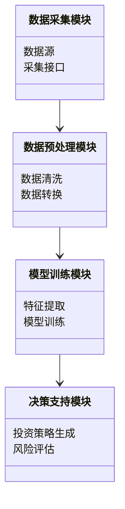
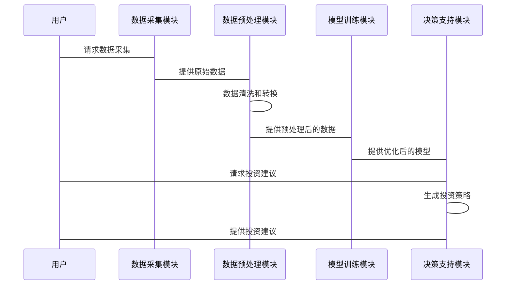

                 


# 多智能体AI如何提升价值投资的决策精度

> 关键词：多智能体AI，价值投资，决策精度，协作算法，金融建模

> 摘要：本文深入探讨了多智能体AI在价值投资中的应用，分析了其如何通过协作算法和分布式计算提升投资决策的精度。文章从背景、核心概念、算法原理、系统架构到实际案例，全面解析了多智能体AI在金融领域的潜力与实现路径。

---

# 第一部分：多智能体AI与价值投资的背景与基础

## 第1章：多智能体AI与价值投资的概述

### 1.1 多智能体AI的基本概念

#### 1.1.1 多智能体系统的定义与特点

多智能体系统（Multi-Agent System, MAS）是由多个智能体组成的分布式系统，每个智能体都是一个能够感知环境、自主决策的实体。与单智能体系统相比，MAS具有以下特点：

- **分布式性**：多个智能体协同工作，而非单一中心控制。
- **自主性**：每个智能体都有自主决策的能力。
- **协作性**：通过通信与协作完成复杂任务。
- **动态性**：系统环境和智能体状态不断变化。

#### 1.1.2 多智能体AI在金融领域的应用潜力

金融领域是多智能体AI的重要应用场景。多智能体系统能够通过分布式计算和协作学习，帮助投资者在复杂多变的市场中捕捉机会，降低风险。例如：

- **高频交易**：通过多智能体协作优化交易策略。
- **风险管理**：多个智能体协同监控市场动态，实时调整风险敞口。
- **资产配置**：通过多智能体协作优化投资组合。

#### 1.1.3 价值投资的核心理念与挑战

价值投资的核心理念是通过深入分析企业的基本面，寻找被市场低估的投资标的。然而，传统价值投资方法存在以下挑战：

- **数据复杂性**：需要处理海量的市场数据和非结构化信息。
- **决策滞后性**：传统人工分析耗时较长，难以应对市场快速变化。
- **主观性**：依赖分析师的主观判断，存在人为误差。

---

### 1.2 价值投资的决策过程与传统方法

#### 1.2.1 价值投资的基本原理

价值投资的核心是寻找市场低估的股票，主要通过以下步骤实现：

1. **基本面分析**：分析企业的财务报表、行业地位、竞争优势等。
2. **估值模型**：使用DCF模型等工具估算企业内在价值。
3. **投资决策**：基于估值与市场价格的差异决定是否投资。

#### 1.2.2 传统投资决策的局限性

传统价值投资方法存在以下局限性：

- **信息处理能力有限**：人工分析难以处理海量数据。
- **决策效率低下**：传统方法耗时较长，难以应对高频交易。
- **主观性较强**：依赖分析师的主观判断，存在人为误差。

#### 1.2.3 AI技术在投资决策中的角色

AI技术能够通过以下方式提升投资决策的效率与精度：

- **数据处理能力**：AI可以快速处理海量数据，提取有用信息。
- **模式识别**：通过机器学习算法发现数据中的潜在模式。
- **决策支持**：AI可以辅助人类分析师做出更明智的决策。

---

### 1.3 多智能体AI与价值投资的结合

#### 1.3.1 多智能体AI在投资决策中的优势

多智能体AI在价值投资中的优势体现在以下几个方面：

- **分布式计算**：多个智能体可以同时处理不同类型的数据，提高计算效率。
- **协作学习**：通过协作学习，多个智能体可以共同优化投资策略。
- **鲁棒性**：多智能体系统具有较高的容错性，部分智能体失效不会导致整个系统崩溃。

#### 1.3.2 价值投资与AI技术的协同效应

价值投资与AI技术的协同效应主要体现在以下几个方面：

- **数据驱动决策**：AI通过分析大量数据，帮助投资者发现潜在投资机会。
- **动态调整策略**：AI能够实时监控市场变化，动态调整投资策略。
- **降低人为误差**：通过AI辅助决策，减少人为判断的主观性。

#### 1.3.3 多智能体AI提升决策精度的路径

多智能体AI通过以下路径提升价值投资的决策精度：

1. **分布式数据处理**：多个智能体分别处理不同类型的数据，提高数据处理效率。
2. **协作优化策略**：通过协作学习，多个智能体共同优化投资策略。
3. **动态调整决策**：根据市场变化，实时调整投资组合。

---

## 第2章：多智能体AI的核心概念与原理

### 2.1 多智能体系统的构成与特性

#### 2.1.1 多智能体系统的组成要素

多智能体系统主要由以下要素构成：

- **智能体**：具有自主决策能力的实体。
- **环境**：智能体所处的外部环境。
- **通信机制**：智能体之间进行信息交换的渠道。
- **协作协议**：智能体之间协作的规则和协议。

#### 2.1.2 多智能体系统的关键特性

多智能体系统的关键特性包括：

- **自主性**：智能体能够自主决策。
- **反应性**：智能体能够实时感知环境变化并做出反应。
- **协作性**：智能体之间能够通过通信机制协同工作。
- **动态性**：系统环境和智能体状态不断变化。

#### 2.1.3 多智能体系统与单智能体系统的对比

以下是多智能体系统与单智能体系统的对比：

| 特性                | 单智能体系统           | 多智能体系统           |
|---------------------|-----------------------|-----------------------|
| 决策主体           | 单一决策主体         | 多个决策主体         |
| 协作方式           | 无协作或简单协作     | 强调协作与分工       |
| 系统复杂性         | 系统相对简单         | 系统复杂性高         |
| 容错性             | 单点故障风险高       | 高容错性，部分故障不影响整体 |

---

### 2.2 价值投资模型的构建与优化

#### 2.2.1 价值投资模型的构建过程

价值投资模型的构建过程包括以下几个步骤：

1. **数据收集**：收集企业的财务数据、行业数据、市场数据等。
2. **特征提取**：从数据中提取有用的特征，例如市盈率、市净率等。
3. **模型训练**：使用机器学习算法训练价值评估模型。
4. **模型优化**：通过交叉验证等方法优化模型性能。

#### 2.2.2 多智能体协作在模型优化中的作用

多智能体协作在价值投资模型优化中的作用体现在以下几个方面：

- **分布式优化**：多个智能体分别优化模型的不同部分。
- **协作学习**：智能体之间共享知识，共同提升模型性能。
- **动态调整**：根据市场变化动态调整模型参数。

#### 2.2.3 模型的可解释性与鲁棒性

模型的可解释性与鲁棒性是价值投资模型的重要特性：

- **可解释性**：模型的决策过程需要清晰可解释，以便投资者理解。
- **鲁棒性**：模型需要能够适应市场环境的变化，避免因单点故障导致性能下降。

---

### 2.3 多智能体协作的机制与算法

#### 2.3.1 多智能体协作的基本机制

多智能体协作的基本机制包括以下几个方面：

1. **通信机制**：智能体之间通过通信机制交换信息。
2. **协作协议**：智能体之间通过协作协议协调行动。
3. **任务分配**：根据智能体的能力和当前任务需求分配任务。

#### 2.3.2 基于博弈论的协作算法

基于博弈论的协作算法通过模拟博弈过程，帮助智能体找到最优协作策略。以下是博弈论协作算法的步骤：

1. **定义博弈规则**：明确智能体之间的博弈规则和收益分配方式。
2. **策略选择**：每个智能体根据当前信息选择最优策略。
3. **收益计算**：根据智能体的协作结果计算收益。
4. **策略更新**：根据收益反馈更新智能体的策略。

#### 2.3.3 分布式计算与通信协议

分布式计算与通信协议是多智能体协作的基础：

- **分布式计算**：任务被分解成多个子任务，分别在不同的智能体上执行。
- **通信协议**：智能体之间通过预定义的协议进行信息交换。

---

## 第3章：多智能体AI的算法原理与数学模型

### 3.1 多智能体协作的算法框架

#### 3.1.1 分布式多智能体算法

分布式多智能体算法通过将任务分解成多个子任务，在不同的智能体上并行执行。以下是分布式多智能体算法的步骤：

1. **任务分解**：将整体任务分解成多个子任务。
2. **任务分配**：将子任务分配给不同的智能体执行。
3. **子任务执行**：每个智能体独立执行分配的子任务。
4. **结果汇总**：将各个智能体的结果汇总，得到最终结果。

#### 3.1.2 联合学习与知识共享

联合学习（Federated Learning）是一种分布式机器学习方法，多个智能体在本地数据上分别训练模型，然后将模型参数汇总，更新全局模型。以下是联合学习的步骤：

1. **初始化**：每个智能体初始化本地模型参数。
2. **局部训练**：每个智能体在本地数据上训练模型。
3. **参数汇总**：将各个智能体的模型参数汇总，更新全局模型。
4. **模型更新**：根据汇总的参数更新全局模型。

#### 3.1.3 基于图论的协作网络

基于图论的协作网络通过构建图结构，描述智能体之间的协作关系。以下是基于图论的协作网络的步骤：

1. **构建图结构**：将智能体及其协作关系表示为图结构。
2. **节点属性提取**：提取图中节点的属性信息。
3. **边权重计算**：计算节点之间的协作权重。
4. **网络优化**：通过优化算法调整网络结构，提升协作效率。

---

### 3.2 价值投资决策的数学模型

#### 3.2.1 投资组合优化的数学公式

投资组合优化的目标是在风险可控的前提下，最大化投资收益。以下是投资组合优化的数学公式：

$$
\text{最大化 } \sum_{i=1}^{n} w_i r_i \quad \text{，使得} \quad \sum_{i=1}^{n} w_i = 1 \quad \text{，且} \quad \sum_{i=1}^{n} w_i^2 \sigma_i^2 \text{最小化}
$$

其中，$w_i$ 是第 $i$ 个资产的权重，$r_i$ 是第 $i$ 个资产的期望收益，$\sigma_i^2$ 是第 $i$ 个资产的收益方差。

#### 3.2.2 风险评估与收益预测的模型

风险评估与收益预测的模型可以通过回归分析实现。以下是回归分析的数学公式：

$$
y = \beta_0 + \beta_1 x_1 + \beta_2 x_2 + \cdots + \beta_k x_k + \epsilon
$$

其中，$y$ 是目标变量（收益或风险），$x_i$ 是自变量，$\beta_i$ 是回归系数，$\epsilon$ 是误差项。

#### 3.2.3 多目标优化的数学表达

多目标优化问题可以通过以下数学表达式表示：

$$
\text{最大化或最小化 } f_1(x), f_2(x), \ldots, f_m(x) \quad \text{，在约束条件下} \quad g_1(x) \geq 0, g_2(x) \geq 0, \ldots, g_n(x) \geq 0
$$

其中，$f_i(x)$ 是目标函数，$g_j(x)$ 是约束条件。

---

### 3.3 基于多智能体的决策优化算法

#### 3.3.1 增量式优化算法

增量式优化算法通过逐步调整模型参数，实现优化目标。以下是增量式优化算法的步骤：

1. **初始化**：设置初始参数值。
2. **计算梯度**：计算目标函数的梯度。
3. **更新参数**：根据梯度信息更新参数。
4. **收敛判断**：判断是否达到收敛条件，若未达到，返回步骤2。

#### 3.3.2 分层优化算法

分层优化算法通过将问题分解成多个子问题，分别优化每个子问题。以下是分层优化算法的步骤：

1. **问题分解**：将整体问题分解成多个子问题。
2. **子问题优化**：分别优化每个子问题。
3. **结果整合**：将各个子问题的优化结果整合，得到最终结果。

#### 3.3.3 基于强化学习的决策优化

基于强化学习的决策优化通过智能体与环境的交互，学习最优决策策略。以下是基于强化学习的决策优化的步骤：

1. **环境建模**：构建金融市场的环境模型。
2. **智能体初始化**：初始化智能体的策略和状态。
3. **动作选择**：智能体根据当前状态选择动作。
4. **环境反馈**：环境对智能体的动作做出反馈，更新状态和奖励。
5. **策略更新**：根据反馈更新智能体的策略。

---

## 第4章：多智能体AI的系统架构与设计

### 4.1 系统架构的整体设计

#### 4.1.1 系统功能模块划分

多智能体AI系统在价值投资中的应用可以划分为以下几个功能模块：

1. **数据采集与预处理模块**：负责采集和预处理市场数据。
2. **模型训练与优化模块**：负责训练和优化价值评估模型。
3. **决策支持模块**：负责提供投资决策支持。
4. **风险监控模块**：负责实时监控投资风险。

#### 4.1.2 模块之间的交互关系

以下是模块之间的交互关系：

- **数据采集与预处理模块**向**模型训练与优化模块**提供预处理后的数据。
- **模型训练与优化模块**向**决策支持模块**提供优化后的模型。
- **决策支持模块**向**风险监控模块**提供投资决策建议。
- **风险监控模块**向**决策支持模块**反馈风险监控结果。

#### 4.1.3 系统的可扩展性与灵活性

系统的可扩展性与灵活性体现在以下几个方面：

- **模块化设计**：系统功能模块化设计，便于扩展和维护。
- **分布式架构**：系统采用分布式架构，支持横向扩展。
- **插件式设计**：系统支持插件式设计，便于功能扩展。

---

### 4.2 系统功能设计

#### 4.2.1 数据采集与预处理模块

数据采集与预处理模块负责从多个数据源采集市场数据，并进行预处理。以下是该模块的主要功能：

1. **数据采集**：从股票交易所、新闻网站等数据源采集市场数据。
2. **数据清洗**：清洗数据中的噪声，确保数据质量。
3. **数据转换**：将数据转换为适合模型训练的格式。

#### 4.2.2 模型训练与优化模块

模型训练与优化模块负责训练和优化价值评估模型。以下是该模块的主要功能：

1. **特征提取**：从数据中提取有用的特征。
2. **模型训练**：使用机器学习算法训练价值评估模型。
3. **模型优化**：通过交叉验证等方法优化模型性能。

#### 4.2.3 决策支持模块

决策支持模块负责为投资者提供投资决策支持。以下是该模块的主要功能：

1. **投资策略生成**：根据模型输出生成投资策略。
2. **风险评估**：评估投资策略的风险。
3. **决策反馈**：根据市场反馈调整投资策略。

#### 4.2.4 风险监控模块

风险监控模块负责实时监控投资风险。以下是该模块的主要功能：

1. **实时监控**：实时监控市场动态和投资组合的表现。
2. **风险预警**：当风险超过预设阈值时，触发预警。
3. **风险应对**：根据预警结果采取相应的风险控制措施。

---

### 4.3 系统架构设计

#### 4.3.1 领域模型设计

以下是领域模型的类图：



---

### 4.4 系统交互设计

以下是系统交互的序列图：



---

## 第5章：多智能体AI的项目实战

### 5.1 项目背景与目标

#### 5.1.1 项目背景

本项目旨在通过多智能体AI技术，提升价值投资的决策精度。项目的主要目标包括：

- **提高投资收益**：通过多智能体协作优化投资策略。
- **降低投资风险**：通过实时监控和预警机制降低投资风险。
- **提升决策效率**：通过自动化分析提高决策效率。

#### 5.1.2 项目目标

项目的具体目标包括：

1. 实现多智能体协作的投资决策系统。
2. 开发数据采集与预处理模块。
3. 构建价值评估模型。
4. 实现投资策略生成与风险评估功能。

---

### 5.2 系统核心实现

#### 5.2.1 环境安装与配置

以下是环境安装与配置的步骤：

1. **安装Python**：安装Python 3.8及以上版本。
2. **安装依赖库**：安装以下依赖库：
   - `numpy`
   - `pandas`
   - `scikit-learn`
   - `matplotlib`
3. **安装框架**：安装`flask`用于构建Web界面。

#### 5.2.2 核心代码实现

以下是核心代码实现的示例：

```python
import numpy as np
import pandas as pd
from sklearn.model_selection import train_test_split
from sklearn.linear_model import LinearRegression

# 数据预处理
data = pd.read_csv('data.csv')
X = data.drop('target', axis=1)
y = data['target']

# 数据分割
X_train, X_test, y_train, y_test = train_test_split(X, y, test_size=0.2)

# 模型训练
model = LinearRegression()
model.fit(X_train, y_train)

# 模型预测
y_pred = model.predict(X_test)
```

---

### 5.3 代码应用与结果分析

#### 5.3.1 代码应用

以下是代码应用的示例：

```python
# 数据可视化
import matplotlib.pyplot as plt

plt.scatter(X_test, y_test, color='blue', label='真实值')
plt.scatter(X_test, y_pred, color='red', label='预测值')
plt.xlabel('特征')
plt.ylabel('目标值')
plt.legend()
plt.show()
```

#### 5.3.2 结果分析

通过上述代码，我们可以看到模型的预测结果与真实值的拟合情况。以下是对结果的分析：

- **拟合度**：模型的拟合度可以通过$R^2$值来衡量。
- **误差分析**：分析预测值与真实值的误差，找出模型的不足之处。
- **优化建议**：根据误差分析结果，提出模型优化建议。

---

## 第6章：多智能体AI的最佳实践与未来展望

### 6.1 最佳实践

#### 6.1.1 小结

多智能体AI在价值投资中的应用具有广阔前景。通过多智能体协作，可以提高投资决策的效率与精度，降低投资风险。

#### 6.1.2 注意事项

在实际应用中，需要注意以下几点：

- **数据质量**：确保数据的准确性和完整性。
- **模型解释性**：确保模型的决策过程清晰可解释。
- **系统安全性**：确保系统的安全性，防止数据泄露和攻击。

#### 6.1.3 拓展阅读

以下是拓展阅读的建议：

- **《算法导论》**：学习算法的基本原理。
- **《机器学习实战》**：学习机器学习的实际应用。
- **《分布式系统》**：学习分布式系统的理论与实践。

---

## 结语

多智能体AI通过协作学习和分布式计算，为价值投资带来了新的可能性。未来，随着技术的不断发展，多智能体AI将在金融领域发挥更大的作用，为投资者提供更精准的投资决策支持。

---

作者：AI天才研究院 & 禅与计算机程序设计艺术

