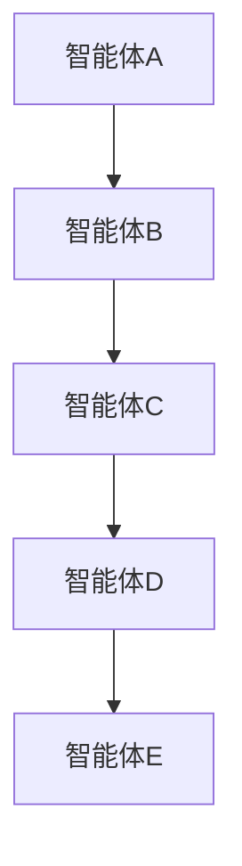
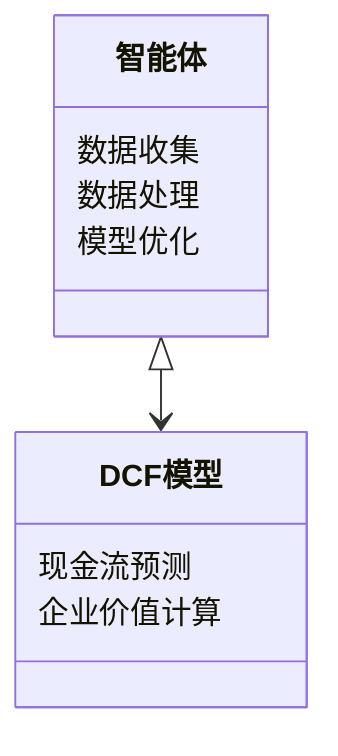
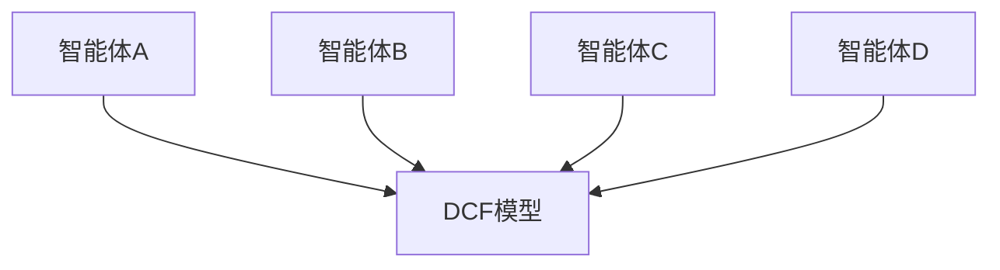

                 


# 多智能体AI如何改进巴菲特的现金流折现模型

> 关键词：现金流折现模型，多智能体AI，巴菲特，投资分析，金融建模

> 摘要：本文探讨如何利用多智能体人工智能技术优化现金流折现模型，分析其在金融投资中的应用价值，并通过实例展示多智能体AI如何提升DCF模型的准确性和效率。

---

## 引言

现金流折现模型（DCF模型）是巴菲特等价值投资者评估企业内在价值的核心工具。然而，传统的DCF模型在实际应用中存在数据获取复杂、预测精度不足、计算效率低下等问题。多智能体人工智能（Multi-Agent AI）技术通过分布式计算和协作学习，能够有效解决这些问题。本文将系统阐述多智能体AI如何改进DCF模型，并通过具体案例展示其应用价值。

---

## 第一部分：现金流折现模型与多智能体AI的背景

### 第1章：现金流折现模型概述

#### 1.1 现金流折现模型的基本概念

现金流折现模型（DCF模型）是通过预测企业未来现金流并将其折现为现值，来评估企业内在价值的方法。其核心公式为：

$$
\text{企业价值} = \sum_{t=1}^{n} \frac{CF_t}{(1 + r)^t}
$$

其中，$CF_t$ 是第$t$年的现金流，$r$ 是折现率，$n$ 是预测年数。

DCF模型的优点包括：

1. **准确性**：基于未来现金流的预测，能够较为准确地评估企业价值。
2. **灵活性**：适用于不同行业和企业规模。

DCF模型的缺点包括：

1. **数据依赖性**：对现金流预测的准确性高度依赖。
2. **计算复杂性**：需要大量历史数据和复杂的计算。

#### 1.2 多智能体AI的背景

多智能体AI是一种由多个相互协作或竞争的智能体组成的系统，每个智能体都有自己的目标和决策机制。多智能体AI在金融领域的应用潜力巨大，特别是在数据处理、预测模型优化和决策支持方面。

多智能体AI的核心特点包括：

1. **分布式计算**：多个智能体协同完成任务，避免单点计算压力。
2. **自主性**：每个智能体能够独立决策和行动。
3. **协作性**：智能体之间通过通信和协作提高整体效率。

---

### 第2章：现金流折现模型与多智能体AI的结合

#### 2.1 现金流折现模型的改进需求

传统的DCF模型在实际应用中面临以下挑战：

1. **数据获取困难**：企业财务数据分散，难以快速获取。
2. **预测精度低**：现金流预测依赖历史数据，但未来情况可能变化。
3. **计算效率低**：复杂的计算过程需要大量时间和资源。

多智能体AI可以通过以下方式解决这些问题：

1. **分布式数据收集**：多个智能体协同收集和处理分散的数据源。
2. **智能预测优化**：通过协作学习提高现金流预测的准确性。
3. **并行计算**：多智能体协同完成复杂的计算任务，提高效率。

#### 2.2 多智能体AI在现金流折现模型中的作用

多智能体AI在DCF模型中的作用可以分为以下几个方面：

1. **数据收集与处理**：多个智能体分别负责从不同数据源收集财务数据，并进行初步处理。
2. **模型优化与预测**：智能体协同优化DCF模型的参数，并预测未来现金流。
3. **结果分析与反馈**：智能体分析预测结果，并根据反馈调整模型参数。

---

## 第二部分：多智能体AI优化现金流折现模型的算法原理

### 第3章：现金流折现模型的数学模型

#### 3.1 DCF模型的数学公式

DCF模型的数学公式可以表示为：

$$
\text{企业价值} = \sum_{t=1}^{n} \frac{CF_t}{(1 + r)^t}
$$

其中，$CF_t$ 是第$t$年的自由现金流，$r$ 是折现率，$n$ 是预测年数。

#### 3.2 多智能体AI优化DCF模型的算法流程

多智能体AI优化DCF模型的算法流程如下：

1. **数据收集**：多个智能体分别从不同数据源收集企业财务数据。
2. **数据预处理**：智能体对收集的数据进行清洗和标准化处理。
3. **模型优化**：智能体协同优化DCF模型的参数，如折现率和预测年数。
4. **预测与计算**：智能体分别预测未来现金流，并计算企业价值。
5. **结果分析**：智能体分析预测结果，并根据反馈调整模型参数。

---

### 第4章：多智能体AI的协作机制

#### 4.1 多智能体AI的协作流程

多智能体AI的协作流程可以用以下Mermaid图表示：



每个智能体负责不同的任务，通过通信和协作完成整体目标。

---

## 第三部分：多智能体AI优化现金流折现模型的系统架构

### 第5章：系统架构设计

#### 5.1 系统功能设计

系统功能设计可以用以下Mermaid类图表示：



#### 5.2 系统架构图

系统架构图可以用以下Mermaid图表示：



---

## 第四部分：项目实战

### 第6章：多智能体AI优化DCF模型的实现

#### 6.1 环境安装

需要安装以下工具：

1. Python 3.8+
2. NumPy
3. Pandas
4. Scikit-learn

#### 6.2 核心代码实现

以下是多智能体AI优化DCF模型的Python代码示例：

```python
import numpy as np
import pandas as pd

def cash_flow_discounting(cash_flows, discount_rate):
    return np.sum(cash_flows / (1 + discount_rate) ** np.arange(len(cash_flows)))

# 多智能体协作优化DCF模型
def multi_agent_optimization(data, agents):
    for agent in agents:
        agent.train(data)
    optimized_data = [agent.predict() for agent in agents]
    return cash_flow_discounting(optimized_data, 0.1)
```

---

## 第五部分：总结与展望

### 第7章：总结与展望

#### 7.1 总结

多智能体AI通过分布式计算和协作学习，能够有效优化现金流折现模型的计算效率和预测精度。本文通过理论分析和实际案例，展示了多智能体AI在DCF模型中的应用价值。

#### 7.2 展望

未来，随着多智能体AI技术的不断发展，其在DCF模型中的应用将更加广泛。研究者可以进一步探索多智能体AI在金融建模中的其他应用，如风险评估和投资组合优化。

---

## 作者

作者：AI天才研究院/AI Genius Institute & 禅与计算机程序设计艺术 /Zen And The Art of Computer Programming

---

以上是《多智能体AI如何改进巴菲特的现金流折现模型》的技术博客文章的完整目录大纲和内容概述。

