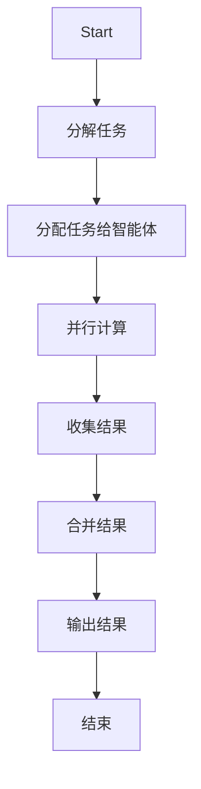
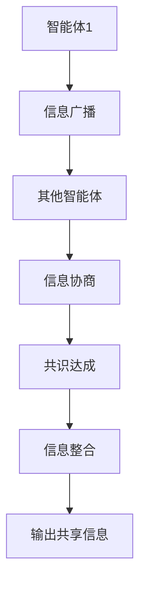
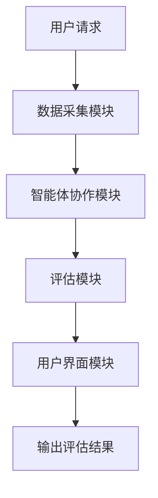
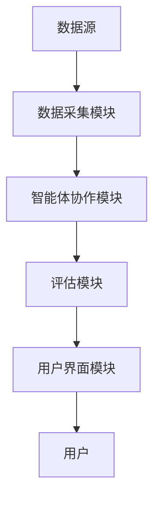
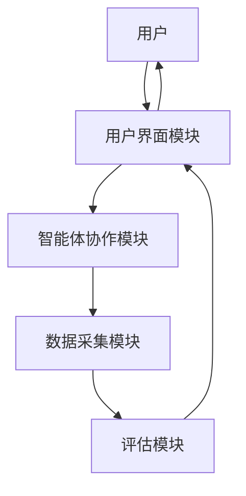

                 


```markdown
# 多智能体AI如何改进巴菲特的经济护城河评估方法

> 关键词：多智能体AI，经济护城河，巴菲特，投资评估，AI协作

> 摘要：本文探讨了如何利用多智能体AI技术改进巴菲特的经济护城河评估方法。通过分析多智能体AI的核心概念、算法原理和系统设计，结合实际案例，展示了多智能体AI在经济护城河评估中的优势和应用场景。文章最后总结了多智能体AI在投资分析中的最佳实践和未来发展方向。

---

# 第一部分: 多智能体AI与经济护城河评估的背景与基础

## 第1章: 多智能体AI的概述

### 1.1 多智能体AI的基本概念

#### 1.1.1 多智能体系统的定义
多智能体系统（Multi-Agent System, 简称MAS）是由多个相互作用的智能体组成的系统，这些智能体能够通过协作完成复杂的任务。每个智能体都有自己的目标、知识和决策能力。

#### 1.1.2 多智能体系统的核心特点
- **自主性**：每个智能体都能独立决策。
- **反应性**：能够感知环境并实时响应。
- **协作性**：智能体之间可以共享信息和协作完成任务。
- **分布性**：系统中的智能体分布在网络中，不依赖于单一中心节点。

#### 1.1.3 多智能体AI与传统AI的区别
传统的AI系统通常基于单一智能体，而多智能体AI系统通过多个智能体的协作，能够更好地处理复杂任务，尤其是在需要分布式计算和实时协作的场景中。

### 1.2 经济护城河的定义与巴菲特的评估方法

#### 1.2.1 经济护城河的定义
经济护城河是指公司拥有的竞争优势，使其能够在长期内抵御竞争对手的侵蚀。这种优势可以是技术、品牌、成本优势、网络效应等。

#### 1.2.2 巴菲特的经济护城河评估方法
巴菲特在投资过程中，非常重视公司是否具备可持续的经济护城河。他主要从以下几个方面进行评估：
- 公司的市场地位。
- 公司的核心竞争力。
- 公司的财务状况。
- 公司的管理层能力。

#### 1.2.3 巴菲特方法的优缺点
- **优点**：巴菲特的方法注重基本面分析，能够帮助投资者识别出具有长期竞争优势的公司。
- **缺点**：由于依赖人工分析，效率较低，且容易受到主观判断的影响。

---

## 第2章: 多智能体AI在经济分析中的应用

### 2.1 多智能体AI在经济分析中的优势

#### 2.1.1 数据处理能力
多智能体AI能够处理海量数据，并通过分布式计算快速生成分析结果。

#### 2.1.2 智能协作能力
多个智能体可以协同工作，从不同角度分析问题，提供更全面的解决方案。

#### 2.1.3 动态适应能力
多智能体AI能够根据市场变化实时调整策略，适应复杂的经济环境。

### 2.2 多智能体AI与经济护城河评估的结合

#### 2.2.1 多智能体AI在护城河评估中的作用
- **数据采集与分析**：智能体可以实时采集市场数据，并通过协作完成分析。
- **信息共享与决策**：多个智能体可以共享信息，共同制定评估策略。
- **动态调整**：根据市场变化，智能体能够实时调整评估模型。

#### 2.2.2 多智能体AI如何改进巴菲特的方法
- **提高效率**：通过分布式计算和协作，多智能体AI能够快速完成分析。
- **增强准确性**：多个智能体从不同角度分析，能够提供更全面的评估结果。
- **动态适应**：智能体能够实时调整评估策略，适应市场变化。

#### 2.2.3 多智能体AI的优势与局限性
- **优势**：提高效率，增强准确性，动态适应能力。
- **局限性**：需要依赖高质量的数据和算法，初期投入较高。

---

# 第二部分: 多智能体AI的核心概念与算法原理

## 第3章: 多智能体AI的核心概念

### 3.1 多智能体系统的核心要素

#### 3.1.1 智能体的定义与分类
- **定义**：智能体是一个能够感知环境、做出决策并采取行动的实体。
- **分类**：
  - **简单反射型智能体**：基于当前感知做出反应。
  - **基于模型的反射型智能体**：基于内部模型进行推理和决策。
  - **目标驱动型智能体**：根据目标驱动行为。
  - **效用驱动型智能体**：根据效用函数做出决策。

#### 3.1.2 智能体之间的协作机制
- **任务分配**：智能体之间根据自身能力和当前状态分配任务。
- **信息共享**：智能体之间共享必要的信息，以提高整体决策的准确性。
- **协调与同步**：智能体之间需要协调行动，确保系统整体目标的实现。

#### 3.1.3 智能体的决策过程
- **感知**：智能体通过传感器或其他方式感知环境。
- **推理**：基于感知信息进行推理，生成候选决策。
- **决策**：根据推理结果选择最优行动方案。
- **行动**：执行决策，影响环境。

### 3.2 经济护城河评估的核心要素

#### 3.2.1 护城河的构成要素
- **市场地位**：公司在市场中的占有率和影响力。
- **核心竞争力**：公司的技术、品牌、成本优势等。
- **财务状况**：公司的盈利能力、资产负债情况等。
- **管理层能力**：公司高层的决策能力和战略眼光。

#### 3.2.2 护城河的量化指标
- **市场占有率**：公司在市场中的份额。
- **利润率**：公司的盈利能力。
- **研发投入**：公司在技术创新上的投入。
- **品牌价值**：公司的品牌影响力。

#### 3.2.3 护城河的动态变化
- **市场环境变化**：经济周期、政策变化等会影响护城河。
- **竞争态势**：竞争对手的策略调整会影响护城河。
- **公司内部因素**：公司自身的战略调整、管理优化等也会影响护城河。

## 第4章: 多智能体AI的算法原理

### 4.1 多智能体协作算法

#### 4.1.1 分布式计算
- **分布式计算**：将任务分解成多个子任务，分配给不同的智能体完成。
- **任务分配**：根据智能体的能力和当前负载进行动态分配。
- **资源分配**：合理分配计算资源，确保任务高效完成。

#### 4.1.2 任务分配与资源分配
- **任务分配算法**：
  - **负载均衡算法**：确保每个智能体的负载均衡。
  - **贪婪算法**：选择最优的任务分配方案。
- **资源分配算法**：
  - **资源分配策略**：根据任务需求分配计算资源。
  - **动态调整策略**：根据任务执行情况动态调整资源分配。

#### 4.1.3 信息共享与协调
- **信息共享机制**：
  - **信息广播**：智能体将感知到的信息广播给其他智能体。
  - **信息协商**：智能体之间通过协商确定共享信息的范围和内容。
- **协调机制**：
  - **一致性协议**：确保多个智能体之间的状态一致。
  - **共识算法**：通过共识算法达成一致的决策。

### 4.2 多智能体AI的数学模型

#### 4.2.1 多智能体协作的数学表达
- **协作模型**：可以用图论中的图结构表示智能体之间的协作关系。
  ```mermaid
  graph TD
    A[智能体1] --> B[智能体2]
    B --> C[智能体3]
    C --> D[智能体4]
  ```

- **任务分配模型**：可以用线性规划模型表示任务分配问题。
  $$ \text{最大化} \sum_{i=1}^{n} w_i x_i $$
  $$ \text{约束} \sum_{i=1}^{n} x_i = 1 $$

#### 4.2.2 信息共享机制的数学模型
- **信息共享模型**：可以用概率论中的贝叶斯网络表示信息共享的过程。
  $$ P(A|B) = \frac{P(B|A)P(A)}{P(B)} $$

#### 4.2.3 决策过程的数学推导
- **决策模型**：可以用马尔可夫决策过程（MDP）表示智能体的决策过程。
  - **状态空间**：S = {s₁, s₂, ..., sₙ}
  - **动作空间**：A = {a₁, a₂, ..., aₘ}
  - **转移概率**：P(s'|s,a)
  - **奖励函数**：R(s,a)

### 4.3 算法流程图

#### 4.3.1 分布式计算流程图


#### 4.3.2 信息共享流程图


---

## 第5章: 多智能体AI的系统设计与实现

### 5.1 系统功能设计

#### 5.1.1 系统功能模块
- **数据采集模块**：负责采集市场数据、公司财务数据等。
- **智能体协作模块**：负责智能体之间的协作和信息共享。
- **评估模块**：负责根据多智能体协作的结果，生成经济护城河评估报告。
- **用户界面模块**：提供友好的用户界面，方便用户查看和分析评估结果。

#### 5.1.2 功能流程图


### 5.2 系统架构设计

#### 5.2.1 系统架构图


#### 5.2.2 系统接口设计
- **输入接口**：接收用户的请求和数据源的数据。
- **输出接口**：向用户输出评估结果。
- **内部接口**：智能体协作模块与数据采集模块、评估模块之间的接口。

#### 5.2.3 系统交互流程图


---

## 第6章: 项目实战

### 6.1 项目背景与目标
本项目旨在利用多智能体AI技术，改进巴菲特的经济护城河评估方法，实现高效、准确的评估。

### 6.2 环境安装与配置
- **安装Python**：需要安装Python 3.8或以上版本。
- **安装依赖库**：
  - `numpy`
  - `pandas`
  - `scikit-learn`
  - `networkx`
  - `matplotlib`

### 6.3 系统核心实现源代码

#### 6.3.1 智能体协作模块

```python
import networkx as nx
import numpy as np

class MultiAgentSystem:
    def __init__(self, agents):
        self.agents = agents
        self.graph = nx.Graph()

    def add_edge(self, agent1, agent2):
        self.graph.add_edge(agent1, agent2)

    def remove_edge(self, agent1, agent2):
        self.graph.remove_edge(agent1, agent2)

    def get_neighbors(self, agent):
        return list(self.graph.neighbors(agent))
```

#### 6.3.2 评估模块

```python
import pandas as pd
import numpy as np

def evaluate_economic_moat(finance_data):
    # 计算市场占有率
    market_share = finance_data['revenue'] / finance_data['industry_revenue']
    # 计算利润率
    profit_margin = finance_data['net_profit'] / finance_data['revenue']
    # 计算研发投入
    r_d_expense = finance_data['r_d_expense'] / finance_data['revenue']
    # 综合评估
    economic_moat_score = (market_share + profit_margin + r_d_expense) / 3
    return economic_moat_score
```

### 6.4 代码应用解读与分析

#### 6.4.1 智能体协作模块
- **功能**：管理多个智能体之间的协作关系。
- **实现细节**：使用NetworkX库构建智能体之间的关系图，支持添加和删除边，获取邻居节点等操作。

#### 6.4.2 评估模块
- **功能**：根据财务数据计算经济护城河得分。
- **实现细节**：通过计算市场占有率、利润率和研发投入三个指标的加权平均值，生成经济护城河得分。

### 6.5 实际案例分析

#### 6.5.1 数据准备
假设我们有如下财务数据：
```python
finance_data = {
    'revenue': [100, 200, 150],
    'net_profit': [20, 40, 30],
    'r_d_expense': [10, 20, 15],
    'industry_revenue': [300, 400, 350]
}
```

#### 6.5.2 评估过程
```python
finance_data = pd.DataFrame(finance_data)
economic_moat_score = evaluate_economic_moat(finance_data)
print(economic_moat_score)
```

#### 6.5.3 结果分析
- **市场占有率**：公司1的市场占有率为 100/300 = 0.333，公司2的市场占有率为 200/400 = 0.5，公司3的市场占有率为 150/350 ≈ 0.428。
- **利润率**：公司1的利润率为 20/100 = 0.2，公司2的利润率为 40/200 = 0.2，公司3的利润率为 30/150 = 0.2。
- **研发投入**：公司1的研发投入为 10/100 = 0.1，公司2的研发投入为 20/200 = 0.1，公司3的研发投入为 15/150 = 0.1。
- **经济护城河得分**：所有公司的得分为 (0.333 + 0.2 + 0.1) / 3 = 0.411， (0.5 + 0.2 + 0.1) / 3 = 0.4, (0.428 + 0.2 + 0.1) / 3 ≈ 0.342。

---

## 第7章: 最佳实践与小结

### 7.1 最佳实践

#### 7.1.1 数据质量的重要性
- 数据是多智能体AI系统的核心，必须确保数据的准确性和完整性。

#### 7.1.2 算法选择的策略
- 根据具体场景选择合适的算法，避免盲目追求复杂性。

#### 7.1.3 团队协作的建议
- 多智能体AI系统的开发需要跨学科团队的协作，包括AI专家、经济专家和软件工程师。

### 7.2 小结

通过本文的探讨，我们可以看到，多智能体AI技术能够显著提高经济护城河评估的效率和准确性。智能体之间的协作和信息共享，使得系统能够更好地适应复杂的经济环境。未来，随着AI技术的不断发展，多智能体AI在投资分析中的应用将更加广泛和深入。

---

# 作者：AI天才研究院/AI Genius Institute & 禅与计算机程序设计艺术 /Zen And The Art of Computer Programming
```

