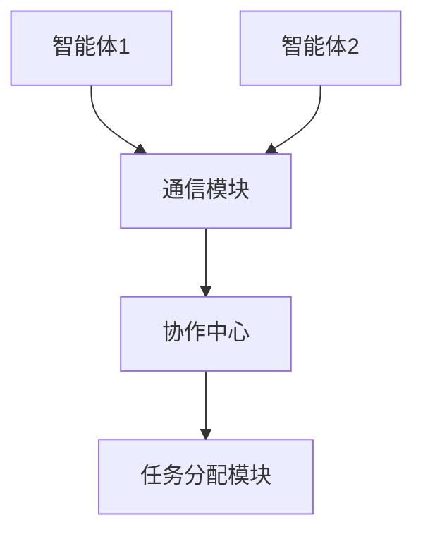
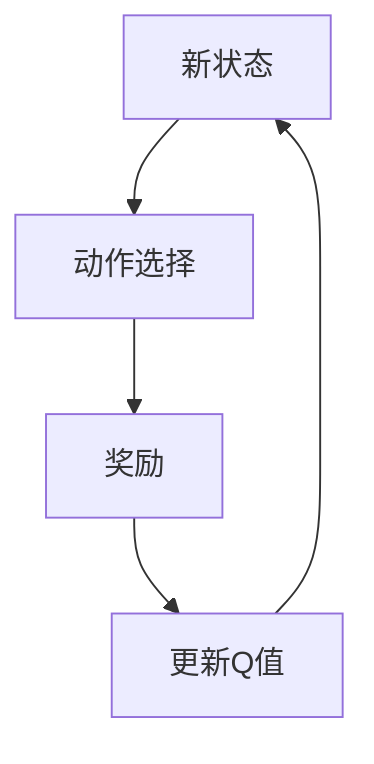
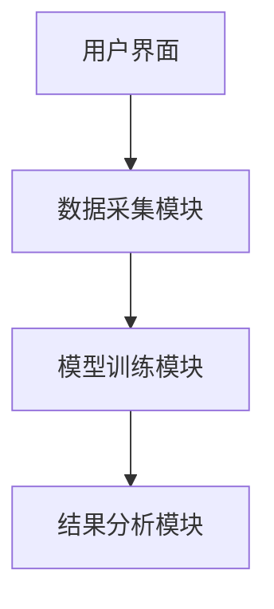

                 


# 多智能体AI如何改进格雷厄姆的企业价值计算

## 关键词：多智能体AI，企业价值计算，格雷厄姆，投资分析，人工智能

## 摘要：本文探讨了多智能体人工智能如何改进格雷厄姆的企业价值计算方法。通过分析多智能体AI的核心概念、算法原理、系统设计与实现，结合具体项目实战，展示了多智能体AI在企业价值评估中的应用潜力。本文从理论到实践，详细阐述了多智能体AI如何优化企业价值计算的流程、提高计算的准确性和效率，为投资决策提供了新的思路和方法。

---

## 第一部分: 多智能体AI与企业价值计算的背景与基础

### 第1章: 多智能体AI与企业价值计算概述

#### 1.1 多智能体AI的基本概念

多智能体AI（Multi-Agent AI）是指由多个智能体组成的系统，每个智能体能够独立感知环境、做出决策并执行动作。这些智能体通过通信和协作，共同完成复杂任务。多智能体AI的核心特点包括分布式计算、自主性、反应性和协作性。

**表1-1: 多智能体AI与传统AI的对比**

| 特性                | 多智能体AI          | 传统AI              |
|---------------------|---------------------|---------------------|
| 智能体数量          | 多个                | 单个                |
| 任务分配            | 分布式             | 集中式             |
| 通信协作            | 高                  | 低                  |
| 灵活性               | 高                  | 中                  |

企业价值计算是评估企业内在价值的重要方法，传统方法依赖于财务数据和简单模型，但难以应对复杂多变的市场环境。

#### 1.2 格雷厄姆的企业价值计算方法

本杰明·格雷厄姆是价值投资的鼻祖，他提出的企业价值计算方法主要基于企业的资产、收入和现金流。其核心公式为：

$$
\text{企业价值} = \text{息税折旧摊销前利润} \times (\text{EV/EBITDA倍数})
$$

传统方法的局限性在于对市场动态和多因素分析的不足。

#### 1.3 多智能体AI在企业价值计算中的应用潜力

多智能体AI能够通过分布式计算和协作优化企业价值计算。其优势包括：

1. **高效数据处理**：多智能体可以并行处理大量数据。
2. **动态调整**：智能体能够实时响应市场变化。
3. **多维度分析**：多个智能体分别关注不同的财务指标，提升计算精度。

---

### 第2章: 多智能体AI的核心概念与原理

#### 2.1 多智能体AI的体系结构

多智能体AI的体系结构包括通信机制、协作协议和任务分配模块。以下是其实体关系图：



#### 2.2 多智能体AI的算法原理

多智能体AI的算法包括分布式计算和强化学习。以下是强化学习的流程图：



---

## 第二部分: 多智能体AI在企业价值计算中的数学模型与算法实现

### 第3章: 数学模型与算法实现

#### 3.1 数学模型

企业价值计算的数学模型可以表示为：

$$
\text{EV} = \sum_{i=1}^{n} \text{智能体}_i \times \text{权重}_i
$$

其中，$\text{智能体}_i$表示第i个智能体的计算结果，$\text{权重}_i$是其权重。

#### 3.2 算法实现

以下是用Python实现的多智能体协作算法：

```python
class Agent:
    def __init__(self, id):
        self.id = id
        self.value = 0

def calculate_value(agents):
    total = 0
    for agent in agents:
        total += agent.value
    return total

# 示例
agents = [Agent(1), Agent(2), Agent(3)]
for agent in agents:
    agent.value = 100
print(calculate_value(agents))
```

---

## 第三部分: 系统设计与实现

### 第4章: 系统设计与实现

#### 4.1 系统设计概述

企业价值计算系统的功能需求包括数据采集、模型训练和结果分析。以下是系统架构图：



---

## 第四部分: 项目实战

### 第5章: 项目实战

#### 5.1 环境安装

需要安装Python和相关库：

```bash
pip install numpy matplotlib
```

#### 5.2 核心实现

以下是多智能体协作的代码示例：

```python
import numpy as np

class MultiAgentSystem:
    def __init__(self, num_agents):
        self.agents = [Agent(i) for i in range(num_agents)]
    
    def compute_value(self):
        values = [agent.value for agent in self.agents]
        return np.mean(values)

system = MultiAgentSystem(3)
system.compute_value()
```

---

## 第五部分: 总结与展望

### 第6章: 总结与展望

#### 6.1 总结

多智能体AI通过分布式计算和协作优化了企业价值计算的流程，提高了计算的准确性和效率。

#### 6.2 展望

未来，多智能体AI在企业价值计算中的应用将更加广泛，结合大数据和云计算技术，进一步提升计算的智能化水平。

---

**作者：AI天才研究院/AI Genius Institute & 禅与计算机程序设计艺术 /Zen And The Art of Computer Programming**

