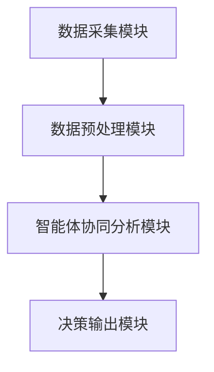
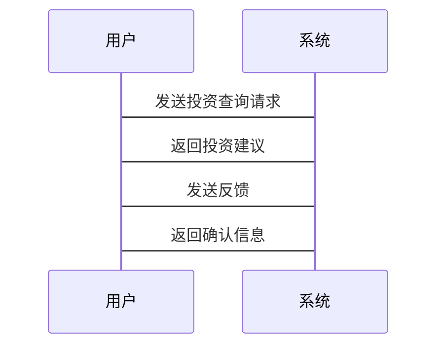

                 


# 多智能体AI如何改进格雷厄姆的工作资本分析

> 关键词：多智能体AI，格雷厄姆分析，资本分析，投资策略，价值投资

> 摘要：本文探讨了如何利用多智能体人工智能技术改进格雷厄姆的价值投资策略。通过分析多智能体AI的核心概念、算法原理及其在资本分析中的应用，本文提出了一种基于多智能体协同学习的资本分析模型，展示了其在提高投资决策准确性和效率方面的优势。

---

## 第1章: 多智能体AI与格雷厄姆投资理论的结合

### 1.1 多智能体AI的基本概念

#### 1.1.1 多智能体系统的定义与特点
多智能体系统（Multi-Agent System, MAS）是由多个独立或协作的智能体组成的系统，每个智能体都能感知环境、做出决策并采取行动。多智能体系统具有以下特点：
- **分布式智能**：多个智能体协同工作，而非单一中心化控制。
- **自主性**：每个智能体都能自主决策。
- **协作性**：智能体之间可以通过通信和协作提高整体系统的性能。
- **反应性**：智能体能够实时感知环境变化并做出响应。

#### 1.1.2 多智能体在投资分析中的应用潜力
多智能体系统在投资分析中的潜力主要体现在以下方面：
- **分散化决策**：多个智能体可以从不同的角度分析市场，降低单一决策的风险。
- **高效信息处理**：多个智能体可以并行处理大量数据，提高分析效率。
- **动态适应性**：智能体能够根据市场变化快速调整策略。

#### 1.1.3 多智能体AI与传统投资分析的区别
传统的投资分析通常依赖于单一的分析模型或分析师的主观判断，而多智能体AI通过多个智能体的协同工作，能够从多个维度、多层次地分析市场信息，从而提供更全面的分析结果。

### 1.2 格雷厄姆投资理论的核心思想

#### 1.2.1 格雷厄姆的价值投资理念
格雷厄姆是价值投资的鼻祖，他认为市场的短期波动往往被情绪驱动，而长期来看，市场会回归理性。他强调通过分析企业的基本面，找到其内在价值，从而在市场低估时买入，高估时卖出。

#### 1.2.2 格雷厄姆的内在价值计算方法
格雷厄姆的内在价值计算方法主要包括以下几个步骤：
1. **分析企业的财务报表**：包括收入、利润、负债、现金流等。
2. **评估企业的盈利能力**：包括ROE（净资产收益率）、ROA（资产收益率）等指标。
3. **估算企业的未来现金流**：基于历史数据和行业趋势，预测未来的现金流。
4. **计算折现率**：根据市场利率和风险偏好，计算合理的折现率。
5. **计算内在价值**：通过现金流的现值计算企业的真实价值。

#### 1.2.3 格雷厄姆分析法的局限性
格雷厄姆的分析方法虽然在理论上非常严谨，但在实际操作中存在以下问题：
- **信息处理能力有限**：单靠人工分析难以处理海量数据。
- **市场变化难以预测**：市场波动和突发事件难以通过简单的模型预测。
- **主观判断的影响**：分析结果受到分析师主观判断的影响。

### 1.3 多智能体AI如何改进格雷厄姆分析

#### 1.3.1 多智能体AI的优势
多智能体AI能够通过多个智能体的协同工作，弥补传统分析方法的不足。具体优势包括：
- **数据处理能力强大**：多个智能体可以同时处理海量数据。
- **决策更加全面**：多个智能体可以从不同角度分析问题，提高决策的准确性。
- **动态适应性强**：智能体能够实时适应市场变化，快速调整分析策略。

#### 1.3.2 多智能体AI在资本分析中的应用场景
多智能体AI在资本分析中的应用场景包括：
- **实时市场监控**：多个智能体实时监控市场动态，及时发现投资机会或风险。
- **多维度数据分析**：多个智能体分别从财务、市场、行业等不同维度进行分析，提供全面的分析结果。
- **动态资产配置**：根据市场变化，智能体协同调整资产配置，优化投资组合。

#### 1.3.3 多智能体AI与格雷厄姆分析的结合点
多智能体AI与格雷厄姆分析的结合点在于：
- **多维度分析**：多个智能体分别从财务、市场、行业等不同维度进行分析，提供全面的分析结果。
- **动态调整**：智能体能够根据市场变化实时调整分析策略，优化投资决策。
- **数据处理能力**：多智能体系统能够处理海量数据，提高分析效率。

---

## 第2章: 多智能体AI的核心概念与技术基础

### 2.1 多智能体系统的组成与功能

#### 2.1.1 多智能体系统的组成要素
多智能体系统主要由以下组成要素：
- **智能体**：能够感知环境、做出决策并采取行动的独立实体。
- **通信机制**：智能体之间进行信息交流的通道。
- **协作协议**：智能体之间协同工作的规则和协议。
- **环境**：智能体所处的外部环境，包括市场、数据等。

#### 2.1.2 多智能体系统的功能模块
多智能体系统的功能模块包括：
- **感知模块**：感知外部环境的信息。
- **决策模块**：根据感知信息做出决策。
- **行动模块**：根据决策采取相应的行动。
- **通信模块**：与其他智能体进行信息交流。

#### 2.1.3 多智能体系统的通信机制
多智能体系统的通信机制包括：
- **直接通信**：智能体之间直接交换信息。
- **间接通信**：通过中间媒介进行信息传递。
- **发布-订阅模型**：智能体发布信息，其他智能体订阅信息。

### 2.2 AI在资本分析中的技术基础

#### 2.2.1 机器学习在资本分析中的应用
机器学习在资本分析中的应用包括：
- **预测股价走势**：通过机器学习模型预测股票的未来走势。
- **识别市场趋势**：通过机器学习模型识别市场趋势。
- **风险评估**：通过机器学习模型评估投资的风险。

#### 2.2.2 自然语言处理在资本分析中的应用
自然语言处理在资本分析中的应用包括：
- **新闻情感分析**：通过自然语言处理技术分析新闻的情感，预测市场走势。
- **财务报告分析**：通过自然语言处理技术分析财务报告，提取关键信息。

#### 2.2.3 强化学习在资本分析中的应用
强化学习在资本分析中的应用包括：
- **动态资产配置**：通过强化学习模型动态调整资产配置。
- **交易策略优化**：通过强化学习模型优化交易策略。
- **风险控制**：通过强化学习模型控制投资风险。

### 2.3 多智能体协同学习的基本原理

#### 2.3.1 多智能体协同学习的定义
多智能体协同学习是指多个智能体通过协作和共享信息，共同完成学习任务的过程。

#### 2.3.2 多智能体协同学习的实现方法
多智能体协同学习的实现方法包括：
- **分布式学习**：多个智能体分别学习不同的任务，然后共享学习成果。
- **协作学习**：多个智能体共同学习同一个任务，通过协作提高学习效果。
- **协商学习**：智能体之间通过协商，分配学习任务，优化学习效果。

#### 2.3.3 多智能体协同学习的优势
多智能体协同学习的优势包括：
- **提高学习效率**：多个智能体可以同时学习，提高学习效率。
- **增强学习效果**：通过协作，智能体能够从多个角度学习，提高学习效果。
- **适应复杂环境**：多个智能体协同工作，能够更好地适应复杂环境。

---

## 第3章: 多智能体AI在资本分析中的应用模型

### 3.1 多智能体AI与资本分析的结合模型

#### 3.1.1 模型的基本框架
多智能体AI与资本分析的结合模型的基本框架包括：
- **数据输入模块**：输入市场数据、财务数据等。
- **智能体协同分析模块**：多个智能体协同分析数据，生成分析结果。
- **决策输出模块**：输出投资决策。

#### 3.1.2 模型的输入与输出
模型的输入包括：
- **市场数据**：包括股票价格、成交量等。
- **财务数据**：包括收入、利润、现金流等。
- **新闻数据**：包括市场新闻、公司公告等。

模型的输出包括：
- **投资建议**：包括买入、卖出、持有等。
- **风险评估**：包括投资风险等级等。

### 3.2 多智能体协同分析的算法实现

#### 3.2.1 算法的基本步骤
多智能体协同分析的算法实现的基本步骤包括：
1. **数据预处理**：对输入数据进行清洗和标准化处理。
2. **智能体分配任务**：将任务分配给多个智能体。
3. **智能体协同分析**：多个智能体协同分析数据，生成分析结果。
4. **结果整合**：将多个智能体的分析结果整合，生成最终的投资建议。

#### 3.2.2 算法的数学模型
以下是多智能体协同分析的数学模型：
$$
\text{最终结果} = \sum_{i=1}^{n} \text{智能体}_i \text{的分析结果}
$$

#### 3.2.3 算法的优化策略
算法的优化策略包括：
- **任务分配优化**：根据智能体的能力和当前负载，优化任务分配。
- **通信优化**：优化智能体之间的通信，减少信息传递的延迟。
- **学习优化**：优化智能体的学习算法，提高学习效果。

### 3.3 多智能体AI在格雷厄姆分析中的具体应用

#### 3.3.1 多智能体协同分析的实现
多智能体协同分析的实现包括：
- **智能体协同分析财务数据**：多个智能体分别分析不同的财务指标，生成综合分析结果。
- **智能体协同分析市场数据**：多个智能体分别分析不同的市场数据，生成综合分析结果。

#### 3.3.2 多智能体AI在格雷厄姆分析中的优势
多智能体AI在格雷厄姆分析中的优势包括：
- **提高分析效率**：多个智能体可以同时分析海量数据，提高分析效率。
- **提高分析准确性**：多个智能体可以从不同角度分析问题，提高分析准确性。
- **适应市场变化**：智能体能够实时适应市场变化，快速调整分析策略。

---

## 第4章: 多智能体AI在资本分析中的系统架构设计

### 4.1 系统功能设计

#### 4.1.1 系统功能模块
系统功能模块包括：
- **数据采集模块**：采集市场数据、财务数据等。
- **智能体协同分析模块**：多个智能体协同分析数据，生成分析结果。
- **决策输出模块**：输出投资决策。

#### 4.1.2 系统功能流程
系统功能流程包括：
1. **数据采集**：从数据源采集市场数据、财务数据等。
2. **数据预处理**：对数据进行清洗和标准化处理。
3. **智能体协同分析**：多个智能体协同分析数据，生成分析结果。
4. **决策输出**：根据分析结果，生成投资建议。

### 4.2 系统架构设计

#### 4.2.1 系统架构图
以下是系统架构图：



#### 4.2.2 系统接口设计
系统接口设计包括：
- **数据接口**：与数据源对接，获取市场数据、财务数据等。
- **智能体接口**：与其他智能体进行通信和协作。
- **用户接口**：与用户进行交互，输出投资建议。

### 4.3 系统交互设计

#### 4.3.1 系统交互流程
系统交互流程包括：
1. **用户输入查询**：用户输入投资查询请求。
2. **系统响应查询**：系统根据用户请求，生成投资建议。
3. **用户反馈**：用户根据系统建议，进行投资决策。

#### 4.3.2 系统交互流程图
以下是系统交互流程图：



---

## 第5章: 项目实战——基于多智能体AI的资本分析系统实现

### 5.1 环境搭建

#### 5.1.1 安装Python环境
安装Python环境：
```bash
python --version
pip install --upgrade pip
```

#### 5.1.2 安装必要的库
安装必要的库：
```bash
pip install numpy
pip install pandas
pip install scikit-learn
pip install matplotlib
```

### 5.2 系统核心实现

#### 5.2.1 数据预处理代码
数据预处理代码：
```python
import pandas as pd
import numpy as np

# 读取数据
data = pd.read_csv('data.csv')

# 数据清洗
data.dropna(inplace=True)

# 数据标准化
from sklearn.preprocessing import StandardScaler
scaler = StandardScaler()
scaled_data = scaler.fit_transform(data)
```

#### 5.2.2 智能体协同分析代码
智能体协同分析代码：
```python
from sklearn.cluster import KMeans

# 分配任务
n_clusters = 3
kmeans = KMeans(n_clusters=n_clusters)
kmeans.fit(scaled_data)

# 分析结果
labels = kmeans.labels_
```

#### 5.2.3 投资决策代码
投资决策代码：
```python
from sklearn.linear_model import LogisticRegression

# 训练模型
model = LogisticRegression()
model.fit(scaled_data, labels)

# 预测结果
predictions = model.predict(scaled_data)
```

### 5.3 代码应用解读与分析

#### 5.3.1 数据预处理解读
数据预处理是分析的基础，包括数据清洗和标准化处理，确保数据质量。

#### 5.3.2 智能体协同分析解读
智能体协同分析通过聚类算法将数据分成不同的类别，每个类别代表不同的投资策略。

#### 5.3.3 投资决策解读
投资决策通过逻辑回归模型预测投资结果，生成最终的投资建议。

### 5.4 实际案例分析

#### 5.4.1 案例背景
假设我们有一个股票数据集，包括股票价格、成交量、财务指标等。

#### 5.4.2 案例分析
根据数据预处理、智能体协同分析和投资决策的步骤，生成最终的投资建议。

### 5.5 项目小结
通过实际案例分析，我们可以看到多智能体AI在资本分析中的优势，包括高效的数据处理能力、全面的分析结果和动态的调整能力。

---

## 第6章: 最佳实践、小结与注意事项

### 6.1 最佳实践

#### 6.1.1 数据质量的重要性
数据质量是分析结果的关键，确保数据的准确性和完整性。

#### 6.1.2 模型调优的技巧
通过不断调整模型参数，优化模型性能。

#### 6.1.3 风险管理的必要性
在实际投资中，风险管理是必不可少的，需要制定合理的风险管理策略。

### 6.2 小结
通过本文的探讨，我们可以看到多智能体AI在资本分析中的巨大潜力，能够显著提高投资决策的准确性和效率。

### 6.3 注意事项

#### 6.3.1 数据隐私与安全
在实际应用中，需要注意数据隐私和安全问题。

#### 6.3.2 模型的可解释性
多智能体AI模型的可解释性是一个重要的问题，需要在实际应用中加以考虑。

#### 6.3.3 市场变化的适应性
市场变化是不可预测的，需要模型具备良好的适应性。

---

## 参考文献
1. Graham, Benjamin. *The Intelligent Investor*. New York: Harper Collins, 1972.
2. Russell, Stuart. *Artificial Intelligence: A Modern Approach*. Pearson, 2010.
3. Lilienfeld, RO. *Quantitative investment analysis*. Cengage Learning, 2006.

---

## 作者：AI天才研究院 & 禅与计算机程序设计艺术

---

通过以上结构，我们逐步分析了多智能体AI如何改进格雷厄姆的工作资本分析，并展示了具体的实现方法和实际应用。希望本文能够为读者提供有益的参考和启示。

