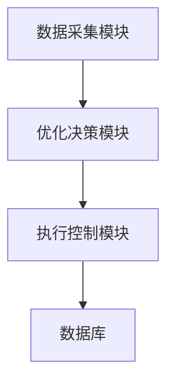
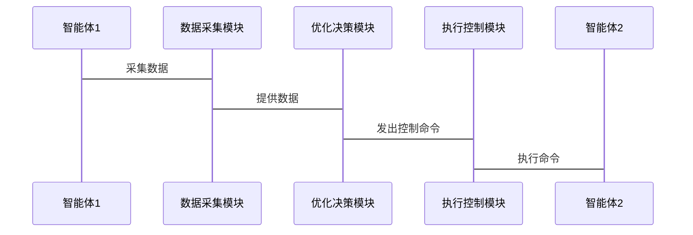

                 


```markdown
# 多智能体AI如何改进约翰·伯格的成本控制理念

> 关键词：多智能体AI，成本控制，约翰·伯格，优化算法，系统架构，项目实战

> 摘要：本文深入探讨了多智能体AI如何优化约翰·伯格的成本控制理念。通过分析多智能体AI的核心概念、算法原理、系统架构及项目实战，展示了多智能体AI在成本控制中的潜力与应用价值。

---

# 第一部分: 多智能体AI与成本控制理念的结合

---

## 第1章: 多智能体AI与成本控制的背景介绍

### 1.1 多智能体AI的定义与特点

#### 1.1.1 多智能体AI的基本概念
多智能体AI（Multi-Agent AI）是指由多个智能体（Agent）协同工作以完成特定任务的人工智能系统。每个智能体都可以独立决策并与其他智能体进行通信和协作。

#### 1.1.2 多智能体AI的核心特点
- **分布式智能**：多个智能体协同工作，避免单点依赖。
- **自主性**：每个智能体都能自主决策。
- **协作性**：智能体之间通过通信和协作完成任务。
- **动态性**：适应环境变化，实时调整策略。

#### 1.1.3 多智能体AI与传统AI的区别
- 传统AI通常基于单一智能体，而多智能体AI由多个智能体协同工作。
- 多智能体AI强调分布式决策和协作，而传统AI强调集中式计算。

### 1.2 成本控制的基本概念

#### 1.2.1 成本控制的定义
成本控制是指在生产或运营过程中，通过优化资源配置和管理，降低成本以提高效率的过程。

#### 1.2.2 成本控制的关键要素
- **资源分配**：合理分配资源以降低浪费。
- **预测与计划**：预测成本变化，制定控制策略。
- **实时监控**：实时跟踪成本变化，及时调整。

#### 1.2.3 成本控制的常见方法
- **预算控制法**：设定预算，监控实际支出。
- **差异分析法**：比较实际与预算差异，找出原因。
- **全面成本管理法**：从战略角度管理成本。

### 1.3 多智能体AI与成本控制的结合

#### 1.3.1 多智能体AI在成本控制中的应用潜力
- **实时监控**：通过智能体实时收集和分析数据，快速响应成本变化。
- **分布式优化**：多个智能体协同优化资源配置，降低整体成本。
- **预测与决策**：利用多智能体的协同计算，提高成本预测的准确性。

#### 1.3.2 约翰·伯格成本控制理念的核心思想
约翰·伯格提出了一套基于制造过程的成本控制理论，强调通过优化生产流程和资源配置来降低成本。

#### 1.3.3 多智能体AI如何改进约翰·伯格的成本控制理念
通过多智能体AI的实时监控、分布式优化和协同决策能力，可以进一步优化约翰·伯格的成本控制模型，使其更加高效和灵活。

### 1.4 本章小结

#### 1.4.1 多智能体AI与成本控制的结合背景
多智能体AI的技术进步为成本控制领域带来了新的可能性。

#### 1.4.2 约翰·伯格成本控制理念的主要特点
约翰·伯格理念注重制造过程的优化和资源配置的效率。

#### 1.4.3 多智能体AI在改进成本控制中的潜在价值
通过多智能体AI的协同计算和实时响应，可以进一步提升成本控制的效率和效果。

---

## 第2章: 多智能体AI的核心概念与原理

### 2.1 多智能体系统的基本原理

#### 2.1.1 多智能体系统的定义
多智能体系统是指由多个智能体组成的协作系统，每个智能体都具有一定的自主性和智能性。

#### 2.1.2 多智能体系统的核心要素
- **智能体**：具有感知、决策和执行能力的实体。
- **通信协议**：智能体之间进行信息交换的规则和标准。
- **任务分配**：根据智能体的能力和环境需求，分配任务。

#### 2.1.3 多智能体系统与传统AI的区别
多智能体系统强调分布式决策和协作，而传统AI强调集中式计算。

### 2.2 多智能体AI的成本控制模型

#### 2.2.1 成本控制模型的构建
构建一个多智能体AI的成本控制模型，需要考虑智能体的通信、任务分配和协同优化。

#### 2.2.2 多智能体AI在成本控制中的角色
- **数据采集智能体**：实时采集生产过程中的数据。
- **优化决策智能体**：基于数据进行优化决策。
- **执行控制智能体**：根据决策执行控制命令。

#### 2.2.3 多智能体AI的成本优化算法
通过多智能体的协同计算，优化资源分配，降低整体成本。

### 2.3 多智能体AI与约翰·伯格成本控制理念的结合

#### 2.3.1 约翰·伯格成本控制理念的分析
约翰·伯格理念强调制造过程的优化和资源配置的效率。

#### 2.3.2 多智能体AI如何优化约翰·伯格的成本控制模型
通过多智能体AI的实时监控和协同优化，进一步提升成本控制的效率和效果。

#### 2.3.3 多智能体AI在成本控制中的具体应用
- **实时监控与预测**：通过智能体实时采集和分析数据，预测成本变化。
- **分布式优化**：多个智能体协同优化资源配置，降低整体成本。
- **协同决策**：利用多智能体的协同计算，提高成本预测的准确性。

### 2.4 本章小结

#### 2.4.1 多智能体AI的核心概念
多智能体AI由多个智能体协同工作，具有分布式智能和自主性。

#### 2.4.2 成本控制模型的构建与优化
构建一个多智能体的成本控制模型，需要考虑智能体的通信、任务分配和协同优化。

#### 2.4.3 多智能体AI在成本控制中的应用前景
通过多智能体AI的实时监控和协同优化，可以进一步提升成本控制的效率和效果。

---

## 第3章: 多智能体AI的成本优化算法原理

### 3.1 多智能体AI的成本优化算法概述

#### 3.1.1 成本优化算法的基本概念
成本优化算法是指通过算法优化资源配置，降低成本的过程。

#### 3.1.2 多智能体AI中的成本优化算法分类
- **集中式优化算法**：所有智能体的信息汇总到中心节点进行优化。
- **分布式优化算法**：每个智能体独立优化，通过通信协调全局最优。

#### 3.1.3 算法选择与优化策略
根据具体应用场景选择合适的算法，并通过参数调优提高算法效率。

### 3.2 多智能体AI的成本优化算法实现

#### 3.2.1 算法

#### 3.2.2 成本优化算法的数学模型
- **集中式优化模型**：
  $$
  \min_{x} \sum_{i=1}^{n} c_i(x) \\
  \text{subject to} \quad x \in X
  $$
- **分布式优化模型**：
  $$
  \min_{x_i} \sum_{i=1}^{n} c_i(x_i) \\
  \text{subject to} \quad \sum_{i=1}^{n} x_i = X
  $$

#### 3.2.3 算法实现步骤
1. 初始化智能体参数。
2. 智能体通过通信协议共享信息。
3. 每个智能体独立优化，调整参数。
4. 协调全局最优，更新智能体参数。
5. 重复优化过程，直到达到目标或达到最大迭代次数。

### 3.3 多智能体AI的成本优化算法在约翰·伯格理念中的应用

#### 3.3.1 算法在制造过程中的应用
通过多智能体AI的实时优化，降低制造过程中的浪费。

#### 3.3.2 算法在资源配置中的应用
通过多智能体AI的分布式优化，合理分配资源，降低成本。

#### 3.3.3 算法在预测与决策中的应用
通过多智能体AI的协同计算，提高成本预测的准确性。

### 3.4 本章小结

#### 3.4.1 多智能体AI的成本优化算法概述
多智能体AI的成本优化算法通过集中式或分布式的方式优化资源配置。

#### 3.4.2 成本优化算法的数学模型与实现步骤
通过数学模型和实现步骤，展示了如何利用多智能体AI优化成本。

#### 3.4.3 多智能体AI在成本控制中的应用前景
通过多智能体AI的优化算法，可以进一步提升成本控制的效率和效果。

---

## 第4章: 多智能体AI的成本控制系统架构设计

### 4.1 系统架构设计概述

#### 4.1.1 系统功能模块设计
- **数据采集模块**：实时采集生产过程中的数据。
- **优化决策模块**：基于数据进行优化决策。
- **执行控制模块**：根据决策执行控制命令。

#### 4.1.2 系统架构图


#### 4.1.3 系统交互设计


### 4.2 系统功能设计

#### 4.2.1 数据采集模块的设计
- **传感器数据采集**：通过传感器实时采集生产过程中的数据。
- **数据预处理**：对采集到的数据进行清洗和标准化处理。

#### 4.2.2 优化决策模块的设计
- **成本预测模型**：基于历史数据和当前数据，预测未来的成本变化。
- **优化算法实现**：通过多智能体AI的优化算法，制定最优的资源分配方案。

#### 4.2.3 执行控制模块的设计
- **控制命令生成**：根据优化决策模块的决策，生成具体的控制命令。
- **命令执行**：将控制命令发送到生产设备，执行具体的控制操作。

### 4.3 系统架构优化

#### 4.3.1 分层架构设计
- **数据层**：负责数据的采集、存储和管理。
- **业务逻辑层**：负责优化决策和控制命令的生成。
- **交互层**：负责与用户的交互和接口的定义。

#### 4.3.2 模块化设计
- **数据采集模块**：负责数据的采集和预处理。
- **优化决策模块**：负责基于数据进行优化决策。
- **执行控制模块**：负责根据决策执行具体的控制命令。

### 4.4 本章小结

#### 4.4.1 系统架构设计概述
通过分层和模块化设计，构建了一个高效的多智能体AI成本控制系统。

#### 4.4.2 系统功能模块设计
数据采集模块、优化决策模块和执行控制模块协同工作，完成成本控制的任务。

#### 4.4.3 系统架构优化
通过分层和模块化设计，提高了系统的可维护性和扩展性。

---

## 第5章: 多智能体AI的成本控制项目实战

### 5.1 项目背景与目标

#### 5.1.1 项目背景
在制造企业中，降低成本是提高竞争力的重要手段。

#### 5.1.2 项目目标
通过多智能体AI技术，优化制造过程中的资源配置，降低成本。

### 5.2 项目环境与工具

#### 5.2.1 环境配置
- **操作系统**：Linux
- **编程语言**：Python
- **框架与库**：TensorFlow、PyTorch
- **工具**：Jupyter Notebook、Git

#### 5.2.2 数据集
- **训练数据集**：历史生产数据
- **测试数据集**：近期生产数据

### 5.3 系统核心实现

#### 5.3.1 数据采集模块实现
```python
import pandas as pd
import numpy as np

# 读取数据
data = pd.read_csv('production_data.csv')

# 数据预处理
data = data.dropna()
data = (data - data.mean()) / data.std()
```

#### 5.3.2 优化决策模块实现
```python
import tensorflow as tf
from tensorflow import keras

# 定义模型
model = keras.Sequential([
    keras.layers.Dense(64, activation='relu'),
    keras.layers.Dense(1, activation='linear')
])

# 编译模型
model.compile(optimizer='adam', loss='mse')

# 训练模型
model.fit(data[['input_feature']], data['target'], epochs=100, batch_size=32)
```

#### 5.3.3 执行控制模块实现
```python
# 优化决策模块生成控制命令
control_command = model.predict(new_data)

# 执行控制模块执行命令
# 假设生产设备的API接口为control_api
control_api.execute(control_command)
```

### 5.4 项目实战案例分析

#### 5.4.1 数据分析与可视化
通过数据分析和可视化，发现生产过程中的成本浪费点。

#### 5.4.2 模型训练与优化
通过多智能体AI的优化算法，训练出最优的资源分配模型。

#### 5.4.3 成本控制效果评估
通过对比分析，评估多智能体AI在成本控制中的实际效果。

### 5.5 项目总结与经验分享

#### 5.5.1 项目成功的关键因素
- **数据质量**：高质量的数据是模型优化的基础。
- **算法选择**：选择合适的算法是项目成功的关键。
- **系统架构**：合理的系统架构设计是项目成功的重要保障。

#### 5.5.2 项目实施中的注意事项
- **数据隐私**：注意数据的安全和隐私保护。
- **系统稳定性**：确保系统的稳定运行，避免中断。
- **团队协作**：加强团队协作，确保项目顺利推进。

### 5.6 本章小结

#### 5.6.1 项目背景与目标
通过多智能体AI技术，优化制造过程中的资源配置，降低成本。

#### 5.6.2 项目环境与工具
配置了合适的开发环境和工具，为项目实施提供了保障。

#### 5.6.3 系统核心实现
通过数据采集、优化决策和执行控制模块的实现，完成了成本控制系统的构建。

---

## 第6章: 多智能体AI的成本控制优化经验总结与未来展望

### 6.1 优化经验总结

#### 6.1.1 算法优化经验
- **算法选择**：选择适合具体应用场景的算法。
- **参数调优**：通过参数调优提高算法效率。
- **模型评估**：通过模型评估找到优化方向。

#### 6.1.2 系统优化经验
- **系统架构优化**：通过分层和模块化设计，提高系统的可维护性和扩展性。
- **数据处理优化**：通过数据预处理和特征选择，提高模型的准确性和效率。
- **系统性能优化**：通过并行计算和缓存优化，提高系统的运行效率。

#### 6.1.3 项目实施经验
- **项目管理**：通过良好的项目管理，确保项目按时完成。
- **团队协作**：加强团队协作，确保项目顺利推进。
- **风险管理**：通过风险分析和应对策略，降低项目失败的风险。

### 6.2 未来展望

#### 6.2.1 多智能体AI技术的未来发展趋势
- **智能化**：智能体将更加智能化，具备更强的自主决策能力。
- **协同性**：多智能体之间的协同将更加紧密，优化效果将更加显著。
- **实时性**：多智能体AI的实时性将不断提高，响应速度将更快。

#### 6.2.2 成本控制领域的未来发展方向
- **智能化**：通过智能化技术进一步优化成本控制。
- **数据驱动**：通过数据驱动的方法，提高成本控制的精准度。
- **绿色制造**：通过绿色制造理念，实现更加可持续的成本控制。

#### 6.2.3 多智能体AI与成本控制的深度融合
随着多智能体AI技术的不断发展，其在成本控制领域的应用将更加广泛和深入。

### 6.3 本章小结

#### 6.3.1 优化经验总结
通过算法优化和系统优化，进一步提高了多智能体AI在成本控制中的效率和效果。

#### 6.3.2 未来展望
随着技术的进步，多智能体AI在成本控制领域的应用前景将更加广阔。

---

## 第7章: 结论与致谢

### 7.1 研究结论

#### 7.1.1 多智能体AI在成本控制中的应用价值
多智能体AI通过实时监控、分布式优化和协同决策，显著提升了成本控制的效率和效果。

#### 7.1.2 约翰·伯格成本控制理念的优化提升
通过多智能体AI的优化算法，进一步优化了约翰·伯格的成本控制模型，使其更加高效和灵活。

### 7.2 未来研究方向

#### 7.2.1 多智能体AI的智能化提升
进一步研究如何提高多智能体AI的智能化水平，使其具备更强的自主决策能力。

#### 7.2.2 成本控制领域的技术创新
探索更多基于多智能体AI的成本控制技术，推动成本控制领域的创新发展。

#### 7.2.3 多智能体AI与绿色制造的结合
研究如何将多智能体AI与绿色制造理念相结合，实现更加可持续的成本控制。

### 7.3 致谢

#### 7.3.1 致谢对象
感谢在项目实施过程中给予支持和帮助的团队成员、合作伙伴和研究机构。

#### 7.3.2 致谢内容
感谢他们在项目中的辛勤工作和宝贵建议，为项目的成功实施提供了重要支持。

---

## 参考文献

（此处列出相关的参考文献，如书籍、论文、技术报告等。）

---

## 作者

作者：AI天才研究院/AI Genius Institute & 禅与计算机程序设计艺术/Zen And The Art of Computer Programming
```

