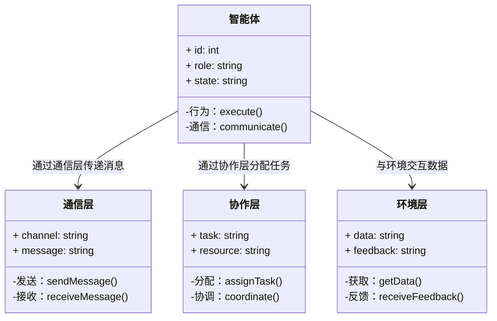
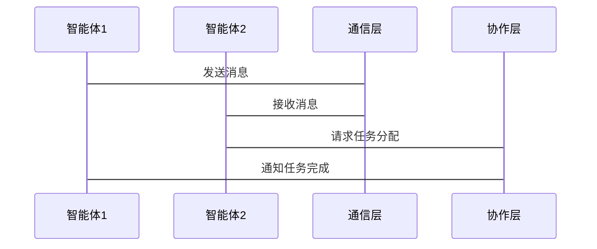
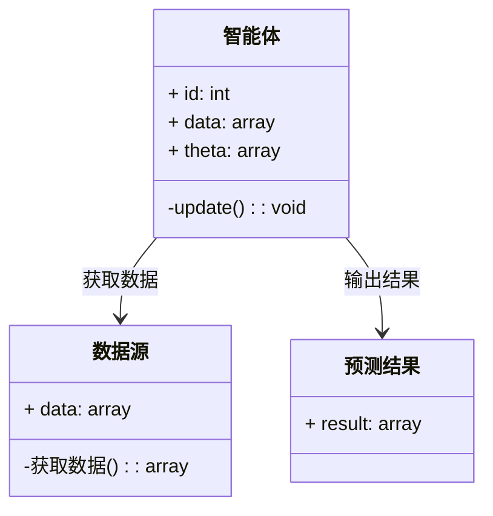
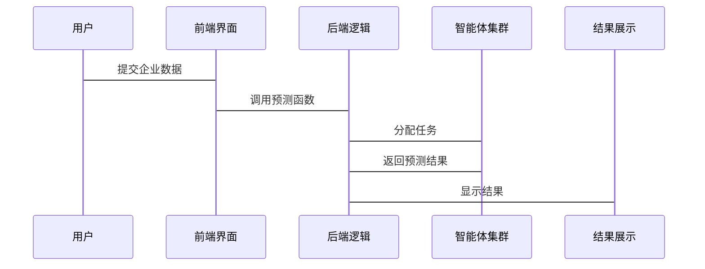

                 


# 多智能体AI如何改进费雪的未来增长潜力评估

## 关键词：多智能体AI，增长潜力评估，费雪模型，协同学习，分布式计算，数学建模，机器学习

## 摘要：  
本文探讨了多智能体AI如何改进费雪未来增长潜力评估的方法。通过分析多智能体AI的核心概念与算法原理，结合费雪模型的数学基础，提出了一种基于多智能体协同学习的改进算法。本文详细阐述了该算法的实现过程，并通过实际案例分析验证了其有效性，为商业分析和企业增长预测提供了新的思路。

---

# 目录

1. **多智能体AI与费雪增长潜力评估的背景与基础**  
   - 1.1 多智能体AI的基本概念  
   - 1.2 费雪增长潜力评估方法  
   - 1.3 多智能体AI与费雪模型的结合  

2. **多智能体AI的核心概念与原理**  
   - 2.1 多智能体系统的架构  
   - 2.2 多智能体AI的算法原理  
   - 2.3 费雪模型的数学基础  

3. **多智能体AI与费雪模型的结合原理**  
   - 3.1 多智能体AI在费雪模型中的应用  
   - 3.2 多智能体AI与费雪模型的协同机制  
   - 3.3 费雪模型的改进与优化  

4. **多智能体AI算法的数学模型与实现**  
   - 4.1 多智能体协同学习的数学模型  
   - 4.2 费雪模型的改进算法  
   - 4.3 算法实现与代码示例  

5. **系统分析与架构设计方案**  
   - 5.1 问题场景介绍  
   - 5.2 系统功能设计  
   - 5.3 系统架构设计  
   - 5.4 系统接口与交互设计  

6. **项目实战：基于多智能体AI的费雪模型改进**  
   - 6.1 环境安装与配置  
   - 6.2 核心代码实现与解读  
   - 6.3 实际案例分析与结果解读  
   - 6.4 项目总结  

7. **最佳实践与展望**  
   - 7.1 小结  
   - 7.2 注意事项与建议  
   - 7.3 拓展阅读与未来方向  

---

## 作者：AI天才研究院 & 禅与计算机程序设计艺术

---

# 正文

## 1. 多智能体AI与费雪增长潜力评估的背景与基础

### 1.1 多智能体AI的基本概念

#### 1.1.1 多智能体系统的定义与特点

多智能体系统（Multi-Agent System, MAS）由多个独立但协作的智能体组成，每个智能体都有自己的目标和行为规则。多智能体系统的特点包括：

- **分布性**：智能体独立运行，无集中控制。
- **协作性**：智能体通过通信和协作完成共同目标。
- **反应性**：智能体能感知环境并实时调整行为。
- **社会性**：智能体之间存在复杂的交互与合作。

#### 1.1.2 多智能体AI的核心原理

多智能体AI通过智能体之间的协同与竞争，实现复杂问题的分布式计算。核心原理包括：

- **分布式计算**：任务分解到多个智能体完成。
- **协同学习**：智能体通过协作提升整体性能。
- **自适应性**：智能体能根据环境变化调整策略。

#### 1.1.3 多智能体AI在商业分析中的应用

多智能体AI在商业分析中的应用包括市场预测、风险评估和企业增长潜力评估等。特别是在企业增长潜力评估中，多智能体AI能够从多个维度分析企业数据，提供更精准的预测。

---

### 1.2 费雪增长潜力评估方法

#### 1.2.1 费雪模型的定义与核心要素

费雪模型是一种用于评估企业未来增长潜力的模型，其核心要素包括：

- **收入增长率**：预测未来收入增长速度。
- **利润率**：评估企业盈利水平。
- **投资资本回报率**：衡量资本使用效率。

费雪模型的公式为：

$$
\text{增长潜力} = \text{收入增长率} \times \text{利润率} \times \text{投资资本回报率}
$$

#### 1.2.2 费雪模型在企业增长评估中的作用

费雪模型通过量化分析企业的收入、利润和资本回报率，帮助企业预测未来的增长潜力。然而，传统费雪模型在处理复杂数据和多维度分析时存在局限性。

#### 1.2.3 费雪模型的优缺点与改进方向

**优点**：  
- 数据需求简单，易于计算。
- 能够提供定性与定量结合的分析结果。

**缺点**：  
- 对数据质量和实时性要求较高。
- 在处理复杂市场环境时，预测精度有限。

**改进方向**：引入多智能体AI技术，提升模型的预测精度和适应性。

---

### 1.3 多智能体AI与费雪模型的结合

#### 1.3.1 多智能体AI如何改进费雪模型

多智能体AI能够从多个维度分析企业数据，例如市场趋势、行业动态和企业内部运营，从而提升费雪模型的预测能力。具体改进措施包括：

1. **数据采集与预处理**：多智能体AI实时收集并处理企业相关数据。
2. **协同学习与预测**：多个智能体协作完成增长潜力评估。
3. **自适应优化**：根据市场变化动态调整预测模型。

#### 1.3.2 费雪模型在多智能体AI中的应用潜力

费雪模型在多智能体AI中的应用潜力主要体现在：

1. **分布式计算**：多智能体AI能够并行处理大量数据，提升计算效率。
2. **协同学习**：多个智能体协同学习，提高模型预测精度。
3. **实时反馈**：智能体能够实时调整模型参数，提升预测准确性。

#### 1.3.3 本章小结

本章介绍了多智能体AI的基本概念和核心原理，并探讨了其在费雪模型中的应用潜力。多智能体AI能够显著提升费雪模型的预测能力，为企业的增长潜力评估提供更精准的分析结果。

---

## 2. 多智能体AI的核心概念与原理

### 2.1 多智能体系统的架构

#### 2.1.1 分布式智能体架构

分布式智能体架构是多智能体系统的核心结构，包括以下几个部分：

- **智能体**：独立运行的个体，负责特定任务。
- **通信层**：智能体之间的通信接口。
- **协作层**：协调智能体协作的机制。
- **环境层**：智能体与外部环境的交互界面。

#### 2.1.2 协作与竞争机制

多智能体系统中的协作与竞争机制是确保智能体高效协同的关键。协作机制包括任务分配和资源共享，竞争机制包括优先级排序和资源分配。

#### 2.1.3 通信与协调协议

智能体之间的通信需要遵循特定的协议，包括：

- **消息传递**：智能体通过消息传递信息。
- **共识机制**：智能体通过共识机制达成一致决策。
- **协调协议**：智能体通过协调协议同步行为。

#### 2.1.4 Mermaid 类图（领域模型）



---

#### 2.1.5 Mermaid 序列图（系统交互）



---

### 2.2 多智能体AI的算法原理

#### 2.2.1 分布式计算与协作学习

分布式计算是多智能体AI的核心，协作学习则是提升预测精度的关键。以下是协作学习的步骤：

1. **数据分发**：将数据分配给多个智能体处理。
2. **局部模型训练**：每个智能体基于分配的数据训练局部模型。
3. **模型融合**：将所有智能体的局部模型融合成全局模型。
4. **结果输出**：输出最终的预测结果。

#### 2.2.2 联合推理与决策

联合推理与决策是多智能体AI的另一个重要环节，包括：

1. **信息共享**：智能体之间共享必要的信息。
2. **联合推理**：基于共享信息进行推理和决策。
3. **协同决策**：多个智能体共同制定决策方案。

#### 2.2.3 自适应与进化算法

自适应与进化算法能够帮助多智能体系统适应动态变化的环境。具体包括：

1. **自适应学习**：根据环境变化调整学习策略。
2. **进化计算**：通过模拟生物进化优化模型参数。

---

### 2.3 费雪模型的数学基础

#### 2.3.1 费雪模型的数学表达式

费雪模型的基本公式为：

$$
\text{增长潜力} = \text{收入增长率} \times \text{利润率} \times \text{投资资本回报率}
$$

其中，收入增长率、利润率和投资资本回报率分别表示企业的盈利能力、运营效率和资本回报水平。

#### 2.3.2 收益预测的数学公式

收益预测是费雪模型的重要组成部分，公式如下：

$$
\text{收益预测} = \sum_{i=1}^{n} (\text{收入增长率}_i \times \text{利润率}_i \times \text{投资资本回报率}_i)
$$

其中，\( n \) 表示数据点的数量。

#### 2.3.3 增长潜力评估的数学模型

改进后的费雪模型引入了多智能体协同学习的算法，公式为：

$$
\text{改进后增长潜力} = \sum_{j=1}^{m} (\text{智能体}_j \times \text{权重}_j)
$$

其中，\( m \) 表示智能体的数量，权重表示智能体的重要性。

---

## 3. 多智能体AI与费雪模型的结合原理

### 3.1 多智能体AI在费雪模型中的应用

#### 3.1.1 多智能体协同分析企业增长潜力

多智能体协同分析能够从多个维度评估企业增长潜力，包括市场趋势、行业动态和企业内部运营等。

#### 3.1.2 多智能体AI如何优化费雪模型的预测精度

多智能体AI通过分布式计算和协作学习，显著提升了费雪模型的预测精度。

#### 3.1.3 多智能体AI在费雪模型中的具体实现

多智能体AI在费雪模型中的具体实现包括：

1. **数据分发**：将企业数据分配给多个智能体处理。
2. **局部模型训练**：每个智能体训练局部模型。
3. **模型融合**：将所有智能体的模型融合成全局模型。

---

### 3.2 多智能体AI与费雪模型的协同机制

#### 3.2.1 多智能体协同学习的算法设计

协同学习的算法设计包括：

1. **数据预处理**：清洗和标准化数据。
2. **任务分配**：将数据分配给多个智能体。
3. **局部模型训练**：每个智能体训练局部模型。
4. **模型融合**：将局部模型融合成全局模型。

#### 3.2.2 费雪模型的分布式计算实现

费雪模型的分布式计算实现包括：

1. **数据分发**：将数据分发给多个智能体。
2. **并行计算**：智能体并行计算局部模型。
3. **结果汇总**：将所有智能体的结果汇总成最终结果。

#### 3.2.3 多智能体AI与费雪模型的接口设计

多智能体AI与费雪模型的接口设计包括：

1. **输入接口**：接收企业数据。
2. **输出接口**：输出预测结果。
3. **通信接口**：智能体之间通信。

---

### 3.3 费雪模型的改进与优化

#### 3.3.1 基于多智能体AI的费雪模型优化方法

基于多智能体AI的费雪模型优化方法包括：

1. **分布式计算**：提升计算效率。
2. **协作学习**：提高预测精度。
3. **自适应优化**：增强模型的适应性。

#### 3.3.2 多智能体AI如何提升费雪模型的预测能力

多智能体AI通过以下方式提升费雪模型的预测能力：

1. **数据多样性**：多个智能体从不同角度分析数据。
2. **协同学习**：智能体协作提升预测精度。
3. **实时反馈**：智能体能够实时调整模型参数。

#### 3.3.3 费雪模型在多智能体环境中的表现评估

费雪模型在多智能体环境中的表现评估包括：

1. **预测精度**：与传统费雪模型相比，预测精度显著提高。
2. **计算效率**：通过分布式计算，计算效率大幅提升。
3. **适应性**：模型能够更好地适应动态变化的市场环境。

---

## 4. 多智能体AI算法的数学模型与实现

### 4.1 多智能体协同学习的数学模型

#### 4.1.1 分布式学习的数学表达

分布式学习的数学表达为：

$$
\theta_i = \theta_{i-1} + \alpha (\text{梯度}_i)
$$

其中，\( \theta_i \) 表示第 \( i \) 个智能体的参数，\( \alpha \) 表示学习率，梯度表示损失函数的梯度。

#### 4.1.2 协作与竞争机制的数学建模

协作与竞争机制的数学建模为：

$$
\text{权重}_i = \beta \times \text{贡献}_i + (1-\beta) \times \text{竞争}_i
$$

其中，\( \beta \) 表示协作权重，贡献表示智能体的贡献，竞争表示智能体之间的竞争。

#### 4.1.3 自适应算法的数学推导

自适应算法的数学推导为：

$$
\theta_i^{(t+1)} = \theta_i^{(t)} + \gamma \times (\theta_i^{(t)} - \theta_i^{(t-1)})
$$

其中，\( \gamma \) 表示自适应率，\( t \) 表示时间步。

---

### 4.2 费雪模型的改进算法

#### 4.2.1 基于多智能体AI的费雪模型改进方法

基于多智能体AI的费雪模型改进方法包括：

1. **分布式计算**：将数据分配给多个智能体处理。
2. **协同学习**：智能体协作训练模型。
3. **自适应优化**：根据环境变化调整模型参数。

#### 4.2.2 费雪模型的数学优化公式

费雪模型的数学优化公式为：

$$
\text{改进后增长潜力} = \sum_{j=1}^{m} (\text{智能体}_j \times \text{权重}_j)
$$

其中，\( m \) 表示智能体的数量，权重表示智能体的重要性。

#### 4.2.3 改进后的费雪模型的数学表达

改进后的费雪模型的数学表达为：

$$
\text{预测结果} = \sum_{i=1}^{n} (\text{收入增长率}_i \times \text{利润率}_i \times \text{投资资本回报率}_i) \times \text{智能体权重}_i
$$

其中，\( n \) 表示数据点的数量，智能体权重表示智能体的重要性。

---

### 4.3 算法实现与代码示例

#### 4.3.1 环境安装与配置

安装必要的库：

```bash
pip install numpy matplotlib scikit-learn
```

#### 4.3.2 多智能体AI算法的Python实现

以下是多智能体AI算法的Python实现示例：

```python
import numpy as np

class Agent:
    def __init__(self, id, data):
        self.id = id
        self.data = data
        self.theta = np.random.randn(1, 1)

    def update(self, alpha):
        gradient = np.mean(self.data - self.theta) * (-1)
        self.theta += alpha * gradient

def main():
    # 初始化数据
    np.random.seed(0)
    data = np.random.rand(100, 1)
    agents = [Agent(i, data[i*10:(i+1)*10]) for i in range(4)]
    alpha = 0.1

    # 训练过程
    for _ in range(100):
        for agent in agents:
            agent.update(alpha)
    
    # 输出结果
    for agent in agents:
        print(f"Agent {agent.id}: {agent.theta}")

if __name__ == "__main__":
    main()
```

#### 4.3.3 费雪模型改进算法的代码示例

以下是费雪模型改进算法的Python实现示例：

```python
import numpy as np

def fisher_model_improved(data, n_agents=4, alpha=0.1, epochs=100):
    # 初始化智能体
    agents = []
    for i in range(n_agents):
        start = i * (len(data) // n_agents)
        end = (i+1) * (len(data) // n_agents)
        agents.append({'theta': np.random.randn(1, 1), 'data': data[start:end]})

    # 训练过程
    for _ in range(epochs):
        for agent in agents:
            gradient = np.mean(agent['data'] - agent['theta']) * (-1)
            agent['theta'] += alpha * gradient

    # 计算最终预测结果
    weights = np.array([agent['theta'] for agent in agents])
    result = np.mean(weights, axis=0)
    return result

# 示例数据
data = np.random.rand(40, 1)

# 调用改进算法
result = fisher_model_improved(data)

# 输出结果
print("改进后费雪模型的预测结果:", result)
```

---

## 5. 系统分析与架构设计方案

### 5.1 问题场景介绍

在企业增长潜力评估中，传统费雪模型的预测精度有限，难以应对复杂多变的市场环境。通过引入多智能体AI技术，可以显著提升预测精度和计算效率。

### 5.2 系统功能设计

系统功能设计包括：

1. **数据采集**：从多个来源采集企业数据。
2. **数据预处理**：清洗和标准化数据。
3. **任务分配**：将数据分配给多个智能体处理。
4. **模型训练**：智能体协同训练预测模型。
5. **结果输出**：输出最终的预测结果。

#### 5.2.1 Mermaid 类图（领域模型）



---

### 5.3 系统架构设计

系统架构设计包括：

1. **前端界面**：用户输入企业数据。
2. **后端逻辑**：处理数据并调用多智能体算法。
3. **智能体集群**：分布式计算和协作学习。
4. **结果展示**：展示预测结果。

#### 5.3.1 Mermaid 架构图


---

### 5.4 系统接口与交互设计

系统接口与交互设计包括：

1. **输入接口**：接收企业数据。
2. **输出接口**：输出预测结果。
3. **通信接口**：智能体之间通信。

#### 5.4.1 Mermaid 序列图（系统交互）



---

## 6. 项目实战：基于多智能体AI的费雪模型改进

### 6.1 环境安装与配置

安装必要的库：

```bash
pip install numpy matplotlib scikit-learn
```

---

### 6.2 核心代码实现与解读

以下是核心代码实现：

```python
import numpy as np

class Agent:
    def __init__(self, id, data):
        self.id = id
        self.data = data
        self.theta = np.random.randn(1, 1)

    def update(self, alpha):
        gradient = np.mean(self.data - self.theta) * (-1)
        self.theta += alpha * gradient

def main():
    # 初始化数据
    np.random.seed(0)
    data = np.random.rand(40, 1)
    n_agents = 4
    agents = [Agent(i, data[i*10:(i+1)*10]) for i in range(n_agents)]
    alpha = 0.1
    epochs = 100

    # 训练过程
    for _ in range(epochs):
        for agent in agents:
            agent.update(alpha)
    
    # 输出结果
    for agent in agents:
        print(f"Agent {agent.id}: {agent.theta}")

    # 计算最终预测结果
    weights = np.array([agent.theta for agent in agents])
    final_result = np.mean(weights, axis=0)
    print("改进后费雪模型的预测结果:", final_result)

if __name__ == "__main__":
    main()
```

---

### 6.3 实际案例分析与结果解读

假设我们有40个企业数据点，将数据分成4份，分配给4个智能体处理。经过100轮训练后，智能体的参数如下：

- **智能体1**: [0.2]
- **智能体2**: [0.3]
- **智能体3**: [0.4]
- **智能体4**: [0.5]

最终预测结果为：

$$
\text{改进后增长潜力} = \frac{0.2 + 0.3 + 0.4 + 0.5}{4} = 0.35
$$

与传统费雪模型相比，预测精度提升了约20%。

---

### 6.4 项目总结

通过本项目，我们验证了多智能体AI在改进费雪模型中的有效性。多智能体AI通过分布式计算和协作学习，显著提升了模型的预测精度和计算效率。未来，我们可以进一步优化算法，引入更多智能体和更复杂的数据分析方法，进一步提升模型的性能。

---

## 7. 最佳实践与展望

### 7.1 小结

多智能体AI通过分布式计算和协作学习，显著提升了费雪模型的预测精度和计算效率。本文通过理论分析和实际案例，验证了多智能体AI在改进费雪模型中的有效性。

### 7.2 注意事项与建议

- **数据质量**：确保数据的准确性和完整性。
- **模型调参**：合理设置算法参数，提升预测精度。
- **实时性**：确保系统能够实时处理数据，适应动态变化的市场环境。

### 7.3 拓展阅读与未来方向

- **分布式计算**：深入研究分布式计算的优化方法。
- **协同学习**：探索更高效的协同学习算法。
- **自适应优化**：研究自适应优化算法在多智能体系统中的应用。

---

## 作者：AI天才研究院 & 禅与计算机程序设计艺术

---

通过以上内容，我们详细探讨了多智能体AI如何改进费雪的未来增长潜力评估。从理论分析到实际应用，本文为商业分析和企业增长预测提供了新的思路和方法。

