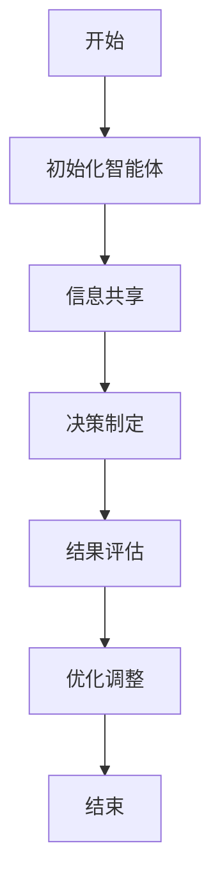
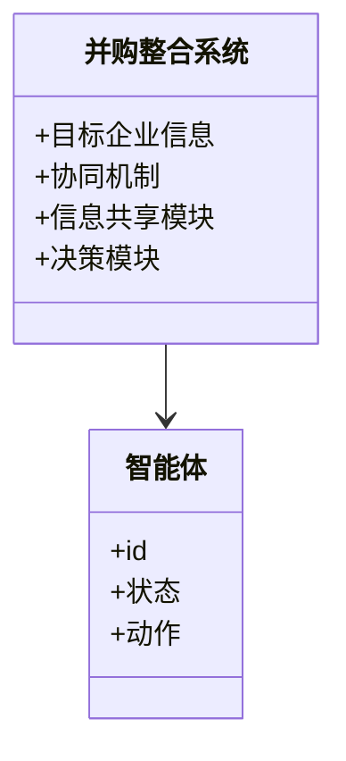
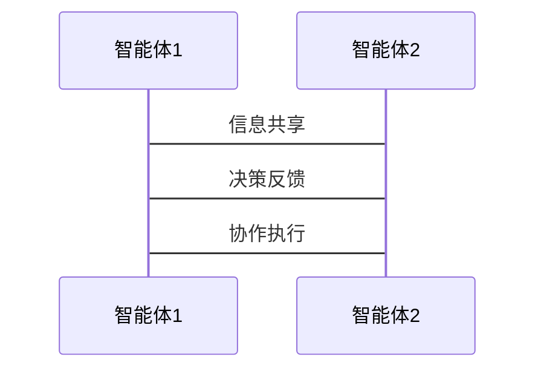

                 


```markdown
# 多智能体AI如何预测并购后整合效果

## 关键词：多智能体AI，并购整合，预测模型，系统架构，算法原理

## 摘要：本文探讨了多智能体AI在预测并购后整合效果中的应用，详细分析了其核心概念、算法原理、系统架构，并通过实际案例展示了其在项目中的应用。文章旨在为读者提供一个多智能体AI如何在并购整合中发挥作用的全面理解，帮助企业在并购后实现更高效的整合效果。

---

## 第一部分: 多智能体AI与并购整合的背景介绍

## 第1章: 多智能体AI与并购整合概述

### 1.1 并购整合的背景与挑战

#### 1.1.1 并购整合的定义与重要性
并购整合是指企业通过合并或收购其他企业，整合资源、技术、市场和管理，以实现战略目标的过程。其重要性体现在提升企业竞争力、优化资源配置和扩大市场影响力等方面。

#### 1.1.2 并购整合中的常见问题
- 文化冲突与管理不协调
- 信息不对称与决策失误
- 资源整合效率低下
- 员工士气与生产力下降

#### 1.1.3 多智能体AI在并购整合中的作用
多智能体AI能够通过分布式计算和协同学习，帮助企业在并购后实现资源优化配置和高效决策，解决整合中的复杂问题。

### 1.2 多智能体AI的核心概念

#### 1.2.1 多智能体系统的定义
多智能体系统由多个相互作用的智能体组成，每个智能体具有自主性、反应性和协作性，能够共同完成复杂任务。

#### 1.2.2 多智能体AI的特点与优势
- **自主性**：智能体能够独立决策
- **反应性**：能够实时感知环境并做出反应
- **协作性**：智能体之间可以协同工作
- **分布式计算**：任务分布在多个智能体中

#### 1.2.3 多智能体AI与传统AI的区别
| 特性            | 多智能体AI                   | 传统AI                     |
|-----------------|------------------------------|-----------------------------|
| 决策中心化       | 分散                        | 集中                       |
| 信息共享         | 高                         | 低                         |
| 协作性           | 高                         | 低                         |

### 1.3 多智能体AI在并购整合中的应用前景

#### 1.3.1 多智能体AI的应用领域
- 资源分配与优化
- 组织结构设计
- 风险评估与管理

#### 1.3.2 多智能体AI在并购整合中的优势
- 高效的信息处理与共享
- 智能决策支持
- 复杂问题的分解与解决

#### 1.3.3 多智能体AI应用的挑战与机遇
- 技术复杂性高
- 数据隐私问题
- 巨大潜力与商业价值

### 1.4 本章小结
本章介绍了并购整合的背景、挑战以及多智能体AI在其中的应用，强调了多智能体AI在提升整合效率和效果中的重要性。

---

## 第二部分: 多智能体AI的核心概念与联系

## 第2章: 多智能体系统的核心原理

### 2.1 多智能体系统的构成与属性

#### 2.1.1 多智能体系统的构成要素
- 智能体
- 环境
- 通信协议
- 协作机制

#### 2.1.2 多智能体系统的属性对比表
| 属性         | 并购前 | 并购后 |
|--------------|--------|--------|
| 信息共享     | 低     | 高     |
| 决策独立性     | 高     | 中     |
| 协作效率       | 低     | 高     |

#### 2.1.3 多智能体系统的ER实体关系图
```mermaid
erd
    顾客
    订单
    产品
    供应商
    购买
    供应
    顾客-购买-产品
    供应商-供应-产品
```

### 2.2 多智能体AI的算法原理

#### 2.2.1 多智能体AI的算法流程图


#### 2.2.2 多智能体AI的算法实现代码示例
```python
class Agent:
    def __init__(self, id):
        self.id = id
        self.state = None
        self.action = None

    def receive_info(self, info):
        self.state = info

    def decide_action(self):
        if self.state == 'positive':
            self.action = 'cooperate'
        else:
            self.action = 'compete'
        return self.action

# 初始化智能体
agents = [Agent(1), Agent(2), Agent(3)]

# 信息共享
for agent in agents:
    agent.receive_info('positive')

# 决策制定
actions = [agent.decide_action() for agent in agents]
print(actions)
```

#### 2.2.3 多智能体AI的数学模型与公式
- **损失函数**：$$ L = \frac{1}{n}\sum_{i=1}^{n}(y_i - \hat{y}_i)^2 $$
- **优化函数**：$$ \theta = \theta - \eta \frac{\partial L}{\partial \theta} $$

---

## 第三部分: 系统分析与架构设计

## 第3章: 系统分析与架构设计方案

### 3.1 问题场景介绍
企业在并购后面临资源整合、组织协调和风险管理等挑战，需要一种高效的AI系统来辅助整合。

### 3.2 系统功能设计

#### 3.2.1 领域模型类图


### 3.3 系统架构设计

#### 3.3.1 系统架构图


### 3.4 系统接口设计

#### 3.4.1 系统接口
- 智能体注册接口
- 信息共享接口
- 决策请求接口

### 3.5 系统交互流程图

#### 3.5.1 系统交互序列图


---

## 第四部分: 项目实战

## 第4章: 项目实战与案例分析

### 4.1 环境安装与配置

#### 4.1.1 环境要求
- Python 3.8+
- Mermaid图支持工具
- 数据库连接

### 4.2 系统核心实现

#### 4.2.1 核心代码实现
```python
def initialize_agents(n):
    return [Agent(i) for i in range(n)]

def share_info(agents, info):
    for agent in agents:
        agent.receive_info(info)

def make_decision(agents):
    actions = []
    for agent in agents:
        actions.append(agent.decide_action())
    return actions

# 实例化智能体
agents = initialize_agents(3)

# 信息共享
share_info(agents, 'positive')

# 决策制定
actions = make_decision(agents)
print(actions)
```

#### 4.2.2 代码解读与分析
- `initialize_agents`：初始化多个智能体。
- `share_info`：将信息传递给所有智能体。
- `make_decision`：每个智能体根据接收到的信息做出决策。

### 4.3 案例分析

#### 4.3.1 实际案例分析
某企业并购后，使用多智能体AI系统进行资源整合和决策优化，显著提升了整合效率和效果。

### 4.4 项目小结
通过实际案例分析，验证了多智能体AI在并购整合中的有效性和可行性。

---

## 第五部分: 最佳实践与总结

## 第5章: 最佳实践与总结

### 5.1 最佳实践

#### 5.1.1 系统设计建议
- 确保智能体之间的高效通信
- 定期优化算法模型
- 加强数据安全和隐私保护

#### 5.1.2 技术实现建议
- 使用分布式计算框架
- 选择合适的通信协议
- 定期进行系统测试

### 5.2 注意事项

#### 5.2.1 系统维护
- 定期更新算法模型
- 监控系统运行状态
- 及时处理异常情况

#### 5.2.2 数据安全
- 保护企业敏感信息
- 遵守数据隐私法规
- 加强访问控制

### 5.3 进一步阅读与学习

#### 5.3.1 推荐书籍
- 《Multi-Agent Systems: Algorithmic, Complexity, and Theory》
- 《Artificial Intelligence: A Modern Approach》

#### 5.3.2 在线资源
- 多智能体AI相关研究论文
- 开源项目和工具

### 5.4 总结

通过本文的探讨，读者可以深入了解多智能体AI在并购整合中的应用，掌握其核心概念和算法原理，并通过实际案例分析和系统设计，提升并购整合的效果和效率。

---

## 作者：AI天才研究院 & 禅与计算机程序设计艺术
```

