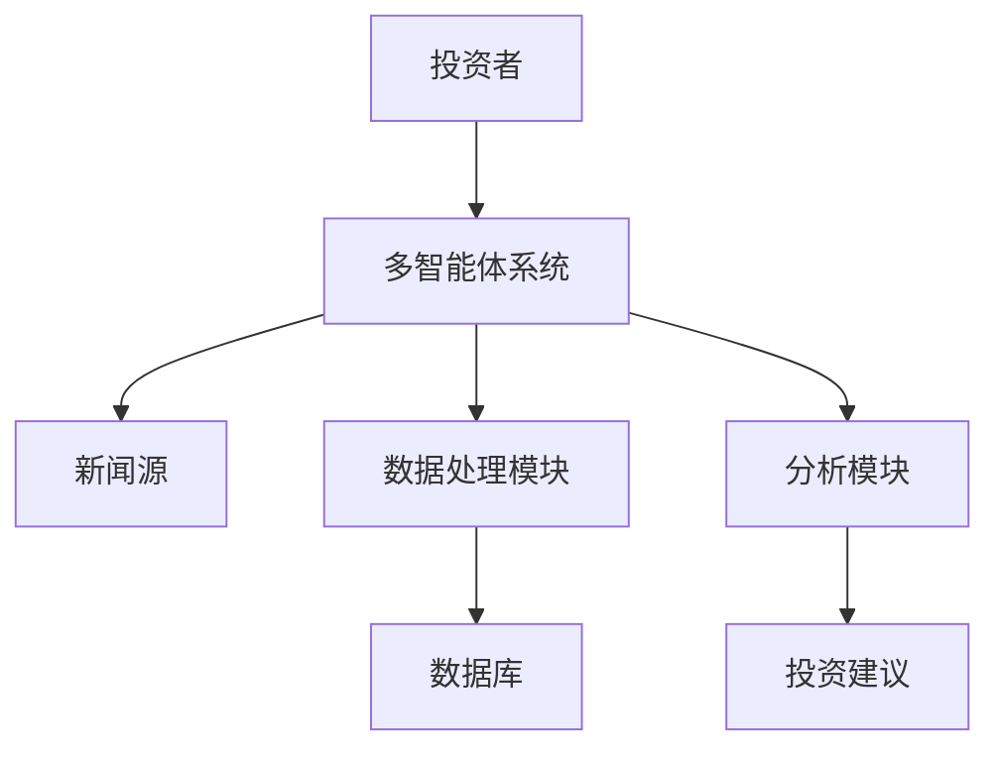
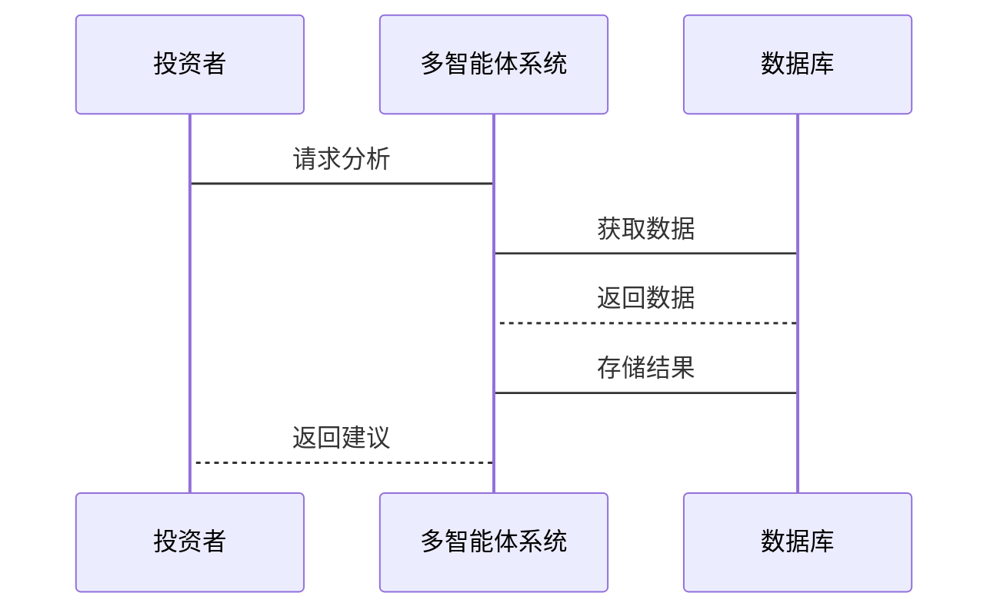

                 


# 多智能体AI系统在价值投资中的实时新闻分析应用

> 关键词：多智能体AI系统，价值投资，实时新闻分析，金融数据，分布式计算

> 摘要：本文探讨了多智能体AI系统在价值投资中的实时新闻分析应用。通过详细分析多智能体系统的概念、算法原理、系统架构设计，结合实际项目案例，展示了如何利用多智能体系统处理实时新闻数据，为投资决策提供支持。文章还提供了最佳实践建议和注意事项。

---

## 第一部分: 多智能体AI系统概述

### 第1章: 多智能体AI系统的基本概念

#### 1.1 多智能体系统的基本定义
多智能体系统（Multi-Agent System, MAS）是由多个智能体（Agent）组成的分布式系统，每个智能体具有一定的自主性、反应性和协作性。与传统的集中式AI系统不同，多智能体系统通过多个智能体的协作来完成复杂的任务。

#### 1.2 多智能体与传统AI的区别
- **自主性**：智能体能够自主决策，而非依赖于中央控制。
- **协作性**：多个智能体协同工作，共同完成任务。
- **动态性**：系统能够适应环境的变化。

#### 1.3 多智能体系统的核心特征
- **分布性**：智能体分布在不同的节点上，具有分布式计算能力。
- **协作性**：智能体之间通过通信和协商完成任务。
- **反应性**：智能体能够实时感知环境并做出反应。

---

### 第2章: 价值投资的基本原理

#### 2.1 价值投资的定义与特点
价值投资是一种投资策略，通过分析公司的基本面，寻找被市场低估的投资标的。其核心在于发现市场中的“价值”，即公司的真实价值与其市场价值之间的差异。

#### 2.2 价值投资中的信息处理需求
- **实时性**：需要及时获取和处理市场信息。
- **准确性**：分析结果需要准确可靠。
- **全面性**：需要综合分析多方面的信息。

#### 2.3 价值投资与实时新闻分析的关联
新闻是影响市场的重要因素。实时新闻分析能够帮助投资者快速捕捉市场动向，发现潜在的投资机会或风险。

---

## 第二部分: 多智能体AI系统在金融领域的应用

### 第3章: 多智能体系统在金融分析中的优势

#### 3.1 分布式计算与金融数据处理
- **分布式计算**：多智能体系统能够高效处理大规模金融数据。
- **并行处理**：多个智能体可以同时处理不同数据源，提高效率。

#### 3.2 多智能体协作在金融决策中的作用
- **信息整合**：多个智能体协作，整合不同来源的信息，提供全面的分析结果。
- **风险分散**：通过分布式计算，降低系统单点故障的风险。

#### 3.3 实时新闻分析对金融投资的影响
- **快速响应**：实时新闻分析能够帮助投资者快速做出决策。
- **精准分析**：通过多智能体系统的协作，提高新闻分析的准确性。

---

### 第4章: 多智能体系统与实时新闻分析的结合

#### 4.1 实时新闻分析的挑战
- **数据量大**：金融新闻数据量庞大，需要高效处理。
- **信息复杂**：新闻内容涉及多方面信息，分析难度大。
- **实时性要求高**：需要快速处理和分析新闻数据。

#### 4.2 多智能体系统在实时新闻分析中的应用
- **分布式计算**：多个智能体协同处理新闻数据。
- **信息提取**：智能体通过自然语言处理技术提取新闻中的关键信息。
- **情感分析**：通过情感分析技术，判断新闻对市场的影响。

---

### 第5章: 多智能体系统在价值投资中的具体应用

#### 5.1 多智能体系统在新闻分析中的流程
1. **数据采集**：智能体从多个新闻源采集数据。
2. **数据处理**：对新闻数据进行清洗和预处理。
3. **信息提取**：通过自然语言处理技术提取关键词和情感信息。
4. **分析与决策**：智能体协作分析新闻数据，生成投资建议。

#### 5.2 多智能体系统在投资决策中的优势
- **高效性**：通过分布式计算，提高数据处理效率。
- **准确性**：多个智能体协作，提高分析结果的准确性。
- **实时性**：能够快速响应市场变化。

---

### 第6章: 系统分析与架构设计方案

#### 6.1 项目背景
本项目旨在利用多智能体系统对实时新闻进行分析，为价值投资提供支持。

#### 6.2 系统功能设计
- **数据采集**：从新闻网站、社交媒体等渠道采集数据。
- **数据处理**：对新闻数据进行清洗、转换和存储。
- **信息提取**：通过自然语言处理技术提取关键词和情感信息。
- **分析与决策**：智能体协作分析数据，生成投资建议。

#### 6.3 系统架构设计


#### 6.4 系统接口设计
- **输入接口**：接收新闻数据。
- **输出接口**：输出投资建议。

#### 6.5 系统交互设计


---

### 第7章: 项目实战

#### 7.1 环境安装
- **Python**：安装Python 3.8及以上版本。
- **库的安装**：安装`pandas`, `numpy`, `nltk`, `transformers`等库。

#### 7.2 系统核心实现源代码
```python
import pandas as pd
from transformers import pipeline

# 初始化智能体
agents = []

# 数据采集
def collect_data():
    # 从新闻网站采集数据
    pass

# 数据处理
def process_data(data):
    # 数据清洗和预处理
    pass

# 信息提取
def extract_info(data):
    nlp = pipeline("text-classification", model="bert-base")
    return nlp(data)

# 分析与决策
def analyze_data(info):
    # 分析信息，生成投资建议
    pass

# 系统主函数
def main():
    data = collect_data()
    processed_data = process_data(data)
    info = extract_info(processed_data)
    analyze_data(info)

if __name__ == "__main__":
    main()
```

#### 7.3 代码应用解读与分析
- **数据采集**：从新闻网站采集数据。
- **数据处理**：清洗数据，去除噪声。
- **信息提取**：使用NLP技术提取关键词和情感信息。
- **分析与决策**：根据提取的信息，生成投资建议。

#### 7.4 实际案例分析
假设新闻内容为某公司发布了季度财报，多智能体系统通过分析新闻内容，发现财报数据好于预期，生成买入建议。

#### 7.5 项目小结
通过项目实战，验证了多智能体系统在实时新闻分析中的有效性。

---

### 第8章: 最佳实践、小结、注意事项、拓展阅读

#### 8.1 最佳实践
- **数据质量**：确保数据来源可靠。
- **算法选择**：根据实际需求选择合适的算法。
- **系统维护**：定期更新模型和数据。

#### 8.2 小结
本文详细介绍了多智能体系统在价值投资中的实时新闻分析应用，通过理论分析和项目实战，展示了其在金融领域的潜力。

#### 8.3 注意事项
- **数据隐私**：注意数据隐私和安全。
- **系统性能**：优化系统性能，确保实时性。

#### 8.4 拓展阅读
- 推荐阅读相关领域的书籍和论文，深入学习多智能体系统和金融分析的知识。

---

作者：AI天才研究院/AI Genius Institute & 禅与计算机程序设计艺术 /Zen And The Art of Computer Programming

