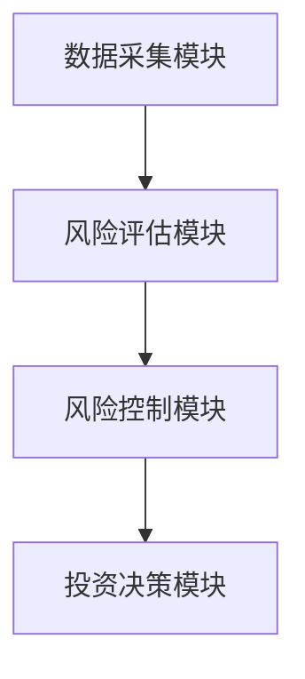
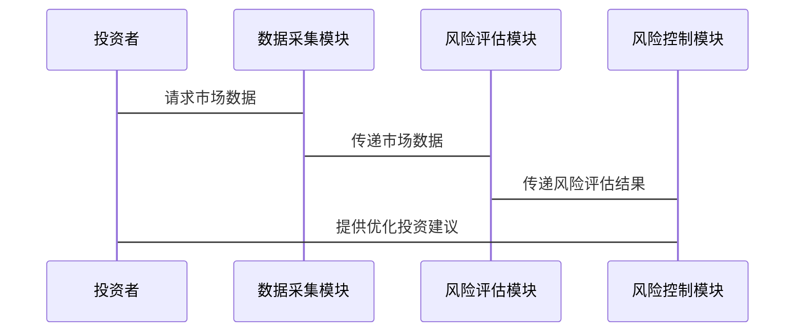

                 


# 多智能体AI系统在价值投资中的风险管理应用

## 关键词：多智能体AI、风险管理、价值投资、算法、系统架构、金融分析

## 摘要：  
本文深入探讨了多智能体AI系统在价值投资中的风险管理应用。通过分析多智能体系统的协作机制、算法原理和实际应用，展示了其在实时风险识别、预测和控制方面的优势。文章从理论到实践，详细阐述了多智能体AI在金融风险管理中的创新方法和未来发展方向。

---

# 第一部分: 多智能体AI系统与风险管理概述

## 第1章: 多智能体AI系统与风险管理概述

### 1.1 多智能体AI系统的定义与特点
#### 1.1.1 多智能体系统的基本概念  
多智能体系统（Multi-Agent Systems, MAS）是由多个相互作用的智能体组成的系统，这些智能体能够感知环境、自主决策并协同完成任务。  

#### 1.1.2 多智能体AI的核心特点  
- **分布性**：智能体独立决策，通过通信协作完成目标。  
- **协同性**：智能体之间通过信息共享和协作实现整体优化。  
- **动态性**：能够适应环境变化和不确定性。  

#### 1.1.3 多智能体AI与传统AI的区别  
| 特性 | 多智能体AI | 传统AI |  
|------|------------|--------|  
| 结构 | 分布式、协作式 | 集中式、单点式 |  
| 决策 | 去中心化决策 | 中央决策 |  
| 应用 | 复杂协作场景 | 单一任务场景 |  

---

### 1.2 风险管理在价值投资中的重要性
#### 1.2.1 风险管理的基本概念  
风险管理是指识别、评估和应对投资中的潜在风险，以降低损失并确保投资目标的实现。  

#### 1.2.2 价值投资中的风险管理需求  
- **市场波动**：金融市场的不确定性对投资决策提出更高要求。  
- **复杂性**：多因素影响投资风险，需要综合分析。  
- **实时性**：需要快速响应市场变化，避免重大损失。  

#### 1.2.3 多智能体AI在风险管理中的优势  
- **分布式计算**：多个智能体协同工作，提高计算效率。  
- **实时性**：能够快速响应市场变化，进行实时风险评估。  
- **协作性**：智能体之间共享信息，优化决策。  

---

### 1.3 多智能体AI系统在金融领域的应用前景
#### 1.3.1 多智能体AI在金融领域的应用现状  
- **高频交易**：利用多智能体系统进行实时市场分析和交易决策。  
- **风险管理**：通过协作学习优化风险控制策略。  
- **智能投顾**：为投资者提供个性化投资建议。  

#### 1.3.2 价值投资中的风险管理挑战  
- **复杂性**：市场因素众多，难以预测。  
- **实时性**：需要快速响应市场变化。  
- **不确定性**：市场波动可能导致模型失效。  

#### 1.3.3 多智能体AI系统的潜在应用场景  
- **实时风险监控**：利用多智能体系统进行实时市场分析和风险预警。  
- **动态资产配置**：通过协作学习优化资产配置策略。  
- **智能决策支持**：为投资者提供智能化的决策支持工具。  

---

### 1.4 本章小结  
本章介绍了多智能体AI系统的定义、特点及其在风险管理中的重要性。通过分析多智能体AI在金融领域的应用前景，展示了其在价值投资中的潜在价值。

---

## 第2章: 多智能体系统的核心概念与原理

### 2.1 多智能体系统的组成与结构
#### 2.1.1 多智能体系统的组成要素  
- **智能体**：具有感知、决策和执行能力的个体。  
- **环境**：智能体所处的外部环境，包括金融市场、客户数据等。  
- **通信机制**：智能体之间信息交换的方式。  

#### 2.1.2 多智能体系统的层次结构  
- **物理层**：智能体的硬件和执行机构。  
- **逻辑层**：智能体的感知、决策和学习能力。  
- **通信层**：智能体之间的信息交互。  

#### 2.1.3 多智能体系统的通信机制  
- **直接通信**：智能体之间直接交换信息。  
- **间接通信**：通过中间媒介进行信息传递。  

---

### 2.2 多智能体系统的协作与决策机制
#### 2.2.1 协作的基本概念  
协作是指多个智能体通过信息共享和协同行动，共同完成目标。  

#### 2.2.2 多智能体协作的实现方法  
- **基于博弈论的协作**：通过博弈模型优化决策。  
- **基于强化学习的协作**：通过奖励机制激励协作行为。  

#### 2.2.3 基于协作的决策机制  
- **分布式决策**：每个智能体独立决策，通过协作优化整体目标。  
- **集中式决策**：由中央智能体统一决策，其他智能体执行。  

---

### 2.3 多智能体系统的通信协议与信息共享
#### 2.3.1 通信协议的基本概念  
通信协议是智能体之间信息交互的规则和标准。  

#### 2.3.2 多智能体系统中的信息共享机制  
- **信息广播**：所有智能体共享信息。  
- **信息查询**：智能体按需查询特定信息。  

#### 2.3.3 信息共享的安全性与隐私保护  
- **加密技术**：保护信息在传输过程中的安全性。  
- **访问控制**：限制信息的访问权限。  

---

### 2.4 本章小结  
本章详细介绍了多智能体系统的组成、协作机制和通信协议。通过分析这些核心概念，为后续的算法和应用奠定了理论基础。

---

## 第3章: 多智能体AI系统的算法原理

### 3.1 多智能体协同学习算法
#### 3.1.1 协同学习的基本概念  
协同学习是指多个智能体通过协作完成学习任务。  

#### 3.1.2 基于强化学习的协同方法  
- **Q-learning**：通过强化学习算法优化智能体的决策策略。  
- **多智能体Q-learning**：扩展Q-learning到多智能体协作场景。  

#### 3.1.3 博弈论模型在协同学习中的应用  
- **纳什均衡**：分析多个智能体协作的均衡状态。  
- **收益分配**：通过博弈论优化智能体之间的收益分配。  

---

### 3.2 多智能体协同学习的数学模型
#### 3.2.1 强化学习的数学模型  
$$ Q(s, a) = r + \gamma \max Q(s', a') $$  
其中，$Q(s, a)$ 表示状态 $s$ 下动作 $a$ 的价值，$\gamma$ 是折扣因子。  

#### 3.2.2 博弈论模型  
- **收益矩阵**：描述多个智能体在不同策略下的收益。  
- **纳什均衡**：所有智能体策略均为最优反应的均衡状态。  

---

### 3.3 多智能体系统的协作与优化算法
#### 3.3.1 分布式协作算法  
- **分布式Q-learning**：每个智能体独立学习，通过通信共享经验。  
- **多智能体强化学习**：通过协作优化整体收益。  

#### 3.3.2 算法实现的Python代码示例  
```python
import numpy as np

class MultiAgentQLearning:
    def __init__(self, num_agents, state_space, action_space, gamma=0.9):
        self.num_agents = num_agents
        self.state_space = state_space
        self.action_space = action_space
        self.gamma = gamma
        self.q_table = [np.zeros((state_space, action_space)) for _ in range(num_agents)]
    
    def update(self, agents, states, actions, rewards, next_states):
        for i in range(self.num_agents):
            s = states[i]
            a = actions[i]
            r = rewards[i]
            next_s = next_states[i]
            self.q_table[i][s][a] = r + self.gamma * np.max(self.q_table[i][next_s])
```

---

### 3.4 本章小结  
本章详细介绍了多智能体协同学习的算法原理，包括强化学习和博弈论模型。通过Python代码示例，展示了算法的具体实现方法。

---

## 第4章: 多智能体AI系统的风险管理应用

### 4.1 风险识别与评估
#### 4.1.1 风险识别的基本概念  
风险识别是发现潜在风险并进行分类的过程。  

#### 4.1.2 基于多智能体的实时风险识别  
- **实时数据采集**：通过智能体实时采集市场数据。  
- **风险分类模型**：利用机器学习算法对风险进行分类。  

#### 4.1.3 风险评估的数学模型  
$$ R = \sum_{i=1}^{n} w_i \cdot r_i $$  
其中，$R$ 表示总体风险，$w_i$ 表示风险因素的权重，$r_i$ 表示风险因素的值。  

---

### 4.2 风险预测与预警
#### 4.2.1 风险预测的基本概念  
风险预测是基于历史数据预测未来风险的可能性。  

#### 4.2.2 基于多智能体的实时风险预测  
- **时间序列分析**：利用LSTM等模型进行时间序列预测。  
- **协同预测**：通过多智能体协同优化预测结果。  

#### 4.2.3 风险预警的实现方法  
- **阈值设定**：当风险指标超过阈值时触发预警。  
- **多级预警**：根据风险严重程度设置不同级别的预警。  

---

### 4.3 风险控制与优化
#### 4.3.1 风险控制的基本概念  
风险控制是通过调整投资策略降低风险的过程。  

#### 4.3.2 基于多智能体的动态风险控制  
- **动态调整策略**：根据实时市场变化动态调整投资组合。  
- **风险分散**：通过多智能体协作实现资产的分散配置。  

#### 4.3.3 风险优化的数学模型  
$$ \min V \quad \text{subject to} \quad \sum_{i=1}^{n} w_i = 1 $$  
其中，$V$ 表示投资组合的风险值，$w_i$ 表示资产权重。  

---

### 4.4 本章小结  
本章探讨了多智能体AI系统在风险识别、预测和控制中的应用，展示了其在价值投资中的实际价值。

---

## 第5章: 系统分析与架构设计

### 5.1 问题场景介绍
#### 5.1.1 系统目标  
实现一个多智能体AI系统，用于价值投资中的风险管理。  

#### 5.1.2 问题描述  
- **复杂性**：金融市场复杂，需要多智能体协作。  
- **实时性**：需要快速响应市场变化。  
- **安全性**：需要保护投资者的隐私和数据安全。  

---

### 5.2 系统功能设计
#### 5.2.1 系统功能模块  
- **数据采集模块**：实时采集市场数据。  
- **风险评估模块**：基于多智能体算法进行风险评估。  
- **风险控制模块**：动态调整投资策略。  

#### 5.2.2 系统功能流程图（Mermaid）  


---

### 5.3 系统架构设计
#### 5.3.1 系统架构图（Mermaid）  


#### 5.3.2 系统接口设计  
- **数据接口**：与金融数据源对接。  
- **用户接口**：为投资者提供交互界面。  

---

### 5.4 系统交互流程图（Mermaid）  


---

### 5.5 本章小结  
本章通过系统分析和架构设计，展示了多智能体AI系统在风险管理中的具体实现方式。

---

## 第6章: 项目实战

### 6.1 环境安装与配置
#### 6.1.1 安装Python环境  
```bash
pip install python3 python3-pip
pip install numpy pandas scikit-learn tensorflow
```

#### 6.1.2 安装金融数据分析库  
```bash
pip install pandas-datareader
```

---

### 6.2 系统核心功能实现
#### 6.2.1 多智能体协同学习实现  
```python
import numpy as np
import pandas as pd

class MultiAgentSystem:
    def __init__(self, num_agents, state_space, action_space):
        self.num_agents = num_agents
        self.state_space = state_space
        self.action_space = action_space
        self.q_tables = [np.zeros((state_space, action_space)) for _ in range(num_agents)]
    
    def act(self, states):
        actions = []
        for i in range(self.num_agents):
            actions.append(np.argmax(self.q_tables[i][states[i]]))
        return actions
    
    def update(self, states, actions, rewards, next_states):
        for i in range(self.num_agents):
            self.q_tables[i][states[i]][actions[i]] += rewards[i]
```

#### 6.2.2 风险管理实现  
```python
def risk_assessment(price_data, window=20):
    returns = price_data.pct_change().dropna()
    volatility = returns.rolling(window).std()
    return volatility
```

---

### 6.3 实际案例分析与解读
#### 6.3.1 案例背景  
分析某股票的历史价格数据，评估其风险并制定投资策略。  

#### 6.3.2 数据分析与处理  
```python
import pandas as pd
import pandas_datareader as pdr

# 获取数据
data = pdr.get_data_yahoo('AAPL', start='2020-01-01', end='2023-12-31')
# 计算收益率
returns = data['Adj Close'].pct_change().dropna()
# 计算波动率
volatility = returns.rolling(20).std()
print(volatility.tail())
```

#### 6.3.3 投资策略制定  
- **基于波动率的策略**：当波动率低于历史均值时买入，高于历史均值时卖出。  

---

### 6.4 本章小结  
本章通过实际案例分析，展示了多智能体AI系统在风险管理中的具体应用。

---

## 第7章: 最佳实践与总结

### 7.1 小结
多智能体AI系统在价值投资中的风险管理应用具有显著优势，能够通过协作和实时分析降低投资风险。

---

### 7.2 注意事项
- **数据质量**：确保数据的准确性和完整性。  
- **模型优化**：定期优化算法以适应市场变化。  
- **风险管理**：严格控制模型的局限性和潜在风险。  

---

### 7.3 拓展阅读
- **多智能体强化学习**：深入学习多智能体强化学习的理论和应用。  
- **金融风险管理**：研究其他金融风险管理方法和技术。  

---

## 作者：AI天才研究院 & 禅与计算机程序设计艺术

