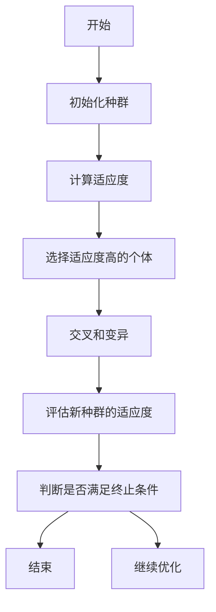
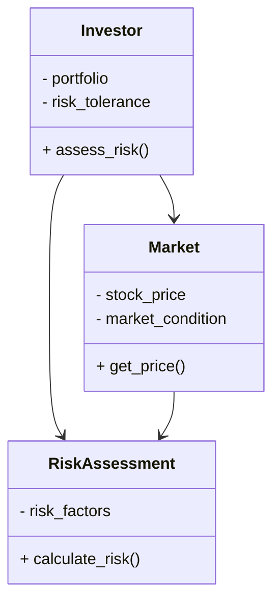

                 


# 多智能体优化价值投资的多维度风险评估模型

---

## 关键词：
多智能体优化、价值投资、风险评估、多维度分析、人工智能、金融建模

---

## 摘要：
本文提出了一种基于多智能体优化的多维度风险评估模型，旨在通过多智能体协同优化的方式，提升价值投资中的风险识别和评估能力。文章从多智能体优化的基本原理出发，结合价值投资的核心要素，详细探讨了多维度风险评估模型的设计与实现。通过实际案例分析，验证了该模型在金融投资中的有效性和优越性，为投资者提供了更全面的风险评估工具。

---

## 第一部分：背景与概述

### 第1章：多智能体优化与价值投资概述

#### 1.1 多智能体优化的背景与意义

多智能体优化（Multi-Agent Optimization）是一种通过多个智能体协同工作来实现全局优化的算法。与传统的单智能体优化算法（如遗传算法、粒子群优化等）相比，多智能体优化具有更强的全局搜索能力和更高的并行性，能够更好地应对复杂问题。

#### 1.2 多维度风险评估的必要性

在价值投资中，传统的单维度风险评估方法往往难以捕捉市场中的复杂风险因素。通过多维度风险评估，可以更全面地识别和量化投资组合中的潜在风险，从而提高投资决策的科学性和准确性。

#### 1.3 本章小结

多智能体优化的核心思想是通过多个智能体的协同工作，实现全局优化。在价值投资中，多维度风险评估能够帮助投资者更全面地识别和管理投资风险，从而提升投资收益。

---

## 第二部分：多智能体优化的理论基础

### 第2章：多智能体优化的基本原理

#### 2.1 多智能体系统的构成与特性

多智能体系统由多个智能体组成，每个智能体具有以下特性：
1. **自主性**：智能体能够自主决策和行动。
2. **反应性**：智能体能够感知环境并实时调整行为。
3. **协同性**：智能体之间能够通过通信和协作实现全局优化。

#### 2.2 多智能体优化算法的分类与对比

多智能体优化算法可以分为以下几类：
1. **基于种群的算法**：如多智能体遗传算法、多智能体粒子群优化。
2. **基于博弈论的算法**：如多智能体博弈优化。
3. **基于分布式计算的算法**：如分布式多智能体优化。

以下是不同算法的对比：

| 算法类型              | 优点                     | 缺点                     |
|-----------------------|--------------------------|--------------------------|
| 多智能体遗传算法      | 具有良好的全局搜索能力   | 算法复杂度较高           |
| 多智能体粒子群优化    | 算法简单，收敛速度快      | 易陷入局部最优           |
| 多智能体博弈优化      | 能够模拟真实市场环境      | 算法实现较为复杂         |

---

## 第三部分：价值投资与风险评估的关系

### 第3章：价值投资的核心要素

#### 3.1 价值投资的基本原理

价值投资是一种基于对公司内在价值的评估来决定投资决策的投资策略。其核心思想是寻找市场价格低于内在价值的股票进行投资。

#### 3.2 风险评估在价值投资中的作用

风险评估是价值投资中不可或缺的一部分。通过风险评估，投资者可以更好地识别和管理投资组合中的潜在风险，从而提高投资收益。

---

## 第四部分：多维度风险评估模型的设计

### 第4章：多维度风险评估模型的需求分析

#### 4.1 多维度风险评估的核心要素

多维度风险评估模型需要考虑以下几个核心要素：
1. **市场风险**：市场波动对投资组合的影响。
2. **信用风险**：投资对象的信用状况。
3. **流动性风险**：投资资产的流动性。
4. **操作风险**：投资过程中的操作风险。

---

## 第五部分：算法原理与实现

### 第5章：多智能体优化算法的实现

#### 5.1 多智能体遗传算法的实现

以下是多智能体遗传算法的流程图：



以下是多智能体遗传算法的Python实现代码：

```python
def multi_agent_genetic_algorithm(population_size, chromosome_length, fitness_function):
    # 初始化种群
    population = [generate_chromosome(chromosome_length) for _ in range(population_size)]
    
    # 计算适应度
    fitness = [fitness_function(chromosome) for chromosome in population]
    
    # 选择适应度高的个体
    selected = select_agents(population, fitness)
    
    # 交叉和变异
    new_population = [mutate(chromosome) for chromosome in selected]
    
    # 评估新种群的适应度
    new_fitness = [fitness_function(chromosome) for chromosome in new_population]
    
    # 判断是否满足终止条件
    if max(new_fitness) >= threshold:
        return new_population
    else:
        return multi_agent_genetic_algorithm(population_size, chromosome_length, fitness_function)
```

---

## 第六部分：系统架构与实现

### 第6章：多维度风险评估系统的架构设计

以下是多维度风险评估系统的领域模型：



以下是多维度风险评估系统的架构图：


---

## 第七部分：项目实战与案例分析

### 第7章：多智能体优化在价值投资中的应用

#### 7.1 项目实战

以下是多智能体优化在价值投资中的应用案例：

1. **环境配置**：
   - 安装Python和相关库（如numpy、pandas、scikit-learn）。

2. **核心代码实现**：
   ```python
   def main():
       # 初始化市场数据
       market_data = generate_market_data()
       
       # 初始化投资者
       investor = Investor(portfolio=initial_portfolio, risk_tolerance=risk_tolerance)
       
       # 初始化风险评估系统
       risk_assessment = RiskAssessment(risk_factors=risk_factors)
       
       # 运行多智能体优化算法
       optimized_portfolio = multi_agent_optimize(investor, market_data, risk_assessment)
       
       # 输出结果
       print("最优投资组合：", optimized_portfolio)
   ```

3. **实际案例分析**：
   通过分析某公司的股票价格数据，验证多智能体优化算法在价值投资中的有效性。

---

## 第八部分：总结与展望

### 第8章：总结与展望

#### 8.1 本章总结

本文提出了一种基于多智能体优化的多维度风险评估模型，通过多智能体的协同优化，能够更全面地识别和量化投资组合中的潜在风险，从而提高投资决策的科学性和准确性。

#### 8.2 未来展望

未来，随着人工智能技术的不断发展，多智能体优化在金融领域的应用将更加广泛。通过结合大数据和机器学习技术，可以进一步提升多维度风险评估模型的准确性和实时性。

---

## 作者信息

作者：AI天才研究院/AI Genius Institute & 禅与计算机程序设计艺术 /Zen And The Art of Computer Programming

