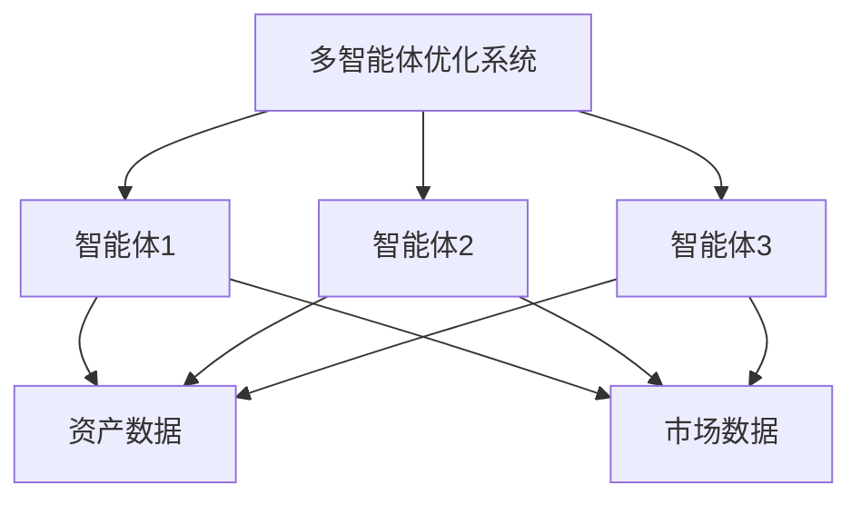
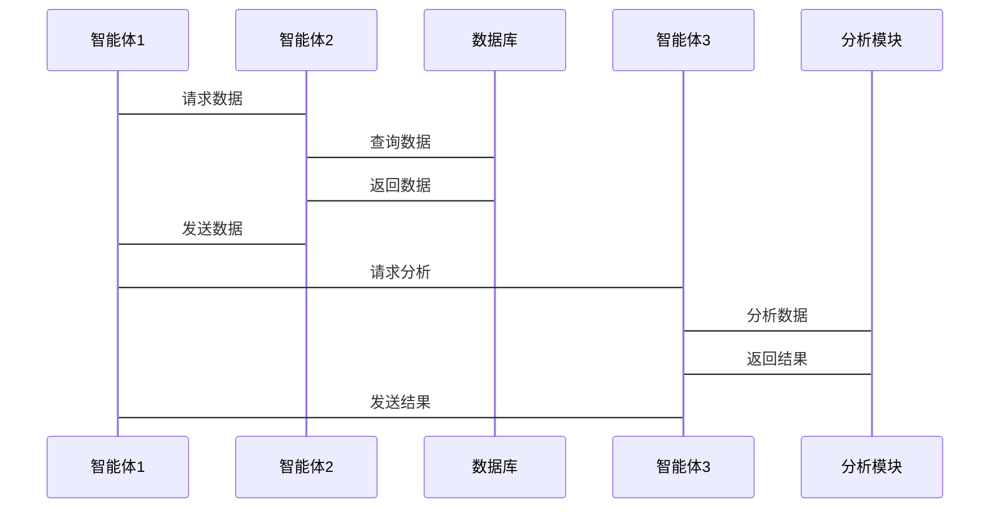

                 


# 多智能体优化价值投资的多资产类别相关性分析

> 关键词：多智能体优化，价值投资，资产类别相关性分析，金融投资，数据挖掘，机器学习，智能算法

> 摘要：本文系统探讨了多智能体优化在价值投资中的应用，重点分析多资产类别之间的相关性，结合算法原理、系统架构和项目实战，深入解析其在金融投资中的潜力。通过多智能体优化算法与相关性分析的结合，优化投资组合，降低风险，实现价值最大化。

---

## 第一部分: 多智能体优化与价值投资的背景介绍

### 第1章: 多智能体优化与价值投资概述

#### 1.1 多智能体优化的基本概念
- **1.1.1 多智能体系统的定义与特点**
  多智能体系统是由多个独立但协作的智能体组成的系统，每个智能体都有自己的目标和决策机制，通过交互实现整体优化。其特点包括分布性、协作性、自主性和反应性。
  
- **1.1.2 多智能体优化的定义与目标**
  多智能体优化是通过多个智能体协作，寻找全局最优解的过程。其目标是在复杂环境中实现资源分配、任务调度和风险控制。

- **1.1.3 多智能体优化在金融领域的应用**
  在金融领域，多智能体优化用于投资组合管理、风险控制和市场预测，通过模拟市场行为优化投资策略。

#### 1.2 价值投资的核心理念
- **1.2.1 价值投资的定义与特点**
  价值投资是通过分析企业基本面，寻找被市场低估的投资标的。其特点包括长期视角、注重内在价值和逆向思维。

- **1.2.2 价值投资的基本原理**
  基于基本面分析，识别具有持续盈利能力的企业，以低于内在价值的价格买入并长期持有。

- **1.2.3 价值投资与多智能体优化的结合**
  利用多智能体优化算法，优化投资组合，平衡风险与收益，提升投资效率和准确性。

### 第2章: 多资产类别相关性分析的基础

#### 2.1 多资产类别相关性分析的定义
- **2.1.1 资产类别与相关性的基本概念**
  资产类别包括股票、债券、商品等，相关性分析研究它们之间的价格波动关系。

- **2.1.2 多资产类别相关性分析的意义**
  通过分析资产之间的相关性，优化投资组合，降低风险，提高收益。

- **2.1.3 相关性分析的数学模型**
  使用协方差矩阵和相关系数矩阵，量化资产之间的相关性。

#### 2.2 多资产类别相关性分析的方法
- **2.2.1 单变量分析法**
  单变量分析用于分析单一资产与市场指数的相关性，帮助识别风险来源。

- **2.2.2 多变量分析法**
  多变量分析同时考虑多个资产的相关性，构建多元回归模型，评估资产间的相互影响。

- **2.2.3 聚类分析法**
  聚类分析将资产分为不同类别，识别具有相似特性的资产组，优化投资组合结构。

#### 2.3 多资产类别相关性分析的挑战
- **2.3.1 数据噪声与缺失值的处理**
  数据清洗和处理是相关性分析的基础，需处理噪声和缺失值，确保数据准确性。

- **2.3.2 资产类别之间的非线性关系**
  非线性关系复杂，需要使用高级统计方法或机器学习模型进行分析。

- **2.3.3 市场波动与突发事件的影响**
  市场波动和突发事件会导致资产相关性变化，影响分析结果的稳定性。

---

## 第二部分: 多智能体优化与价值投资的核心概念与联系

### 第3章: 多智能体优化的原理与实现

#### 3.1 多智能体优化的原理
- **3.1.1 多智能体系统的组成与交互**
  多智能体系统由多个智能体组成，通过通信和协作完成任务。智能体之间通过消息传递进行交互，协调行动。

- **3.1.2 多智能体优化的算法流程**
  优化算法包括初始化、评估、更新和终止条件判断。通过迭代优化，逐步逼近最优解。

- **3.1.3 多智能体优化在金融中的应用**
  在金融领域，多智能体优化用于投资组合优化、风险管理和市场预测，提升投资效率和准确性。

#### 3.2 多智能体优化与价值投资的联系
- **3.2.1 价值投资的优化目标**
  价值投资旨在寻找低估资产，实现长期收益最大化。多智能体优化通过分析市场数据，辅助投资决策。

- **3.2.2 多智能体优化在价值投资中的应用**
  利用多智能体优化算法，分析多资产类别相关性，优化投资组合配置，降低风险，提升收益。

- **3.2.3 实体关系图（ER图）架构**
  ER图展示多智能体优化与价值投资的关系，智能体之间通过数据交互，优化投资组合。

```mermaid
erd
    股票价格
    债券价格
    商品价格
    智能体1
    智能体2
    智能体3
    智能体4
    智能体5
    智能体6
    智能体7
    智能体8
    智能体9
    智能体10

    智能体1 --> 股票价格
    智能体2 --> 债券价格
    智能体3 --> 商品价格
    智能体4 --> 智能体1
    智能体5 --> 智能体2
    智能体6 --> 智能体3
    智能体7 --> 股票价格
    智能体8 --> 债券价格
    智能体9 --> 商品价格
    智能体10 --> 智能体7
```

---

## 第三部分: 数学模型与公式

### 3.3 数学模型的详细推导

#### 3.3.1 目标函数
$$
\text{目标函数} = \sum_{i=1}^{n} w_i \cdot r_i
$$

其中，\( w_i \) 是资产 \( i \) 的权重，\( r_i \) 是资产 \( i \) 的回报率。

#### 3.3.2 约束条件
$$
\sum_{i=1}^{n} w_i = 1
$$

$$
w_i \geq 0 \quad \forall i
$$

#### 3.3.3 优化过程
通过多智能体优化算法，逐步调整权重 \( w_i \)，使目标函数最大化。

---

## 第四部分: 系统分析与架构设计

### 4.1 系统架构设计



### 4.2 系统交互设计



---

## 第五部分: 项目实战

### 5.1 环境安装
- 安装Python、NumPy、Pandas、Matplotlib、Scikit-learn等库。
- 安装多智能体优化框架，如DEAP或Ray。

### 5.2 核心实现代码

```python
import numpy as np
from sklearn.metrics import pairwise_distances

# 示例数据
assets = ['股票', '债券', '黄金', '白银']
returns = np.array([[0.1, 0.05, 0.08, 0.03],
                     [0.08, 0.12, 0.05, 0.07],
                     [0.12, 0.09, 0.07, 0.08]])

# 计算相关系数矩阵
correlations = pairwise_distances(returns, metric='correlation')
print(correlations)
```

### 5.3 案例分析
分析相关系数矩阵，识别资产之间的强相关性，优化投资组合配置，降低风险。

---

## 第六部分: 最佳实践、小结与注意事项

### 6.1 最佳实践
- 定期更新数据，适应市场变化。
- 结合多智能体优化与其他投资策略，提升投资效果。

### 6.2 小结
通过多智能体优化与相关性分析的结合，优化投资组合，实现价值投资的目标。本文详细介绍了理论基础、算法实现和系统设计，提供了实际案例和代码示例，帮助读者理解和应用这些技术。

### 6.3 注意事项
- 数据质量和完整性直接影响分析结果，需谨慎处理。
- 市场波动和突发事件会影响相关性分析，需及时调整策略。

### 6.4 拓展阅读
建议阅读相关书籍和论文，深入理解多智能体优化和价值投资的理论与实践。

---

作者：AI天才研究院/AI Genius Institute & 禅与计算机程序设计艺术 /Zen And The Art of Computer Programming

