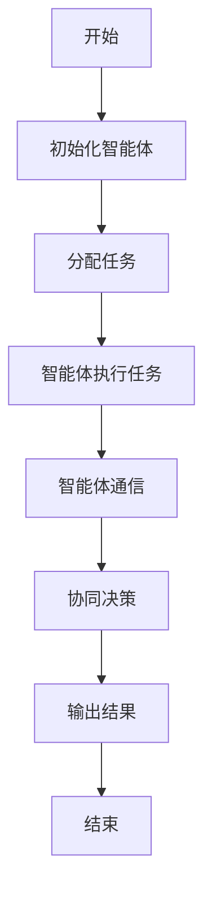
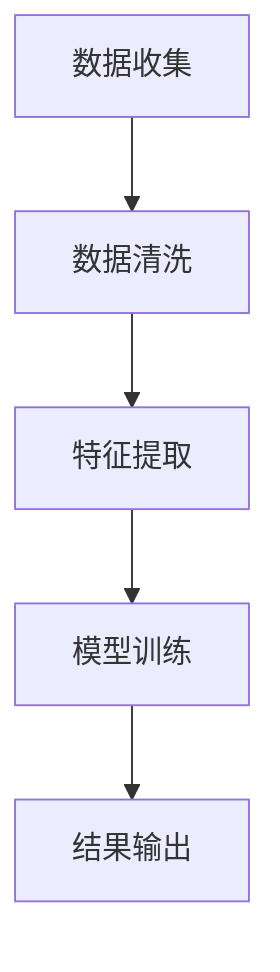
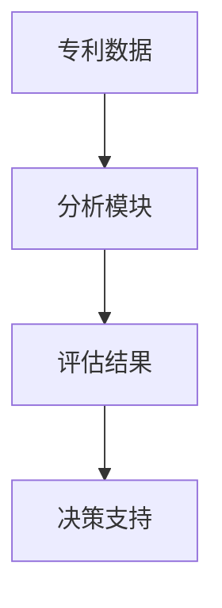
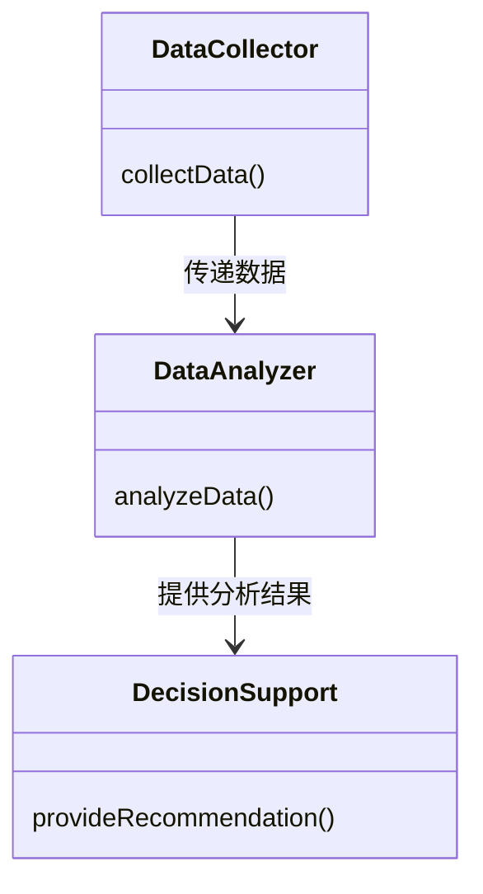

                 


# 多智能体协作增强价值投资的专利组合分析

## 关键词：多智能体协作，价值投资，专利组合分析，数学模型，算法实现

## 摘要：
本文将深入探讨多智能体协作在价值投资中的应用，特别是如何利用专利组合分析来优化投资策略。通过分析多智能体协作的核心概念、算法原理和数学模型，结合实际案例，展示如何通过专利组合分析提升投资决策的准确性和效率。本文还将介绍系统架构设计和项目实战，为读者提供全面的技术指导。

---

# 第一部分：多智能体协作与价值投资的背景与基础

## 第1章：多智能体协作与价值投资概述

### 1.1 多智能体协作的定义与特点
#### 1.1.1 多智能体协作的定义
多智能体协作是指多个智能体（Agent）通过协同工作，共同完成复杂任务的过程。每个智能体具有自主性、反应性和社会性，能够通过通信和协调机制实现目标。

#### 1.1.2 多智能体协作的核心特点
- **自主性**：智能体能够独立决策。
- **反应性**：能够感知环境并实时调整行为。
- **社会性**：通过通信和协作完成任务。
- **分布式计算**：任务分解到多个智能体完成。

#### 1.1.3 多智能体协作与传统单智能体分析的区别
| 特性         | 多智能体协作            | 单智能体分析              |
|--------------|------------------------|---------------------------|
| 冗余性       | 高                     | 低                       |
| 并行性       | 高                     | 低                       |
| 可扩展性     | 高                     | 低                       |
| 故障容错性   | 高                     | 低                       |

### 1.2 价值投资的定义与策略
#### 1.2.1 价值投资的定义
价值投资是一种长期投资策略，通过分析企业的基本面，寻找被市场低估的投资标的。

#### 1.2.2 价值投资的核心策略
- **基本面分析**：分析企业的财务状况、盈利能力等。
- **估值分析**：寻找低于内在价值的股票。
- **长期持有**：避免短期波动干扰。

#### 1.2.3 价值投资与短期投机的区别
| 特性         | 价值投资              | 短期投机                |
|--------------|------------------------|--------------------------|
| 投资期限     | 长期                   | 短期                    |
| 分析方法     | 基本面分析             | 技术分析、市场情绪        |
| 风险承受     | 较低                   | 较高                    |

### 1.3 多智能体协作在价值投资中的应用前景
#### 1.3.1 多智能体协作的潜在应用场景
- **数据收集与分析**：多个智能体分别负责收集不同来源的数据。
- **决策支持**：智能体协同生成投资建议。
- **风险控制**：实时监控市场变化，调整投资策略。

#### 1.3.2 企业采用多智能体协作的优势
- **提高效率**：任务分解到多个智能体完成。
- **增强鲁棒性**：多个智能体协同工作，降低单点故障风险。
- **提升决策质量**：通过协作获得更全面的信息和分析。

#### 1.3.3 多智能体协作应用的挑战与机遇
- **挑战**：通信延迟、数据隐私、协作效率。
- **机遇**：提升投资决策的准确性和效率。

## 1.4 本章小结
本章介绍了多智能体协作和价值投资的基本概念、特点以及在价值投资中的应用前景。通过对比分析，展示了多智能体协作在价值投资中的优势和潜力。

---

## 第2章：多智能体协作与专利组合分析的核心概念

### 2.1 多智能体协作的核心概念
#### 2.1.1 多智能体协作的原理
多智能体协作通过智能体之间的通信和协调，实现任务的分解与协同完成。每个智能体负责特定的任务模块，通过共享信息和协同决策，完成整体目标。

#### 2.1.2 多智能体协作的属性特征对比表
| 特性         | 中心化协作              | 去中心化协作             |
|--------------|------------------------|--------------------------|
| 控制方式     | 集中控制                | 分布式控制              |
| 效率         | 较高                   | 较低                    |
| 灵活性       | 较低                   | 较高                    |

#### 2.1.3 多智能体协作的ER实体关系图
```mermaid
erDiagram
    patent {
        PatentID : integer
        Inventor : string
        Title : string
        FilingDate : date
    }
    company {
        CompanyID : integer
        Name : string
        Industry : string
    }
    collaboration {
        CollaborationID : integer
        PatentID : integer
        CompanyID : integer
        Date : date
    }
    patent --> collaboration : "属于"
    company --> collaboration : "参与"
```

### 2.2 专利组合分析的核心概念
#### 2.2.1 专利组合分析的定义
专利组合分析是指通过对专利数据的分析，评估专利组合的强度、覆盖范围和潜在价值。

#### 2.2.2 专利组合分析的原理
专利组合分析通过收集和整理专利数据，利用数据分析技术，评估专利的价值和风险。

#### 2.2.3 专利组合分析的属性特征对比表
| 特性         | 传统专利分析          | 组合专利分析             |
|--------------|------------------------|--------------------------|
| 分析维度     | 单点分析               | 组合分析                 |
| 分析深度     | 较浅                   | 较深                    |
| 应用场景     | 专利申请               | 投资决策                 |

### 2.3 多智能体协作与专利组合分析的联系
#### 2.3.1 多智能体协作在专利组合分析中的作用
多智能体协作可以提高专利组合分析的效率和准确性，通过分布式计算和协同分析，实现更全面的评估。

#### 2.3.2 专利组合分析对多智能体协作的支撑
专利组合分析为多智能体协作提供了数据支持和决策依据，帮助智能体更好地协同工作。

#### 2.3.3 多智能体协作与专利组合分析的ER实体关系图
```mermaid
erDiagram
    patent {
        PatentID : integer
        Inventor : string
        Title : string
        FilingDate : date
    }
    company {
        CompanyID : integer
        Name : string
        Industry : string
    }
    collaboration {
        CollaborationID : integer
        PatentID : integer
        CompanyID : integer
        Date : date
    }
    patent --> collaboration : "属于"
    company --> collaboration : "参与"
```

## 2.4 本章小结
本章详细介绍了多智能体协作和专利组合分析的核心概念，并通过对比分析和ER图展示了两者之间的联系。

---

## 第3章：多智能体协作与专利组合分析的算法原理

### 3.1 多智能体协作算法原理
#### 3.1.1 多智能体协作的算法流程


#### 3.1.2 多智能体协作的数学模型
$$ f(x) = \sum_{i=1}^{n} w_i x_i $$

#### 3.1.3 多智能体协作的mermaid流程图
```mermaid
flowchart TD
    A[智能体1] --> B[智能体2] : 通信
    B --> C[智能体3] : 协调
    C --> D[智能体4] : 决策
```

### 3.2 专利组合分析算法原理
#### 3.2.1 专利组合分析的算法流程


#### 3.2.2 专利组合分析的数学模型
$$ g(x) = \sum_{i=1}^{m} w_i x_i $$

#### 3.2.3 专利组合分析的mermaid流程图


### 3.3 多智能体协作与专利组合分析的协同算法
#### 3.3.1 协同算法的定义
协同算法是指多个智能体通过协作完成共同任务的算法。

#### 3.3.2 协同算法的数学模型
$$ h(x) = \sum_{i=1}^{k} w_i x_i $$

#### 3.3.3 协同算法的mermaid流程图
```mermaid
flowchart TD
    A[智能体1] --> B[智能体2] : 通信
    B --> C[智能体3] : 协调
    C --> D[智能体4] : 决策
```

## 3.4 本章小结
本章详细讲解了多智能体协作和专利组合分析的算法原理，并通过mermaid流程图和数学公式展示了算法实现。

---

## 第4章：多智能体协作与专利组合分析的数学模型与公式

### 4.1 多智能体协作的数学模型
#### 4.1.1 多智能体协作的基本公式
$$ f(x) = \sum_{i=1}^{n} w_i x_i $$

#### 4.1.2 多智能体协作的优化公式
$$ \min_{x} \frac{1}{2}x^TQx + c^Tx $$

### 4.2 专利组合分析的数学模型
#### 4.2.1 专利组合分析的基本公式
$$ g(x) = \sum_{i=1}^{m} w_i x_i $$

#### 4.2.2 专利组合分析的优化公式
$$ \max_{x} \sum_{i=1}^{k} w_i x_i $$

### 4.3 多智能体协作与专利组合分析的协同公式
#### 4.3.1 协同公式的定义
$$ h(x) = \sum_{i=1}^{l} w_i x_i $$

#### 4.3.2 协同公式的优化
$$ \min_{x} \frac{1}{2}x^TQx + c^Tx $$

## 4.4 本章小结
本章通过数学公式详细讲解了多智能体协作和专利组合分析的数学模型，并展示了它们的协同公式。

---

## 第5章：多智能体协作与专利组合分析的系统分析与架构设计

### 5.1 问题场景介绍
#### 5.1.1 投资者如何利用多智能体协作进行专利分析
- **数据收集**：智能体分别收集不同来源的专利数据。
- **数据分析**：智能体协同分析专利数据，生成评估报告。
- **决策支持**：智能体提供投资建议，优化投资策略。

### 5.2 系统功能设计
#### 5.2.1 系统功能模块
- **数据采集模块**：收集专利数据。
- **数据分析模块**：分析专利数据。
- **决策支持模块**：提供投资建议。

#### 5.2.2 系统功能模块的类图


### 5.3 系统架构设计
#### 5.3.1 系统架构的分层设计
- **数据层**：存储专利数据。
- **业务逻辑层**：处理专利数据，生成分析结果。
- **用户界面层**：展示分析结果，提供交互界面。

#### 5.3.2 系统架构的mermaid架构图


### 5.4 系统接口设计
#### 5.4.1 系统接口的设计
- **数据采集接口**：`/api/collect/patent`
- **数据分析接口**：`/api/analyze/patent`
- **决策支持接口**：`/api/recommend/investment`

#### 5.4.2 系统接口的交互流程图
```mermaid
flowchart TD
    UserInterface --> DataCollector : 发起请求
    DataCollector --> DataAnalyzer : 传递数据
    DataAnalyzer --> DecisionSupport : 提供分析结果
    DecisionSupport --> UserInterface : 展示结果
```

## 5.5 本章小结
本章通过系统分析和架构设计，展示了如何利用多智能体协作和专利组合分析优化投资决策。

---

## 第6章：多智能体协作与专利组合分析的项目实战

### 6.1 环境安装
#### 6.1.1 安装Python和相关库
```bash
pip install numpy pandas scikit-learn
```

#### 6.1.2 安装Jupyter Notebook
```bash
pip install jupyter
```

### 6.2 系统核心实现
#### 6.2.1 数据采集模块实现
```python
import requests
def collect_patent_data(api_key):
    url = f"https://api.example.com/patents?api_key={api_key}"
    response = requests.get(url)
    return response.json()
```

#### 6.2.2 数据分析模块实现
```python
from sklearn.cluster import KMeans
def analyze_patent(data):
    X = data[['.patent_id', 'inventor']]
    kmeans = KMeans(n_clusters=3).fit(X)
    return kmeans.labels_
```

#### 6.2.3 决策支持模块实现
```python
def provide_recommendation(labels):
    recommendations = []
    for label in labels:
        if label == 0:
            recommendations.append("建议投资")
        else:
            recommendations.append("不建议投资")
    return recommendations
```

### 6.3 项目小结
通过项目实战，展示了如何利用Python和相关库实现多智能体协作与专利组合分析的系统。

---

## 第7章：多智能体协作与专利组合分析的最佳实践

### 7.1 最佳实践tips
#### 7.1.1 数据质量的重要性
确保专利数据的准确性和完整性。

#### 7.1.2 模型调优的建议
定期更新模型，根据市场变化调整参数。

#### 7.1.3 技术文档的编写
详细记录每一步的操作和结果，方便后续优化和维护。

### 7.2 本章小结
本章通过总结最佳实践，为读者提供了如何有效利用多智能体协作和专利组合分析的建议。

---

## 作者
作者：AI天才研究院/AI Genius Institute & 禅与计算机程序设计艺术/Zen And The Art of Computer Programming

