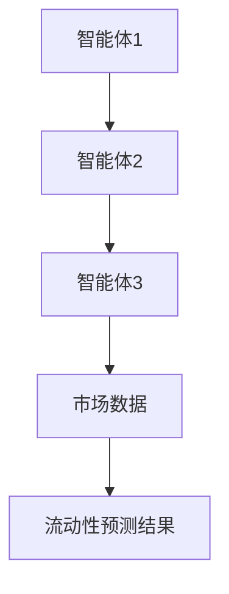
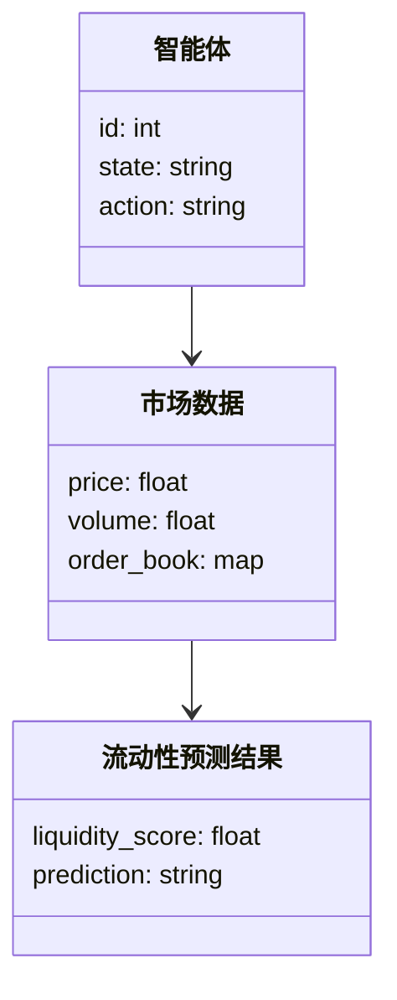
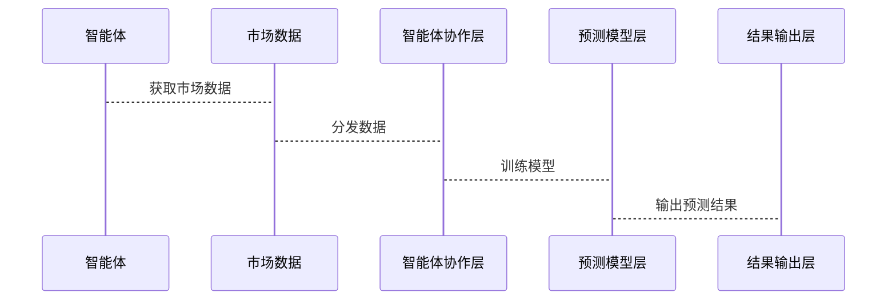

                 


# 多智能体协作增强价值投资的市场流动性预测

> 关键词：多智能体协作，价值投资，市场流动性预测，人工智能，金融数据分析

> 摘要：本文探讨了如何通过多智能体协作技术增强价值投资的市场流动性预测能力。文章从背景介绍、核心概念、算法原理、系统架构到项目实战，全面分析了多智能体协作在金融市场的应用潜力，并通过具体案例展示了其在流动性预测中的实际价值。通过本文的阐述，读者将深入了解如何利用多智能体协作技术优化投资决策，并在实际应用中提升市场流动性预测的准确性和效率。

---

## 第一部分：多智能体协作与价值投资概述

### 第1章：多智能体协作与价值投资概述

#### 1.1 多智能体协作的背景与意义

##### 1.1.1 从单智能体到多智能体的演进
现代金融市场日益复杂，单智能体无法满足多样化的金融需求。多智能体协作通过分布式计算和协同学习，能够更高效地解决复杂问题。

##### 1.1.2 多智能体协作的核心优势
- **分布式计算**：多智能体能够并行处理大量数据，提升计算效率。
- **协同学习**：智能体之间通过协作优化决策，避免个体决策的局限性。
- **鲁棒性**：多智能体系统具有较强的容错性和适应性，能够在复杂环境下稳定运行。

##### 1.1.3 价值投资与市场流动性预测的结合
价值投资注重长期收益，而市场流动性预测则是实现价值投资的重要工具。通过多智能体协作，可以更准确地预测市场流动性，为价值投资提供数据支持。

#### 1.2 市场流动性预测的定义与挑战

##### 1.2.1 市场流动性预测的基本概念
市场流动性是指资产在短时间内以合理价格买卖的能力。流动性预测的核心是分析市场数据，预判未来市场走势。

##### 1.2.2 流动性预测的复杂性与挑战
- **数据多样性**：市场数据包括价格、成交量、订单簿等，数据量大且复杂。
- **非线性关系**：市场参与者的行为具有不确定性，导致流动性预测具有高度非线性。
- **实时性要求**：金融市场对实时性要求高，需要快速响应。

##### 1.2.3 价值投资在流动性预测中的作用
价值投资者通过分析基本面因素，结合流动性预测，能够在市场波动中找到投资机会。

#### 1.3 多智能体协作在金融市场的应用前景

##### 1.3.1 多智能体协作在金融领域的潜力
- **高频交易**：多智能体能够快速处理市场数据，优化交易策略。
- **风险控制**：通过协作，多智能体可以实时监控市场风险，制定应对策略。

##### 1.3.2 价值投资与流动性预测的结合
多智能体协作能够提升流动性预测的精度，从而增强价值投资的决策能力。

##### 1.3.3 未来发展趋势与研究方向
- **智能体协同优化**：研究如何进一步提升智能体之间的协作效率。
- **多模态数据融合**：结合文本、图像等多种数据源，提升预测能力。

#### 1.4 本章小结
本章介绍了多智能体协作的背景、优势及其在金融市场的应用潜力，为后续章节的展开奠定了基础。

---

## 第二部分：多智能体协作的核心概念与联系

### 第2章：多智能体协作的核心概念

#### 2.1 多智能体协作的原理

##### 2.1.1 多智能体系统的定义与特点
- **定义**：多智能体系统是由多个智能体组成的分布式系统，能够通过协作完成特定任务。
- **特点**：智能体具有自主性、反应性、协作性和学习性。

##### 2.1.2 协作行为的实现机制
- **通信机制**：智能体之间通过消息传递进行通信。
- **协调机制**：通过协调算法（如一致性算法）实现任务分配和协作。

##### 2.1.3 智能体之间的通信与协调
- **通信协议**：定义智能体之间的消息格式和交互规则。
- **协调算法**：如分布式一致性算法（Paxos、Raft等）用于协调智能体的行为。

#### 2.2 价值投资与市场流动性预测的关系

##### 2.2.1 价值投资的基本原理
- **基本面分析**：分析公司的财务状况、行业地位等因素，评估其内在价值。
- **长期投资**：注重长期收益，避免短期波动的干扰。

##### 2.2.2 流动性预测对投资决策的影响
- **流动性风险**：流动性不足可能导致资产难以变现，增加投资风险。
- **流动性机会**：通过预测流动性变化，抓住市场波动带来的投资机会。

##### 2.2.3 多智能体协作如何增强价值投资的效果
- **数据融合**：多智能体能够整合多种数据源，提供更全面的市场分析。
- **协同决策**：通过协作，智能体能够综合考虑多种因素，制定更优的投资策略。

#### 2.3 多智能体协作与市场流动性预测的实体关系图



---

## 第三部分：多智能体协作的算法原理

### 第3章：多智能体协作的算法原理

#### 3.1 多智能体强化学习算法

##### 3.1.1 多智能体强化学习的基本概念
- **定义**：多智能体强化学习是指多个智能体在共享环境中通过协作学习策略，以最大化集体奖励。
- **特点**：智能体之间通过协作实现全局目标，而非个体目标。

##### 3.1.2 基于Q-learning的多智能体协作
- **Q-learning算法**：通过智能体与环境的交互，更新Q值表，实现策略优化。
- **分布式Q-learning**：多个智能体分别维护自己的Q值表，通过通信共享信息。

##### 3.1.3 集中式与分布式多智能体学习的区别
- **集中式**：所有智能体共享同一个Q值表，适用于简单环境。
- **分布式**：每个智能体维护自己的Q值表，适用于复杂环境。

#### 3.2 价值网络模型

##### 3.2.1 价值网络模型的定义
- **定义**：价值网络模型是一种基于神经网络的预测模型，用于评估市场流动性。
- **输入**：市场数据（如价格、成交量、订单簿等）。
- **输出**：流动性预测结果。

##### 3.2.2 模型的输入与输出
- **输入**：多智能体协同处理后的市场数据。
- **输出**：预测的市场流动性指标（如买卖价差、成交额等）。

##### 3.2.3 模型的训练过程
- **训练数据**：历史市场数据。
- **训练目标**：最小化预测误差，优化模型性能。

#### 3.3 流动性预测的数学模型

##### 3.3.1 流动性预测的基本公式
$$
\text{流动性} = f(\text{价格}, \text{成交量}, \text{订单簿深度})
$$

##### 3.3.2 基于神经网络的流动性预测模型
$$
L(t) = \sigma(W_1 \cdot X(t) + W_2 \cdot H(t-1))
$$
其中：
- \( L(t) \) 表示第 \( t \) 时刻的流动性预测值。
- \( X(t) \) 表示输入特征向量。
- \( H(t-1) \) 表示前一时刻的隐藏层状态。
- \( \sigma \) 表示sigmoid函数。

---

## 第四部分：系统分析与架构设计

### 第4章：系统分析与架构设计

#### 4.1 系统功能设计

##### 4.1.1 领域模型（类图）


#### 4.2 系统架构设计

##### 4.2.1 系统架构图


#### 4.3 系统接口设计

##### 4.3.1 智能体协作接口
- **输入**：市场数据。
- **输出**：协作后的预测结果。

##### 4.3.2 预测模型接口
- **输入**：智能体协作数据。
- **输出**：流动性预测结果。

#### 4.4 系统交互设计

##### 4.4.1 交互流程图


---

## 第五部分：项目实战

### 第5章：项目实战

#### 5.1 环境安装

##### 5.1.1 安装依赖
- **Python**：3.8+
- **TensorFlow**：2.0+
- **Mermaid**：用于绘制图表。

#### 5.2 核心代码实现

##### 5.2.1 多智能体协作代码
```python
class Agent:
    def __init__(self, id):
        self.id = id
        self.state = None
        self.action = None

    def receive_message(self, message):
        self.state = message

    def send_message(self):
        return self.state
```

##### 5.2.2 流动性预测模型代码
```python
import tensorflow as tf
from tensorflow.keras import layers

model = tf.keras.Sequential([
    layers.Dense(64, activation='relu'),
    layers.Dense(1, activation='sigmoid')
])
model.compile(optimizer='adam', loss='binary_crossentropy')
```

#### 5.3 案例分析与解读

##### 5.3.1 实际案例分析
- **数据来源**：某股票的历史交易数据。
- **预测结果**：模型预测该股票的流动性变化。

##### 5.3.2 代码应用解读
- **数据预处理**：清洗和归一化市场数据。
- **模型训练**：使用历史数据训练流动性预测模型。
- **结果分析**：评估模型的预测精度和实际应用效果。

#### 5.4 项目小结
通过实际案例分析，验证了多智能体协作在市场流动性预测中的有效性，并展示了其在价值投资中的潜在价值。

---

## 第六部分：最佳实践与总结

### 第6章：最佳实践与总结

#### 6.1 最佳实践 tips

##### 6.1.1 系统设计建议
- **模块化设计**：确保系统各模块独立性，便于维护和扩展。
- **容错机制**：设计智能体协作系统时，需考虑节点故障的容错机制。

##### 6.1.2 模型优化建议
- **超参数调优**：通过网格搜索或随机搜索优化模型性能。
- **数据增强**：增加数据多样性，提升模型的泛化能力。

#### 6.2 小结
本文通过理论分析和实践案例，全面探讨了多智能体协作在市场流动性预测中的应用，展示了其在价值投资中的潜力和优势。

#### 6.3 注意事项
- **数据隐私**：确保市场数据的安全性和隐私性。
- **模型实时性**：优化模型的计算效率，满足金融市场的实时性要求。

#### 6.4 拓展阅读
- **多智能体系统**：进一步学习多智能体系统的核心理论和应用。
- **强化学习**：深入研究强化学习在金融领域的应用。

---

## 作者信息

作者：AI天才研究院/AI Genius Institute  
& 禅与计算机程序设计艺术 /Zen And The Art of Computer Programming

