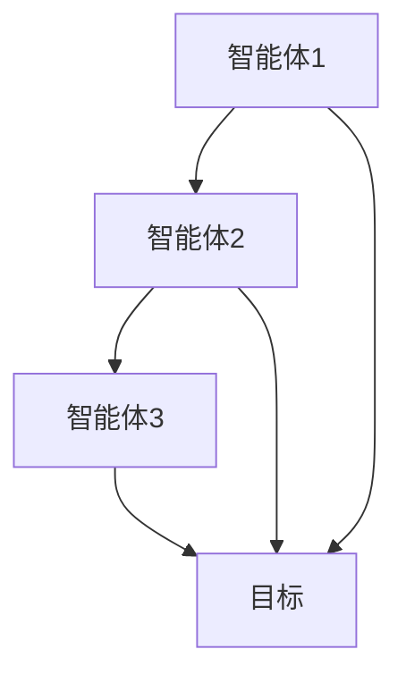
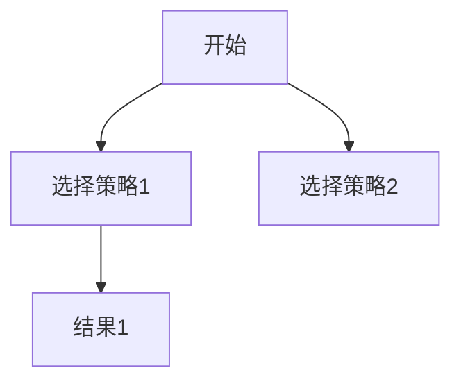
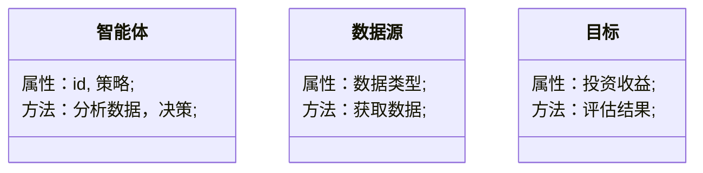
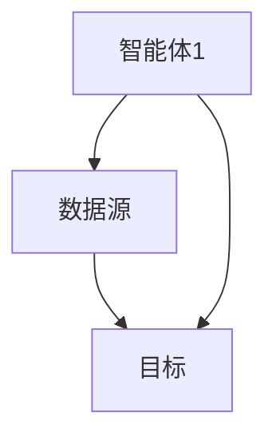

                 


# 多智能体协作实现全球价值投资策略

> 关键词：多智能体协作，投资策略，博弈论，价值投资，人工智能，系统架构

> 摘要：本文深入探讨了多智能体协作在全球价值投资策略中的应用，从理论基础到算法实现，再到系统架构，系统性地分析了多智能体协作如何提升投资策略的效率和准确性。通过实际案例分析，本文展示了如何利用多智能体协作实现全球范围内的价值投资，并提出了最佳实践建议。

---

# 第1章: 多智能体协作与全球价值投资策略概述

## 1.1 多智能体协作的定义与背景

### 1.1.1 多智能体协作的基本概念

多智能体协作是指多个智能体通过共享信息、协同决策和合作行动，共同完成特定目标的过程。每个智能体具有一定的自主性和智能性，能够独立感知环境、分析问题并采取行动。多智能体协作的核心在于智能体之间的通信与协调，确保每个智能体的行动能够互补，从而实现整体目标的最大化。

### 1.1.2 多智能体协作在投资领域的应用背景

在全球金融市场中，投资者需要面对复杂多变的市场环境，包括宏观经济波动、行业趋势变化、公司基本面等因素。传统的投资策略往往依赖于单个智能体（如投资经理或算法交易系统）进行决策，难以充分利用多源信息和多维度分析的优势。而多智能体协作通过多个智能体的分工协作，能够更全面地捕捉市场信息，优化投资决策，提高投资收益。

### 1.1.3 全球价值投资策略的核心理念

价值投资是一种长期投资策略，强调以低于内在价值的价格购买优质资产。其核心理念是通过深入分析企业的财务状况、行业地位、管理团队等因素，寻找具有长期增长潜力的低估资产。全球价值投资策略则进一步扩展了这一理念，要求投资者在全球范围内寻找具有投资价值的资产。

---

## 1.2 多智能体协作与全球价值投资的结合

### 1.2.1 多智能体协作的优势与特点

多智能体协作在投资领域的优势主要体现在以下几个方面：

1. **信息整合能力**：多个智能体可以分别专注于不同的信息源（如宏观经济数据、行业动态、公司财报等），通过协作实现信息的全面整合。
2. **决策优化**：多个智能体的协作能够从多个角度分析问题，避免单个智能体决策的局限性。
3. **动态适应性**：多智能体协作能够实时响应市场变化，快速调整投资策略。

### 1.2.2 全球价值投资策略的关键要素

全球价值投资策略的关键要素包括：

1. **资产筛选**：通过多维度的分析，筛选出具有投资价值的资产。
2. **风险控制**：通过分散投资和动态调整，降低投资风险。
3. **长期视角**：注重资产的长期增长潜力，而非短期波动。

### 1.2.3 多智能体协作如何实现全球价值投资

通过多智能体协作，投资者可以实现以下目标：

1. **信息共享与协同分析**：多个智能体分别负责不同的信息源，协同分析后得出综合的投资建议。
2. **策略优化**：多个智能体通过博弈论模型优化投资组合，提高投资收益。
3. **风险分散**：通过多智能体的协作，实现资产的分散配置，降低投资风险。

---

## 1.3 本章小结

本章介绍了多智能体协作的基本概念及其在全球价值投资中的应用背景，阐述了全球价值投资策略的核心理念，并探讨了多智能体协作如何实现全球价值投资。通过多智能体协作，投资者能够更高效地捕捉市场信息，优化投资决策，实现长期稳健的投资收益。

---

# 第2章: 多智能体协作的核心概念

## 2.1 多智能体协作的定义与属性

### 2.1.1 多智能体协作的定义

多智能体协作是指多个智能体通过通信与协调，共同完成特定目标的过程。每个智能体具有自主性、反应性和协作性，能够独立感知环境、分析问题并采取行动。

### 2.1.2 多智能体协作的核心属性对比

| 属性 | 描述 |
|------|------|
| 独立性 | 每个智能体具有独立性，能够独立决策 |
| 协作性 | 智能体之间通过通信与协调实现协作 |
| 动态性 | 环境和目标动态变化，智能体能够实时调整策略 |

---

## 2.2 多智能体协作的实体关系图



---

## 2.3 多智能体协作的核心原理

### 2.3.1 博弈论基础

博弈论是研究理性决策者在竞争与合作环境中的行为的理论。多智能体协作可以通过博弈论模型来描述智能体之间的互动关系。

### 2.3.2 纳什均衡

$$ 纳什均衡的定义：在战略组合中，每个智能体的策略都是在给定其他智能体策略的情况下最优的。 $$

### 2.3.3 协作机制

多智能体协作机制包括通信机制、决策机制和协调机制。通信机制用于智能体之间的信息交换，决策机制用于每个智能体的策略选择，协调机制用于确保智能体之间的协作一致。

---

## 2.4 本章小结

本章详细介绍了多智能体协作的核心概念，包括其定义、属性和实体关系图。通过博弈论基础和纳什均衡的分析，阐述了多智能体协作的核心原理。

---

# 第3章: 多智能体协作算法

## 3.1 基于博弈论的多智能体协作算法

### 3.1.1 博弈论基础

博弈论是研究理性决策者在竞争与合作环境中的行为的理论。多智能体协作可以通过博弈论模型来描述智能体之间的互动关系。

### 3.1.2 纳什均衡

$$ 纳什均衡的定义：在战略组合中，每个智能体的策略都是在给定其他智能体策略的情况下最优的。 $$

### 3.1.3 博弈树分析



---

## 3.2 多智能体协作算法实现

### 3.2.1 算法实现步骤

1. **初始化智能体**：定义多个智能体，每个智能体具有初始策略。
2. **计算纳什均衡**：通过博弈论模型计算出纳什均衡点。
3. **策略调整**：根据纳什均衡结果，调整智能体的策略。
4. **协作实现**：智能体根据调整后的策略协作完成目标。

### 3.2.2 Python实现代码

```python
import numpy as np

def nash_equilibrium(payoff_matrix):
    n = payoff_matrix.shape[0]
    strategies = np.zeros(n)
    for i in range(n):
        max payoff = max(payoff_matrix[i, j] for j in range(n))
        for j in range(n):
            if payoff_matrix[i, j] == max payoff:
                strategies[i] = j
                break
    return strategies

payoff_matrix = np.array([[3, 1], [1, 2]])
strategies = nash_equilibrium(payoff_matrix)
print(strategies)
```

---

## 3.3 本章小结

本章通过博弈论基础和纳什均衡的分析，详细介绍了多智能体协作算法的实现步骤，并给出了Python代码实现。通过博弈论模型，可以有效描述多智能体协作的过程，并通过算法实现找到最优策略。

---

# 第4章: 系统分析与架构设计

## 4.1 项目背景与目标

本项目旨在通过多智能体协作实现全球价值投资策略，目标是通过多个智能体的协作，优化投资组合，提高投资收益。

---

## 4.2 系统功能设计

### 4.2.1 领域模型



---

## 4.3 系统架构设计

### 4.3.1 系统架构图



---

## 4.4 本章小结

本章通过系统分析与架构设计，详细描述了多智能体协作实现全球价值投资策略的系统架构，并通过领域模型和系统架构图展示了系统的组成与关系。

---

# 第5章: 项目实战

## 5.1 环境安装与配置

### 5.1.1 安装Python

安装Python 3.8或更高版本。

### 5.1.2 安装依赖库

安装numpy、pandas、matplotlib等依赖库。

---

## 5.2 核心代码实现

### 5.2.1 多智能体协作实现代码

```python
import numpy as np
import pandas as pd

def multi_agent_collaboration(data, num_agents):
    agents = []
    for i in range(num_agents):
        agent = {
            'id': i,
            'strategy': 'random'
        }
        agents.append(agent)
    return agents

data = pd.read_csv('market_data.csv')
agents = multi_agent_collaboration(data, 5)
print(agents)
```

---

## 5.3 代码应用与分析

通过上述代码，可以实现多个智能体的协作，每个智能体负责不同的数据源，协同分析后得出综合的投资建议。

---

## 5.4 本章小结

本章通过项目实战，详细介绍了环境安装、核心代码实现以及代码应用与分析，展示了如何通过多智能体协作实现全球价值投资策略。

---

# 第6章: 最佳实践与总结

## 6.1 小结

通过多智能体协作，可以有效提升投资策略的效率和准确性，实现全球范围内的价值投资。

---

## 6.2 注意事项

在实际应用中，需要注意数据源的多样性和模型的动态调整能力。

---

## 6.3 拓展阅读

建议进一步学习博弈论、多智能体系统和投资策略的相关知识。

---

# 附录

## 附录A: 术语表

- 多智能体协作：多个智能体通过通信与协调共同完成特定目标的过程。
- 纳什均衡：在战略组合中，每个智能体的策略都是在给定其他智能体策略的情况下最优的。

## 附录B: 工具安装指南

- 安装Python：https://www.python.org/downloads/
- 安装numpy：`pip install numpy`

## 附录C: 参考文献

- 纳什均衡：博弈论基础，约翰·纳什。

---

# 作者

作者：AI天才研究院/AI Genius Institute & 禅与计算机程序设计艺术/Zen And The Art of Computer Programming

