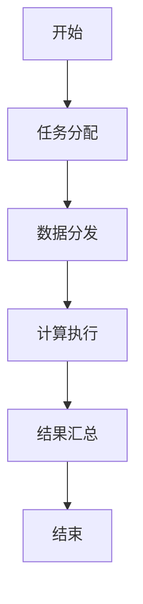
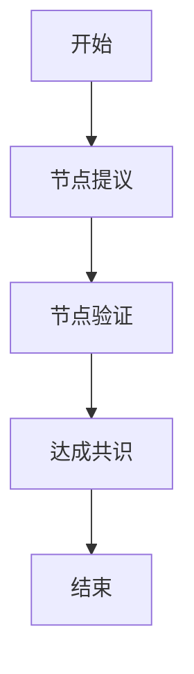
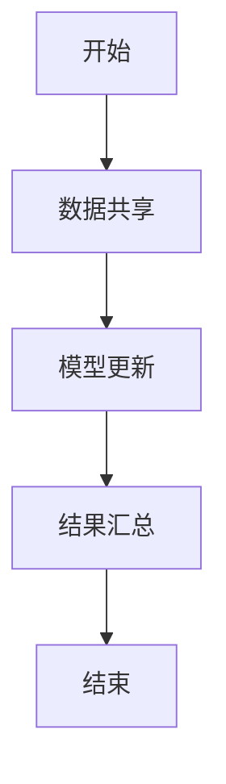
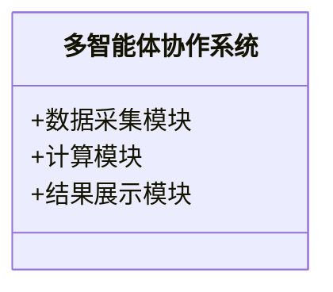
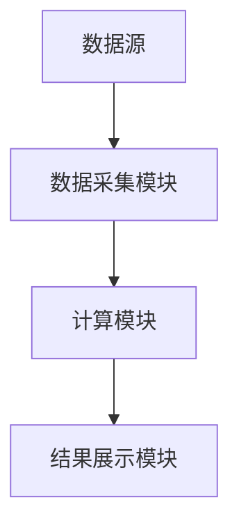
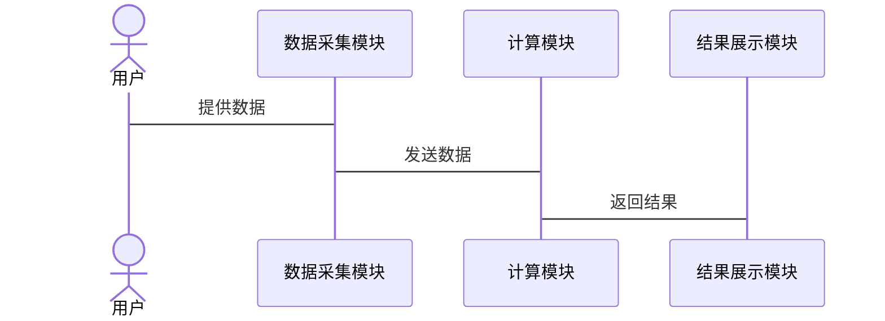

                 


```markdown
# 多智能体协作实现全面的公司价值评估

> 关键词：多智能体协作、公司价值评估、分布式计算、人工智能、算法原理、系统架构设计

> 摘要：本文详细探讨了多智能体协作在公司价值评估中的应用，分析了其核心概念、算法原理和系统架构设计。通过实际案例分析，展示了如何利用多智能体协作技术实现对公司价值的全面评估，提供了最佳实践和系统化的解决方案。

---

# 第一部分: 多智能体协作与公司价值评估背景

# 第1章: 多智能体协作与公司价值评估概述

## 1.1 多智能体协作的背景与意义
### 1.1.1 问题背景介绍
随着企业规模的不断扩大和业务复杂性的增加，传统的单一评估方法已难以满足全面、动态和实时的需求。多智能体协作通过分布式计算和协同学习，提供了更高效的解决方案。

### 1.1.2 问题描述与目标
公司价值评估需要考虑财务、市场、管理等多个维度，传统的评估方法往往存在数据孤岛、计算复杂等问题。多智能体协作的目标是通过协同多个智能体，实现数据的实时同步和高效计算。

### 1.1.3 问题解决思路
采用分布式计算、共识机制和协同学习等技术，构建一个多智能体协作系统，实现对公司各方面的实时评估。

### 1.1.4 边界与外延
明确系统的边界，如数据范围、评估维度等，同时扩展到更广泛的应用场景。

### 1.1.5 核心概念结构与要素
包括多智能体、协作机制、评估指标等核心要素。

## 1.2 多智能体协作的核心概念
### 1.2.1 多智能体协作的基本定义
定义多智能体协作的概念，强调其分布式和协同的特点。

### 1.2.2 公司价值评估的关键要素
包括财务指标、市场表现、管理效率等。

### 1.2.3 两者的联系与区别
对比多智能体协作与传统评估方法的区别，突出其优势。

## 1.3 多智能体协作框架与方法
### 1.3.1 常见的协作框架介绍
介绍几种典型的多智能体协作框架。

### 1.3.2 各种方法的优缺点对比
通过表格对比不同协作框架的优缺点。

### 1.3.3 选择合适的协作框架
根据具体需求选择合适的框架。

## 1.4 本章小结

---

# 第二部分: 多智能体协作的核心原理与机制

# 第2章: 多智能体协作的原理与机制

## 2.1 多智能体协作的基本原理
### 2.1.1 分布式计算原理
解释分布式计算的基本原理。

### 2.1.2 共识机制原理
介绍共识机制的作用和实现方法。

### 2.1.3 信息同步机制
描述信息同步的过程和方法。

## 2.2 多智能体协作的特征与属性
### 2.2.1 分布式特征
分析其分布式特性。

### 2.2.2 自适应特征
探讨其自适应能力。

### 2.2.3 协作特征
强调其协作性。

## 2.3 多智能体协作的ER实体关系图
```mermaid
erd
actor: 多智能体协作系统
relation: 实体间关系
```

## 2.4 本章小结

---

# 第三部分: 多智能体协作的算法原理与数学模型

# 第3章: 多智能体协作算法原理

## 3.1 分布式计算算法
### 3.1.1 分布式计算的基本原理
解释分布式计算的基本原理。

### 3.1.2 分布式计算的流程图


### 3.1.3 分布式计算的数学模型
$$y = f(x)$$

## 3.2 共识机制算法
### 3.2.1 共识机制的基本原理
介绍共识机制的实现方法。

### 3.2.2 共识机制的流程图


### 3.2.3 共识机制的数学模型
$$P(i) = \sum_{j} \frac{w_j}{\sum w_k} \cdot v_j$$

## 3.3 协作学习算法
### 3.3.1 协作学习的基本原理
解释协作学习的过程。

### 3.3.2 协作学习的流程图


### 3.3.3 协作学习的数学模型
$$f(x) = \sum_{i=1}^{n} w_i x_i$$

## 3.4 本章小结

---

# 第四部分: 系统分析与架构设计

# 第4章: 系统架构设计

## 4.1 系统功能设计
### 4.1.1 功能模块划分
包括数据采集、计算、结果展示等功能模块。

### 4.1.2 功能模块的类图


## 4.2 系统架构设计
### 4.2.1 系统架构图


## 4.3 系统接口设计
### 4.3.1 接口定义
定义系统各模块之间的接口。

### 4.3.2 接口的交互流程
描述接口的交互流程。

## 4.4 系统交互设计
### 4.4.1 交互流程图


## 4.5 本章小结

---

# 第五部分: 项目实战

# 第5章: 项目实战

## 5.1 环境安装与配置
### 5.1.1 环境需求
列出所需的环境和工具。

### 5.1.2 安装步骤
详细说明安装过程。

## 5.2 核心代码实现
### 5.2.1 数据采集模块实现
编写数据采集模块的代码。

### 5.2.2 计算模块实现
实现计算模块的核心算法。

### 5.2.3 结果展示模块实现
编写结果展示模块的代码。

## 5.3 项目案例分析
### 5.3.1 案例背景介绍
介绍实际案例的背景。

### 5.3.2 案例分析与实现
详细分析案例并展示实现过程。

## 5.4 本章小结

---

# 第六部分: 最佳实践与总结

# 第6章: 最佳实践与总结

## 6.1 小结
总结全文的主要内容。

## 6.2 注意事项
列出使用多智能体协作技术时需要注意的事项。

## 6.3 拓展阅读
推荐相关的书籍和资源。

## 6.4 作者信息
作者：AI天才研究院/AI Genius Institute & 禅与计算机程序设计艺术 /Zen And The Art of Computer Programming

---

通过以上目录结构，您可以按照每个章节和小节的详细内容进行展开，构建一篇完整的技术博客文章。
```

