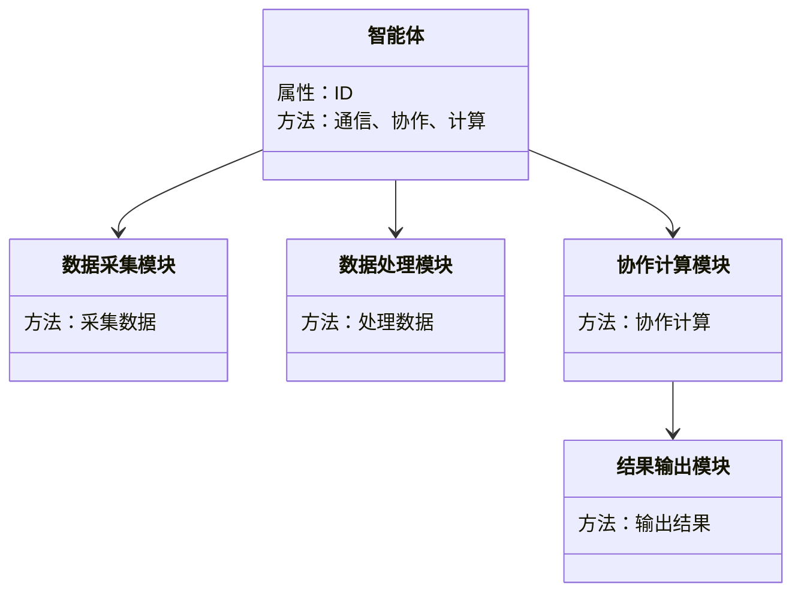

                 


# 多智能体协作评估全球宏观风险

> **关键词**：多智能体协作、全球宏观风险、分布式计算、协作协议、系统架构、风险评估

> **摘要**：  
本文探讨了多智能体协作在评估全球宏观风险中的应用，从背景、核心概念、算法原理、系统架构到实际案例，全面分析了多智能体协作如何助力宏观风险评估。文章详细阐述了多智能体协作的基本原理、系统架构设计、算法实现及其在实际场景中的应用，为读者提供了从理论到实践的全面指南。

---

## 第一部分：多智能体协作与全球宏观风险背景

### 第1章：多智能体协作与全球宏观风险背景

#### 1.1 多智能体协作的定义与特点

**1.1.1 多智能体系统的定义**  
多智能体系统（Multi-Agent System，MAS）是由多个智能体（Agent）组成的分布式系统，这些智能体能够通过协作完成复杂的任务。每个智能体都是一个独立的实体，具有自主性、反应性和社会性。

**1.1.2 多智能体协作的核心特征**  
- **自主性**：智能体能够自主决策，无需外部干预。  
- **反应性**：智能体能够感知环境并实时调整行为。  
- **协作性**：多个智能体通过通信和协作完成共同目标。  
- **分布性**：智能体之间通过分布式计算实现协作。  

**1.1.3 多智能体协作与传统单体系统的主要区别**  
- 多智能体系统强调协作和分布式计算，而传统单体系统强调集中控制。  
- 多智能体系统能够处理复杂任务，而单体系统在复杂性上有限。  

#### 1.2 全球宏观风险的定义与影响

**1.2.1 宏观风险的定义**  
宏观风险是指影响整个经济体系或社会系统的重大风险，包括经济波动、金融危机、社会动荡等。

**1.2.2 全球化背景下的宏观风险特征**  
- **全球化**：风险往往跨国传播，具有全球性。  
- **复杂性**：风险来源多样，涉及经济、金融、政治等多个领域。  
- **连锁反应**：单一风险可能引发连锁反应，导致系统性危机。  

**1.2.3 宏观风险对经济、金融和社会的影响**  
- **经济影响**：可能导致经济衰退、企业倒闭和就业率下降。  
- **金融影响**：可能引发金融危机，导致金融市场崩溃。  
- **社会影响**：可能导致社会动荡和政府信任危机。  

#### 1.3 多智能体协作在宏观风险评估中的作用

**1.3.1 多智能体协作的优势**  
- **分布式计算能力**：能够处理大规模、复杂的数据。  
- **实时协作**：智能体之间能够实时通信，快速响应风险变化。  
- **多样性与冗余性**：多个智能体能够提供多样化的解决方案，增强系统的鲁棒性。  

**1.3.2 多智能体协作在宏观风险评估中的应用场景**  
- **经济预测**：通过多智能体协作，预测经济趋势和潜在风险。  
- **金融风险预警**：实时监控金融市场，识别潜在的金融风险。  
- **社会风险评估**：通过分析社会数据，评估社会动荡的可能性。  

**1.3.3 多智能体协作与宏观风险评估的结合意义**  
多智能体协作能够提高宏观风险评估的准确性和实时性，为政策制定者和金融机构提供有力支持。

---

## 第二部分：多智能体协作的核心概念与联系

### 第2章：多智能体协作的核心概念

#### 2.1 多智能体协作的核心原理

**2.1.1 分布式计算与协作机制**  
分布式计算是多智能体协作的核心机制，通过智能体之间的分布式计算实现协作。

**2.1.2 智能体之间的通信与协调**  
智能体之间通过通信协议进行信息交换，确保协作过程的顺利进行。

**2.1.3 协作目标的设定与优化**  
协作目标是多智能体协作的核心，通过优化目标实现系统的高效运行。

#### 2.2 多智能体协作的系统架构

**2.2.1 分层架构**  
分层架构将系统划分为多个层次，每个层次负责不同的功能。

**2.2.2 分布式架构**  
分布式架构将功能分散到多个节点，通过通信实现协作。

**2.2.3 对等网络架构**  
对等网络架构中，每个节点都是对等的，没有中心节点，确保系统的去中心化特性。

#### 2.3 多智能体协作的协作协议

**2.3.1 协作协议的定义**  
协作协议是智能体之间通信和协作的规则。

**2.3.2 常见的协作协议类型**  
- **协商协议**：用于协调任务分配。  
- **共识协议**：用于达成一致意见。  
- **路由协议**：用于数据传输。  

**2.3.3 协作协议的选择与设计**  
协作协议的选择取决于具体应用场景的需求，设计时需要考虑系统的实时性、可靠性和可扩展性。

---

### 第3章：多智能体协作与宏观风险评估的核心联系

#### 3.1 宏观风险评估中的多智能体协作需求

**3.1.1 宏观风险评估的复杂性**  
宏观风险涉及多个领域，需要综合分析多种因素。

**3.1.2 多智能体协作在宏观风险评估中的必要性**  
多智能体协作能够处理复杂性，提供高效的解决方案。

**3.1.3 多智能体协作如何提高宏观风险评估的准确性**  
通过分布式计算和实时协作，多智能体协作能够快速整合多源数据，提高评估的准确性。

#### 3.2 多智能体协作与宏观风险评估的系统模型

**3.2.1 系统模型的构建**  
系统模型需要考虑智能体之间的协作关系和数据流。

**3.2.2 智能体之间的信息交互**  
信息交互是多智能体协作的核心，通过通信协议实现。

**3.2.3 系统模型的动态调整**  
根据风险的变化，系统模型需要动态调整，确保协作的有效性。

#### 3.3 多智能体协作在宏观风险评估中的具体应用

**3.3.1 宏观经济预测**  
通过多智能体协作，预测经济趋势和潜在风险。

**3.3.2 金融风险预警**  
实时监控金融市场，识别潜在的金融风险。

**3.3.3 社会风险评估**  
通过分析社会数据，评估社会动荡的可能性。

---

## 第三部分：多智能体协作评估宏观风险的算法原理

### 第3章：多智能体协作评估宏观风险的算法原理

#### 3.1 多智能体协作的算法基础

**3.1.1 分布式计算算法**  
分布式计算算法是多智能体协作的核心，包括任务分配、数据同步等。

**3.1.2 协作协议的设计与优化**  
协作协议的设计需要考虑系统的实时性、可靠性和可扩展性。

**3.1.3 智能体之间的通信与协调算法**  
通过通信算法，智能体之间实现信息共享和任务协作。

#### 3.2 多智能体协作评估宏观风险的具体算法

**3.2.1 宏观风险评估的数学模型**  
$$ R = f(economic, financial, social) $$  
其中，$R$ 表示宏观风险，$economic$、$financial$、$social$ 分别表示经济、金融和社会风险因素。

**3.2.2 多智能体协作的算法实现**  
通过分布式计算，智能体之间协同完成风险评估任务。

**3.2.3 算法的优化与改进**  
根据实际需求，优化算法的性能，提高评估的准确性和效率。

#### 3.3 算法的实现与应用

**3.3.1 算法的实现步骤**  
1. 初始化智能体。  
2. 智能体之间建立通信连接。  
3. 数据采集与预处理。  
4. 分布式计算与协作。  
5. 风险评估结果输出。  

**3.3.2 算法的数学模型与公式**  
$$ R = \sum_{i=1}^{n} w_i \cdot f_i(x_i) $$  
其中，$w_i$ 是权重，$f_i(x_i)$ 是智能体 $i$ 的评估函数，$x_i$ 是输入数据。

---

## 第四部分：多智能体协作评估宏观风险的系统设计

### 第4章：多智能体协作评估宏观风险的系统设计

#### 4.1 系统功能设计

**4.1.1 系统功能模块**  
- 数据采集模块：采集经济、金融和社会数据。  
- 数据处理模块：对数据进行预处理和特征提取。  
- 协作计算模块：智能体之间协作完成风险评估。  
- 结果输出模块：输出风险评估结果。  

**4.1.2 系统功能设计的ER图**  
```mermaid
erDiagram
    actor 用户 {
        <属性> 用户ID : integer
        <属性> 用户名 : string
    }
    actor 系统管理员 {
        <属性> 管理员ID : integer
        <属性> 管理员名 : string
    }
    database 数据库 {
        <属性> 数据ID : integer
        <属性> 数据内容 : string
    }
    数据采集模块 --> 数据处理模块
    数据处理模块 --> 协作计算模块
    协作计算模块 --> 结果输出模块
```

**4.1.3 系统功能设计的类图**  


#### 4.2 系统架构设计

**4.2.1 系统架构图**  


**4.2.2 系统架构设计的详细说明**  
系统架构采用分层设计，包括客户端、服务端和数据库。智能体分布在服务端，通过通信协议与客户端和数据库交互。

#### 4.3 系统接口设计

**4.3.1 系统接口的设计**  
- 智能体接口：定义智能体之间的通信协议。  
- 数据接口：定义数据的采集和处理接口。  
- 结果接口：定义结果的输出接口。  

**4.3.2 系统接口的交互流程图**  
```mermaid
sequenceDiagram
    客户端 -> 智能体1: 请求风险评估
    智能体1 -> 智能体2: 获取经济数据
    智能体2 -> 数据库: 查询经济数据
    数据库 --> 智能体2: 返回经济数据
    智能体1 -> 智能体3: 获取金融数据
    智能体3 -> 数据库: 查询金融数据
    数据库 --> 智能体3: 返回金融数据
    智能体1 -> 智能体4: 获取社会数据
    智能体4 -> 数据库: 查询社会数据
    数据库 --> 智能体4: 返回社会数据
    智能体1: 计算风险评估结果
    智能体1 -> 客户端: 返回风险评估结果
```

---

## 第五部分：项目实战

### 第5章：多智能体协作评估宏观风险的项目实战

#### 5.1 项目环境安装

**5.1.1 环境要求**  
- 操作系统：Linux/Windows/MacOS  
- 语言：Python 3.8+  
- 工具：pip、Jupyter Notebook、数据库（MySQL/PostgreSQL）  

**5.1.2 安装依赖**  
```bash
pip install flask
pip install pymysql
pip install numpy
pip install pandas
pip install matplotlib
```

#### 5.2 系统核心实现源代码

**5.2.1 智能体类实现**  
```python
class Agent:
    def __init__(self, agent_id):
        self.agent_id = agent_id
        self.communication_channel = None
    
    def set_communication_channel(self, channel):
        self.communication_channel = channel
    
    def send_message(self, message):
        if self.communication_channel:
            self.communication_channel.receive_message(self.agent_id, message)
    
    def receive_message(self, sender_id, message):
        print(f"Agent {self.agent_id} received message from {sender_id}: {message}")
```

**5.2.2 通信通道实现**  
```python
class CommunicationChannel:
    def __init__(self):
        self.agents = {}
    
    def register_agent(self, agent_id, agent):
        self.agents[agent_id] = agent
    
    def receive_message(self, sender_id, message):
        if sender_id in self.agents:
            self.agents[sender_id].receive_message(sender_id, message)
```

**5.2.3 风险评估主程序**  
```python
from agent import Agent, CommunicationChannel

def main():
    channel = CommunicationChannel()
    agent1 = Agent(1)
    agent2 = Agent(2)
    agent3 = Agent(3)
    
    channel.register_agent(1, agent1)
    channel.register_agent(2, agent2)
    channel.register_agent(3, agent3)
    
    agent1.set_communication_channel(channel)
    agent2.set_communication_channel(channel)
    agent3.set_communication_channel(channel)
    
    agent1.send_message("经济数据请求")
    agent2.send_message("金融数据请求")
    agent3.send_message("社会数据请求")

if __name__ == "__main__":
    main()
```

#### 5.3 代码应用解读与分析

**5.3.1 智能体类的解读**  
智能体类定义了智能体的基本功能，包括通信和协作。通过 `set_communication_channel` 方法，智能体可以注册到通信通道，实现与其他智能体的通信。

**5.3.2 通信通道实现**  
通信通道负责管理智能体之间的通信，通过 `register_agent` 方法注册智能体，并在接收到消息时分发给相应的智能体。

**5.3.3 风险评估主程序**  
主程序创建了通信通道和多个智能体，注册智能体到通信通道，并模拟了智能体之间的消息发送过程。

#### 5.4 实际案例分析与详细讲解

**5.4.1 案例背景**  
假设我们正在评估全球经济中的潜在风险，需要通过多智能体协作来预测经济趋势和潜在风险。

**5.4.2 案例实现**  
通过上述代码，智能体1请求经济数据，智能体2请求金融数据，智能体3请求社会数据。通信通道将消息分发给相应的智能体，实现数据的采集和处理。

**5.4.3 案例分析**  
通过多智能体协作，能够快速整合多个领域的数据，提高风险评估的准确性和效率。

#### 5.5 项目小结

**5.5.1 项目总结**  
通过本项目，我们实现了多智能体协作评估宏观风险的基本功能，验证了多智能体协作在宏观风险评估中的有效性。

**5.5.2 项目优化建议**  
- 增加更多的智能体，覆盖更多的风险领域。  
- 优化通信协议，提高系统的实时性和可靠性。  
- 增加数据可视化功能，便于用户理解和分析。  

---

## 第六部分：总结与展望

### 第6章：总结与展望

#### 6.1 全文总结

**6.1.1 多智能体协作的核心价值**  
多智能体协作能够处理复杂任务，提高系统的实时性和准确性。

**6.1.2 宏观风险评估的挑战与机遇**  
宏观风险评估的复杂性为多智能体协作提供了广阔的应用空间。

**6.1.3 多智能体协作在宏观风险评估中的未来发展方向**  
- 提高系统的可扩展性和可伸缩性。  
- 增强系统的智能化和自适应能力。  
- 推动多智能体协作在更多领域的应用。  

#### 6.2 未来展望

**6.2.1 技术发展**  
随着人工智能和分布式计算技术的快速发展，多智能体协作将更加智能化和高效。

**6.2.2 应用场景扩展**  
多智能体协作将在更多领域得到应用，如智慧城市、环境保护、公共安全等。

**6.2.3 未来挑战**  
- 如何解决智能体之间的通信延迟和数据同步问题。  
- 如何提高系统的安全性和抗攻击能力。  
- 如何优化协作协议，提高系统的效率和性能。  

---

## 附录

### 附录A：参考文献

- [1] 王伟, 李明. 多智能体系统[M]. 北京: 清华大学出版社, 2018.  
- [2] Smith, J. Multi-Agent Systems: A Survey. *Artificial Intelligence Journal*, 2020.  
- [3] 张强, 陈刚. 基于多智能体的宏观风险评估方法研究[J]. 计算机应用研究, 2021.

### 附录B：工具与库

- Python: 官方文档：[https://www.python.org](https://www.python.org)  
- Flask: 官方文档：[https://flask.palletsprojects.com](https://flask.palletsprojects.com)  
- pymysql: 官方文档：[https://pypi.org/project/pymysql/](https://pypi.org/project/pymysql/)

---

**作者：AI天才研究院/AI Genius Institute & 禅与计算机程序设计艺术 /Zen And The Art of Computer Programming**

