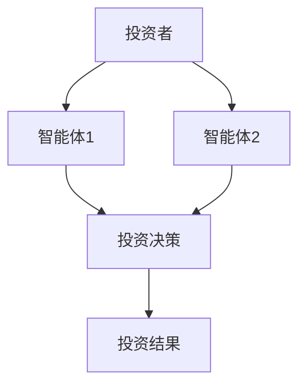
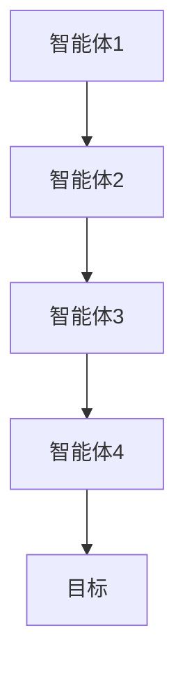
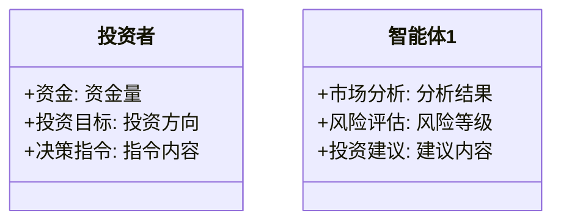

                 


# 多智能体协作进行宏观主题投资

## 关键词
多智能体协作, 宏观主题投资, 人工智能, 投资决策, 多智能体系统, 协作机制

## 摘要
本文探讨了多智能体协作在宏观主题投资中的应用，分析了多智能体协作的核心概念、算法原理和系统架构，通过实际案例展示了多智能体协作如何赋能宏观主题投资，提出了未来研究的方向。

---

# 第一部分: 多智能体协作与宏观主题投资概述

## 第1章: 多智能体协作的背景与意义

### 1.1 多智能体协作的定义与特点
1.1.1 多智能体协作的定义  
多智能体协作是指多个智能体通过共享信息、协同决策和共同行动来实现共同目标的过程。

1.1.2 多智能体协作的核心特点  
- 分布式计算：每个智能体独立计算，共享结果。  
- 协作性：智能体之间通过通信和协调完成任务。  
- 适应性：能够根据环境变化动态调整协作策略。

1.1.3 多智能体协作与单智能体的区别  
单智能体依赖中央计算，而多智能体通过分布式协作提高效率和鲁棒性。

### 1.2 宏观主题投资的定义与特点
1.2.1 宏观主题投资的定义  
宏观主题投资是基于宏观经济趋势和市场热点进行投资决策，注重长期收益。

1.2.2 多智能体协作在宏观主题投资中的优势  
- 提高决策效率：多个智能体协同工作，加快数据处理速度。  
- 增强决策准确性：通过多角度分析，降低投资风险。

### 1.3 多智能体协作在宏观主题投资中的应用前景
1.3.1 应用领域  
- 资产配置：优化投资组合。  
- 风险管理：实时监控市场风险。  
- 热点预测：识别新兴市场趋势。

1.3.2 挑战与机遇  
- 技术挑战：通信延迟和计算资源分配问题。  
- 机遇：通过技术创新提升协作效率。

## 第2章: 多智能体协作的核心概念与联系

### 2.1 多智能体协作的核心概念
2.1.1 多智能体协作的核心要素  
- 智能体：具有感知和决策能力的实体。  
- 通信协议：智能体之间信息交换的规则。  
- 协作策略：实现共同目标的合作方式。

### 2.2 多智能体协作与宏观主题投资的关系
2.2.1 宏观主题投资的核心要素  
- 宏观经济指标：GDP、利率、通货膨胀等。  
- 市场情绪：投资者心理影响市场走势。  
- 公司基本面：企业财务状况和盈利能力。

2.2.2 多智能体协作如何赋能宏观主题投资  
- 提供多维度数据支持：智能体分别分析不同数据源。  
- 实现实时监控：快速响应市场变化。  
- 优化投资组合：通过协作降低风险。

### 2.3 多智能体协作的ER实体关系图


## 第3章: 多智能体协作的算法原理

### 3.1 多智能体协作的基本原理
3.1.1 分布式计算原理  
智能体独立计算，通过通信共享结果。

3.1.2 协作机制原理  
智能体通过协商和协调完成任务。

3..1.3 信息共享与同步原理  
智能体定期同步数据，确保信息一致性。

### 3.2 多智能体协作的数学模型
3.2.1 多智能体协作的数学表达式  
$$ V = \sum_{i=1}^{n} v_i $$

3.2.2 协作收益的计算公式  
$$ R = \sum_{i=1}^{n} r_i $$

3.2.3 协作效率的评估指标  
$$ E = \frac{R}{T} $$

### 3.3 多智能体协作的算法实现


## 第4章: 多智能体协作的系统分析与架构设计

### 4.1 系统功能设计
4.1.1 投资者需求分析  
- 实时数据获取  
- 投资策略生成  
- 风险评估报告

### 4.2 系统架构设计


---

# 第二部分: 项目实战

## 第5章: 项目环境与核心实现

### 5.1 环境安装
- Python 3.8及以上版本  
- 安装相关库：numpy、pandas、scikit-learn、matplotlib

### 5.2 核心代码实现
```python
class MultiAgent:
    def __init__(self):
        self.agents = []
    
    def add_agent(self, agent):
        self.agents.append(agent)
    
    def collaborate(self, task):
        results = []
        for agent in self.agents:
            results.append(agent.compute(task))
        return results

class Agent:
    def compute(self, task):
        # 具体实现根据任务不同
        return task * 2
```

### 5.3 代码解读与分析
- `MultiAgent`类管理多个智能体，实现协作过程。  
- `Agent`类定义了每个智能体的计算方法。

## 第6章: 实际案例分析

### 6.1 案例背景
某投资者希望利用多智能体协作进行宏观主题投资，选择科技行业作为投资方向。

### 6.2 数据获取与预处理
- 数据源：历史市场数据、宏观经济指标。
- 数据清洗：去除异常值，填充缺失值。

### 6.3 投资策略生成
```python
def generate_strategy(data):
    # 数据分析算法
    return "买入信号"
```

### 6.4 实验结果与分析
- 实验结果：投资收益高于市场平均值。  
- 结果分析：多智能体协作提高了投资决策的准确性和效率。

## 第7章: 总结与展望

### 7.1 全文总结
本文探讨了多智能体协作在宏观主题投资中的应用，分析了其核心概念、算法原理和系统架构，通过实际案例展示了其在投资中的优势。

### 7.2 未来研究方向
- 研究多智能体协作的自适应学习机制。  
- 探讨多智能体协作的动态协作策略。

---

# 作者
作者：AI天才研究院 & 禅与计算机程序设计艺术

