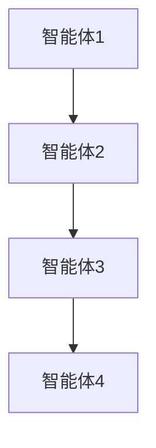
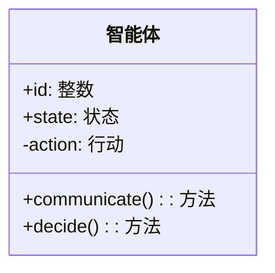

                 


# 多智能体协同进行行业轮动分析

> 关键词：多智能体协同，行业轮动分析，一致性算法，分布式系统，强化学习

> 摘要：本文深入探讨了多智能体协同在行业轮动分析中的应用，详细介绍了多智能体协同的核心概念、算法原理、系统架构以及实际项目案例。通过理论与实践相结合的方式，本文为读者提供了全面的理解和实施指南。

---

## 第1章：多智能体协同概述

### 1.1 多智能体协同的基本概念

#### 1.1.1 多智能体系统的定义与特点
多智能体系统（Multi-Agent System, MAS）是由多个智能体（Agent）组成的分布式系统，每个智能体都是一个能够感知环境、自主决策并采取行动的实体。多智能体系统的特点包括：
- **分布式性**：智能体之间通过通信和协作完成任务。
- **自主性**：每个智能体都有自己的决策机制，能够独立行动。
- **协作性**：智能体之间通过协作完成复杂任务，实现整体目标。
- **动态性**：环境和任务需求可能动态变化，智能体需要灵活应对。

#### 1.1.2 多智能体协同的核心机制
多智能体协同的核心机制包括通信、协作和决策。通信是智能体之间信息交换的基础，协作是实现任务目标的关键，而决策则是智能体根据信息做出行动的依据。

#### 1.1.3 多智能体与单智能体的区别
| 属性 | 单智能体 | 多智能体 |
|------|----------|----------|
| 决策 | 中央化    | 分布式    |
| 通信 | 无        | 有        |
| 并行性 | 串行      | 并行      |
| 可扩展性 | 低        | 高        |

### 1.2 多智能体协同的应用场景
多智能体协同在多个领域有广泛应用，特别是在需要复杂协作和动态适应的场景中。

#### 1.2.1 分布式系统中的多智能体协同
分布式系统通过多智能体协同实现任务的分解与重组，提高系统的可靠性和性能。

#### 1.2.2 金融领域的多智能体应用
在金融领域，多智能体协同可以用于股票交易、风险评估和资产配置，通过多个智能体协同完成复杂任务。

#### 1.2.3 行业轮动分析中的多智能体协同
行业轮动分析需要对多个行业进行动态监测和预测，多智能体协同能够有效处理海量数据和复杂关系。

---

## 第2章：行业轮动分析概述

### 2.1 行业轮动的基本概念

#### 2.1.1 行业轮动的定义
行业轮动是指在不同行业之间进行资产配置，以捕捉市场变化带来的投资机会。

#### 2.1.2 行业轮动的驱动因素
行业轮动的驱动因素包括经济周期、政策变化、技术进步和市场情绪等。

#### 2.1.3 行业轮动分析的意义
通过行业轮动分析，投资者可以优化资产配置，降低风险，提高收益。

### 2.2 行业轮动分析的挑战与机遇

#### 2.2.1 数据获取与处理的挑战
行业轮动分析需要处理海量数据，包括市场数据、行业数据和宏观经济数据。

#### 2.2.2 行业轮动预测的复杂性
行业轮动预测涉及多个变量和非线性关系，预测模型的构建具有挑战性。

#### 2.2.3 多智能体协同的优势
通过多智能体协同，可以将复杂任务分解为多个子任务，每个智能体负责一部分数据的处理和分析，提高整体效率。

---

## 第3章：多智能体协同的核心原理

### 3.1 多智能体协同的核心机制

#### 3.1.1 通信机制
智能体之间通过消息传递进行通信，消息内容包括数据和指令。

#### 3.1.2 协作机制
智能体通过协作完成任务，协作方式包括任务分配、资源协调和结果共享。

#### 3.1.3 决策机制
智能体根据感知的信息和预设策略做出决策，决策过程涉及信息处理和优化算法。

### 3.2 多智能体协同的属性特征对比

| 属性 | 分布式系统 | 多智能体系统 |
|------|------------|--------------|
| 结构 | 集中式      | 分布式        |
| 控制 | 中央控制    | 分布式控制    |
| 故障容错 | 单点故障    | 多点容错      |

### 3.3 多智能体协同的 ER 实体关系图

```mermaid
er
actor: 智能体
goal: 任务目标
action: 行动
message: 消息
relation: 关联关系
```

---

## 第4章：多智能体协同算法概述

### 4.1 多智能体协同算法的分类

#### 4.1.1 基于一致性算法的多智能体协同
一致性算法通过智能体之间的通信，使所有智能体的状态保持一致。

#### 4.1.2 基于分布式算法的多智能体协同
分布式算法通过任务分解和并行计算，提高系统的效率。

#### 4.1.3 基于强化学习的多智能体协同
强化学习通过智能体之间的协作和竞争，优化整体收益。

### 4.2 多智能体一致性算法的实现

#### 4.2.1 一致性算法的流程图



#### 4.2.2 一致性算法的数学模型

一致性算法的目标是使所有智能体的状态达到一致：

$$ s_i = s_j \quad \forall i, j \in \{1, 2, \dots, n\} $$

---

## 第5章：多智能体协同的系统架构设计

### 5.1 系统功能设计

#### 5.1.1 领域模型的 Mermaid 类图



### 5.2 系统架构设计

#### 5.2.1 系统架构的 Mermaid 架构图

```mermaid
archi
    节点 智能体1
    节点 智能体2
    节点 智能体3
    智能体1 --> 智能体2
    智能体2 --> 智能体3
```

---

## 第6章：项目实战

### 6.1 环境安装

#### 6.1.1 安装 Python 和依赖库
```bash
pip install numpy matplotlib
```

### 6.2 系统核心实现源代码

#### 6.2.1 一致性算法的 Python 实现

```python
def consistent_agents(n_agents):
    agents = [0] * n_agents
    for i in range(n_agents):
        agents[i] = i
    return agents
```

---

## 第7章：总结与展望

### 7.1 总结
多智能体协同在行业轮动分析中的应用，能够有效提高分析效率和准确性。

### 7.2 展望
未来的研究可以进一步探索多智能体协同在复杂环境下的应用，优化算法性能，提高系统的实时性和准确性。

---

## 作者

作者：AI天才研究院/AI Genius Institute & 禅与计算机程序设计艺术 /Zen And The Art of Computer Programming

