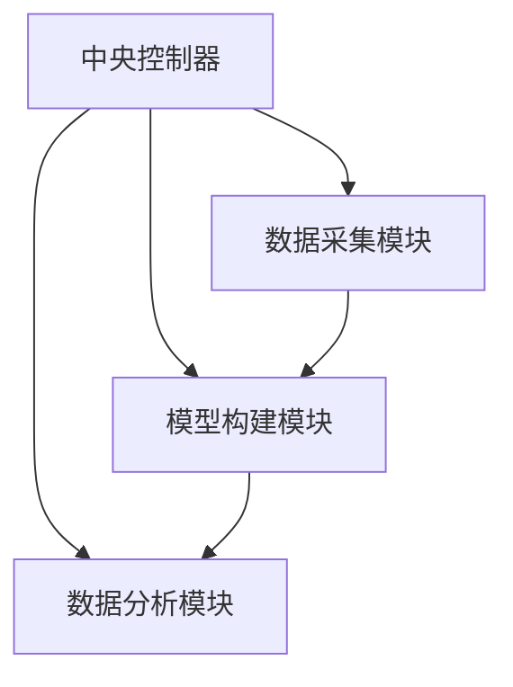
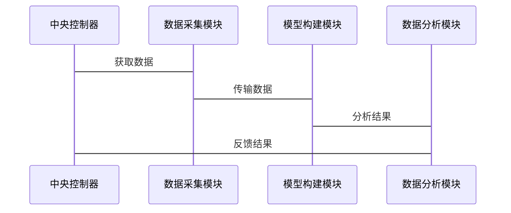

                 


# 多智能体在宏观经济分析中的应用

## 关键词
多智能体系统, 宏观经济分析, 分布式计算, 博弈论, 宏观经济预测, 经济模拟

## 摘要
本文探讨多智能体系统（MAS）在宏观经济分析中的应用，详细介绍MAS的基本概念、算法原理、系统架构及实际案例。通过分析经济主体的行为模型，展示MAS在宏观经济预测和政策模拟中的优势，为经济学研究提供新的视角。

---

# 第一部分: 多智能体系统与宏观经济分析基础

## 第1章: 多智能体系统概述

### 1.1 多智能体系统的基本概念
#### 1.1.1 智能体的定义与特征
智能体（Agent）是能够感知环境并采取行动的实体，具备自主性、反应性、目标导向和社交能力。  
$$ \text{智能体的特征：自主性、反应性、目标导向、社交能力} $$

#### 1.1.2 多智能体系统的定义与特点
多智能体系统由多个智能体组成，通过协作完成复杂任务，具有分布式、动态性和涌现性的特点。  
$$ \text{MAS特点：分布式、动态性、涌现性} $$

#### 1.1.3 多智能体系统与传统模型的区别
MAS与传统模型的区别在于：MAS强调自主性和分布式计算，传统模型依赖中央决策。  

### 1.2 宏观经济分析的背景与需求
#### 1.2.1 宏观经济分析的基本概念
宏观经济分析研究整体经济系统的运行，包括GDP、失业率等指标。  

#### 1.2.2 宏观经济模型的发展历程
从凯恩斯模型到动态随机一般均衡模型（DSGE），宏观经济模型逐渐复杂化。  

#### 1.2.3 多智能体系统在宏观经济分析中的优势
MAS能够模拟个体行为，捕捉系统动态，提供更精准的预测。  

## 第2章: 多智能体系统的核心概念与联系

### 2.1 多智能体系统的原理
#### 2.1.1 智能体的自主性与反应性
智能体根据环境反馈自主决策，具有实时反应能力。  

#### 2.1.2 多智能体系统的通信与协作机制
智能体通过通信协议交换信息，协作完成任务。  

#### 2.1.3 系统的动态性与复杂性
经济系统动态变化，MAS能够适应复杂环境。  

### 2.2 多智能体系统与宏观经济模型的关系
#### 2.2.1 经济主体的多智能体建模
将企业、消费者建模为智能体，模拟其行为。  

#### 2.2.2 宏观经济指标的多智能体模拟
通过智能体交互模拟GDP、失业率等指标的变化。  

#### 2.2.3 多智能体系统在经济预测中的应用
MAS用于预测经济趋势，评估政策效果。  

## 第3章: 多智能体系统的算法原理

### 3.1 分布式计算与协调算法
#### 3.1.1 分布式计算的基本原理
分布式计算通过分解任务，利用多智能体协作完成。  

#### 3.1.2 多智能体系统的协调机制
采用协商算法（如分布式协商）解决冲突，优化决策。  

#### 3.1.3 基于博弈论的决策算法
利用纳什均衡理论，模拟智能体策略选择。  

### 3.2 博弈论与经济模拟
#### 3.2.1 博弈论的基本概念
博弈论研究理性决策者在竞争环境中的行为。  

#### 3.2.2 经济主体的策略选择与纳什均衡
智能体在博弈中选择最优策略，达到纳什均衡状态。  

#### 3.2.3 多智能体系统中的博弈模拟
通过博弈论建模，模拟经济主体的互动行为。  

## 第4章: 多智能体系统的数学模型与公式

### 4.1 经济主体的行为模型
#### 4.1.1 智能体的效用函数
效用函数描述智能体的偏好，用于决策选择。  
$$ U(i) = \sum_{j=1}^{n} w_j x_j $$

#### 4.1.2 智能体的决策规则
根据效用函数选择最优行动。  
$$ \text{选择} a_i \text{使得} U(a_i) \text{最大} $$

#### 4.1.3 智能体的交互模型
描述智能体之间的信息交换和影响。  
$$ P(i) = \sum_{j \neq i} \beta_{ij} x_j $$

### 4.2 宏观经济指标的多智能体模型
#### 4.2.1 GDP的多智能体模拟公式
通过智能体的生产与消费模拟GDP。  
$$ \text{GDP} = \sum_{i=1}^{N} P(i) $$

#### 4.2.2 就业市场的多智能体模型
模拟企业招聘与工人就业行为。  
$$ \text{就业率} = \frac{\text{就业人数}}{\text{劳动力人口}} $$

#### 4.2.3 价格形成的多智能体机制
通过供需互动决定价格。  
$$ P = \frac{\sum_{i=1}^{N} p_i}{N} $$

## 第5章: 多智能体系统的系统分析与架构设计

### 5.1 宏观经济分析的场景与需求
#### 5.1.1 经济系统的复杂性
经济系统涉及多方利益，难以用单一模型描述。  

#### 5.1.2 多智能体系统的适用场景
适用于模拟个体行为和系统动态。  

#### 5.1.3 系统设计的目标与约束
目标：准确模拟经济现象；约束：计算资源、模型复杂度。  

### 5.2 系统功能设计
#### 5.2.1 数据采集与处理模块
收集经济数据，如GDP、失业率等。  

#### 5.2.2 模型构建与模拟模块
建立智能体模型，模拟经济互动。  

#### 5.2.3 数据分析与可视化模块
分析模拟结果，生成可视化报告。  

## 第6章: 多智能体系统的系统架构设计

### 6.1 系统架构图


### 6.2 系统交互图


### 6.3 系统接口设计
- 数据采集模块接口：`getData()`
- 模型构建模块接口：`buildModel()`
- 数据分析模块接口：`analyzeData()`

---

# 第二部分: 多智能体系统在宏观经济分析中的应用

## 第7章: 项目实战

### 7.1 环境安装
安装Python和相关库（如networkx、numpy）。  

### 7.2 系统核心实现源代码
```python
import networkx as nx
import numpy as np

class Agent:
    def __init__(self, id):
        self.id = id
        self utility = 0

    def decide(self, state):
        # 简单决策逻辑
        return 'action'

class MAS:
    def __init__(self, agents):
        self.agents = agents
        self.graph = nx.empty_graph(len(agents))

    def simulate(self, steps):
        for _ in range(steps):
            for agent in self.agents:
                state = self.get_state(agent)
                action = agent.decide(state)
                self.update_graph(agent, action)
```

### 7.3 实际案例分析
模拟企业竞争，分析市场均衡。  

### 7.4 详细解读与分析
解释代码实现，展示模拟结果。  

## 第8章: 总结与展望

### 8.1 最佳实践 tips
- 选择合适的智能体模型
- 确保数据质量和充足性
- 定期验证模型准确性

### 8.2 小结
多智能体系统为宏观经济分析提供新方法，能够模拟个体行为，捕捉系统动态。  

### 8.3 注意事项
- 模型复杂度高，需优化计算资源
- 确保模型的可解释性
- 定期更新模型以适应变化

### 8.4 拓展阅读
推荐相关书籍和论文，鼓励深入学习。

---

# 作者：AI天才研究院/AI Genius Institute & 禅与计算机程序设计艺术 /Zen And The Art of Computer Programming

