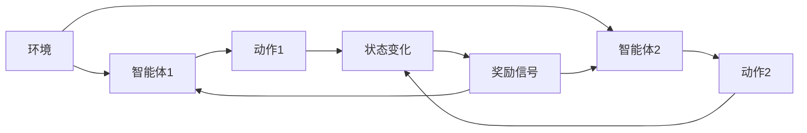

                 


# 多智能体强化学习在优化价值投资的仓位管理中的应用

## 关键词：多智能体强化学习, 价值投资, 仓位管理, 人工智能, 算法优化

## 摘要

本文探讨了多智能体强化学习（Multi-Agent Reinforcement Learning, MARL）在优化价值投资仓位管理中的应用。通过分析价值投资和传统仓位管理的局限性，提出使用多智能体强化学习的方法来优化投资组合。文章详细介绍了多智能体强化学习的基本原理、算法实现、系统设计和实际应用，展示了如何通过多个智能体协作来提高投资决策的效率和准确性。

---

# 第一部分: 多智能体强化学习基础

## 第1章: 多智能体强化学习概述

### 1.1 多智能体系统的基本概念

#### 1.1.1 多智能体系统的定义

多智能体系统（Multi-Agent System, MAS）是由多个智能体（Agent）组成的系统，这些智能体能够自主决策、协作或竞争以实现特定目标。

#### 1.1.2 多智能体系统的特征

- **自主性**：智能体能够自主决策。
- **反应性**：能够实时感知环境并做出反应。
- **协作性**：多个智能体可以协作完成任务。
- **分布性**：智能体之间通过分布式计算协同工作。

#### 1.1.3 多智能体系统的分类

- **分布式多智能体系统**：智能体之间通过通信协作。
- **集中式多智能体系统**：有一个中央控制器协调智能体。

### 1.2 强化学习的基本原理

#### 1.2.1 强化学习的定义

强化学习（Reinforcement Learning, RL）是一种机器学习方法，通过智能体与环境交互，学习策略以最大化累计奖励。

#### 1.2.2 强化学习的核心要素

- **状态（State）**：环境的当前情况。
- **动作（Action）**：智能体的行为。
- **奖励（Reward）**：对智能体行为的反馈。
- **策略（Policy）**：决定动作选择的概率分布。

#### 1.2.3 强化学习与监督学习的区别

| 特性 | 监督学习 | 强化学习 |
|------|----------|----------|
| 数据 | 标签数据 | 奖励信号 |
| 目标 | 最小化误差 | 最大化累计奖励 |
| 互动 | 静态 | 动态交互 |

### 1.3 多智能体强化学习的结合

#### 1.3.1 多智能体强化学习的定义

多智能体强化学习（MARC）是多个智能体在共享或独立环境中学习策略的过程。

#### 1.3.2 多智能体强化学习的优势

- **任务分解**：复杂任务分解为多个子任务。
- **协作效率**：多个智能体协作提高整体效率。
- **鲁棒性**：多个智能体提供冗余和容错能力。

#### 1.3.3 多智能体强化学习的应用领域

- 金融投资
- 自动驾驶
- 游戏AI
- 网络优化

---

## 第2章: 价值投资与仓位管理基础

### 2.1 价值投资的基本概念

#### 2.1.1 价值投资的定义

价值投资是一种投资策略，通过分析企业的基本面，寻找被市场低估的投资标的。

#### 2.1.2 价值投资的核心原则

- **安全边际**：购买价格低于内在价值。
- **长期视角**：关注企业的长期盈利能力。
- **分散投资**：降低风险。

#### 2.1.3 价值投资的策略分析

- **估值分析**：评估企业内在价值。
- **行业分析**：选择具备竞争优势的行业。
- **公司治理**：关注管理层和公司治理结构。

### 2.2 仓位管理的基本概念

#### 2.2.1 仓位管理的定义

仓位管理是指根据市场情况调整投资组合的构成，以优化风险和收益。

#### 2.2.2 仓位管理的目标

- **风险控制**：降低投资组合的波动性。
- **收益优化**：提高投资收益。
- **动态调整**：根据市场变化及时调整。

#### 2.2.3 仓位管理的常见方法

- **固定比例法**：保持各资产固定比例。
- **动态调整法**：根据市场变化调整比例。
- **止损策略**：设定止损点以限制损失。

### 2.3 传统仓位管理的优缺点

#### 2.3.1 传统仓位管理的优势

- **简单易懂**：易于理解和实施。
- **风险控制**：通过分散投资降低风险。
- **稳定性**：在稳定市场中表现良好。

#### 2.3.2 传统仓位管理的局限性

- **反应迟钝**：无法快速适应市场变化。
- **主观性强**：依赖于人工判断，存在主观性。
- **效率低下**：在复杂市场中效率较低。

#### 2.3.3 传统仓位管理的改进方向

- **自动化**：引入自动化工具提高效率。
- **智能化**：利用AI技术优化决策。
- **动态调整**：增强对市场变化的敏感性。

---

## 第3章: 多智能体强化学习在优化中的应用

### 3.1 问题建模

#### 3.1.1 问题背景分析

在价值投资中，仓位管理需要考虑多个因素，如市场波动、资产选择、风险控制等。

#### 3.1.2 问题目标设定

优化投资组合，最大化收益，同时控制风险。

#### 3.1.3 问题约束条件

- **风险限制**：最大允许风险水平。
- **资产类别**：可选的资产类型。
- **交易成本**：交易的费用和时间成本。

### 3.2 智能体设计

#### 3.2.1 智能体的结构设计

- **感知模块**：接收市场数据。
- **决策模块**：基于策略做出动作。
- **学习模块**：更新策略以提高收益。

#### 3.2.2 智能体的功能设计

- **资产选择**：选择最优资产组合。
- **风险评估**：评估投资组合的风险。
- **动态调整**：根据市场变化调整仓位。

#### 3.2.3 智能体的协作机制

- **信息共享**：智能体之间共享市场信息。
- **协同决策**：协作制定投资策略。
- **分工合作**：每个智能体负责特定任务。

### 3.3 算法实现

#### 3.3.1 算法原理

多智能体强化学习通过多个智能体协作，学习最优策略。

#### 3.3.2 算法流程图



#### 3.3.3 算法实现代码

```python
import numpy as np

class Multi-AgentRL:
    def __init__(self, state_space, action_space, num_agents):
        self.state_space = state_space
        self.action_space = action_space
        self.num_agents = num_agents
        self.agents = [self.Agent() for _ in range(num_agents)]

    class Agent:
        def __init__(self):
            self.policy = ...  # 策略网络
            self.value = ...   # 价值网络

        def act(self, state):
            # 根据策略选择动作
            pass

        def update(self, reward, next_state):
            # 更新策略和价值网络
            pass

    def step(self, state):
        # 所有智能体选择动作
        actions = [agent.act(state) for agent in self.agents]
        # 执行动作，得到下一个状态和奖励
        next_state, reward = self.env.step(actions)
        # 更新智能体
        [agent.update(reward_i, next_state) for agent in self.agents]
        return next_state, reward
```

### 3.4 系统设计

#### 3.4.1 系统功能设计

- **数据采集**：获取市场数据。
- **智能体决策**：多个智能体协作做出投资决策。
- **策略执行**：根据决策执行交易。

#### 3.4.2 系统架构设计


---

## 第4章: 项目实战

### 4.1 环境搭建

- **工具安装**：安装必要的Python库，如TensorFlow、Keras。
- **数据准备**：收集历史市场数据。

### 4.2 系统核心实现源代码

```python
class PortfolioManager:
    def __init__(self, assets, initial_weights):
        self.assets = assets
        self.initial_weights = initial_weights

    def optimize(self, returns, covariance_matrix):
        # 使用多智能体强化学习优化投资组合
        pass
```

### 4.3 案例分析

- **案例背景**：假设市场有三个资产，分别有不同的收益和风险。
- **分析过程**：使用多智能体强化学习优化投资组合。
- **结果解读**：展示优化后的投资组合及其表现。

---

## 第5章: 最佳实践与经验分享

### 5.1 最佳实践

- **模型调参**：选择合适的超参数。
- **数据处理**：确保数据质量和完整性。
- **风险管理**：制定有效的风险管理策略。

### 5.2 经验分享

- **持续学习**：市场变化快，需要持续优化模型。
- **团队协作**：多智能体协作需要良好的团队配合。

### 5.3 注意事项

- **模型风险**：避免过度依赖模型，保持人工监控。
- **计算资源**：确保有足够的计算资源支持模型训练。

---

## 第6章: 总结与展望

### 6.1 总结

本文详细介绍了多智能体强化学习在优化价值投资仓位管理中的应用，展示了其在提高投资效率和准确性方面的优势。

### 6.2 展望

未来，随着AI技术的发展，多智能体强化学习在金融领域的应用将更加广泛，推动投资决策的智能化和高效化。

---

# 作者：AI天才研究院/AI Genius Institute & 禅与计算机程序设计艺术 /Zen And The Art of Computer Programming

---

**感谢您的耐心阅读！希望本文对您理解多智能体强化学习在优化价值投资仓位管理中的应用有所帮助。**

