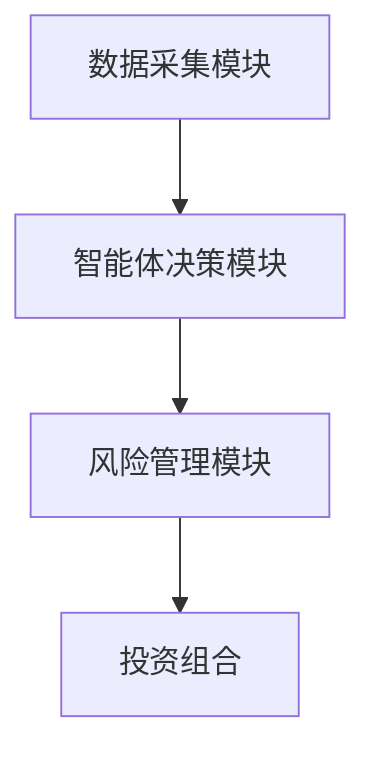

                 


# 多智能体强化学习在优化价值投资的动态止损策略中的应用

## 关键词：多智能体强化学习，动态止损策略，价值投资，投资组合优化，机器学习算法

## 摘要：  
本文探讨了多智能体强化学习在优化价值投资中的动态止损策略的应用。通过分析多智能体强化学习的基本原理和算法框架，结合价值投资和动态止损策略的核心概念，本文提出了一种基于多智能体强化学习的动态止损优化方法。通过详细的算法推导、系统架构设计和实际案例分析，本文展示了如何利用多智能体强化学习技术优化投资决策中的动态止损策略，从而提高投资回报率和风险管理能力。本文还提供了丰富的数学模型和代码实现，帮助读者深入理解并应用于实际投资场景。

---

## 第一部分: 多智能体强化学习基础

### 第1章: 多智能体强化学习概述

#### 1.1 多智能体强化学习的基本概念

##### 1.1.1 多智能体系统的定义  
多智能体系统（Multi-Agent System, MAS）是由多个智能体组成的分布式系统，每个智能体具有一定的自主性、反应性和协作性，能够通过感知环境、做出决策并执行动作来实现目标。多智能体系统广泛应用于机器人控制、游戏AI、交通管理等领域。

##### 1.1.2 强化学习的基本原理  
强化学习（Reinforcement Learning, RL）是一种通过试错方法让智能体在与环境的交互中学习策略的机器学习方法。智能体通过执行动作、观察环境状态和接收奖励来优化策略，目标是最大化累计奖励。

##### 1.1.3 多智能体强化学习的特征  
- **分布式性**：多个智能体协作完成任务，而非集中控制。  
- **异质性**：智能体可能具有不同的目标、知识和能力。  
- **动态性**：环境和智能体之间的交互动态变化，增加了复杂性。  

#### 1.2 多智能体强化学习的算法框架

##### 1.2.1 集中式与分布式算法  
- **集中式算法**：所有智能体共享一个集中化的值函数或策略，适用于任务高度协作的场景。  
- **分布式算法**：每个智能体独立学习，适用于任务相对独立的场景。  

##### 1.2.2 基于值函数的方法  
- **Q-learning**：通过学习状态-动作值函数来优化策略。  
- **多智能体Q-learning**：扩展Q-learning到多智能体场景，考虑多个智能体的协作与竞争。  

##### 1.2.3 基于策略梯度的方法  
- **策略梯度法**：直接优化策略参数，避免值函数的估计误差。  
- **分布式策略梯度法**：每个智能体独立优化策略，适用于异质性较高的场景。  

#### 1.3 多智能体强化学习的数学模型

##### 1.3.1 状态空间的定义  
状态空间表示环境中的所有可能状态，每个状态描述了当前环境的某个方面。例如，在投资场景中，状态可以是市场指数、股票价格等。  

##### 1.3.2 动作空间的定义  
动作空间表示智能体可以执行的所有动作，例如“买入”、“卖出”或“持有”。  

##### 1.3.3 奖励函数的设计  
奖励函数定义了智能体在特定状态和动作下获得的奖励，用于指导智能体学习最优策略。例如，在投资场景中，获得正收益时奖励为正，亏损时奖励为负。  

---

### 第2章: 多智能体强化学习的核心算法

#### 2.1 集中式值函数方法

##### 2.1.1 Q-learning算法  
Q-learning是一种经典的强化学习算法，通过更新Q值函数来学习最优策略。  

**算法流程**：  
1. 初始化Q值函数为0。  
2. 在每个时间步，智能体选择动作，执行动作并观察奖励和新状态。  
3. 更新Q值函数：  
   $$ Q(s, a) = Q(s, a) + \alpha (r + \gamma \max Q(s', a') - Q(s, a)) $$  
   其中，$\alpha$是学习率，$\gamma$是折扣因子。  

##### 2.1.2 多智能体Q-learning的扩展  
在多智能体场景中，Q-learning可以扩展为集中式或分布式方法。集中式方法共享一个Q值函数，而分布式方法每个智能体维护自己的Q值函数。  

#### 2.2 分布式策略梯度方法

##### 2.2.1 独立策略梯度法  
独立策略梯度法假设每个智能体独立优化自己的策略，适用于任务相对独立的场景。  

**策略梯度公式**：  
$$ \nabla \theta \leftarrow \nabla J(\theta) $$  
其中，$J(\theta)$是目标函数，$\theta$是策略参数。  

##### 2.2.2 协作策略梯度法  
协作策略梯度法考虑智能体之间的协作关系，通过共享参数或联合优化策略来实现协作目标。  

**联合目标函数**：  
$$ J(\theta_1, \theta_2, \dots, \theta_n) = \sum_{i=1}^{n} J_i(\theta_i) $$  

#### 2.3 联合强化学习

##### 2.3.1 联合Q-learning  
联合Q-learning将多个智能体的Q值函数联合起来，通过同步更新实现协作目标。  

**联合更新公式**：  
$$ Q_i(s, a) = Q_i(s, a) + \alpha (r + \gamma \max Q_j(s', a') - Q_i(s, a)) $$  

##### 2.3.2 联合策略梯度法  
联合策略梯度法通过优化所有智能体的策略参数，实现全局最优目标。  

**联合目标函数**：  
$$ J(\theta_1, \theta_2, \dots, \theta_n) = \sum_{i=1}^{n} J_i(\theta_i) $$  

---

### 第3章: 多智能体强化学习的数学推导

#### 3.1 值函数的更新公式

##### 3.1.1 单智能体Q-learning的更新公式  
$$ Q(s, a) = Q(s, a) + \alpha (r + \gamma \max Q(s', a') - Q(s, a)) $$  

##### 3.1.2 多智能体Q-learning的扩展公式  
$$ Q_i(s, a) = Q_i(s, a) + \alpha (r + \gamma \max Q_j(s', a') - Q_i(s, a)) $$  

#### 3.2 策略梯度的数学推导

##### 3.2.1 独立策略梯度的推导  
$$ \nabla \theta \leftarrow \nabla J(\theta) $$  

##### 3.2.2 协作策略梯度的推导  
$$ \nabla \theta \leftarrow \nabla (J_1(\theta_1) + J_2(\theta_2) + \dots + J_n(\theta_n)) $$  

#### 3.3 联合强化学习的数学模型

##### 3.3.1 联合Q-learning的数学表达  
$$ Q_i(s, a) = Q_i(s, a) + \alpha (r + \gamma \max Q_j(s', a') - Q_i(s, a)) $$  

##### 3.3.2 联合策略梯度的数学表达  
$$ \nabla \theta \leftarrow \nabla (J_1(\theta_1) + J_2(\theta_2) + \dots + J_n(\theta_n)) $$  

---

## 第二部分: 价值投资与动态止损策略

### 第4章: 价值投资的基本原理

#### 4.1 价值投资的定义与特点

##### 4.1.1 价值投资的定义  
价值投资是一种以公司基本面分析为基础的投资策略，旨在以低于公平价值的价格买入优质股票，长期持有，获得超额收益。  

##### 4.1.2 价值投资的核心理念  
- **安全边际**：买入价格低于内在价值，降低投资风险。  
- **长期视角**：关注公司的长期盈利能力，而非短期市场波动。  

##### 4.1.3 价值投资与其它投资策略的对比  
- **成长投资**：注重公司未来的增长潜力，风险较高。  
- **指数投资**：被动跟踪市场指数，风险分散但收益有限。  

#### 4.2 价值投资的关键要素

##### 4.2.1 公司基本面分析  
- **财务指标**：市盈率、市净率、ROE等。  
- **行业地位**：公司在行业中的竞争力。  
- **管理层能力**：管理层的背景和决策能力。  

##### 4.2.2 市场情绪分析  
市场情绪影响投资者的心理和行为，可以通过新闻、社交媒体等数据进行分析。  

##### 4.2.3 财务指标分析  
通过分析公司的财务报表，评估公司的盈利能力、偿债能力和发展潜力。  

---

#### 第5章: 动态止损策略的原理与应用

##### 5.1 动态止损的定义与特点

###### 5.1.1 动态止损的定义  
动态止损是一种根据市场变化动态调整止损点的投资策略，旨在在市场波动中降低投资风险，同时捕捉潜在收益。  

###### 5.1.2 动态止损与静态止损的对比  
- **静态止损**：止损点固定，不随市场变化调整，适用于市场波动较小的场景。  
- **动态止损**：止损点根据市场变化动态调整，适用于市场波动较大的场景。  

###### 5.1.3 动态止损的优势  
- **风险控制**：能够根据市场波动及时调整止损点，避免过度亏损。  
- **收益优化**：在市场上涨时，适当提高止损点，锁定收益。  

##### 5.2 动态止损的实现方法

###### 5.2.1 基于技术指标的动态止损  
- **移动平均线**：根据价格走势调整止损点。  
- **布林带**：根据价格波动范围调整止损点。  

###### 5.2.2 基于机器学习的动态止损  
- **强化学习**：通过学习市场数据，动态调整止损点。  
- **监督学习**：基于历史数据训练模型，预测最优止损点。  

###### 5.2.3 基于市场情绪的动态止损  
- **情绪指标**：通过分析市场情绪指数，动态调整止损点。  

---

##### 第6章: 多智能体强化学习在动态止损策略中的应用

###### 6.1 动态止损策略的优化需求  
- **实时调整**：根据市场变化实时调整止损点，降低风险。  
- **多目标优化**：在风险控制和收益最大化之间找到平衡点。  

###### 6.2 多智能体强化学习的应用框架  
- **智能体分工**：每个智能体负责不同的市场指标或投资组合。  
- **协作学习**：智能体之间协作优化止损策略。  

###### 6.3 动态止损策略的优化效果  
- **风险降低**：通过动态调整止损点，降低投资组合的波动性。  
- **收益提升**：在市场上涨时，智能体能够及时调整止损点，捕捉更多收益。  

---

## 项目实战: 多智能体强化学习优化动态止损策略

### 第7章: 项目环境与数据准备

#### 7.1 环境安装  
- **安装Python**：确保安装了Python 3.8及以上版本。  
- **安装依赖库**：安装NumPy、Pandas、Matplotlib、TensorFlow等库。  

#### 7.2 数据准备  
- **数据来源**：获取历史股票数据，包括开盘价、收盘价、最高价、最低价、成交量等。  
- **数据预处理**：清洗数据、计算技术指标（如MA、MACD等）。  

### 第8章: 系统架构设计

#### 8.1 系统功能设计  
- **数据采集模块**：从数据源获取实时市场数据。  
- **智能体决策模块**：基于强化学习算法，动态调整止损点。  
- **风险管理模块**：监控投资组合风险，执行止损操作。  

#### 8.2 系统架构图  


---

### 第9章: 算法实现与优化

#### 9.1 强化学习算法实现

##### 9.1.1 Q-learning算法实现  
```python
import numpy as np

class QLearning:
    def __init__(self, state_space, action_space, alpha=0.1, gamma=0.99):
        self.state_space = state_space
        self.action_space = action_space
        self.alpha = alpha
        self.gamma = gamma
        self.Q = np.zeros((state_space, action_space))

    def get_action(self, state):
        return np.argmax(self.Q[state, :])

    def update_Q(self, state, action, reward, next_state):
        self.Q[state, action] += self.alpha * (reward + self.gamma * np.max(self.Q[next_state, :]) - self.Q[state, action])
```

##### 9.1.2 多智能体强化学习实现  
```python
class MultiAgentQLearning:
    def __init__(self, num_agents, state_space, action_space, alpha=0.1, gamma=0.99):
        self.num_agents = num_agents
        self.state_space = state_space
        self.action_space = action_space
        self.alpha = alpha
        self.gamma = gamma
        self.Q = [np.zeros((state_space, action_space)) for _ in range(num_agents)]

    def get_action(self, agent, state):
        return np.argmax(self.Q[agent][state, :])

    def update_Q(self, agent, state, action, reward, next_state):
        self.Q[agent][state, action] += self.alpha * (reward + self.gamma * np.max(self.Q[agent][next_state, :]) - self.Q[agent][state, action])
```

#### 9.2 动态止损策略优化  
- **策略评估**：通过回测验证策略的有效性。  
- **参数调优**：调整学习率、折扣因子等参数，优化策略表现。  

---

### 第10章: 实际案例分析

#### 10.1 案例背景  
选择某只股票，模拟市场波动，训练智能体学习动态止损策略。  

#### 10.2 案例分析  
- **数据输入**：输入股票历史数据，训练智能体学习动态止损点。  
- **策略执行**：智能体根据市场变化动态调整止损点，执行买卖操作。  
- **结果分析**：对比有无动态止损策略下的投资收益和风险。  

---

## 结论与展望

### 第11章: 结论

#### 11.1 核心结论  
- 多智能体强化学习能够有效优化动态止损策略，降低投资风险，提高收益。  
- 通过智能体协作，可以实现更复杂的策略优化。  

#### 11.2 未来展望  
- **算法优化**：探索更高效的多智能体强化学习算法。  
- **应用场景扩展**：将多智能体强化学习应用于更多投资策略优化问题。  

---

## 附录

### 附录A: 代码实现

#### A.1 Q-learning算法代码  
```python
import numpy as np

class QLearning:
    def __init__(self, state_space, action_space, alpha=0.1, gamma=0.99):
        self.state_space = state_space
        self.action_space = action_space
        self.alpha = alpha
        self.gamma = gamma
        self.Q = np.zeros((state_space, action_space))

    def get_action(self, state):
        return np.argmax(self.Q[state, :])

    def update_Q(self, state, action, reward, next_state):
        self.Q[state, action] += self.alpha * (reward + self.gamma * np.max(self.Q[next_state, :]) - self.Q[state, action])
```

#### A.2 多智能体强化学习代码  
```python
class MultiAgentQLearning:
    def __init__(self, num_agents, state_space, action_space, alpha=0.1, gamma=0.99):
        self.num_agents = num_agents
        self.state_space = state_space
        self.action_space = action_space
        self.alpha = alpha
        self.gamma = gamma
        self.Q = [np.zeros((state_space, action_space)) for _ in range(num_agents)]

    def get_action(self, agent, state):
        return np.argmax(self.Q[agent][state, :])

    def update_Q(self, agent, state, action, reward, next_state):
        self.Q[agent][state, action] += self.alpha * (reward + self.gamma * np.max(self.Q[agent][next_state, :]) - self.Q[agent][state, action])
```

---

## 作者

**作者：AI天才研究院/AI Genius Institute & 禅与计算机程序设计艺术 /Zen And The Art of Computer Programming**

