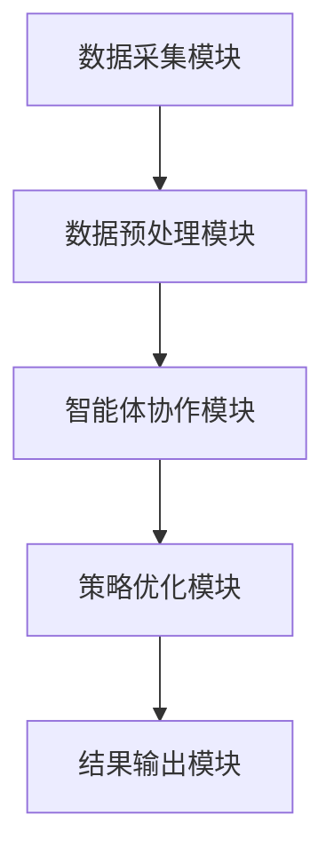
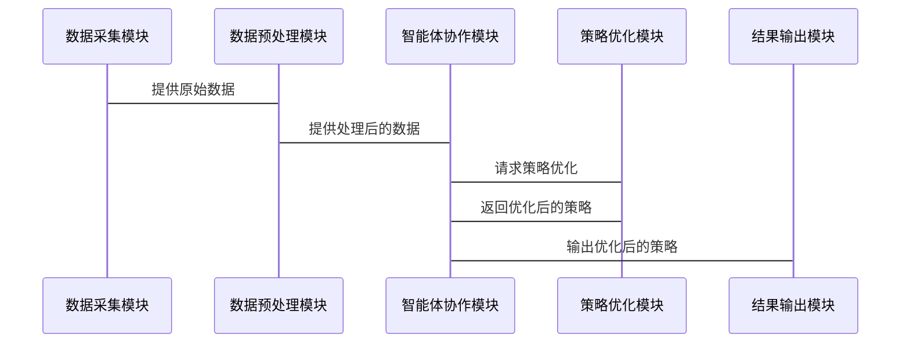

                 


```markdown
# 多智能体强化学习在优化价值投资的择时策略中的应用

> 关键词：多智能体强化学习，价值投资，择时策略，金融优化，人工智能

> 摘要：本文探讨了多智能体强化学习在优化价值投资中的择时策略。通过分析价值投资的核心要素，结合多智能体强化学习的理论基础，提出了一种基于多智能体的择时策略优化方法。通过系统设计、项目实战和案例分析，展示了该方法在实际投资中的应用效果，为金融投资领域提供了一种新的解决方案。

---

## 第1章: 多智能体强化学习与价值投资概述

### 1.1 价值投资的基本概念
#### 1.1.1 价值投资的定义与核心理念
- 价值投资是一种长期投资策略，旨在通过分析企业的基本面，找到市场价格低于其内在价值的股票进行投资。
- 核心理念：寻找被市场低估的优质企业，长期持有，获得超额收益。
- 价值投资的关键要素：企业盈利能力、财务健康状况、行业地位、管理团队等。

#### 1.1.2 价值投资的策略与方法
- 基于基本面分析的投资策略。
- 定性分析与定量分析结合。
- 长期投资与分散投资策略。

#### 1.1.3 价值投资在现代金融中的地位
- 价值投资是机构投资者和散户投资者的重要策略之一。
- 在复杂多变的市场环境中，价值投资需要结合现代技术手段进行优化。

### 1.2 强化学习的基本概念
#### 1.2.1 强化学习的定义与特点
- 强化学习（Reinforcement Learning, RL）是一种机器学习方法，通过智能体与环境的交互，学习最优策略以最大化累积奖励。
- 强化学习的核心要素：状态（State）、动作（Action）、奖励（Reward）、策略（Policy）、值函数（Value Function）。
- 强化学习的特点：基于试错学习、实时交互、目标导向。

#### 1.2.2 强化学习的算法框架
- Q-learning：基于值函数的强化学习算法。
- Actor-Critic：基于策略和值函数的强化学习算法。
- Deep Reinforcement Learning：深度强化学习，结合神经网络进行状态和动作的表示。

#### 1.2.3 强化学习在金融领域的应用潜力
- 股票交易策略优化。
- 风险控制与投资组合管理。
- 市场微观结构分析。

### 1.3 多智能体强化学习的背景与意义
#### 1.3.1 多智能体强化学习的定义
- 多智能体强化学习（Multi-Agent Reinforcement Learning, MARS）是指多个智能体在共享环境中协作或竞争，以实现共同目标的强化学习形式。
- 多智能体系统的优势：分布式决策、任务分解、协作优化。

#### 1.3.2 多智能体强化学习在金融中的应用前景
- 多个智能体分别负责不同的投资任务，协同优化整体投资策略。
- 多智能体可以分别关注不同的市场因子，形成互补的信息处理能力。
- 多智能体系统可以模拟市场中的多方参与者，提高交易策略的鲁棒性。

---

## 第2章: 多智能体强化学习的理论基础

### 2.1 多智能体强化学习的基本概念
#### 2.1.1 多智能体系统的定义与特点
- 多智能体系统：由多个智能体组成的协作或竞争系统，每个智能体都有自己的目标和决策空间。
- 多智能体系统的复杂性：智能体之间的交互、信息共享、任务分配。

#### 2.1.2 多智能体强化学习的核心要素
- 智能体：每个智能体都有自己的状态、动作和奖励函数。
- 环境：智能体与环境交互，环境提供状态和奖励。
- 通信与协作：智能体之间的信息交换和协同决策。

#### 2.1.3 多智能体强化学习与单智能体强化学习的区别
| 特性          | 单智能体强化学习         | 多智能体强化学习         |
|---------------|--------------------------|--------------------------|
| 决策主体      | 单一智能体               | 多个智能体               |
| 信息共享      | 无信息共享               | 有信息共享               |
| 协作/竞争     | 无协作/竞争             | 存在协作/竞争            |
| 应用场景       | 简单任务                 | 复杂任务                 |

### 2.2 多智能体强化学习的算法框架
#### 2.2.1 基于Q-learning的多智能体算法
- 多智能体Q-learning：每个智能体独立学习自己的Q值函数，通过环境反馈更新策略。
- 优点：简单易实现，适合异构智能体。
- 缺点：存在信息孤岛，智能体之间缺乏有效协作。

#### 2.2.2 基于Actor-Critic的多智能体算法
- 多智能体Actor-Critic：每个智能体同时学习策略（Actor）和值函数（Critic），通过协作更新策略。
- 优点：智能体之间可以通过共享网络参数进行协作。
- 缺点：算法复杂度较高，实现难度大。

#### 2.2.3 基于分布式参数的多智能体算法
- 基于分布式参数的多智能体强化学习：智能体之间通过共享参数或参数更新进行协作。
- 优点：能够有效利用多智能体的信息，提高学习效率。
- 缺点：需要设计高效的通信机制。

### 2.3 多智能体强化学习中的智能体协作机制
#### 2.3.1 智能体之间的通信与协作
- 通信方式：通过共享信息或发送消息实现协作。
- 协作机制：基于共享目标或任务分解的协作方式。

#### 2.3.2 智能体之间的竞争与平衡
- 竞争机制：智能体之间通过竞争优化整体策略。
- 平衡机制：通过设计奖励函数或惩罚机制，平衡智能体之间的竞争与协作。

#### 2.3.3 智能体之间的学习与适应
- 在线学习：智能体根据环境反馈实时更新策略。
- 离线学习：智能体利用历史数据进行策略优化。

---

## 第3章: 价值投资中的择时策略优化

### 3.1 拆解价值投资中的择时问题
#### 3.1.1 拆解择时问题的核心要素
- 市场状态识别：判断市场的当前状态，如牛市、熊市、震荡市。
- 买入时机选择：基于市场状态和企业基本面，选择合适的买入时机。
- 卖出时机选择：基于市场状态和投资目标，选择合适的卖出时机。

#### 3.1.2 拆解择时问题的数学模型
- 市场状态表示：通过特征向量表示市场状态。
- 动作空间：买入、持有、卖出三种动作。
- 奖励函数：基于投资收益和风险的综合评价。

#### 3.1.3 拆解择时问题的优化目标
- 最大化投资收益：在不同市场状态下选择最优动作，实现最大化的投资收益。
- 控制投资风险：在市场波动中，通过择时策略降低投资风险。

### 3.2 多智能体强化学习在择时策略中的应用
#### 3.2.1 拆解价值投资中的择时问题
- 市场状态识别：通过多智能体分别关注不同的市场因子，如技术指标、财务指标、情绪指标等。
- 动作决策：每个智能体负责不同的动作决策，如买入、卖出、持有。

#### 3.2.2 多智能体强化学习在择时策略中的实现
- 系统设计：每个智能体负责不同的市场因子，通过协作实现整体的择时策略。
- 通信机制：智能体之间通过共享市场信息和策略建议进行协作。
- 策略优化：通过强化学习算法，不断优化每个智能体的策略，提高整体择时效果。

#### 3.2.3 多智能体强化学习在择时策略中的优化效果
- 实验结果：通过回测实验，验证多智能体强化学习在择时策略中的优化效果。
- 对比分析：与单智能体强化学习和传统价值投资策略进行对比，展示多智能体的优势。

---

## 第4章: 多智能体强化学习在价值投资中的系统设计

### 4.1 系统设计概述
#### 4.1.1 问题场景介绍
- 投资目标：通过多智能体强化学习优化价值投资的择时策略，提高投资收益，降低投资风险。
- 问题规模：涉及多个市场因子和多种投资策略，需要进行分布式决策和协作优化。

#### 4.1.2 系统功能设计
- 数据采集模块：采集市场数据、企业基本面数据等。
- 智能体协作模块：实现多智能体之间的通信与协作。
- 策略优化模块：通过强化学习算法优化择时策略。

#### 4.1.3 系统架构设计


### 4.2 系统实现细节
#### 4.2.1 数据预处理模块
- 数据清洗：处理缺失值、异常值。
- 数据标准化：对市场数据进行标准化处理，便于模型输入。
- 数据特征提取：提取有用的市场因子，如技术指标、财务指标等。

#### 4.2.2 智能体协作模块
- 智能体通信：通过消息传递机制实现智能体之间的信息共享。
- 协作机制：设计合理的协作机制，确保智能体之间能够有效协作。

#### 4.2.3 策略优化模块
- 策略更新：通过强化学习算法不断优化智能体的策略。
- 策略评估：通过回测实验评估策略的有效性。

### 4.3 系统交互设计
#### 4.3.1 系统交互流程
- 系统启动：数据采集模块开始采集市场数据。
- 数据预处理：对采集的数据进行清洗和标准化处理。
- 智能体协作：智能体之间通过通信模块进行协作，共同优化策略。
- 策略优化：策略优化模块通过强化学习算法优化智能体的策略。
- 结果输出：输出优化后的择时策略。

#### 4.3.2 系统交互图


---

## 第5章: 项目实战与案例分析

### 5.1 项目实战
#### 5.1.1 环境安装与配置
- 安装必要的Python库：如TensorFlow、Keras、OpenAI Gym等。
- 配置开发环境：如Jupyter Notebook、PyCharm等。

#### 5.1.2 核心代码实现
- 数据预处理代码：
```python
import pandas as pd
import numpy as np

# 读取股票数据
data = pd.read_csv('stock_data.csv')

# 数据清洗
data = data.dropna()

# 数据标准化
data = (data - data.mean()) / data.std()
```

- 智能体协作代码：
```python
class Agent:
    def __init__(self, state_space, action_space):
        self.state_space = state_space
        self.action_space = action_space
        # 初始化策略网络
        self.model = self.build_model()

    def build_model(self):
        # 定义策略网络
        pass

    def act(self, state):
        # 根据当前状态选择动作
        pass
```

- 强化学习算法实现：
```python
class MARLAlgorithm:
    def __init__(self, agents):
        self.agents = agents

    def train(self, env, episodes):
        for episode in range(episodes):
            state = env.reset()
            while not done:
                actions = [agent.act(state) for agent in self.agents]
                next_state, rewards, done, _ = env.step(actions)
                for i in range(len(self.agents)):
                    self.agents[i].update_policy(state, actions[i], rewards[i], next_state)
```

#### 5.1.3 实验结果与分析
- 回测实验：通过历史数据验证策略的有效性。
- 收益分析：计算策略的平均收益率、最大回撤、夏普比率等指标。
- 风险控制：分析策略在不同市场环境下的风险表现。

### 5.2 案例分析
#### 5.2.1 案例背景
- 选择具体的股票数据集，如标普500指数成分股。
- 设定回测区间，如2010年至2020年。

#### 5.2.2 案例实现
- 数据预处理：选择相关的市场因子，如市盈率、市净率、ROE等。
- 智能体设计：每个智能体负责不同的市场因子，协作完成择时策略。
- 策略优化：通过强化学习算法优化智能体的策略，提高投资收益。

#### 5.2.3 案例结果
- 投资收益：与传统价值投资策略对比，展示多智能体强化学习的优势。
- 风险控制：分析策略在不同市场环境下的风险表现。
- 策略稳定性：评估策略在长期回测中的稳定性。

---

## 第6章: 总结与展望

### 6.1 总结
- 本文提出了基于多智能体强化学习的择时策略优化方法。
- 通过系统设计和项目实战，验证了该方法的有效性。
- 多智能体强化学习在价值投资中的应用前景广阔。

### 6.2 展望
- 提高多智能体系统的协作效率，优化通信机制。
- 结合其他机器学习方法，如深度学习、强化学习，进一步提升策略优化效果。
- 研究多智能体强化学习在其他金融领域的应用，如投资组合管理、风险管理等。

---

## 参考文献

（此处列出相关参考文献）

---

## 作者信息

作者：AI天才研究院/AI Genius Institute & 禅与计算机程序设计艺术/Zen And The Art of Computer Programming
```

