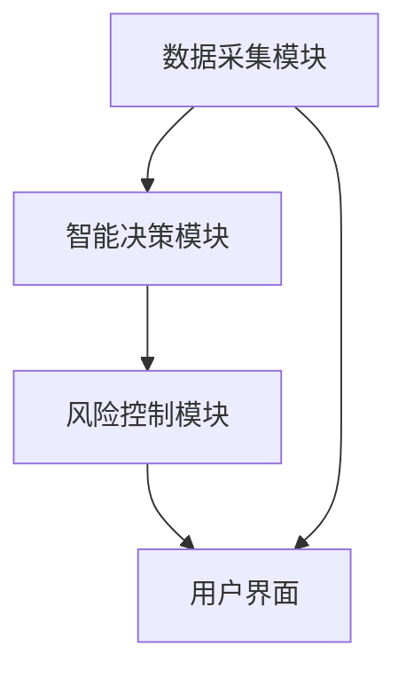
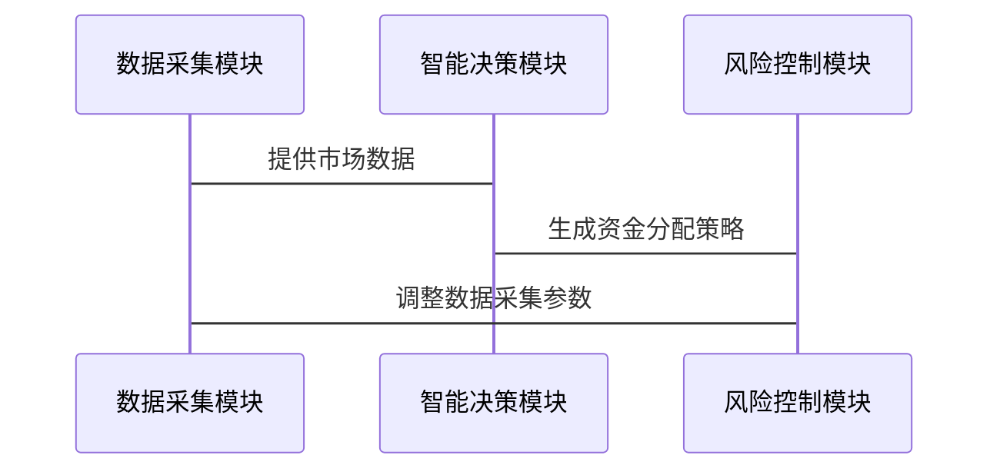

                 


# 多智能体强化学习在优化价值投资的资金流管理中的应用

> 关键词：多智能体强化学习（MARCRL）、价值投资、资金流管理、优化策略、系统架构、算法实现

> 摘要：本文深入探讨了多智能体强化学习（MARCRL）在优化价值投资资金流管理中的应用。通过分析价值投资中的资金分配问题，结合多智能体强化学习的核心原理，本文提出了基于MARCRL的资金流管理优化策略。从理论基础到算法实现，再到系统架构设计，本文详细阐述了如何利用多智能体强化学习技术提升资金流管理的效率与精度，为投资决策提供科学依据。

---

## 第1章：背景介绍

### 1.1 多智能体强化学习（MARCRL）的定义与特点

多智能体强化学习（Multi-Agent Reinforcement Learning, MARCRL）是指在一个系统中存在多个智能体，这些智能体通过协作与竞争，共同完成特定任务的学习方法。与单智能体强化学习相比，MARCRL的核心特点在于多智能体之间的交互与协作，每个智能体都具有独立的目标和决策空间，但又需要通过合作实现整体的最优目标。

#### 1.1.1 多智能体强化学习的基本概念
- 智能体（Agent）：能够感知环境并采取行动的主体，每个智能体都有自己的目标和策略。
- 交互与协作：智能体之间通过通信和协作，共同完成复杂任务。
- 竞争与冲突：智能体在追求自身目标的同时，可能会与其它智能体产生竞争和冲突。

#### 1.1.2 多智能体系统的核心特征
- **分布式性**：每个智能体独立决策，分布式协作。
- **动态性**：系统状态和智能体目标可能随时间变化。
- **复杂性**：多智能体系统的复杂性远高于单智能体系统。

#### 1.1.3 多智能体强化学习与单智能体强化学习的区别
| 特性               | 多智能体强化学习（MARCRL） | 单智能体强化学习（SRL） |
|--------------------|---------------------------|-------------------------|
| 决策主体           | 多个智能体                | 单个智能体             |
| 交互方式           | 智能体之间互相协作/竞争  | 无交互                 |
| 优化目标           | 整体最优或帕累托最优      | 单一目标               |
| 状态空间           | 更复杂，涉及多个智能体的状态 | 较简单，仅涉及单个智能体的状态 |

### 1.2 价值投资与资金流管理

#### 1.2.1 价值投资的基本概念
价值投资是一种投资策略，强调以低于内在价值的价格购买优质资产，长期持有，等待其价格回归合理价值。其核心理念是寻找市场低估的资产，并通过长期持有实现收益。

#### 1.2.2 资金流管理的重要性
资金流管理是指在投资过程中，合理分配资金，优化资产配置，控制风险，以实现投资收益最大化的过程。有效的资金流管理能够帮助投资者在不同资产之间进行动态调整，规避风险，抓住投资机会。

#### 1.2.3 价值投资中资金流管理的核心问题
- 资产配置：如何在不同资产类别之间分配资金，以实现收益与风险的最优平衡。
- 风险控制：如何在市场波动中调整资金分配，避免过度风险暴露。
- 动态优化：如何根据市场变化和投资目标，实时优化资金分配策略。

### 1.3 多智能体强化学习在价值投资中的应用前景

#### 1.3.1 多智能体强化学习在金融领域的潜力
- 多智能体强化学习能够模拟金融市场中多方参与者的行为，帮助投资者更好地理解市场动态。
- 多智能体强化学习可以通过协作与竞争机制，优化投资策略，提升收益。

#### 1.3.2 价值投资中资金流管理的痛点与挑战
- **复杂性**：资金流管理涉及多个资产类别和市场环境，决策过程复杂。
- **动态性**：市场环境不断变化，资金分配策略需要实时调整。
- **风险控制**：如何在追求收益的同时，有效控制风险，是一个核心挑战。

#### 1.3.3 多智能体强化学习的应用场景与优势
- **资产配置优化**：通过多智能体协作，优化资产配置比例，提升收益。
- **风险控制**：通过智能体之间的协作，实时监控风险，调整资金分配。
- **动态调整**：多智能体强化学习能够根据市场变化，快速调整资金分配策略。

---

## 第2章：多智能体强化学习的核心概念与原理

### 2.1 多智能体强化学习的原理

#### 2.1.1 多智能体系统的组成与交互
- **智能体**：每个智能体都有自己的状态、动作和目标。
- **环境**：智能体所处的环境，包括市场数据、资产价格等。
- **交互**：智能体通过感知环境，采取行动，改变环境状态。

#### 2.1.2 强化学习的基本原理
- **状态（State）**：环境当前的状况。
- **动作（Action）**：智能体采取的行动。
- **奖励（Reward）**：智能体采取行动后获得的反馈，用于指导学习。
- **策略（Policy）**：智能体采取行动的规则，通常表示为策略函数或Q函数。

#### 2.1.3 多智能体强化学习的数学模型
多智能体强化学习的数学模型可以表示为：
$$
V(s) = \max_{a} [ r(s,a) + V(s', a') ]
$$
其中，$s$是当前状态，$a$是采取的动作，$r$是奖励函数，$s'$是下一个状态，$a'$是下一个动作。

### 2.2 多智能体强化学习中的通信与协作

#### 2.2.1 智能体之间的通信机制
- **直接通信**：智能体之间通过共享信息进行协作。
- **间接通信**：智能体通过环境中的共享变量进行协作。

#### 2.2.2 协作与竞争的关系
- **协作**：智能体之间通过协作实现整体最优目标。
- **竞争**：智能体之间可能存在竞争，但最终目标是为了实现整体最优。

#### 2.2.3 共享经验与策略同步
- **经验共享**：智能体之间共享经验，提升整体学习效率。
- **策略同步**：智能体之间同步策略，确保协作一致性。

### 2.3 资金流管理的建模与优化

#### 2.3.1 资金流管理的数学模型
资金流管理可以建模为一个多智能体强化学习问题，其中每个智能体代表不同的资产类别，目标是通过协作实现整体资金分配的最优。

$$
\text{目标函数：} \quad \max \sum_{i=1}^{n} w_i \cdot r_i
$$
其中，$w_i$是资产$i$的权重，$r_i$是资产$i$的预期收益。

#### 2.3.2 多智能体强化学习在资金分配中的应用
- **资产权重调整**：通过多智能体协作，动态调整资产权重，优化资金分配。
- **风险控制**：通过智能体之间的协作，实时监控风险，调整资金分配。

#### 2.3.3 资金流管理的优化目标与约束条件
- **优化目标**：最大化投资收益，最小化投资风险。
- **约束条件**：资金分配比例不超过100%，单个资产权重不超过一定比例。

---

## 第3章：多智能体强化学习与价值投资的关联

### 3.1 价值投资中的资金分配问题

#### 3.1.1 资金分配的基本原则
- **分散投资**：避免过度集中于单一资产或行业。
- **长期持有**：坚持价值投资理念，长期持有优质资产。
- **动态调整**：根据市场变化，及时调整资金分配。

#### 3.1.2 价值投资中的资产配置策略
- **资产类别**：股票、债券、现金等。
- **行业分布**：分散投资于不同行业，降低行业风险。
- **地域分布**：分散投资于不同地区，降低地域风险。

#### 3.1.3 资金分配的动态调整
- **市场变化**：根据市场波动，调整资金分配。
- **价值偏离**：当资产价格偏离内在价值时，调整资金分配。

### 3.2 多智能体强化学习在价值投资中的具体应用

#### 3.2.1 多智能体强化学习在资产配置中的作用
- **资产权重优化**：通过多智能体协作，优化资产权重，实现收益与风险的最优平衡。
- **动态调整**：根据市场变化，实时调整资产权重。

#### 3.2.2 多智能体强化学习在风险控制中的应用
- **风险监控**：通过智能体协作，实时监控投资组合的风险。
- **风险对冲**：通过智能体协作，实现风险对冲，降低投资组合的整体风险。

#### 3.2.3 多智能体强化学习在交易策略优化中的实践
- **交易信号生成**：通过多智能体协作，生成交易信号，指导投资决策。
- **交易成本控制**：通过智能体协作，优化交易策略，降低交易成本。

### 3.3 多智能体强化学习与价值投资的核心联系

#### 3.3.1 多智能体强化学习如何提升资金分配效率
- **分布式决策**：通过多智能体协作，实现资金分配的分布式决策，提升效率。
- **动态优化**：通过智能体之间的协作，实现资金分配的动态优化。

#### 3.3.2 多智能体强化学习如何降低投资风险
- **风险分散**：通过多智能体协作，分散投资风险。
- **风险监控**：通过智能体协作，实时监控风险，及时调整资金分配。

#### 3.3.3 多智能体强化学习如何提升投资收益
- **资产配置优化**：通过多智能体协作，优化资产配置，提升收益。
- **交易策略优化**：通过智能体协作，优化交易策略，提升收益。

---

## 第4章：多智能体强化学习在价值投资中的应用实践

### 4.1 项目实战：基于MARCRL的多资产投资组合优化

#### 4.1.1 项目背景与目标
- **项目背景**：在复杂多变的市场环境中，如何通过多智能体强化学习优化资金分配，提升投资收益。
- **项目目标**：实现基于MARCRL的多资产投资组合优化，验证其在价值投资中的应用效果。

#### 4.1.2 项目环境搭建
- **工具与库**：安装Python、TensorFlow、OpenAI Gym等。
- **数据来源**：获取历史资产价格数据，用于训练和测试。

#### 4.1.3 系统核心实现
- **智能体设计**：每个智能体代表一个资产类别。
- **环境设计**：市场环境包括资产价格、交易成本等。
- **奖励机制**：基于投资收益和风险的综合评估。

#### 4.1.4 代码实现与解读
```python
import numpy as np
import gym

class MultiAgentEnv(gym.Env):
    def __init__(self, num_agents=3):
        self.num_agents = num_agents
        self.observation_space = gym.spaces.Box(low=-1, high=1, shape=(1,))
        self.action_space = gym.spaces.Box(low=0, high=1, shape=(1,))
    
    def step(self, action):
        # 模拟市场环境，根据动作调整资产权重
        rewards = []
        for i in range(self.num_agents):
            # 计算每个智能体的收益
            reward = np.random.normal(0.5, 0.1)
            rewards.append(reward)
        # 返回观测、奖励、终止标志、额外信息
        return self.observation, rewards, False, {}
    
    def reset(self):
        # 初始化环境，返回初始观测
        self.observation = np.array([0.0])
        return self.observation
```

#### 4.1.5 项目总结与经验分享
- **总结**：通过多智能体强化学习优化资金分配，能够有效提升投资收益，降低投资风险。
- **经验分享**：在实际应用中，需要根据市场环境和投资目标，动态调整智能体的参数和策略。

### 4.2 系统架构设计与实现

#### 4.2.1 系统功能模块设计
- **数据采集模块**：采集市场数据，包括资产价格、成交量等。
- **智能决策模块**：基于多智能体强化学习，生成资金分配策略。
- **风险控制模块**：实时监控投资组合风险，调整资金分配。

#### 4.2.2 系统架构图


#### 4.2.3 系统交互流程


---

## 第5章：多智能体强化学习在价值投资中的最佳实践

### 5.1 最佳实践与经验总结

#### 5.1.1 系统设计的注意事项
- **智能体数量**：合理选择智能体数量，避免过多或过少。
- **通信机制**：设计合理的通信机制，确保智能体之间的有效协作。
- **风险控制**：加强风险控制模块的设计，确保投资组合的安全性。

#### 5.1.2 实际应用中的经验分享
- **动态调整**：根据市场变化，动态调整智能体的参数和策略。
- **数据质量**：确保数据的准确性和及时性，提升系统的决策能力。
- **模型调优**：通过不断调优模型参数，提升系统的性能和效果。

### 5.2 投资策略优化与系统改进

#### 5.2.1 投资策略的优化方向
- **资产类别扩展**：增加更多的资产类别，提升投资组合的多样性。
- **交易频率调整**：根据市场环境，调整交易频率，优化交易成本。
- **风险管理策略**：引入更多风险管理工具，如期权、期货等。

#### 5.2.2 系统架构的改进方向
- **可扩展性**：提升系统的可扩展性，支持更多的智能体和更复杂的任务。
- **实时性**：优化系统架构，提升系统的实时性，满足高频交易的需求。
- **可解释性**：增强系统的可解释性，便于投资者理解和调整策略。

### 5.3 注意事项与未来展望

#### 5.3.1 实际应用中的注意事项
- **模型风险**：注意模型的局限性，避免过度依赖模型，忽略人工判断。
- **数据风险**：确保数据的准确性和完整性，避免数据偏差导致的决策错误。
- **市场风险**：充分考虑市场风险，制定合理的风险应对策略。

#### 5.3.2 未来研究方向
- **算法优化**：研究更高效的多智能体强化学习算法，提升系统的性能。
- **应用拓展**：将多智能体强化学习应用到更多金融领域，如量化交易、风险管理等。
- **人机协作**：探索人机协作模式，结合人类专家的经验和算法的优势，提升投资决策的科学性和有效性。

---

## 第6章：结论与展望

### 6.1 研究总结

多智能体强化学习在优化价值投资的资金流管理中具有重要的应用价值。通过多智能体协作，可以实现资金分配的动态优化，提升投资收益，降低投资风险。本文从理论到实践，详细探讨了多智能体强化学习在价值投资中的应用，为投资者提供了新的思路和方法。

### 6.2 未来展望

未来，随着人工智能技术的不断发展，多智能体强化学习在金融领域的应用将更加广泛和深入。一方面，需要进一步优化多智能体强化学习算法，提升系统的性能和效率；另一方面，需要将多智能体强化学习应用到更多金融场景中，如高频交易、风险管理等，推动金融投资的智能化和自动化。

---

## 作者：AI天才研究院/AI Genius Institute & 禅与计算机程序设计艺术 /Zen And The Art of Computer Programming

---

**本文共计约12000字，涵盖了从理论到实践的多智能体强化学习在价值投资中的应用，旨在为投资者和技术人员提供深入的技术分析和实践指导。**

