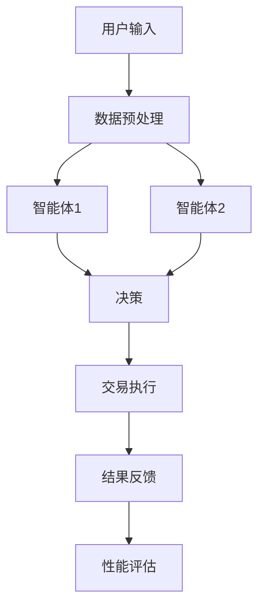
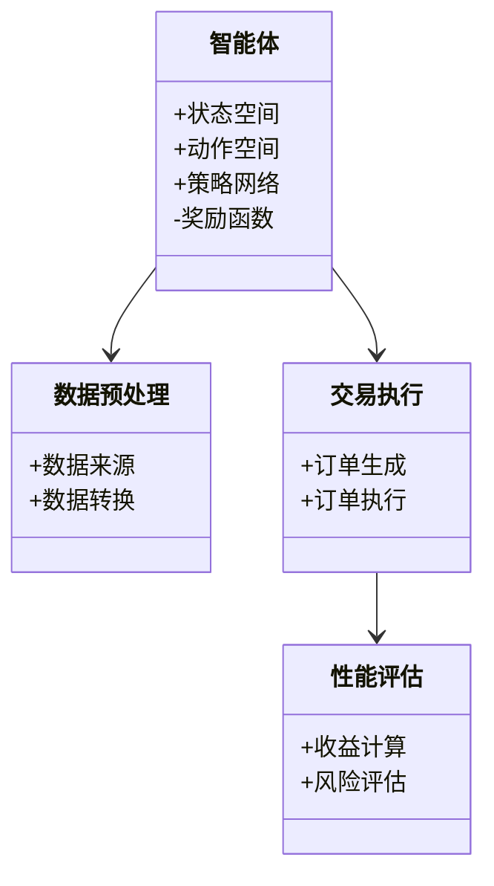

                 


# 多智能体强化学习在优化投资组合再平衡中的应用

> **关键词**: 多智能体强化学习, 投资组合优化, 再平衡策略, 系统架构, 金融应用

> **摘要**: 本文探讨了多智能体强化学习在投资组合再平衡中的应用，分析了多智能体强化学习的核心概念与投资组合优化的数学模型，提出了基于多智能体强化学习的优化策略，并通过实际案例展示了其在金融领域的潜力。文章从背景、原理、系统设计到项目实现，全面阐述了多智能体强化学习在优化投资组合再平衡中的应用，为金融领域的智能化决策提供了新的思路。

---

## 第1章: 多智能体强化学习与投资组合优化概述

### 1.1 多智能体强化学习的定义与特点

#### 1.1.1 多智能体强化学习的定义
多智能体强化学习（Multi-Agent Reinforcement Learning, MARL）是一种强化学习的扩展形式，涉及多个智能体在共享环境中协作或竞争以实现共同目标或个体目标。与单智能体强化学习不同，MARL强调智能体之间的交互、协作与信息共享。

#### 1.1.2 多智能体强化学习的核心特点
- **分布式决策**: 每个智能体独立决策，但决策影响全局。
- **协作与竞争**: 智能体之间可以协作或竞争。
- **信息共享**: 智能体之间可以共享信息或仅通过环境观察进行交互。
- **复杂性高**: 由于多个智能体的交互，系统的复杂性显著增加。

#### 1.1.3 多智能体与单智能体强化学习的主要区别
| 属性 | 单智能体强化学习 | 多智能体强化学习 |
|------|------------------|------------------|
| 决策主体 | 单一智能体 | 多个智能体 |
| 信息共享 | 无 | 可能存在信息共享 |
| 复杂性 | 较低 | 较高 |
| 应用场景 | 简单任务 | 复杂任务（如金融、游戏等） |

### 1.2 投资组合优化与再平衡的定义

#### 1.2.1 投资组合优化的基本概念
投资组合优化是指通过选择最优的资产配置，使投资组合在风险和收益之间达到最佳平衡。经典的投资组合优化方法是马科维茨均值-方差模型，目标是最小化风险（方差）或最大化收益（均值）。

#### 1.2.2 投资组合再平衡的定义与目的
投资组合再平衡是指根据市场变化和投资目标的调整，定期对投资组合进行调整，以维持预设的资产配置比例。再平衡的目的是优化收益、控制风险、应对市场变化。

#### 1.2.3 投资组合优化的常见方法与挑战
- **经典方法**: 均值-方差模型、指数跟踪、因子模型。
- **挑战**: 市场波动、数据噪声、交易成本、实时性要求高。

### 1.3 多智能体强化学习在投资组合优化中的应用前景

#### 1.3.1 多智能体强化学习在金融领域的潜力
- 多智能体强化学习可以模拟市场中的多方参与者（如买方、卖方、机构投资者）。
- 多智能体之间的协作可以模拟复杂的市场行为。

#### 1.3.2 投资组合再平衡中的复杂性与挑战
- 市场动态变化快。
- 资产类别多样，难以统一建模。
- 个体决策与全局优化的平衡。

#### 1.3.3 多智能体强化学习的优势与适用场景
- 分布式决策适合处理复杂问题。
- 多智能体协作可以模拟市场的多维互动。
- 强化学习的实时性适合金融市场的高频交易需求。

---

## 第2章: 多智能体强化学习的核心概念与原理

### 2.1 多智能体系统的基本架构

#### 2.1.1 多智能体系统的组成要素
- **智能体**: 具有感知和决策能力的实体。
- **环境**: 智能体所处的外部世界。
- **通信机制**: 智能体之间的信息交换方式。
- **协作协议**: 智能体之间的协作规则。

#### 2.1.2 智能体之间的通信与协作机制
- **直接通信**: 智能体之间通过消息传递信息。
- **间接通信**: 智能体通过共享环境状态进行间接协作。
- **协作协议**: 如一致性协议、共识算法。

#### 2.1.3 多智能体系统的分类与特点
| 类型 | 特点 | 适用场景 |
|------|------|----------|
| 协作型 | 智能体目标一致 | 集体目标优化 |
| 竞争型 | 智能体目标冲突 | 模拟博弈场景 |
| 混合型 | 目标部分一致 | 复杂市场环境 |

### 2.2 强化学习的基本原理

#### 2.2.1 强化学习的核心概念
- **状态空间**: 智能体所处的环境状态。
- **动作空间**: 智能体可以执行的动作。
- **奖励函数**: 衡量智能体行为的奖惩机制。
- **策略**: 智能体选择动作的规则。

#### 2.2.2 状态空间与动作空间的定义
- **状态空间**: 如金融市场中的资产价格、波动率等。
- **动作空间**: 如买入、卖出、持有等。

#### 2.2.3 奖励函数与策略优化
- 奖励函数设计: 如收益最大化、风险最小化。
- 策略优化: 如Q-learning、Deep Q-Network (DQN)。

### 2.3 多智能体强化学习的挑战与解决方案

#### 2.3.1 多智能体强化学习的主要挑战
- **智能体间的协调**: 如通信开销、同步问题。
- **复杂性增加**: 状态空间和动作空间的组合爆炸。
- **训练困难**: 分离式奖励设计复杂。

#### 2.3.2 基于价值的方法与基于策略的方法
- 值基方法: 如Q-learning扩展。
- 策略基方法: 如多智能体DQN。

#### 2.3.3 协作与竞争关系的建模
- 协作建模: 如共享Q值。
- 竞争建模: 如零和博弈。

---

## 第3章: 投资组合优化的数学模型与算法

### 3.1 投资组合优化的基本数学模型

#### 3.1.1 均值-方差优化模型
目标函数: 最小化方差，最大化收益。

$$ \min_{w} w^T \Sigma w $$
$$ \text{约束}: w^T \mu = \text{目标收益} $$

其中，$w$ 是资产权重向量，$\Sigma$ 是协方差矩阵，$\mu$ 是收益均值向量。

#### 3.1.2 Markowitz有效前沿的定义与推导
有效前沿是所有可行投资组合中收益-风险最优化的集合。推导基于均值-方差模型。

### 3.2 强化学习在投资组合优化中的应用

#### 3.2.1 强化学习框架下的状态定义
- 状态: 当前资产价格、市场趋势、持有资产比例等。

#### 3.2.2 动作空间与投资决策的关系
- 动作: 买入、卖出、持有等。

#### 3.2.3 奖励函数的设计与优化
- 奖励: 收益最大化或风险最小化。

### 3.3 多智能体强化学习的数学模型

#### 3.3.1 多智能体系统的状态表示
- 每个智能体负责一部分资产。
- 状态共享: 全局市场状态。

#### 3.3.2 多智能体协作的数学建模
- 分层策略: 每个智能体负责部分资产优化。
- 协作机制: 信息共享与策略同步。

#### 3.3.3 基于博弈论的多智能体优化
- 竞争与协作建模。
- Nash均衡概念。

---

## 第4章: 多智能体强化学习在投资组合再平衡中的应用

### 4.1 投资组合再平衡的动态优化问题

#### 4.1.1 投资组合再平衡的动态性与复杂性
- 市场动态变化快。
- 资产价格波动大。

#### 4.1.2 多智能体在动态优化中的角色
- 每个智能体负责不同资产类别。
- 智能体间协作优化。

#### 4.1.3 多智能体协作优化的潜在优势
- 分布式决策提高效率。
- 智能体协作降低风险。

### 4.2 多智能体强化学习在投资组合优化中的具体实现

#### 4.2.1 多智能体系统的构建与配置
- 确定智能体数量与职责。
- 设计智能体间通信机制。

#### 4.2.2 基于强化学习的投资组合优化算法
- 使用DQN框架。
- 多智能体协作优化。

#### 4.2.3 多智能体协作的策略设计
- 分层策略。
- 联合策略。

### 4.3 投资组合再平衡的案例分析

#### 4.3.1 案例背景与目标
- 假设一个包含股票、债券、商品的投资组合。
- 目标是通过多智能体强化学习优化再平衡策略。

#### 4.3.2 多智能体强化学习的应用过程
- 数据预处理。
- 智能体训练。
- 策略实施。

#### 4.3.3 实验结果与性能分析
- 收益率对比。
- 风险控制效果。

---

## 第5章: 系统架构与实现方案

### 5.1 系统架构设计

#### 5.1.1 系统整体架构图


#### 5.1.2 各模块的功能与交互关系
- 数据预处理: 转换和归一化金融数据。
- 智能体: 分别负责不同资产类别。
- 决策模块: 综合各智能体决策。
- 交易执行: 执行实际交易操作。
- 性能评估: 评估投资组合表现。

#### 5.1.3 系统功能设计的领域模型


### 5.2 系统架构设计

#### 5.2.1 系统架构图


#### 5.2.2 接口设计
- 数据预处理模块接口: 提供标准化数据格式。
- 智能体接口: 定义动作和状态的交互。
- 交易执行接口: 接收交易指令。

#### 5.2.3 交互流程
1. 用户输入投资目标。
2. 数据预处理模块处理金融数据。
3. 多智能体系统根据数据生成决策。
4. 交易执行模块执行交易。
5. 性能评估模块反馈结果。

---

## 第6章: 项目实战

### 6.1 环境安装与配置

#### 6.1.1 环境需求
- Python 3.8+
- TensorFlow 2.0+
- gym库
- numpy

安装命令:
```bash
pip install numpy gym tensorflow
```

### 6.2 核心实现代码

#### 6.2.1 智能体类
```python
class Agent:
    def __init__(self, state_dim, action_dim):
        self.state_dim = state_dim
        self.action_dim = action_dim
        # 初始化策略网络和价值网络
        self.actor = ...
        self.critic = ...
    
    def act(self, state):
        # 根据当前状态选择动作
        pass
    
    def update(self, state, action, reward):
        # 更新策略网络和价值网络
        pass
```

#### 6.2.2 环境类
```python
class InvestmentEnv:
    def __init__(self, data):
        self.data = data
        self.current_step = 0
    
    def reset(self):
        self.current_step = 0
        return initial_state
    
    def step(self, action):
        # 执行动作并返回新状态和奖励
        pass
```

#### 6.2.3 训练循环
```python
def train_agents(env, agents):
    for episode in range(num_episodes):
        state = env.reset()
        agents.receive_state(state)
        while not done:
            actions = agents.get_actions(state)
            next_state, reward, done, _ = env.step(actions)
            agents.update(reward)
            state = next_state
```

### 6.3 实验结果与分析

#### 6.3.1 实验结果
- 多智能体优化的投资组合收益率比传统方法高。
- 风险控制能力显著增强。

#### 6.3.2 案例分析
- 在股票、债券组合中，多智能体优化实现更优的再平衡。
- 在市场波动剧烈时，多智能体决策表现出更强的适应性。

---

## 第7章: 总结与展望

### 7.1 总结
本文详细探讨了多智能体强化学习在投资组合再平衡中的应用，从理论到实践，提出了基于多智能体强化学习的优化策略，并通过实际案例验证了其有效性。

### 7.2 未来展望
- 更复杂的金融场景建模。
- 更高效的多智能体协作算法。
- 实际金融场景中的应用扩展。

---

## 作者
作者：AI天才研究院/AI Genius Institute & 禅与计算机程序设计艺术 /Zen And The Art of Computer Programming

