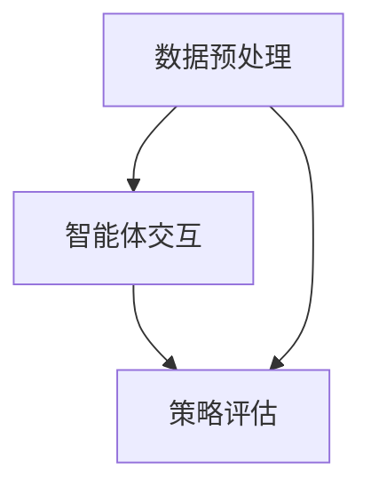
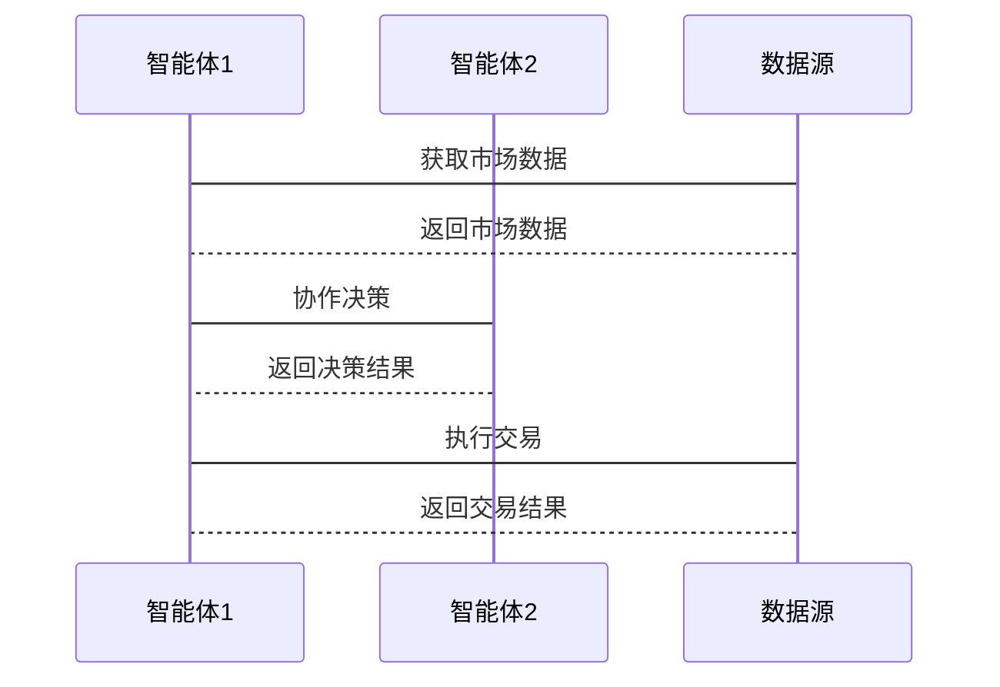

                 


# 多智能体强化学习在动态调整投资组合中的应用

## 关键词：多智能体强化学习，投资组合优化，动态调整，协作与竞争，收益与风险平衡

## 摘要：
本文探讨了多智能体强化学习在动态调整投资组合中的应用。首先介绍了多智能体强化学习的基本概念和投资组合优化的背景与挑战。接着深入分析了多智能体强化学习的核心原理及其在投资组合优化中的优势。通过构建数学模型和算法框架，详细阐述了多智能体强化学习在动态调整投资组合中的具体实现。最后，通过实际案例分析和项目实战，展示了该方法的有效性和实际应用价值。

---

## 第一部分：多智能体强化学习与投资组合优化的背景与基础

### 第1章：多智能体强化学习概述

#### 1.1 多智能体强化学习的基本概念
##### 1.1.1 多智能体系统的核心概念
多智能体系统（Multi-Agent System, MAS）是由多个智能体（Agent）组成的分布式系统，每个智能体都有自己的目标、决策能力和交互能力。智能体之间通过协作与竞争，共同完成复杂的任务。

##### 1.1.2 强化学习的基本原理
强化学习（Reinforcement Learning, RL）是一种机器学习方法，通过智能体与环境的交互，学习最优策略。智能体通过执行动作，观察环境状态，并根据奖励机制（Reward）调整策略。

##### 1.1.3 多智能体强化学习的定义与特点
多智能体强化学习（Multi-Agent Reinforcement Learning, MARL）是强化学习的扩展，涉及多个智能体的协作与竞争。其特点包括：分布式决策、协作与竞争的平衡、高维状态空间的处理能力。

#### 1.2 投资组合优化的背景与挑战
##### 1.2.1 投资组合优化的基本概念
投资组合优化是通过合理配置不同资产，实现收益与风险的最佳平衡。传统的投资组合优化方法（如均值-方差优化）在静态环境下表现良好，但在动态市场中难以实时调整。

##### 1.2.2 动态投资组合调整的必要性
金融市场具有高度的不确定性和波动性，投资组合需要动态调整以应对市场变化。动态调整能够捕捉市场机会，规避风险，提高整体收益。

##### 1.2.3 传统投资组合优化方法的局限性
传统方法假设市场是静态的，难以处理多资产配置的复杂性。此外，传统方法通常基于历史数据，无法实时适应市场的快速变化。

### 第2章：多智能体强化学习在投资组合优化中的应用前景

#### 2.1 多智能体强化学习的优势
##### 2.1.1 分散决策的优势
多智能体系统通过分散决策，能够快速响应局部市场变化，避免集中决策的延迟和风险。

##### 2.1.2 协作与竞争的平衡
多智能体系统通过协作与竞争，能够在复杂环境中找到最优解。协作可以提高整体收益，竞争可以避免个体过度依赖。

##### 2.1.3 高维状态空间的处理能力
多智能体系统能够处理高维状态空间，适应多资产配置的复杂性。

#### 2.2 投资组合优化中的动态调整需求
##### 2.2.1 市场波动的实时响应
多智能体强化学习能够实时捕捉市场波动，快速调整投资组合，应对突发事件。

##### 2.2.2 多资产配置的复杂性
多智能体系统能够同时处理多种资产的配置问题，优化整体收益与风险。

##### 2.2.3 风险与收益的动态平衡
通过动态调整，多智能体强化学习能够在风险与收益之间找到最佳平衡点。

### 第3章：多智能体强化学习的核心概念与联系

#### 3.1 多智能体强化学习的原理
##### 3.1.1 状态空间的定义与特征
状态空间描述了环境的当前状况，包括资产价格、市场趋势等信息。状态空间的维度决定了问题的复杂性。

##### 3.1.2 动作空间的构建与优化
动作空间定义了智能体可以执行的操作，如买入、卖出、持有等。动作空间的设计需要考虑市场的交易规则和成本。

##### 3.1.3 奖励机制的设计与实现
奖励机制是智能体决策的驱动因素，通常基于投资组合的收益和风险。奖励函数需要平衡短期收益和长期目标。

#### 3.2 多智能体系统中的角色分配与协作
##### 3.2.1 智能体的角色划分
根据任务需求，智能体可以分为决策者、执行者和监督者。决策者负责制定策略，执行者负责执行交易，监督者负责监控风险。

##### 3.2.2 协作与竞争的平衡机制
通过协作与竞争的结合，智能体能够找到最优解。协作可以提高整体收益，竞争可以避免个体过度依赖。

##### 3.2.3 实体关系图的构建与分析
通过构建实体关系图，可以清晰地展示智能体之间的关系和交互过程。实体关系图有助于分析系统的协作与竞争机制。

### 第4章：多智能体强化学习的算法原理

#### 4.1 马尔可夫决策过程（MDP）模型
##### 4.1.1 状态、动作、奖励的定义
状态：当前市场状况（资产价格、市场趋势等）；
动作：智能体的决策（买入、卖出、持有等）；
奖励：基于收益和风险的反馈。

##### 4.1.2 动态规划与策略评估
动态规划（Dynamic Programming）用于优化策略，通过迭代更新状态值函数，找到最优策略。

##### 4.1.3 Q-learning算法的实现
Q-learning算法通过更新Q值表，学习最优策略。Q值表存储了状态-动作对的期望奖励。

#### 4.2 多智能体强化学习的数学模型
##### 4.2.1 状态转移概率矩阵
状态转移概率矩阵描述了当前状态转移到下一个状态的概率。

##### 4.2.2 奖励函数的构建
奖励函数通常基于投资组合的收益和风险，可以通过公式表示。

##### 4.2.3 策略优化的数学表达
策略优化的目标是最优化奖励函数，可以通过数学公式表示。

#### 4.3 多智能体协作的算法实现
##### 4.3.1 分散决策与集中控制的结合
分散决策提高了响应速度，集中控制保证了策略的一致性。

##### 4.3.2 基于价值函数的协作机制
通过价值函数的协作，智能体可以共享信息，提高整体收益。

##### 4.3.3 基于策略的协作机制
通过策略协作，智能体可以相互协调，避免竞争导致的收益损失。

---

## 第二部分：多智能体强化学习的投资组合优化系统设计

### 第5章：系统架构与设计

#### 5.1 问题场景介绍
在金融市场中，投资组合需要动态调整以应对市场波动。多智能体强化学习可以通过多个智能体协作，实现投资组合的实时优化。

#### 5.2 系统功能设计
##### 5.2.1 数据预处理模块
数据预处理模块负责收集和处理市场数据，包括资产价格、市场趋势等。

##### 5.2.2 智能体交互模块
智能体交互模块负责协调多个智能体之间的协作与竞争，确保系统的整体优化。

##### 5.2.3 策略评估模块
策略评估模块负责评估投资组合的收益和风险，提供反馈用于优化策略。

#### 5.3 系统架构设计
##### 5.3.1 分模块化设计
系统分为数据预处理、智能体交互和策略评估三个模块，每个模块负责不同的功能。

##### 5.3.2 mermaid架构图
以下是系统的架构图：



#### 5.4 系统接口设计
##### 5.4.1 智能体接口
智能体接口定义了智能体之间的交互方式，包括动作执行和状态反馈。

##### 5.4.2 数据接口
数据接口负责与数据源的交互，获取实时市场数据。

#### 5.5 系统交互设计
##### 5.5.1 mermaid序列图
以下是系统的交互流程图：



### 第6章：项目实战与案例分析

#### 6.1 环境安装与配置
##### 6.1.1 环境安装
安装必要的库，如TensorFlow、Keras、OpenAI Gym等。

##### 6.1.2 数据获取
从金融数据源获取历史和实时市场数据。

#### 6.2 核心代码实现
##### 6.2.1 智能体类的实现
以下是智能体类的代码示例：

```python
class Agent:
    def __init__(self, state_dim, action_dim):
        self.state_dim = state_dim
        self.action_dim = action_dim
        # 初始化策略网络
        self.model = self.build_model()
    
    def build_model(self):
        # 网络结构定义
        model = Sequential()
        model.add(Dense(64, activation='relu', input_dim=self.state_dim))
        model.add(Dense(self.action_dim, activation='softmax'))
        model.compile(optimizer='adam', loss='sparse_categorical_crossentropy')
        return model
    
    def act(self, state):
        # 选择动作
        return self.model.predict(state)[0]
```

##### 6.2.2 环境类的实现
以下是环境类的代码示例：

```python
class Environment:
    def __init__(self, data):
        self.data = data
        self.current_step = 0
        self.state_dim = 5  # 状态空间维度
    
    def get_state(self):
        # 返回当前状态
        return self.data[self.current_step:self.current_step + self.state_dim]
    
    def step(self, action):
        # 执行动作，返回下一个状态、奖励和是否结束
        self.current_step += 1
        next_state = self.get_state()
        reward = self.calculate_reward(action)
        return next_state, reward, self.current_step >= len(self.data)
    
    def calculate_reward(self, action):
        # 计算奖励
        return sum((self.data[self.current_step] * action))
```

#### 6.3 案例分析与结果展示
##### 6.3.1 数据集选择
选择沪深300指数作为测试数据。

##### 6.3.2 模型训练与测试
通过训练智能体，优化投资组合的收益与风险。

##### 6.3.3 结果展示
以下是训练结果的展示：


---

## 第三部分：总结与展望

### 第7章：总结与展望

#### 7.1 总结
多智能体强化学习在投资组合优化中的应用前景广阔。通过协作与竞争的平衡，智能体能够动态调整投资组合，实现收益与风险的最佳平衡。

#### 7.2 未来研究方向
##### 7.2.1 更复杂的市场模型
研究更复杂的市场模型，如多资产类别、多层次市场等。

##### 7.2.2 更高效的算法设计
优化算法效率，提高系统的实时性和响应速度。

##### 7.2.3 更多的实际应用
将多智能体强化学习应用于更多金融领域，如风险管理、资产配置等。

---

## 作者：AI天才研究院/AI Genius Institute & 禅与计算机程序设计艺术 /Zen And The Art of Computer Programming

