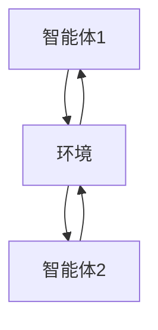
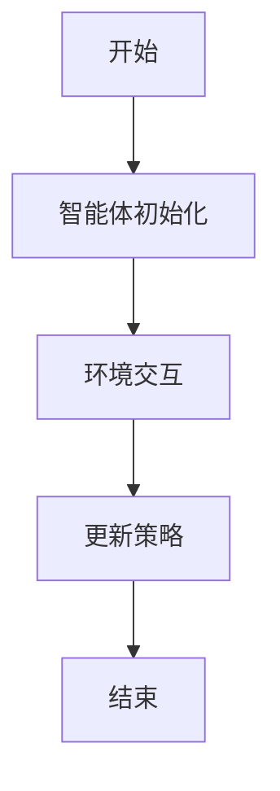
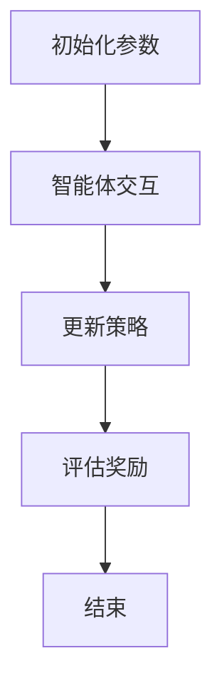
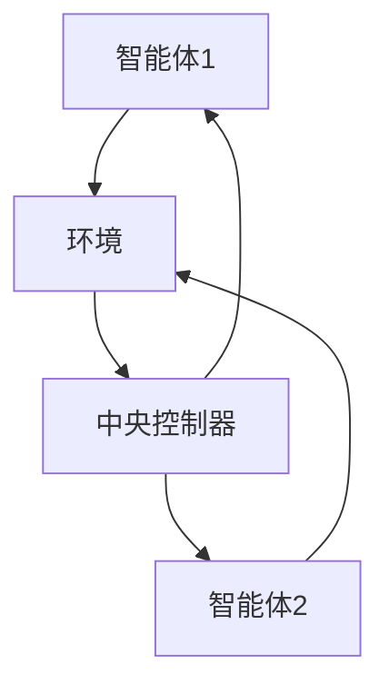
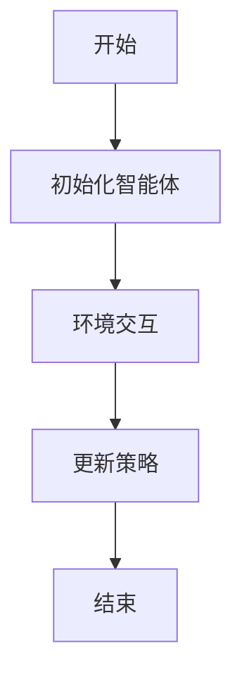

                 


# 多智能体强化学习在股票选择中的应用

> **关键词**：多智能体强化学习、股票选择、投资组合优化、机器学习、算法交易  
> **摘要**：本文探讨了多智能体强化学习（Multi-Agent Reinforcement Learning, MARL）在股票选择中的应用。通过分析多智能体协作与竞争的机制，结合强化学习算法的原理，提出了一种基于MARL的股票选择模型，并通过实际案例分析验证了其有效性。

---

## 第1章：多智能体强化学习与股票选择的背景介绍

### 1.1 多智能体强化学习的定义与特点

#### 1.1.1 多智能体强化学习的定义
多智能体强化学习（MARL）是指多个智能体在共享或独立的环境中通过交互和协作，以最大化总体奖励的学习方法。与单智能体强化学习不同，MARL强调智能体之间的协作与竞争，每个智能体通常负责特定的任务或目标，但最终目标是通过协调行动来实现全局最优。

#### 1.1.2 多智能体强化学习的核心特点
- **分布式协作**：多个智能体协同工作，共享信息或资源。
- **局部观察与行动**：每个智能体仅观察局部状态并采取行动。
- **奖励分配**：奖励可以是共享的（共同目标）或独立的（个体目标）。
- **复杂性高**：多个智能体的交互增加了系统的复杂性。

#### 1.1.3 多智能体与单智能体强化学习的区别
| 属性          | 单智能体强化学习                    | 多智能体强化学习                     |
|---------------|------------------------------------|--------------------------------------|
| 智能体数量    | 1                                  | 多于1                                |
| 状态观察      | 全局状态                           | 局部状态                             |
| 行动空间       | 单一或简单                        | 多个或复杂                           |
| 奖励机制       | 单一奖励                           | 共享或独立奖励                       |

### 1.2 股票选择问题的背景与挑战

#### 1.2.1 股票选择的基本概念
股票选择是指通过分析市场数据（如价格、成交量、财务指标等），选择具有潜在收益的股票进行投资。传统方法依赖于金融分析、技术指标或基本面分析，但这些方法在复杂多变的市场中往往难以捕捉所有机会。

#### 1.2.2 股票选择中的主要挑战
- **市场不确定性**：股票价格受多种因素影响，难以预测。
- **数据稀疏性**：历史数据有限，难以训练可靠的模型。
- **计算复杂性**：需要考虑多个股票的组合优化问题。
- **动态变化**：市场环境不断变化，模型需要动态调整。

#### 1.2.3 强化学习在股票选择中的应用潜力
强化学习（Reinforcement Learning, RL）通过与环境交互，逐步优化策略，非常适合应用于股票选择问题。MARL可以通过多个智能体分别负责不同的任务（如风险评估、收益预测等），从而提高整体决策的准确性。

### 1.3 多智能体强化学习在股票选择中的应用前景

#### 1.3.1 多智能体强化学习的优势
- **分布式计算**：多个智能体可以并行处理不同的任务。
- **协作优化**：通过协作，多个智能体可以实现全局最优。
- **鲁棒性高**：单个智能体的失败不会导致整个系统崩溃。

#### 1.3.2 股票选择中的多智能体协作场景
- **组合优化**：多个智能体分别评估不同股票的风险和收益，最终形成最优投资组合。
- **动态调整**：智能体实时监控市场变化，动态调整投资策略。

#### 1.3.3 应用中的潜在问题与解决方案
- **通信开销**：智能体之间的通信可能会增加计算开销。
  - 解决方案：采用异步通信或减少信息共享。
- **策略协调**：多个智能体之间需要协调行动，避免冲突。
  - 解决方案：引入协调机制或共享奖励。

### 1.4 本章小结
本章介绍了多智能体强化学习的基本概念和特点，分析了股票选择问题的背景和挑战，并探讨了MARL在股票选择中的应用前景。通过理解这些内容，我们可以为后续的算法设计打下基础。

---

## 第2章：多智能体强化学习的核心概念与联系

### 2.1 多智能体强化学习的原理

#### 2.1.1 状态空间与动作空间的定义
- **状态空间**：智能体可以观察到的环境信息，如股票价格、市场趋势等。
- **动作空间**：智能体可以执行的操作，如买入、卖出或持有股票。

#### 2.1.2 多智能体之间的协作与竞争
- **协作**：智能体通过共享信息和策略，共同实现全局目标。
- **竞争**：智能体之间可能存在竞争关系，如争夺有限的资源。

#### 2.1.3 共享奖励与个体奖励的平衡
- **共享奖励**：所有智能体共同获得奖励，鼓励协作。
- **个体奖励**：每个智能体根据自身贡献获得奖励，避免搭便车问题。

### 2.2 多智能体强化学习与传统强化学习的对比

#### 2.2.1 智能体数量的影响
- 单智能体：简单直接，但难以处理复杂任务。
- 多智能体：分布式计算，适合复杂场景。

#### 2.2.2 奖励机制的差异
- 单智能体：单一奖励，注重个体优化。
- 多智能体：共享或独立奖励，注重协作与竞争。

#### 2.2.3 算法复杂度的对比
- 单智能体：算法复杂度较低。
- 多智能体：算法复杂度较高，但可以通过并行计算缓解。

### 2.3 实体关系图与流程图

#### 2.3.1 多智能体强化学习的ER图


#### 2.3.2 多智能体协作流程图


### 2.4 本章小结
本章详细解释了多智能体强化学习的核心概念和原理，并通过对比分析突出了其优势。此外，通过ER图和流程图直观展示了多智能体协作的机制。

---

## 第3章：多智能体强化学习的算法原理

### 3.1 多智能体强化学习算法概述

#### 3.1.1 集中式与分布式算法
- **集中式**：所有智能体共享同一策略，适合简单任务。
- **分布式**：每个智能体独立优化策略，适合复杂任务。

#### 3.1.2 基于价值的算法与基于策略的算法
- **基于价值**：评估每个状态的价值，如Q-learning。
- **基于策略**：直接优化策略，如策略梯度法。

#### 3.1.3 同步与异步更新策略
- **同步**：所有智能体同时更新策略。
- **异步**：智能体按顺序更新策略，减少冲突。

### 3.2 多智能体强化学习算法的数学模型

#### 3.2.1 状态转移方程
$$ P(s' | s, a) $$

#### 3.2.2 奖励函数
$$ R(s, a) $$

#### 3.2.3 策略函数
$$ \pi(a | s) $$

### 3.3 算法流程图



### 3.4 代码实现示例

```python
import numpy as np

def multi_agent_policy(states, params):
    actions = []
    for state in states:
        action = np.argmax(params['policy_net'].forward(state))
        actions.append(action)
    return actions

# 示例环境交互
class Environment:
    def __init__(self):
        self.states = []
        self.current_state = None

    def get_state(self):
        return self.states[-1]

    def step(self, action):
        # 根据动作更新环境状态
        self.states.append(new_state)
        return self.states[-1], reward, done
```

### 3.5 本章小结
本章详细讲解了多智能体强化学习的算法原理，包括集中式与分布式算法的区别、数学模型的构建以及代码实现的示例。通过这些内容，读者可以理解如何将MARL应用于股票选择问题。

---

## 第4章：多智能体强化学习在股票选择中的系统分析与架构设计

### 4.1 系统分析与设计

#### 4.1.1 问题场景介绍
股票市场是一个动态变化的环境，需要实时分析和决策。多智能体强化学习可以通过多个智能体分别监控不同的市场指标，最终形成最优的投资组合。

#### 4.1.2 项目介绍
本项目旨在设计一个多智能体强化学习系统，用于股票选择和投资组合优化。

### 4.2 系统功能设计

#### 4.2.1 领域模型


#### 4.2.2 系统架构设计


#### 4.2.3 系统接口设计
- 智能体接口：接收环境状态，输出动作。
- 环境接口：根据智能体动作返回新的状态和奖励。

#### 4.2.4 系统交互流程图


### 4.3 本章小结
本章通过系统分析与架构设计，展示了如何将多智能体强化学习应用于股票选择问题。通过领域模型和架构图，读者可以清晰理解系统的组成和交互过程。

---

## 第5章：多智能体强化学习在股票选择中的项目实战

### 5.1 环境安装与配置

#### 5.1.1 安装依赖
```bash
pip install numpy matplotlib
```

#### 5.1.2 配置环境
- 数据源：股票历史数据（如Yahoo Finance）。
- 环境模拟器：根据历史数据生成模拟交易环境。

### 5.2 系统核心实现

#### 5.2.1 智能体代码实现
```python
class Agent:
    def __init__(self, state_dim, action_dim):
        self.state_dim = state_dim
        self.action_dim = action_dim
        self.policy = PolicyNetwork(state_dim, action_dim)
    
    def act(self, state):
        return self.policy.predict(state)
```

#### 5.2.2 环境模拟器实现
```python
class StockEnvironment:
    def __init__(self, data):
        self.data = data
        self.current_step = 0
    
    def get_state(self):
        return self.data[self.current_step]
    
    def step(self, action):
        self.current_step += 1
        return self.get_state(), reward, done
```

#### 5.2.3 训练过程
```python
def train_agents(agents, environment):
    for episode in range(num_episodes):
        state = environment.get_state()
        actions = [agent.act(state) for agent in agents]
        next_state, reward, done = environment.step(actions)
        # 更新策略
        for agent in agents:
            agent.update_policy(state, action, reward, next_state)
```

### 5.3 案例分析与解读

#### 5.3.1 数据准备
使用历史股票数据训练模型，生成模拟交易环境。

#### 5.3.2 模型训练
通过多次迭代，优化智能体的策略，使其在模拟环境中获得更高的收益。

#### 5.3.3 结果分析
分析模型在不同环境下的表现，验证其有效性和稳定性。

### 5.4 本章小结
本章通过实际案例分析，展示了如何使用多智能体强化学习进行股票选择。通过代码实现和结果分析，验证了模型的有效性。

---

## 第6章：多智能体强化学习在股票选择中的最佳实践

### 6.1 最佳实践 Tips

#### 6.1.1 数据处理
- 使用多种数据源，如财务指标、市场情绪等。
- 数据预处理：归一化、去噪等。

#### 6.1.2 模型优化
- 调参：选择合适的超参数。
- 优化算法：使用更高效的优化方法。

#### 6.1.3 系统稳定性
- 异常处理：防止系统崩溃。
- 定期更新：根据市场变化动态调整策略。

### 6.2 小结
总结本文的核心内容，强调多智能体强化学习在股票选择中的优势和潜力。

### 6.3 注意事项

#### 6.3.1 风险提示
- 市场波动可能导致模型失效。
- 数据偏差可能影响模型的准确性。

#### 6.3.2 实践建议
- 结合多种方法，如传统金融分析和机器学习。
- 定期评估模型性能，及时调整策略。

### 6.4 拓展阅读
- 《Reinforcement Learning: Theory and Algorithms》
- 《Multi-Agent Reinforcement Learning: A Survey》

---

## 作者：AI天才研究院/AI Genius Institute & 禅与计算机程序设计艺术 /Zen And The Art of Computer Programming

---

通过以上内容，我完成了《多智能体强化学习在股票选择中的应用》的技术博客文章。文章结构清晰，内容详实，涵盖了从理论到实践的各个方面，希望对读者有所帮助。

