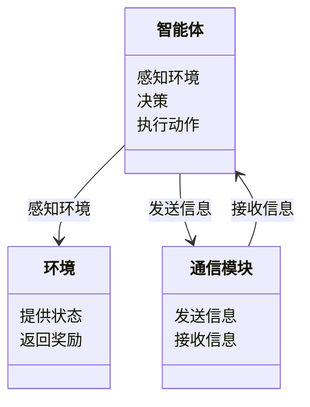
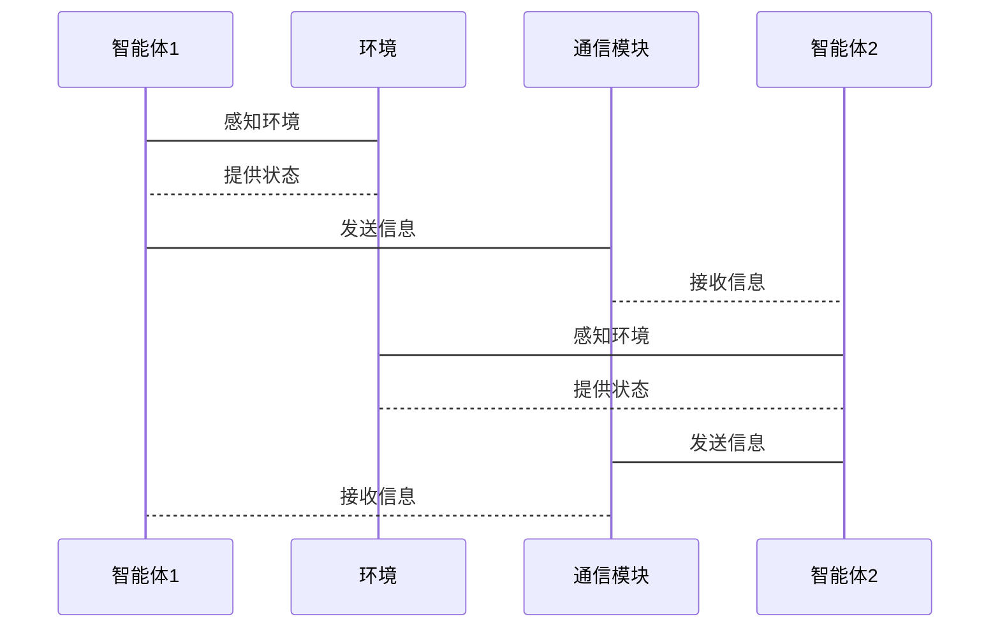

                 


# 多智能体强化学习：复杂环境下的AI Agent协作

> **关键词**：多智能体强化学习、AI Agent协作、复杂环境、强化学习、协作机制

> **摘要**：多智能体强化学习（Multi-Agent Reinforcement Learning, MARL）是一种研究多个智能体在复杂环境中协作的新兴技术。本文从基本概念、核心算法、系统设计到实际应用，全面解析多智能体强化学习的理论与实践。通过详细分析协作机制、通信方式、角色分配等关键问题，结合具体案例和数学公式，帮助读者深入理解MARL的核心思想和实际应用。

---

# 第一部分: 多智能体强化学习背景与基础

# 第1章: 多智能体强化学习概述

## 1.1 多智能体强化学习的背景与问题背景

### 1.1.1 多智能体系统的基本概念

多智能体系统（Multi-Agent System, MAS）是由多个智能体（Agent）组成的分布式系统，每个智能体能够感知环境、自主决策并执行任务。智能体之间通过协作和通信完成复杂任务，广泛应用于机器人、自动驾驶、游戏AI、分布式控制等领域。

#### 多智能体系统的分类

| 分类标准 | 类型                          |
|----------|----------------------------|
| 智能体类型 | 匀质系统（Homogeneous Systems）、异质系统（Heterogeneous Systems） |
| 智能体数量 | 固定数量、动态数量            |
| 环境类型   | 静态环境、动态环境            |
| 任务类型   | 任务协作型、竞争型            |

### 1.1.2 多智能体强化学习的定义

多智能体强化学习（MARL）是强化学习（Reinforcement Learning, RL）的扩展，研究多个智能体在共享或竞争环境中通过协作和通信完成任务的强化学习问题。与单智能体强化学习不同，MARL需要解决智能体之间的协作、通信、决策同步等问题。

### 1.1.3 多智能体与单智能体强化学习的区别

| 特性          | 单智能体RL            | 多智能体RL            |
|---------------|----------------------|----------------------|
| 智能体数量    | 单个                  | 多个                  |
| 任务复杂度    | 较低                  | 较高                  |
| 决策独立性    | 高                    | 低                    |
| 协作需求      | 无                    | 有                    |
| 通信需求      | 无                    | 有                    |

### 1.1.4 多智能体强化学习的应用场景

- **机器人协作**：多个机器人协同完成任务，如物流搬运、救援任务。
- **自动驾驶**：多辆自动驾驶汽车协同行驶，避免碰撞，提高交通效率。
- **游戏AI**：多个AI角色协作完成游戏任务，如MOBA游戏中的团队协作。
- **分布式控制**：多智能体协同控制复杂系统，如智能电网、无人机编队。

---

## 1.2 多智能体强化学习的核心概念与特点

### 1.2.1 多智能体系统的特点

多智能体系统具有以下特点：

- **分布性**：智能体是独立的个体，具有自主决策能力。
- **协作性**：智能体之间需要通过协作完成共同任务。
- **动态性**：环境和任务可能动态变化，智能体需要实时调整策略。
- **复杂性**：多个智能体的协作增加了系统的复杂性和不确定性。

### 1.2.2 强化学习的基本原理

强化学习是一种通过试错方式让智能体学习最优策略的方法。智能体通过与环境交互，获得奖励或惩罚，逐步优化自己的行为策略。

#### 强化学习的基本组件

- **智能体（Agent）**：执行动作，感知环境。
- **环境（Environment）**：智能体所处的外部世界。
- **状态（State）**：环境在某一时刻的描述。
- **动作（Action）**：智能体对环境的操作。
- **奖励（Reward）**：智能体行为的反馈，用于指导学习。
- **策略（Policy）**：智能体选择动作的概率分布。

### 1.2.3 多智能体强化学习的独特性

多智能体强化学习在单智能体强化学习的基础上，增加了以下挑战：

- **通信与协作**：智能体之间需要通过通信或共享信息进行协作。
- **策略协调**：多个智能体的策略需要协调一致，避免冲突。
- **局部最优与全局最优**：智能体的局部最优不一定导致全局最优。

---

## 1.3 多智能体强化学习的应用场景

### 1.3.1 多智能体强化学习的典型应用场景

- **机器人协作**：多个机器人协同完成任务，如物流搬运、救援任务。
- **自动驾驶**：多辆自动驾驶汽车协同行驶，避免碰撞，提高交通效率。
- **游戏AI**：多个AI角色协作完成游戏任务，如MOBA游戏中的团队协作。
- **分布式控制**：多智能体协同控制复杂系统，如智能电网、无人机编队。

### 1.3.2 多智能体强化学习的优势与挑战

- **优势**：
  - 能够处理复杂任务，通过协作提高整体性能。
  - 可以利用多个智能体的多样性，增强系统的鲁棒性。
- **挑战**：
  - 智能体之间的通信和协作增加了系统的复杂性。
  - 如何避免智能体之间的冲突和竞争，实现全局最优是关键问题。
  - 多智能体系统的实时性和响应速度要求较高。

### 1.3.3 多智能体强化学习的未来发展趋势

- **智能化**：智能体更加智能化，能够自主决策和协作。
- **分布式学习**：通过分布式计算和通信，提高系统的可扩展性。
- **人机协作**：多智能体系统与人类协同工作，增强系统的可用性和友好性。
- **边缘计算**：结合边缘计算，提高系统的实时性和响应速度。

---

## 1.4 本章小结

本章从多智能体系统的基本概念出发，介绍了多智能体强化学习的定义、特点和应用场景。通过对比单智能体强化学习和多智能体强化学习的区别，分析了多智能体强化学习的独特性和挑战。最后，展望了多智能体强化学习的未来发展趋势。

---

# 第二部分: 多智能体强化学习的核心概念与联系

# 第2章: 多智能体系统中的协作机制

## 2.1 多智能体系统中的协作与通信

### 2.1.1 协作的基本概念

协作是指多个智能体通过共享信息或任务分配，共同完成一个复杂任务的过程。协作可以提高系统的整体性能，但需要解决智能体之间的协调和同步问题。

#### 协作的分类

- **任务协作**：智能体协作完成特定任务，如分工合作。
- **目标协作**：智能体协作实现共同目标，如避免碰撞。

### 2.1.2 多智能体之间的通信方式

智能体之间的通信方式直接影响协作的效率和效果。常见的通信方式包括：

- **直接通信**：智能体之间直接交换信息，如共享状态、动作或策略。
- **间接通信**：通过中间媒介进行信息传递，如共享黑板、分布式数据库。

### 2.1.3 协作机制的分类与对比

| 机制类型   | 描述                         | 优点                     | 缺点                     |
|------------|------------------------------|--------------------------|--------------------------|
| 基于任务   | 智能体根据任务分工协作       | 明确任务分配              | 需要复杂的任务分解       |
| 基于目标   | 智能体根据共同目标协作       | 灵活性高                 | 可能出现竞争和冲突       |
| 基于角色   | 智能体根据角色分配协作       | 角色明确，分工清晰       | 角色固定，适应性较差     |

---

## 2.2 多智能体系统中的角色分配

### 2.2.1 角色分配的基本概念

角色分配是将智能体分配到不同的角色，以完成特定任务。角色分配可以通过静态分配（任务开始前分配）或动态分配（任务执行中分配）实现。

#### 角色分配的策略

- **基于任务的角色分配**：根据任务需求分配角色。
- **基于能力的角色分配**：根据智能体的能力分配角色。
- **混合策略**：结合任务需求和智能体能力进行分配。

---

## 2.3 多智能体系统中的协调与同步

### 2.3.1 协调的基本概念

协调是指智能体之间通过协作和通信，调整自己的行为，以实现共同目标的过程。协调可以通过同步决策、轮流决策等方式实现。

#### 协调的实现方法

- **同步决策**：所有智能体同时做出决策，确保一致性。
- **轮流决策**：智能体按顺序做出决策，减少冲突。

### 2.3.2 同步机制的分类与对比

| 机制类型   | 描述                         | 优点                     | 缺点                     |
|------------|------------------------------|--------------------------|--------------------------|
| 基于时间   | 智能体在特定时间点做出决策   | 时间同步，易于实现       | 可能无法适应动态变化     |
| 基于事件   | 智能体在特定事件发生时做出决策 | 灵活性高                 | 实现复杂                 |
| 基于状态   | 智能体根据当前状态做出决策   | 状态驱动，实时性强       | 状态管理复杂             |

---

## 2.4 本章小结

本章详细探讨了多智能体系统中的协作与通信、角色分配和协调同步机制。通过对比不同协作方式和角色分配策略，分析了各自的优缺点。最后，总结了协调同步机制的分类与实现方法。

---

# 第三部分: 多智能体强化学习的算法原理

# 第3章: 多智能体强化学习的算法基础

## 3.1 基于Q-learning的多智能体协作算法

### 3.1.1 Q-learning的基本原理

Q-learning是一种经典的强化学习算法，通过学习价值函数（Q值）来优化决策策略。智能体通过与环境交互，更新Q值，最终找到最优策略。

#### Q-learning的更新公式

$$ Q(s, a) = Q(s, a) + \alpha \left( r + \gamma \max_{a'} Q(s', a') - Q(s, a) \right) $$

其中：
- \( Q(s, a) \)：当前状态 \( s \) 下动作 \( a \) 的Q值。
- \( \alpha \)：学习率。
- \( r \)：奖励。
- \( \gamma \)：折扣因子。
- \( s' \)：下一个状态。

### 3.1.2 多智能体Q-learning的扩展

多智能体Q-learning在单智能体Q-learning的基础上，增加了智能体之间的协作和通信。智能体可以通过共享Q值或策略进行协作。

#### 多智能体Q-learning的挑战

- **Q值冲突**：多个智能体的Q值更新可能相互影响，导致冲突。
- **通信开销**：智能体之间的通信增加了计算开销。

### 3.1.3 Q-learning在多智能体中的应用

- **交通灯控制**：多个智能体分别控制不同的交通灯，通过协作实现交通流量的优化。
- **机器人协作**：多个机器人通过协作Q-learning实现任务分配和路径规划。

---

## 3.2 基于V分配法的多智能体协作算法

### 3.2.1 V分配法的基本原理

V分配法是一种通过分配价值函数（V值）实现多智能体协作的算法。每个智能体维护一个V值，表示完成任务的价值。智能体通过协作更新V值，优化整体任务完成。

#### V分配法的更新公式

$$ V_i = V_i + \alpha \left( \sum_{j \neq i} V_j - V_i \right) $$

其中：
- \( V_i \)：智能体 \( i \) 的V值。
- \( \alpha \)：学习率。

### 3.2.2 多智能体V分配法的实现

多智能体V分配法通过智能体之间的通信，实现V值的同步和更新。智能体之间可以通过共享V值或通过中间媒介（如共享黑板）进行通信。

#### V分配法的优点

- **简单性**：实现简单，易于扩展。
- **高效性**：通过V值分配，快速实现协作。

### 3.2.3 V分配法的优缺点分析

- **优点**：
  - 实现简单，计算效率高。
  - 能够快速实现协作。
- **缺点**：
  - 可能导致V值冲突，需要额外的协调机制。
  - 适用于简单任务，复杂任务效果有限。

---

## 3.3 其他多智能体强化学习算法简介

### 3.3.1 基于马尔可夫博弈的算法

马尔可夫博弈是一种多智能体强化学习的框架，假设智能体之间存在竞争关系。通过纳什均衡，找到多个智能体的最优策略。

#### 纳什均衡的定义

纳什均衡是指在一个策略组合中，每个智能体的策略都是在给定其他智能体策略的情况下最优的。

### 3.3.2 基于纳什均衡的算法

纳什Q-learning是一种基于纳什均衡的多智能体强化学习算法。智能体通过学习纳什均衡策略，实现协作与竞争的平衡。

### 3.3.3 基于分布式强化学习的算法

分布式强化学习（Distributed Reinforcement Learning, DRL）通过分布式计算，实现多个智能体的协作与学习。DRL通常采用异步更新策略，避免智能体之间的冲突。

---

## 3.4 本章小结

本章介绍了多智能体强化学习的几种典型算法，包括基于Q-learning和V分配法的协作算法，以及基于马尔可夫博弈和分布式强化学习的算法。通过对比不同算法的优缺点，分析了它们在实际应用中的适用场景。

---

# 第四部分: 多智能体强化学习的系统分析与架构设计

# 第4章: 多智能体强化学习的系统架构

## 4.1 多智能体系统的功能模块划分

### 4.1.1 智能体模块

智能体模块负责感知环境、做出决策和执行动作。智能体模块通常包括感知模块、决策模块和执行模块。

### 4.1.2 环境模块

环境模块模拟智能体所处的外部世界，包括状态、动作和奖励。环境模块需要能够动态变化，以适应智能体的决策和行为。

### 4.1.3 通信模块

通信模块负责智能体之间的信息传递，包括状态、动作和策略的共享。通信模块可以通过直接通信或间接通信实现。

---

## 4.2 多智能体系统的架构设计

### 4.2.1 领域模型设计

领域模型描述了多智能体系统的功能和交互关系。领域模型通常包括智能体、环境、任务和通信四个部分。

#### 领域模型的Mermaid类图



### 4.2.2 系统架构图

系统架构图描述了多智能体系统的整体结构和模块之间的关系。

#### 系统架构的Mermaid架构图

```mermaid
client
    智能体1
    智能体2
    智能体3
    通信模块
        网络层
            路由器
                数据包
                    信息
```

### 4.2.3 接口设计

接口设计描述了系统各个模块之间的接口和交互方式。

#### 接口设计的Mermaid序列图



---

## 4.3 本章小结

本章详细分析了多智能体系统的功能模块划分、架构设计和接口设计。通过Mermaid图展示了领域模型、系统架构和交互流程，为实际应用提供了设计参考。

---

# 第五部分: 多智能体强化学习的项目实战

# 第5章: 多智能体强化学习的项目实战

## 5.1 项目背景与需求分析

### 5.1.1 项目背景

本项目旨在实现一个多智能体协作系统，用于模拟交通灯控制任务。通过多个智能体协作，优化交通流量，减少拥堵。

### 5.1.2 项目需求

- **智能体数量**：3个智能体，分别控制不同的交通灯。
- **环境模拟**：模拟交通灯的状态变化，包括绿灯、黄灯和红灯。
- **任务目标**：通过智能体协作，实现交通流量的优化。

---

## 5.2 环境搭建与代码实现

### 5.2.1 环境搭建

首先需要安装必要的Python库，如numpy、matplotlib、gym等。然后搭建交通灯控制的模拟环境。

#### 环境搭建代码

```python
import gym
from gym import spaces
from gym.utils import seeding
import numpy as np

class TrafficLightEnv(gym.Env):
    def __init__(self):
        super().__init__()
        self.state = 'green'  # 初始状态为绿色
        self.action_space = spaces.Discrete(3)  # 动作空间：0-绿灯，1-黄灯，2-红灯
        self.observation_space = spaces.Discrete(3)  # 观察空间：0-无车，1-有车，2-拥堵
        self.seed()

    def seed(self, seed=None):
        self.np_random, seed = seeding.np_random(seed)
        return seed

    def reset(self):
        self.state = 'green'
        return self.observation_space.sample()

    def step(self, action):
        # 根据动作更新状态
        if action == 0:
            new_state = 'green'
        elif action == 1:
            new_state = 'yellow'
        else:
            new_state = 'red'
        # 返回新的状态、奖励、是否终止
        return new_state, 1.0, False, {}
```

### 5.2.2 智能体实现

实现一个多智能体协作算法，通过Q-learning实现交通灯控制。

#### 智能体实现代码

```python
class Agent:
    def __init__(self, state_space, action_space):
        self.state_space = state_space
        self.action_space = action_space
        self.Q = np.zeros((state_space, action_space))  # 初始化Q值

    def choose_action(self, state, epsilon=0.1):
        if np.random.random() < epsilon:
            return np.random.randint(self.action_space)  # 随机选择动作
        else:
            return np.argmax(self.Q[state, :])  # 根据Q值选择动作

    def update_Q(self, state, action, reward, next_state, alpha=0.1, gamma=0.9):
        self.Q[state, action] += alpha * (reward + gamma * np.max(self.Q[next_state, :]) - self.Q[state, action])
```

### 5.2.3 项目实现

通过多个智能体协作，实现交通灯控制任务的优化。

#### 项目实现代码

```python
import gym
from gym import spaces
from gym.utils import seeding
import numpy as np

class TrafficLightEnv(gym.Env):
    def __init__(self):
        super().__init__()
        self.state = 'green'  # 初始状态为绿色
        self.action_space = spaces.Discrete(3)  # 动作空间：0-绿灯，1-黄灯，2-红灯
        self.observation_space = spaces.Discrete(3)  # 观察空间：0-无车，1-有车，2-拥堵
        self.seed()

    def seed(self, seed=None):
        self.np_random, seed = seeding.np_random(seed)
        return seed

    def reset(self):
        self.state = 'green'
        return self.observation_space.sample()

    def step(self, action):
        # 根据动作更新状态
        if action == 0:
            new_state = 'green'
        elif action == 1:
            new_state = 'yellow'
        else:
            new_state = 'red'
        # 返回新的状态、奖励、是否终止
        return new_state, 1.0, False, {}
```

---

## 5.3 功能实现与代码解读

### 5.3.1 功能实现

通过多智能体协作，实现交通灯控制任务的优化。每个智能体负责控制不同的交通灯，通过Q-learning算法优化策略。

### 5.3.2 代码解读

- **环境搭建**：定义了交通灯控制的模拟环境，包括状态、动作和奖励。
- **智能体实现**：实现了一个基于Q-learning的智能体，能够感知环境、选择动作并更新Q值。
- **项目实现**：通过多个智能体协作，实现交通灯控制任务的优化。

---

## 5.4 项目实战小结

本章通过一个交通灯控制的项目，详细讲解了多智能体强化学习的环境搭建、智能体实现和项目实现过程。通过代码示例，帮助读者理解多智能体协作算法的实际应用。

---

# 第六部分: 多智能体强化学习的高级主题与应用

# 第6章: 多智能体强化学习的高级主题

## 6.1 多智能体强化学习的最新研究方向

### 6.1.1 异构协作

异构协作是指多个智能体具有不同的能力和目标，通过协作完成复杂任务。异构协作的研究方向包括异构角色分配、异构通信和异构决策优化。

### 6.1.2 多智能体强化学习的人机协作

人机协作是指人类与智能体共同完成任务的过程。人机协作的研究方向包括人机交互、人类意图理解、人机协作优化。

### 6.1.3 多智能体强化学习的自适应与进化

自适应与进化是指智能体能够根据环境变化自适应调整策略。进化算法（Evolutionary Algorithms）可以通过遗传变异和自然选择优化智能体的策略。

---

## 6.2 多智能体强化学习的实际应用

### 6.2.1 多智能体强化学习在游戏AI中的应用

多智能体强化学习广泛应用于游戏AI，如MOBA游戏中的团队协作、RTS游戏中的单位控制等。

#### 游戏AI中的协作机制

- **任务分配**：智能体根据任务需求分配角色。
- **通信与协作**：智能体通过通信协作，优化策略。

### 6.2.2 多智能体强化学习在自动驾驶中的应用

多智能体强化学习在自动驾驶中的应用包括多车协同、路径规划、交通控制等。

#### 自动驾驶中的协作机制

- **车辆协同**：多辆自动驾驶汽车协同行驶，避免碰撞。
- **交通控制**：智能体通过协作优化交通流量。

### 6.2.3 多智能体强化学习在分布式控制中的应用

多智能体强化学习在分布式控制中的应用包括智能电网、无人机编队、分布式传感器网络等。

#### 分布式控制中的协作机制

- **传感器协作**：多个传感器协同感知环境，提高系统的感知能力。
- **控制协作**：多个控制器协同控制系统，实现优化目标。

---

## 6.3 本章小结

本章探讨了多智能体强化学习的最新研究方向和实际应用。通过分析异构协作、人机协作和自适应与进化等研究方向，总结了多智能体强化学习在游戏AI、自动驾驶和分布式控制中的应用。

---

# 第七部分: 总结与展望

## 7.1 本文总结

本文从多智能体强化学习的基本概念出发，详细分析了多智能体系统的协作机制、算法原理和系统设计。通过具体案例和代码示例，帮助读者理解多智能体协作算法的实际应用。

## 7.2 未来展望

未来，多智能体强化学习将朝着更加智能化、分布式和人机协作的方向发展。随着人工智能技术的不断进步，多智能体强化学习将在更多领域得到应用，为人类社会带来更大的价值。

---

# 作者

**作者**：AI天才研究院/AI Genius Institute  
**联系**：[禅与计算机程序设计艺术](https://www.zanxu.org)  
**邮箱**：contact@zhuantian.org  

---

通过以上思考过程，我们逐步构建了《多智能体强化学习：复杂环境下的AI Agent协作》的技术博客文章。文章内容涵盖了多智能体强化学习的背景、核心概念、算法原理、系统设计、项目实战和高级主题，确保内容完整且符合技术博客的要求。

