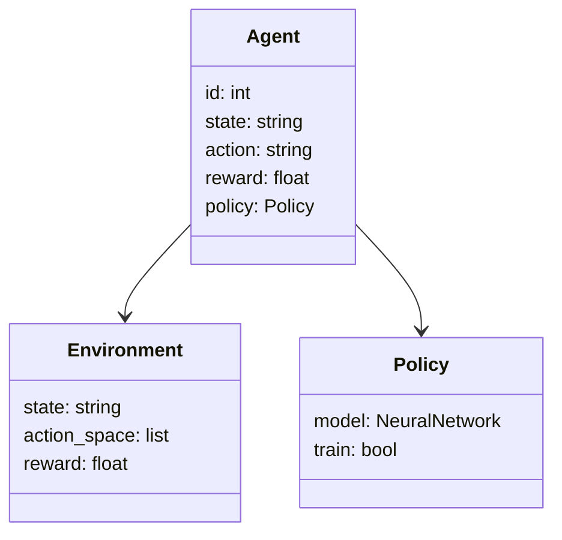

                 


# 多智能体强化学习：复杂环境下的AI Agent协作

## 关键词：
多智能体强化学习, AI Agent, 协作与竞争, 通信协议, 分布式算法, 系统架构

## 摘要：
多智能体强化学习（Multi-Agent Reinforcement Learning, MARL）是人工智能领域的重要研究方向，专注于多个智能体在复杂环境中的协作与竞争。本文系统地介绍了多智能体强化学习的核心概念、算法原理、通信协议、系统架构以及实际应用。通过详细的理论分析和代码实现，探讨了如何在复杂环境中实现高效协作，同时提供了丰富的实战案例和系统设计方法，帮助读者全面掌握多智能体强化学习的精髓。

---

# 第一部分: 多智能体强化学习概述

## 第1章: 多智能体强化学习的基本概念

### 1.1 多智能体系统的基本概念

#### 1.1.1 多智能体系统的定义
- 多智能体系统（Multi-Agent System, MAS）是由多个智能体（Agent）组成的分布式系统。
- 每个智能体都是具有感知、决策和行动能力的主体。
- 智能体之间可以通过通信和协作完成共同目标或任务。

#### 1.1.2 多智能体系统的特点
| 特性 | 描述 |
|------|------|
| 分布式 | 智能体独立运行，不依赖中央控制 |
| 协作性 | 智能体之间可以通过协作提高整体性能 |
| 竞争性 | 智能体之间可能存在竞争关系 |
| 动态性 | 环境和任务可能动态变化 |

#### 1.1.3 多智能体系统与单智能体系统的区别
- **单智能体系统**：单一智能体在环境中独立学习和决策。
- **多智能体系统**：多个智能体协作或竞争，共同完成任务。

### 1.2 多智能体强化学习的定义与问题描述

#### 1.2.1 强化学习的基本概念
- 强化学习（Reinforcement Learning, RL）：智能体通过与环境交互，学习最优策略以最大化累计奖励。
- 环境：智能体行动的场所，可能动态变化。
- 策略：智能体在给定状态下的行动规则。
- 奖励：智能体行动后获得的反馈，用于指导学习。

#### 1.2.2 多智能体强化学习的定义
- 多智能体强化学习（MARL）：多个智能体在环境中协作或竞争，通过学习策略优化任务完成效果。
- 每个智能体都有自己的目标函数，可能与全局目标一致或冲突。

#### 1.2.3 多智能体强化学习的核心问题
- **通信与协作**：智能体之间如何高效通信和协作。
- **策略同步**：多个智能体策略如何协调一致。
- **环境建模**：复杂环境下的状态表示与动作选择。

#### 1.2.4 多智能体强化学习的边界与外延
- 外延：与分布式计算、博弈论、分布式系统等领域的交叉。

### 1.3 多智能体强化学习的核心要素

#### 1.3.1 智能体的定义与属性
- **智能体属性**：
  - 状态感知（Observation）：智能体对环境的感知。
  - 行动（Action）：智能体在环境中的动作。
  - 奖励（Reward）：智能体的行动反馈。
  - 策略（Policy）：智能体的行动规则。

#### 1.3.2 环境的定义与建模
- 环境可以是静态或动态的，需要建模状态空间和动作空间。
- 状态空间：环境中的所有可能状态。
- 动作空间：智能体可以执行的所有动作。

#### 1.3.3 协作与竞争关系
- 协作：智能体之间互相帮助，共同完成任务。
- 竞争：智能体之间争夺资源或目标。
- 综合：部分协作，部分竞争。

#### 1.3.4 通信与信息共享
- 通信协议：智能体之间信息传递的规则。
- 信息共享：智能体之间共享状态、动作或策略信息。

---

## 第2章: 多智能体强化学习的核心概念与联系

### 2.1 多智能体强化学习的核心原理

#### 2.1.1 分布式强化学习
- 分布式强化学习：多个智能体独立学习，通过通信共享信息。
- 优点：提高并行计算效率，适应大规模环境。
- 缺点：通信开销大，协调困难。

#### 2.1.2 协作强化学习
- 协作强化学习：智能体之间通过协作完成共同目标。
- 关键：设计高效的协作策略。

#### 2.1.3 竞争强化学习
- 竞争强化学习：智能体之间通过竞争优化性能。
- 关键：避免恶性竞争，找到平衡点。

### 2.2 智能体之间的通信协议

#### 2.2.1 通信协议的定义
- 通信协议：智能体之间信息传递的规则和格式。
- 例如：使用特定的消息格式和传输频率。

#### 2.2.2 常见的通信协议类型
| 类型 | 描述 |
|------|------|
| 同步通信 | 智能体定期交换信息 |
| 异步通信 | 智能体随时交换信息 |
| 基于内容的通信 | 智能体根据内容相关性选择通信对象 |

#### 2.2.3 通信协议的设计原则
- 简洁性：减少通信开销。
- 及时性：确保信息及时传递。
- 有效性：传递有用信息。

### 2.3 多智能体协作策略

#### 2.3.1 协作策略的定义
- 协作策略：智能体之间如何协作以实现共同目标。

#### 2.3.2 常见的协作策略类型
| 类型 | 描述 |
|------|------|
| 共享策略 | 智能体共享策略参数 |
| 分层策略 | 分层决策，高层协调，低层执行 |
| 分散策略 | 每个智能体独立决策，通过通信调整 |

#### 2.3.3 协作策略的选择与优化
- 根据任务需求选择协作策略。
- 通过实验和优化选择最优策略。

---

## 第3章: 多智能体强化学习的算法原理

### 3.1 分布式Q-learning算法

#### 3.1.1 算法的基本原理
- 每个智能体独立学习Q值表。
- 通过通信共享Q值信息。

#### 3.1.2 算法的实现步骤
1. 初始化Q值表。
2. 智能体与环境交互，更新Q值。
3. 定期通信，同步Q值表。

#### 3.1.3 算法的优缺点分析
- 优点：简单易实现。
- 缺点：通信开销大，可能收敛较慢。

### 3.2 多智能体DQN算法

#### 3.2.1 算法的基本原理
- 每个智能体维护一个DQN网络。
- 通过通信共享经验 replay buffer。

#### 3.2.2 算法的实现步骤
1. 初始化DQN网络。
2. 智能体与环境交互，更新网络。
3. 通信共享经验 replay buffer。

#### 3.2.3 算法的优缺点分析
- 优点：利用经验回放提高学习效率。
- 缺点：通信复杂度高。

### 3.3 基于通信的多智能体强化学习算法

#### 3.3.1 通信机制的定义
- 通信机制：智能体之间如何共享信息。

#### 3.3.2 基于通信的算法实现
- 智能体通过通信共享策略或状态信息。

#### 3.3.3 通信策略的优化
- 优化通信频率和内容，减少开销。

---

## 第4章: 多智能体强化学习的数学模型与公式

### 4.1 Q值更新公式

#### 4.1.1 单智能体Q-learning公式
$$ Q(s, a) = Q(s, a) + \alpha (r + \gamma \max Q(s', a') - Q(s, a)) $$

#### 4.1.2 多智能体Q-learning公式
$$ Q_i(s, a) = Q_i(s, a) + \alpha (r_i + \gamma \max Q_j(s', a') - Q_i(s, a)) $$

#### 4.1.3 分布式Q-learning的数学推导
- 假设智能体i和j共享Q值表：
$$ Q_i(s, a) = Q_j(s, a) $$

### 4.2 策略优化公式

#### 4.2.1 基于策略梯度的优化公式
$$ \nabla \theta \leftarrow \nabla \log \pi_\theta(s) \cdot Q(s, a) $$

#### 4.2.2 多智能体策略优化的数学推导
- 假设多个智能体共享策略参数：
$$ \theta_i = \theta_j $$

### 4.3 通信策略的数学建模

#### 4.3.1 通信协议的数学表示
- 智能体i发送消息给j：
$$ m_{i \to j} = f(Q_i, Q_j) $$

#### 4.3.2 通信策略的优化目标函数
$$ \min_{\theta} \sum_{i=1}^N L_i(\theta) $$

---

## 第5章: 多智能体强化学习的系统分析与架构设计

### 5.1 问题场景介绍

#### 5.1.1 项目背景
- 例如：智能交通系统中的多智能体协作。

#### 5.1.2 项目目标
- 实现多个智能体在复杂环境中的协作。

### 5.2 系统功能设计

#### 5.2.1 领域模型（Mermaid 类图）


#### 5.2.2 系统架构设计（Mermaid 架构图）
```mermaid
archi
    title Multi-Agent System Architecture
    container 智能体管理模块 {
        类 AgentManager
        类 Agent
    }
    container 环境模拟模块 {
        类 EnvironmentSimulator
    }
    container 通信模块 {
        类 Communication
    }
    智能体管理模块 --> 环境模拟模块
    智能体管理模块 --> 通信模块
    环境模拟模块 --> 通信模块
```

### 5.3 系统接口设计

#### 5.3.1 智能体接口
- 接收环境状态，发送动作。
- 例如：`receive_state(state)`, `send_action(action)`。

#### 5.3.2 通信接口
- 接收消息，发送消息。
- 例如：`receive_message(msg)`, `send_message(msg)`。

### 5.4 系统交互设计（Mermaid 序列图）
```mermaid
sequenceDiagram
    participant 智能体1
    participant 智能体2
    participant 环境
    智能体1 -> 环境: send_action(a1)
    环境 -> 智能体1: receive_state(s1), reward(r1)
    智能体2 -> 环境: send_action(a2)
    环境 -> 智能体2: receive_state(s2), reward(r2)
    智能体1 <-> 智能体2: 通信
```

---

## 第6章: 多智能体强化学习的项目实战

### 6.1 环境搭建

#### 6.1.1 环境安装
- 安装Python和深度学习框架（如TensorFlow或PyTorch）。
- 安装多智能体强化学习库（如Mujoco或OpenAI Gym）。

#### 6.1.2 环境配置
- 定义环境的状态空间和动作空间。
- 设置奖励函数。

### 6.2 系统核心实现

#### 6.2.1 智能体类实现
```python
class Agent:
    def __init__(self, id):
        self.id = id
        self.q_table = dict()

    def receive_state(self, state):
        # 处理状态
        pass

    def send_action(self, state):
        # 选择动作
        pass

    def receive_message(self, message):
        # 处理消息
        pass
```

#### 6.2.2 通信模块实现
```python
class Communicator:
    def __init__(self):
        self.messages = dict()

    def send_message(self, sender, receiver, message):
        self.messages[(sender, receiver)] = message

    def receive_message(self, sender, receiver):
        return self.messages.get((sender, receiver), None)
```

#### 6.2.3 环境模拟实现
```python
class Environment:
    def __init__(self):
        self.agents = []
        self.states = dict()

    def step(self, actions):
        # 执行动作，更新状态
        pass

    def reset(self):
        # 初始化环境
        pass
```

### 6.3 代码实现与解读

#### 6.3.1 分布式Q-learning实现
```python
class DistributedQLearning:
    def __init__(self, num_agents):
        self.agents = [Agent(i) for i in range(num_agents)]
        self.communicator = Communicator()

    def update_q_table(self):
        for agent in self.agents:
            state = agent.receive_state()
            action = agent.send_action(state)
            next_state = environment.step(action)
            reward = environment.get_reward()
            agent.q_table[(state, action)] = reward + gamma * max(agent.q_table.get((next_state, action), 0))
            self.communicator.send_message(agent.id, agent.id+1, agent.q_table)
```

#### 6.3.2 环境交互实现
```python
environment = Environment()
environment.agents = [Agent(0), Agent(1)]
communicator = Communicator()
environment.reset()

while True:
    for agent in environment.agents:
        state = environment.get_state(agent.id)
        action = agent.send_action(state)
        next_state = environment.step(action)
        reward = environment.get_reward()
        agent.q_table[(state, action)] = reward + gamma * max(agent.q_table.get((next_state, action), 0))
        communicator.send_message(agent.id, other_agent.id, agent.q_table)
```

### 6.4 案例分析与结果解读

#### 6.4.1 实验结果分析
- 收敛速度：通信机制对收敛速度的影响。
- 稳定性：系统在动态环境中的表现。
- 协作效果：智能体之间协作能力的评估。

#### 6.4.2 系统性能优化
- 优化通信频率。
- 改进协作策略。

### 6.5 项目小结

#### 6.5.1 项目总结
- 成功实现多智能体强化学习系统。
- 系统在复杂环境中的协作能力得到验证。

#### 6.5.2 经验总结
- 通信机制设计的重要性。
- 协作策略对系统性能的影响。

---

## 第7章: 多智能体强化学习的最佳实践

### 7.1 最佳实践 Tips

#### 7.1.1 通信机制设计
- 简化通信协议，减少开销。
- 根据任务需求选择通信频率。

#### 7.1.2 协作策略选择
- 根据环境动态选择协作策略。
- 定期优化协作策略。

#### 7.1.3 系统架构设计
- 模块化设计，便于扩展。
- 灵活的架构支持多种任务。

### 7.2 小结与展望

#### 7.2.1 小结
- 多智能体强化学习的核心概念和算法。
- 系统设计和项目实现的关键点。

#### 7.2.2 展望
- 更高效的通信机制。
- 更智能的协作策略。
- 更复杂的环境建模。

---

## 作者信息

作者：AI天才研究院/AI Genius Institute & 禅与计算机程序设计艺术 /Zen And The Art of Computer Programming

---

以上是《多智能体强化学习：复杂环境下的AI Agent协作》的详细目录大纲和内容概述，涵盖了从基础概念到算法实现、系统设计和项目实战的全过程。每个章节都详细展开，结合理论和实践，帮助读者全面掌握多智能体强化学习的核心内容。

