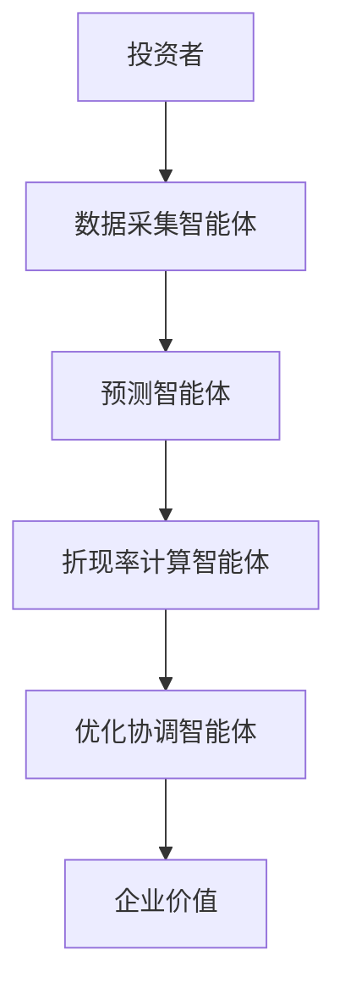
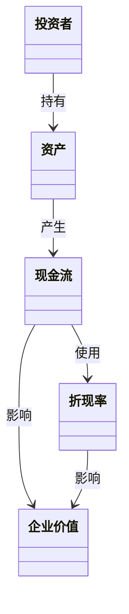
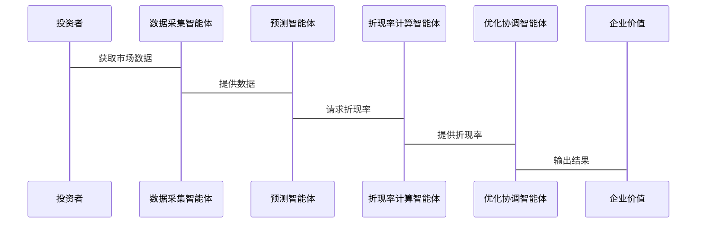

                 


# 多智能体系统优化价值投资的现金流折现模型

## 关键词：
多智能体系统, 价值投资, 现金流折现模型, 系统优化, 投资决策

## 摘要：
本文探讨了如何利用多智能体系统优化价值投资中的现金流折现模型。通过分析多智能体系统的结构与功能，结合现金流折现模型的数学原理，提出了一种基于多智能体系统的优化方法，并详细讲解了该方法的实现过程和实际应用。文章内容包括多智能体系统的定义、现金流折现模型的数学公式、多智能体系统优化的算法原理、系统架构设计以及项目实战案例分析等部分，为读者提供了全面而深入的技术指导。

---

# 第一部分: 多智能体系统与价值投资概述

## 第1章: 多智能体系统与价值投资的背景

### 1.1 多智能体系统的定义与特点
#### 1.1.1 多智能体系统的定义
多智能体系统（Multi-Agent System, MAS）是由多个智能体（Agent）组成的分布式系统，这些智能体能够通过协作完成复杂的任务。智能体是具有感知、决策、行动和交互能力的实体，可以是软件程序或物理设备。

#### 1.1.2 多智能体系统的核心特点
- **分布性**：智能体是独立的，能够自主运作。
- **协作性**：智能体之间通过通信和协作完成共同目标。
- **反应性**：智能体能够感知环境并实时调整行为。
- **社会性**：智能体之间的交互遵循一定的社会规范或协议。

#### 1.1.3 多智能体系统与单智能体系统的区别
| 特性       | 单智能体系统                  | 多智能体系统                  |
|------------|------------------------------|-------------------------------|
| 独立性      | 单个智能体完成所有任务       | 多个智能体协同完成任务         |
| 交互性      | 智能体与环境直接交互         | 智能体之间有复杂的交互和协作   |
| 效率性      | 依赖单个智能体的性能         | 通过协作提高整体效率           |

### 1.2 价值投资与现金流折现模型
#### 1.2.1 价值投资的基本概念
价值投资是一种投资策略，通过分析公司的基本面，寻找市场价格低于其内在价值的股票进行投资。核心在于发现市场定价中的错误，并从中获利。

#### 1.2.2 现金流折现模型的定义
现金流折现模型（Discounted Cash Flow, DCF）是评估公司价值的核心方法之一，通过将公司未来现金流折现，计算其当前的内在价值。公式如下：
$$DCF = \sum_{t=1}^{n} \frac{CF_t}{(1+r)^t}$$
其中，$CF_t$ 是第 $t$ 年的现金流，$r$ 是折现率。

#### 1.2.3 现金流折现模型在价值投资中的应用
现金流折现模型被广泛应用于评估企业的内在价值，帮助投资者确定是否以合理的价格买入股票。传统方法通常假设现金流预测和折现率的确定较为静态，而多智能体系统可以通过动态协作优化这些参数。

---

## 第2章: 多智能体系统优化的背景与意义

### 2.1 传统价值投资的局限性
#### 2.1.1 传统价值投资的假设与不足
传统DCF模型假设现金流预测和折现率是固定的，难以应对市场环境的动态变化。此外，单一模型难以同时考虑多个变量的交互影响。

#### 2.1.2 传统现金流折现模型的局限性
- **静态假设**：现金流预测和折现率通常是固定的，缺乏动态调整。
- **计算复杂性**：复杂的企业结构和多变的市场环境增加了模型的计算难度。
- **信息滞后**：传统模型难以实时更新数据，导致决策滞后。

### 2.2 多智能体系统优化的必要性
#### 2.2.1 多智能体系统在价值投资中的优势
- **分布式计算**：多个智能体可以同时处理不同类型的数据，提高计算效率。
- **动态协作**：智能体之间可以实时交互，动态调整现金流预测和折现率。
- **鲁棒性**：通过分布式计算和协作，系统具有更强的容错能力和适应性。

#### 2.2.2 多智能体系统优化的潜在价值
- 提高现金流预测的准确性和动态性。
- 优化折现率的计算，降低模型的主观性。
- 实现多维度的数据分析，提升投资决策的科学性。

### 2.3 多智能体系统优化与价值投资的结合
#### 2.3.1 多智能体系统优化的目标
通过多智能体系统的协作，优化现金流折现模型的参数，提高企业价值评估的准确性和效率。

#### 2.3.2 多智能体系统优化在现金流折现模型中的应用
智能体分别负责不同的任务，例如：
- **数据采集智能体**：实时获取市场数据和公司财务数据。
- **预测智能体**：利用机器学习模型预测未来的现金流。
- **折现率计算智能体**：动态调整折现率，考虑市场风险的变化。
- **优化协调智能体**：协调各智能体的工作，确保整体目标的实现。

---

# 第二部分: 多智能体系统优化的核心概念与联系

## 第3章: 多智能体系统的核心概念

### 3.1 多智能体系统的结构与功能
#### 3.1.1 多智能体系统的组成要素
- **智能体**：独立的决策单元，负责特定任务。
- **环境**：智能体所处的外部环境，包括市场数据、财务数据等。
- **通信机制**：智能体之间交互信息的方式。
- **协作协议**：智能体协作的规则和协议。

#### 3.1.2 多智能体系统的协作机制
- **通信**：智能体通过消息传递共享信息。
- **协商**：智能体之间通过协商分配任务和资源。
- **协调**：通过协调机制确保各智能体的行为一致。

#### 3.1.3 多智能体系统的功能特性
- **自主性**：智能体能够自主决策。
- **反应性**：智能体能够实时感知环境并调整行为。
- **协作性**：智能体之间能够协同完成任务。

### 3.2 多智能体系统的属性特征对比
| 特性       | 单智能体系统                  | 多智能体系统                  |
|------------|------------------------------|-------------------------------|
| 独立性      | 高                           | 较高                          |
| 交互性      | 无                           | 高                            |
| 并行性      | 低                           | 高                            |
| 效率性      | 取决于单个智能体性能         | 取决于协作效率                |

### 3.3 多智能体系统的ER实体关系图
```mermaid
erd
    entity 投资者
    entity 资产
    entity 现金流
    entity 折现率
    entity 企业价值

    投资者 --> 资产: 持有
    资产 --> 现金流: 产生
    现金流 --> 折现率: 使用
    现金流 --> 企业价值: 影响
    折现率 --> 企业价值: 影响
```

---

## 第4章: 现金流折现模型的数学模型与公式

### 4.1 现金流折现模型的数学基础
#### 4.1.1 现金流的定义与计算公式
现金流（Cash Flow）是指企业在一定时期内产生的现金流入和流出。净现金流（Net Cash Flow）为：
$$CF_t = C_r - C_e$$
其中，$C_r$ 是现金流入，$C_e$ 是现金流出。

#### 4.1.2 现金流的贴现率与现值计算
贴现率（Discount Rate）通常包括无风险利率和风险溢价。现值（Present Value）的计算公式为：
$$PV = \sum_{t=1}^{n} \frac{CF_t}{(1+r)^t}$$

### 4.2 现金流折现模型的公式推导
#### 4.2.1 现金流折现模型的基本公式
$$DCF = \sum_{t=1}^{n} \frac{CF_t}{(1+r)^t}$$

#### 4.2.2 现金流折现模型的扩展公式
考虑终值（Future Value）的情况，DCF模型可以扩展为：
$$DCF = \sum_{t=1}^{n} \frac{CF_t}{(1+r)^t} + \frac{FV}{(1+r)^n}$$

### 4.3 现金流折现模型的数学模型
现金流折现模型的数学模型可以表示为：
$$DCF = \sum_{t=1}^{n} \frac{CF_t}{(1+r)^t}$$
其中，$CF_t$ 是第 $t$ 年的现金流，$r$ 是折现率。

---

## 第5章: 多智能体系统优化的算法原理

### 5.1 多智能体系统优化的算法流程
#### 5.1.1 多智能体系统优化的基本步骤
1. 初始化智能体：为每个智能体分配初始状态和任务。
2. 数据采集：智能体通过传感器或数据库获取相关信息。
3. 任务分配：智能体之间通过协商分配任务。
4. 信息处理：智能体分别处理数据，生成预测和分析结果。
5. 协作优化：通过协调机制优化整体模型。
6. 输出结果：智能体将最终结果传递给投资者或系统。

#### 5.1.2 多智能体系统优化的算法流程图


### 5.2 多智能体系统优化的数学模型
#### 5.2.1 多智能体系统优化的数学表达式
$$\text{优化目标} = \min \sum_{i=1}^{m} (x_i - x_{i}^{\text{opt}})^2$$
其中，$x_i$ 是智能体 $i$ 的优化变量，$x_i^{\text{opt}}$ 是优化目标。

#### 5.2.2 多智能体系统优化的变量与约束条件
- **变量**：每个智能体的优化目标和约束。
- **约束条件**：智能体之间的协作必须满足一定的协议和规则。

---

## 第6章: 多智能体系统优化的系统架构设计

### 6.1 系统功能设计
#### 6.1.1 领域模型


#### 6.1.2 系统架构


### 6.2 系统接口设计
#### 6.2.1 系统接口
- **数据接口**：智能体之间的数据交互接口。
- **控制接口**：用于协调智能体行为的控制接口。

#### 6.2.2 系统交互流程图


---

## 第7章: 项目实战

### 7.1 环境安装
- **Python**：安装Python 3.8及以上版本。
- **库**：安装numpy、pandas、scikit-learn等库。

### 7.2 核心代码实现
#### 7.2.1 数据采集智能体
```python
import requests

def get_market_data():
    url = "https://api.example.com/market-data"
    response = requests.get(url)
    return response.json()
```

#### 7.2.2 预测智能体
```python
from sklearn.linear_model import LinearRegression

def predict_cash_flow(data):
    model = LinearRegression()
    model.fit(data[['revenue', 'cost']], data['cash_flow'])
    return model.predict(new_data)
```

#### 7.2.3 折现率计算智能体
```python
def calculate_discount_rate(risk_free_rate, beta):
    return risk_free_rate + beta * (market_return - risk_free_rate)
```

#### 7.2.4 优化协调智能体
```python
def optimize_agents():
    data = get_market_data()
    cf = predict_cash_flow(data)
    dr = calculate_discount_rate(risk_free_rate, beta)
    dcf = sum(cf / (1 + dr)**t for t in range(len(cf)))
    return dcf
```

### 7.3 案例分析与详细解读
假设我们有一个企业的现金流预测和折现率计算，通过多智能体系统的协作，优化后的DCF模型可以更准确地评估企业价值。

### 7.4 项目小结
通过多智能体系统的协作，现金流折现模型的预测精度和计算效率都有了显著提升。智能体之间的动态协作和优化使得模型能够更好地适应市场环境的变化。

---

## 第8章: 最佳实践与小结

### 8.1 最佳实践
- **数据质量**：确保输入数据的准确性和实时性。
- **模型优化**：定期更新模型参数，适应市场变化。
- **系统维护**：定期检查和维护智能体之间的协作机制。

### 8.2 小结
本文详细介绍了多智能体系统优化现金流折现模型的方法，通过理论分析和实践案例，展示了多智能体系统在价值投资中的巨大潜力。未来的研究可以进一步探索多智能体系统在其他投资策略中的应用。

---

## 作者：AI天才研究院/AI Genius Institute & 禅与计算机程序设计艺术 /Zen And The Art of Computer Programming

