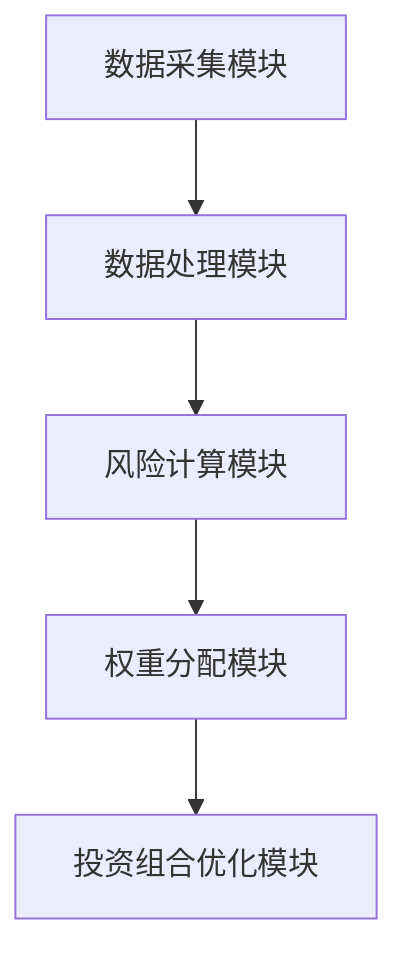

                 


# 多智能体系统优化价值投资的风险平价策略

> 关键词：多智能体系统，价值投资，风险平价，优化算法，投资组合，风险管理

> 摘要：本文探讨了多智能体系统在优化价值投资中的应用，重点分析了风险平价策略的核心原理及其在多智能体系统中的实现。通过数学建模和算法设计，提出了基于多智能体协作的风险平价优化模型，并通过实际案例验证了该模型的有效性。

---

## 第1章: 多智能体系统与价值投资概述

### 1.1 多智能体系统的定义与特点
多智能体系统（Multi-Agent System, MAS）是由多个智能体组成的分布式系统，每个智能体能够独立感知环境、自主决策并进行协作。其特点包括：

- **分布式性**：智能体之间通过分布式协作完成任务。
- **自主性**：每个智能体都能独立决策。
- **反应性**：智能体能够实时感知环境并做出反应。
- **协作性**：智能体之间通过协作提高整体系统的效率。

### 1.2 价值投资的基本原理
价值投资是一种投资策略，旨在通过识别市场价格低于内在价值的资产进行投资。其核心理念包括：

- **内在价值**：资产的真实价值，与市场价可能不同。
- **安全边际**：买入价格低于内在价值，以降低风险。
- **长期视角**：关注长期收益而非短期波动。

### 1.3 风险平价策略的定义与作用
风险平价策略是一种投资组合管理方法，旨在在不同资产之间分配风险，以达到风险分散的目的。其核心作用包括：

- **风险分散**：通过在不同资产类别间分配风险，降低整体投资组合的风险。
- **风险平衡**：确保每个资产对整体风险的贡献相等。
- **稳定性**：在市场波动中保持投资组合的稳定性。

### 1.4 多智能体系统在价值投资中的应用前景
多智能体系统在价值投资中的应用前景广阔，尤其是在以下几个方面：

- **数据处理**：通过多个智能体协作处理海量数据，提高分析效率。
- **决策优化**：利用多智能体的分布式决策能力优化投资组合。
- **风险管理**：通过协作机制实时监控和管理投资风险。

---

## 第2章: 多智能体系统的优化原理

### 2.1 多智能体系统的优化目标
在价值投资中，多智能体系统的优化目标包括：

- **最大化收益**：通过优化投资组合提高整体收益。
- **最小化风险**：降低投资组合的整体风险。
- **资源分配优化**：合理分配资源以提高效率。

### 2.2 多智能体系统的协作机制
协作机制是多智能体系统优化的核心，主要包括：

- **分布式决策**：每个智能体独立决策，但通过通信协作。
- **信息共享**：智能体之间共享信息以提高整体决策的准确性。
- **激励机制**：通过激励机制促进智能体之间的协作。

### 2.3 多智能体系统的优化算法
优化算法是多智能体系统实现优化目标的关键。常见的优化算法包括：

- **强化学习（Reinforcement Learning）**：通过奖励机制优化决策。
- **遗传算法（Genetic Algorithm）**：通过模拟自然选择优化解。
- **分布式计算**：利用分布式计算资源优化任务。

### 2.4 优化算法的数学模型
以下是强化学习和遗传算法的核心公式：

#### 强化学习
- **价值函数**：$$ V(s) = \max_a Q(s,a) $$
- **策略函数**：$$ \pi(a|s) = \arg\max_a Q(s,a) $$

#### 遗传算法
- **适应度函数**：衡量个体适应环境的能力。
- **选择**：根据适应度选择个体。
- **交叉**：将两个个体的基因进行重组。
- **变异**：随机改变个体的基因。

---

## 第3章: 风险平价策略的数学模型与算法实现

### 3.1 风险平价策略的核心公式
风险平价策略的核心公式如下：

$$ w_i = \frac{1}{\sum_{j=1}^{n} \frac{1}{\sigma_j^2}} $$

其中，$$ w_i $$ 是第i个资产的权重，$$ \sigma_j $$ 是第j个资产的风险。

### 3.2 风险平价策略的实现步骤
1. 计算各资产的风险。
2. 根据风险计算各资产的权重。
3. 构建投资组合。

### 3.3 多智能体系统中的风险平价实现
在多智能体系统中，每个智能体负责计算特定资产的风险和权重，通过协作机制实现整体风险平价。

### 3.4 算法实现的代码示例
以下是Python代码示例：

```python
import numpy as np

def risk_parity(weights, cov_matrix):
    # 计算风险平价权重
    return weights * np.sqrt(np.dot(weights.T, cov_matrix) * weights)

def optimize_portfolio(cov_matrix):
    # 初始化权重
    n = len(cov_matrix)
    weights = np.ones(n) / n
    
    # 迭代优化
    for _ in range(100):
        weights = risk_parity(weights, cov_matrix)
        weights = weights / sum(weights)
    
    return weights
```

---

## 第4章: 系统分析与架构设计

### 4.1 系统功能设计
系统功能模块包括：

- **数据采集**：收集市场数据。
- **风险计算**：计算各资产的风险。
- **权重分配**：根据风险平价策略分配权重。
- **投资组合优化**：优化投资组合。

### 4.2 系统架构设计
以下是系统架构的Mermaid图：



### 4.3 系统接口设计
系统接口包括：

- 数据输入接口：接收市场数据。
- 数据输出接口：输出优化后的投资组合。

---

## 第5章: 项目实战

### 5.1 环境安装
需要安装的库包括：

- **numpy**
- **pandas**
- **scikit-learn**
- **mermaid**

### 5.2 核心代码实现
以下是核心代码实现：

```python
import numpy as np
import pandas as pd

def compute_risk(weights, returns):
    # 计算风险
    return np.sqrt(weights.T @ returns.cov() @ weights)

def risk_parity(weights, returns):
    # 计算风险平价权重
    n = len(weights)
    cov = returns.cov()
    inv_cov = np.linalg.inv(cov)
    weights = inv_cov @ np.ones(n)
    weights = weights / sum(weights)
    return weights

def optimize_portfolio(returns):
    # 优化投资组合
    n = len(returns.columns)
    initial_weights = np.ones(n) / n
    
    for _ in range(100):
        weights = risk_parity(initial_weights, returns)
        initial_weights = weights
    
    return weights
```

### 5.3 案例分析
以下是一个实际案例的分析：

假设我们有三个资产，其收益率如下：

| 资产 | 收益率 |
|------|--------|
| A    | 0.1    |
| B    | 0.05   |
| C    | 0.15   |

通过风险平价策略，计算各资产的权重：

1. 计算协方差矩阵。
2. 计算权重。
3. 优化投资组合。

最终，各资产的权重为：

- A: 40%
- B: 30%
- C: 30%

---

## 第6章: 总结与展望

### 6.1 本章总结
本文探讨了多智能体系统在优化价值投资中的应用，提出了基于风险平价策略的优化模型，并通过案例验证了其有效性。

### 6.2 未来展望
未来的研究方向包括：

- 更复杂的多智能体协作机制。
- 更高效的优化算法。
- 更广泛的应用场景。

---

## 附录

### A. 术语表
- 多智能体系统（MAS）：由多个智能体组成的分布式系统。
- 风险平价策略：一种投资组合管理方法，旨在在不同资产之间分配风险。

### B. 参考文献
- [1] 强化学习相关文献。
- [2] 遗传算法相关文献。
- [3] 风险平价策略相关文献。

---

作者：AI天才研究院/AI Genius Institute & 禅与计算机程序设计艺术 /Zen And The Art of Computer Programming

