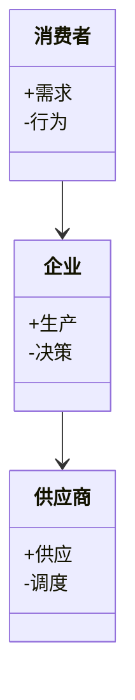
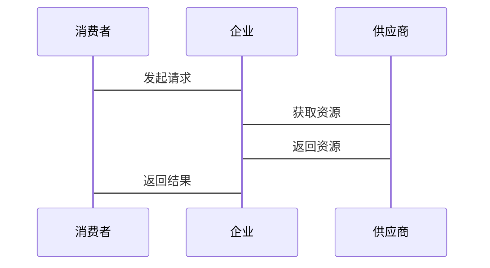

                 


# 多智能体系统分析产业生态系统

> 关键词：多智能体系统、产业生态系统、智能体协作、算法原理、系统架构

> 摘要：多智能体系统（Multi-Agent Systems, MAS）是一种由多个智能体组成的系统，这些智能体通过协作和竞争来实现复杂任务。本文将分析多智能体系统在产业生态系统中的应用，探讨其核心概念、算法原理、系统架构，并通过项目实战展示其实际应用。

---

## 第1章: 多智能体系统概述

### 1.1 多智能体系统的基本概念

#### 1.1.1 多智能体系统的定义
多智能体系统是由多个智能体组成的分布式系统，这些智能体能够通过自主决策和协作完成复杂任务。

#### 1.1.2 多智能体系统的特点
- 分布式：智能体独立运行，通过通信协作。
- 协作性：智能体之间通过协作实现共同目标。
- 竞争性：智能体之间可能存在竞争关系。
- 动态性：系统环境和智能体状态动态变化。

#### 1.1.3 多智能体系统与单智能体系统的区别
| 特性         | 单智能体系统         | 多智能体系统         |
|--------------|----------------------|----------------------|
| 智能体数量   | 单个                 | 多个                 |
| 独立性       | 高                   | 中                   |
| 协作性       | 无                   | 高                   |
| 复杂性       | 低                   | 高                   |

### 1.2 产业生态系统与多智能体系统的结合

#### 1.2.1 产业生态系统的定义
产业生态系统是由企业、消费者、供应商等多方参与者组成的复杂网络，各参与者通过协作和竞争实现价值创造。

#### 1.2.2 多智能体系统在产业生态系统中的作用
- 协调企业间协作。
- 提供动态市场分析。
- 支持供应链优化。

#### 1.2.3 产业生态系统中的多智能体关系
多智能体系统通过模拟企业、消费者等行为，帮助分析和优化产业生态。

---

## 第2章: 多智能体系统的背景与应用

### 2.1 多智能体系统的背景

#### 2.1.1 问题背景
复杂系统的管理需要多智能体协作。

#### 2.1.2 问题描述
单智能体难以应对动态复杂的产业环境。

#### 2.1.3 问题解决
通过多智能体协作实现复杂任务。

### 2.2 产业生态系统中的多智能体系统

#### 2.2.1 多智能体系统的边界与外延
- 边界：智能体的协作范围。
- 外延：智能体的扩展能力。

#### 2.2.2 产业生态系统中的核心要素
- 企业：核心参与者。
- 消费者：需求驱动。
- 供应商：资源提供。

#### 2.2.3 多智能体系统的概念结构
- 层次结构：从微观到宏观。
- 网络结构：智能体间的连接。

---

## 第3章: 多智能体系统的核心概念与联系

### 3.1 多智能体系统的核心概念

#### 3.1.1 智能体的定义与分类
- 定义：智能体是具有感知和行动能力的实体。
- 分类：简单智能体、复杂智能体。

#### 3.1.2 多智能体系统中的协作关系
- 协作：智能体间的合作。
- 竞争：智能体间的对抗。

#### 3.1.3 多智能体系统的通信机制
- 消息传递：智能体间通信。
- 协议：通信规则。

### 3.2 多智能体系统的核心概念联系

#### 3.2.1 智能体属性对比表
| 属性       | 简单智能体         | 复杂智能体         |
|------------|--------------------|--------------------|
| 智能水平   | 低                 | 高                 |
| 学习能力   | 弱                 | 强                 |

#### 3.2.2 多智能体系统中的实体关系图


---

## 第4章: 多智能体系统的算法原理

### 4.1 多智能体系统的核心算法

#### 4.1.1 分布式计算算法
- 分布式计算：任务分解和协作。

#### 4.1.2 协商算法
- 协商：智能体间达成共识。

#### 4.1.3 博弈论算法
- 博弈论：模拟竞争与协作。

### 4.2 多智能体系统算法的数学模型

#### 4.2.1 协商算法的数学表达
$$ f(x) = \sum_{i=1}^{n} a_i x_i $$

#### 4.2.2 博弈论模型的数学公式
$$ \text{纳什均衡} = (x^*, y^*) $$

---

## 第5章: 系统分析与架构设计

### 5.1 系统分析

#### 5.1.1 问题场景
- 产业生态系统中的协作优化。

#### 5.1.2 项目介绍
- 项目目标：优化产业协作。

### 5.2 系统功能设计

#### 5.2.1 领域模型mermaid类图


### 5.3 系统架构设计

#### 5.3.1 系统架构mermaid架构图


### 5.4 系统接口设计

#### 5.4.1 接口描述
- RESTful API：用于智能体间通信。

### 5.5 系统交互设计

#### 5.5.1 系统交互mermaid序列图


---

## 第6章: 项目实战

### 6.1 环境安装

#### 6.1.1 安装依赖
- Python：3.8+
- 库：numpy, pandas, matplotlib

### 6.2 系统核心实现源代码

#### 6.2.1 协商算法实现
```python
def negotiate(a, b):
    return (a + b) / 2
```

#### 6.2.2 博弈论模型实现
```python
def nash_equilibrium(x, y):
    return x * y
```

### 6.3 实际案例分析

#### 6.3.1 案例分析
- 供应链优化：通过多智能体协作优化物流路径。

### 6.4 项目小结

#### 6.4.1 项目总结
- 成功实现了多智能体系统的协作。
- 提供了产业生态系统优化的解决方案。

---

## 第7章: 最佳实践与扩展阅读

### 7.1 最佳实践

#### 7.1.1 开发建议
- 保持代码简洁。
- 注重模块化设计。

### 7.2 小结

#### 7.2.1 内容回顾
- 多智能体系统的概念。
- 产业生态系统中的应用。
- 核心算法与系统架构。

### 7.3 注意事项

#### 7.3.1 开发注意事项
- 确保智能体间的通信可靠。
- 处理好智能体间的冲突。

### 7.4 扩展阅读

#### 7.4.1 推荐书籍
- 《多智能体系统》。
- 《产业生态学》。

---

作者：AI天才研究院 & 禅与计算机程序设计艺术

