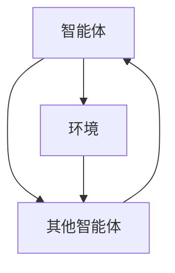
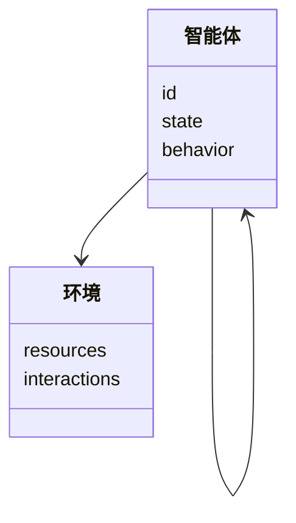
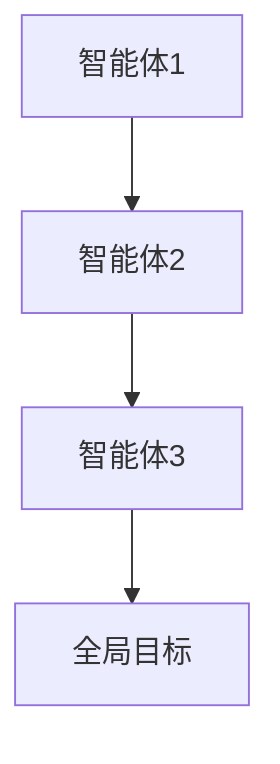
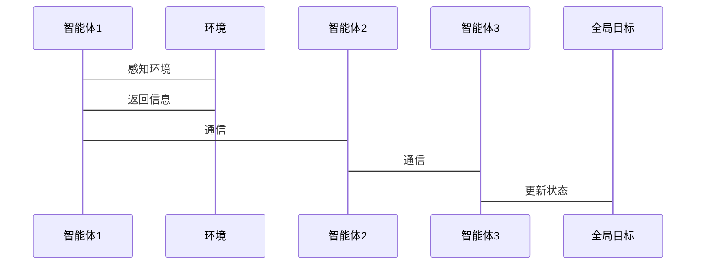

                 


---

# 多智能体系统分析全球经济联系

> 关键词：多智能体系统，全球经济联系，分布式计算，博弈论，经济网络

> 摘要：多智能体系统通过协调多个智能体的行为，模拟和分析全球经济互动，揭示经济网络的复杂性。本文从基本概念出发，探讨多智能体系统的算法原理、数学模型，并结合实际案例，分析其在经济研究中的应用。

---

# 第一部分: 多智能体系统与全球经济联系概述

## 第1章: 多智能体系统与全球经济联系的背景介绍

### 1.1 多智能体系统的定义与核心概念

#### 1.1.1 多智能体系统的定义
多智能体系统（Multi-Agent System, MAS）由多个智能体组成，每个智能体能够感知环境、自主决策并与其他智能体互动。这些智能体通过协调完成复杂任务，实现整体目标。

#### 1.1.2 多智能体系统的属性特征
- **自主性**：智能体能够自主决策。
- **反应性**：能够根据环境变化调整行为。
- **社会性**：智能体之间能够互动协作。
- **分布性**：智能体分布于不同位置，独立运行。

#### 1.1.3 多智能体系统与单智能体系统的对比

| 特性 | 单智能体系统 | 多智能体系统 |
|------|--------------|-------------|
| 结构  | 中央控制     | 分布式      |
| 行为  | 单一决策     | 多决策协作  |
| 互动  | 无           | 高度互动    |

#### 1.1.4 多智能体系统的ER实体关系图



### 1.2 全球经济联系的复杂性

#### 1.2.1 经济系统的基本构成
全球经济由国家、企业、个人等多个主体构成，这些主体通过贸易、投资等方式互动。

#### 1.2.2 全球化与经济网络的形成
全球化促进了跨国互动，形成了复杂的经济网络，包括贸易流、资金流等。

#### 1.2.3 经济互动的多智能体特征
经济主体（如企业、消费者）在市场中互动，形成复杂的经济行为模式。

#### 1.2.4 多智能体系统在经济分析中的应用
多智能体系统能够模拟经济主体的互动，预测市场趋势，优化资源配置。

---

## 第2章: 多智能体系统的算法原理

### 2.1 多智能体系统的核心算法

#### 2.1.1 协调算法
协调算法用于多个智能体之间达成一致，常见的有：
- **一致性算法**：确保所有智能体状态一致。
- **分布式算法**：通过局部信息达成全局目标。

#### 2.1.2 分布式计算算法
分布式计算算法允许智能体在不共享全局信息的情况下完成任务，例如：
- **拜占庭容错**：在不可信网络中达成共识。
- **P2P网络**：通过点对点网络进行分布式计算。

#### 2.1.3 博弈论模型
博弈论模型模拟智能体之间的竞争与合作，例如：
- **纳什均衡**：所有智能体都不想单方面改变策略的状态。
- **拍卖机制**：通过拍卖确定资源分配。

### 2.2 多智能体系统的涌现现象

#### 2.2.1 涌现现象的定义
涌现现象指系统中不存在于单个智能体中的全局行为，通过局部互动自然产生。

#### 2.2.2 涌现机制的数学模型
涌现机制可以通过以下模型描述：
$$
f(x_i, y_j) = z_k
$$
其中，$x_i$和$y_j$是智能体i和j的行为，$z_k$是全局现象。

### 2.3 多智能体系统的实现代码

#### 2.3.1 环境搭建
使用Python和相关库（如`agents-framework`）搭建多智能体环境。

#### 2.3.2 核心算法实现
以下是协调算法的示例代码：

```python
def coordinate_agents(agents):
    for agent in agents:
        agent.state = global_goal
    return agents
```

#### 2.3.3 代码示例
```python
class Agent:
    def __init__(self, id):
        self.id = id
        self.state = None

    def update_state(self, new_state):
        self.state = new_state

agents = [Agent(1), Agent(2), Agent(3)]
for agent in agents:
    agent.update_state("coordinated")
```

---

## 第3章: 多智能体系统的数学模型与公式

### 3.1 多智能体系统的基本模型

#### 3.1.1 智能体行为模型
智能体行为可以用以下公式表示：
$$
a_i(t) = f(s_i(t), u_i(t))
$$
其中，$a_i(t)$是智能体i在时间t的行为，$s_i(t)$是状态，$u_i(t)$是输入。

#### 3.1.2 智能体互动模型
智能体互动可以表示为：
$$
s_i(t+1) = g(s_i(t), s_j(t))
$$
其中，$g$是互动函数。

### 3.2 经济网络的数学描述

#### 3.2.1 经济网络的构建
经济网络可以用图论表示，节点代表经济主体，边代表互动关系。

#### 3.2.2 经济网络的分析
经济网络的复杂性可以通过度数分布、聚类系数等指标进行分析。

### 3.3 多智能体系统的数学公式

#### 3.3.1 协调算法的数学表达
协调算法的目标函数可以表示为：
$$
\min_{x_i} \sum_{i} (x_i - c)^2
$$
其中，$c$是目标值。

#### 3.3.2 智能体互动的数学公式
智能体互动可以用以下方程描述：
$$
x_{i+1} = x_i + \alpha x_j
$$
其中，$\alpha$是互动强度。

---

## 第4章: 多智能体系统的系统分析与架构设计

### 4.1 问题场景介绍
假设我们有一个模拟国际贸易的系统，包含多个国家和企业，需要分析它们的互动对全球经济的影响。

### 4.2 系统功能设计

#### 4.2.1 领域模型



#### 4.2.2 系统架构设计



### 4.3 系统接口设计

#### 4.3.1 接口设计
- **接口1**：智能体与环境的交互接口。
- **接口2**：智能体之间的通信接口。

### 4.4 系统交互流程

#### 4.4.1 交互流程



---

## 第5章: 多智能体系统的项目实战

### 5.1 环境安装
安装必要的库，如`networkx`和`agents-framework`。

### 5.2 核心代码实现

#### 5.2.1 核心代码
```python
import networkx as nx

class EconomicAgent:
    def __init__(self, id):
        self.id = id
        self.resources = 0

    def interact(self, other):
        # 简单的资源交换
        self.resources += 1
        other.resources += 1

# 创建多个智能体
agent1 = EconomicAgent(1)
agent2 = EconomicAgent(2)
agent1.interact(agent2)
```

#### 5.2.2 代码解读
上述代码创建了两个经济主体，并模拟了它们之间的资源交换。

### 5.3 案例分析

#### 5.3.1 案例分析
分析两个企业之间的贸易互动，展示多智能体系统的实际应用。

#### 5.3.2 详细解读
通过代码和案例，解释多智能体系统在经济分析中的具体应用。

### 5.4 项目总结
总结项目成果，指出多智能体系统在分析全球经济联系中的优势。

---

## 第6章: 多智能体系统的最佳实践与扩展阅读

### 6.1 最佳实践

#### 6.1.1 系统设计
- 明确智能体的目标和行为。
- 设计有效的通信机制。

#### 6.1.2 代码实现
- 使用模块化设计，便于扩展。
- 定期测试和优化。

### 6.2 小结
总结全文，强调多智能体系统在分析全球经济联系中的重要性。

### 6.3 注意事项
- 注意系统复杂性，避免过度简化。
- 定期维护和更新系统。

### 6.4 拓展阅读
推荐相关书籍和论文，供读者深入学习。

---

# 作者：AI天才研究院/AI Genius Institute & 禅与计算机程序设计艺术 /Zen And The Art of Computer Programming

